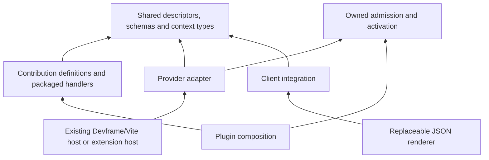
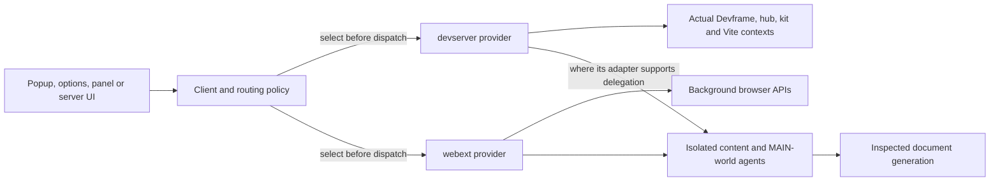
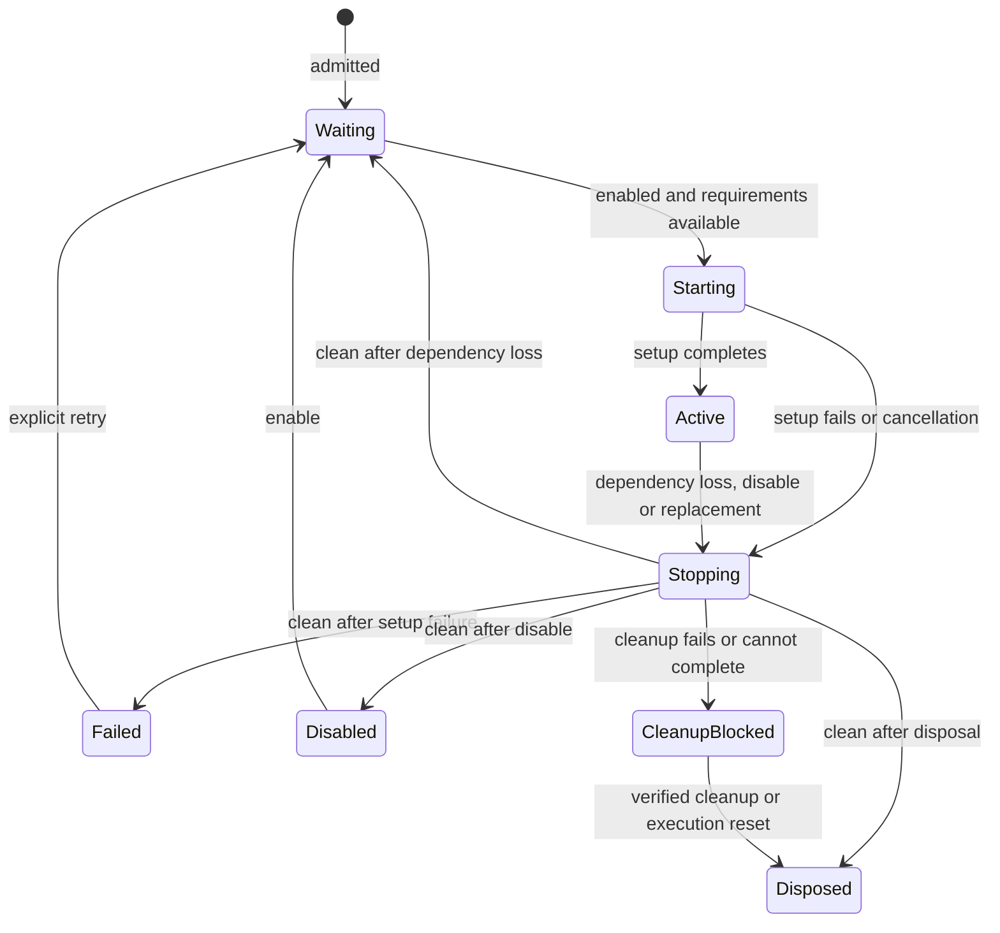

# Portable contribution architecture

This is the canonical core architecture settled through the owner review of [Contribution and realm contract](https://github.com/dvcol/devkit-extension/issues/5). [GLOSSARY.md](./GLOSSARY.md) defines the vocabulary. [Core declarations](./docs/contracts/core.d.ts) express the declaration and lifecycle interfaces; they are a specification, not a shipped runtime package.

The core decisions are settled. The linked domain tickets still own the exact server, routing, state, security, debugger, injection, renderer and reload integrations. Settling this document does not claim those implementations or their real-host tests exist.

## Purpose and constraints

Build a generic, modular client and contribution ecosystem shared by browser extensions and development tools. A host can select a development-server provider for a development target and an extension provider for a deployed target while retaining the same contribution contracts and JSON UI. Hosts supply domain/origin policies; the SDK contains no company-specific code or domain classifications.

Executable contributions are assembled from packaged code at build time. Startup and later installation accept the same definitions; runtime installation does not mean downloading executable plugins. Public authoring is framework-neutral. Renderer implementations can use a framework and remain replaceable.

The eventual monorepo uses pnpm/Turbo, Vite/Oxc and strict Oxlint enforcement, with the audited TypeScript 7 pipeline subject to package/declaration compatibility checks. Chromium and Firefox are the initial browser hosts. Development HMR and watched production builds with live preview have separate, explicit update/restart/reload behavior. Existing scaffolding may be replaced as implementation proceeds.

## Contracts, contributions and plugins

| Element | Declaration | Runtime meaning |
| --- | --- | --- |
| Capability | Imported ID, mandatory positive integer contract version, operation schemas and target requirements | A service contract; does not imply availability |
| Service | Capability descriptor plus execution assignment, requirements and setup recipe | Constructs an owned implementation of exactly that contract |
| Action | Shared versioned descriptor plus a separate handler contribution | An invocable use case that can consume capabilities |
| View | JSON definition, references and bindings | Published presentation, mounted by a renderer on a surface |
| Transform | Kind-specific transform definition | Owned interception or transformation behavior |
| Script | Packaged module and execution declaration | Runs in its actual background/content/page execution with target scope |
| Plugin | Named lists of services, actions, views, transforms, scripts and custom extensions | Installed and controlled together, with independent contribution activation/failure |
| Custom kind | Imported kind descriptor, payload schema and explicitly installed kind handler | Allows new kinds without arbitrary plugin fields or a closed core switch |

A service always declares a capability contract and its version. There is no unversioned service, implicit latest version or required portable raw-object `provide`. Native APIs remain available in eligible native contexts.

Definitions are inert. Helpers preserve schema/literal inference and validate declarative invariants; they do not execute setup or register resources. Use dedicated plugin properties. Unknown properties such as `actons`, wrong-kind list entries and missing contracts are errors.

## Dependency and execution diagrams





An adapter integrates environment lifecycle, communication and implementations. A transport only carries messages. Reuse upstream RPC/state/JSON contracts through supported interfaces; do not build a competing generic host, RPC engine or state authority merely to unify constructor names.

## Placement and ownership

| Piece | Role | Owns |
| --- | --- | --- |
| Extension background worker/document | Provider | Browser capability implementations, provider registrations and recovery coordination |
| Isolated content script | Execution agent | Its document/frame resources and extension-side page bridge |
| Injected MAIN-world script | Execution agent | Page-owned resources and a validated target-scoped bridge |
| Extension DevTools page | Client bootstrap/local integration | Panel creation, inspected target integration and its native hooks |
| Popup, options, panel, sidebar | Client and renderer | That document's connections, subscriptions and mounts |
| Standalone Devframe server | Provider through adapter | Existing host integration and server contribution lifetimes |
| Vite DevTools server | Provider through adapter | Existing Devframe/hub/kit context and eligible Vite integration |
| Devframe/DevTools panel | Client and renderer | Panel mount and client subscriptions |

Closing a UI document does not dispose independent provider work. A content/page script is not a trusted provider merely because it can send a message. A worker termination cannot be treated as proof that JavaScript cleanup callbacks ran; recovery must re-establish ownership and target generation.

Provider identity, realm, execution, UI surface and target are separate axes. Initial realm descriptors are `webext` and `devserver`. Adding a realm requires a descriptor and adapter, not a core union or renderer rewrite. Devframe, hub and Vite contexts may coexist within one server provider.

## Identity, admission and strictness

Every registration has an owner. Capability slots use `(provider ID, capability ID, exact contract version)`. A provider can offer multiple versions concurrently, each backed by an explicit contract and implementation. A definition's contribution ID identifies its lifecycle within the installation and must be unique there. Version equality is not proof that an author preserved a schema: publishing incompatible content under an unchanged contract version violates the contract.

Contract IDs are non-empty, case-sensitive identifiers. Contract versions are positive safe integers. Package versions do not select contracts. Pointer identity is irrelevant to duplicate admission, including when the very same definition object appears twice.

| Condition | Default `strict: true` | Relaxed strictness |
| --- | --- | --- |
| Duplicate service slot | Reject incoming admission batch | Warn and skip the incoming service definition |
| Requested contract version unavailable | Error diagnostic; incompatible binding remains unavailable | Warning diagnostic; incompatible binding remains unavailable |
| Invalid declaration, unknown kind/field or dependency cycle | Reject admission batch | Still reject; strictness is not a bypass for declaration validation |
| Setup throws after admission | Isolate failed contribution, invalidate dependents, report diagnostics | Same failure and cleanup behavior |
| Cleanup fails or does not finish | Block replacement | Still block replacement |

A startup batch is the host's complete startup composition. A later plugin installation is one batch; installing a service directly is a one-definition batch. In strict mode, reject an invalid batch before any of its setup runs. Previously running installations remain intact. Reserve identities deterministically before asynchronous setup; completion speed never selects a duplicate winner. Within a declared startup plan, host service declarations precede plugin lists, and declaration-list order supplies conflict diagnostics. Activation follows dependency order, not incidental array or promise completion order.

Relaxed duplicate results contain an explicit skipped outcome and diagnostic, with no ownership handle for the old service. A plugin containing skipped services may still admit its other declarations; its snapshot records the skips. Requiring an already host-owned service is allowed, but registering it again does not acquire ownership or merge options.

## Schemas, values and calls

Standard Schema is mandatory for public wire inputs and returns. Validation checks original values; it discards successful transformed output. Derive both argument and return value types from the corresponding schema's `InferInput`. Authors can normalize in handlers or wrap handlers explicitly. The final returned value must still satisfy the wire return schema.

Public JSON Schema export is needed only by integrations requiring schema inspection, such as generated forms or an MCP adapter. Missing or unsupported export is explicit; never invent a permissive schema. Validation, serialization and authorization remain separate checks. Native objects and functions are never made transportable by a successful schema check.

Ordinary operation/action calls return `Promise<Value>` and reject on failure. Stable error codes and `isOperationError` allow runtime narrowing; TypeScript does not specify a promise's rejection type. Availability and lifecycle status remain separately observable. Broadcast uses per-provider outcomes in the routing contract.

| Call path | Provider behavior | Target and context |
| --- | --- | --- |
| `capabilities.invoke(contract, operation, input, options)` | Select for this invocation before dispatch | Common options contain the authoritative target and optional routing directive |
| `capabilities.resolve(contract, options)` | Resolve a particular provider binding | Availability is a snapshot; an operation can still fail afterward |
| `binding.api.operation(input, options)` | Use that binding's provider | No routing override that silently changes the binding's owner/context |
| `actions.invoke(action, input, options)` | Select the action provider; its requirements bind there by default | Handler receives validated target, signal and its own local execution context |

A bound API stays pinned to its provider. A fresh routed invocation can select another provider before dispatch. Cross-provider orchestration is explicit. After dispatch, no timeout, disconnect or report that execution did not begin permits rerouting or automatic replay. A separately requested invocation starts a new decision.

Operation declarations specify `target: 'required'` or `target: 'none'`. Required-target calls must provide a validated target reference in invocation options; targetless calls reject an execution target. Business payloads can refer to other subjects without changing this execution target. A target reference contains a kind, opaque identity and generation; the routing/trust adapters define resolution and validate freshness. Abort signals remain local, with transport cancellation represented by protocol messages.

## Representative shared and native declarations

The following pseudocode follows [the declaration types](./docs/contracts/core.d.ts). Package import paths are illustrative until the monorepo package layout is implemented. `titleInputSchema` and `titleResultSchema` are application-owned Standard Schema validators; `titleResultSchema` accepts `{ title: string }`.

```ts
const pageCapability = defineCapability({
  id: 'example.page',
  version: 1,
  operations: {
    readTitle: defineOperation({
      input: titleInputSchema,
      output: titleResultSchema,
      target: 'required',
    }),
  },
});

const readTitleAction = defineAction({
  id: 'example.inspector.read-title',
  version: 1,
  operation: pageCapability.operations.readTitle,
});

const readTitleContribution = defineActionContribution(readTitleAction, {
  id: 'example.inspector.read-title',
  execution: providerExecution,
  requires: { page: pageCapability },
  handler({ input, services, target, signal }) {
    return services.page.api.readTitle(input, { target, signal });
  },
});

const inspectorPlugin = definePlugin({
  id: 'example.inspector',
  actions: [readTitleContribution],
  views: [inspectorView],
});
```

The action handler is packaged for provider execution and does not run in the renderer. `inspectorView` is a JSON view declaration referencing the action's public descriptor; it does not import that handler. A UI-free plugin can omit `views`. Direct capability calls need no action wrapper.

```ts
const browserPageService = defineService(pageCapability, {
  id: 'example.browser-page-service',
  execution: extensionBackgroundExecution,
  setup(context) {
    const browserContext = context.native.get(browserBackgroundContext);
    if (!browserContext) throw new Error('Browser background context unavailable');

    const resource = createBrowserPageImplementation(browserContext);
    context.scope.onDispose(() => resource.dispose());
    return resource.operations;
  },
});

const admission = await provider.services.install(browserPageService);
if (admission.status === 'admitted') {
  const current = admission.handle.snapshot();
  showInstallationStatus(current);
}
```

`createBrowserPageImplementation` is application/adapter code returning operations satisfying `pageCapability` and an asynchronous cleanup function. It resolves/authorizes target references through the browser adapter before native work. This is not a claim that a browser API accepts the generic target reference directly. A server implementation supplies a different recipe for the same contract and receives its actual native server contexts.

Transforms and scripts retain their own declaration kinds and execution hooks. A transform-only plugin owns its interception registration through its activation scope. A page-only plugin packages its script for MAIN-world execution and a document generation, without acquiring background native APIs. Their exact operation and packaging signatures belong to [Injection and transform contract](https://github.com/dvcol/devkit-extension/issues/11).

A custom kind uses `defineContributionKind({ id, schema })`, `defineExtension(kind, { id, execution, payload })` and `plugin.extensions`. The host explicitly supplies a `ContributionKindInstaller` for that descriptor. Its `activate` receives the validated definition and owned local setup scope. An unknown kind is an admission error; no arbitrary plugin key is treated as an extension. The renderer needs no change merely because another non-UI kind exists.

## Local native contexts

A binding exposes `api` and `context`. The context includes provider and realm identity plus execution identity, with `access: 'local' | 'remote'`. Local contexts expose `native.get(importedDescriptor)`, yielding the declared native type or `undefined`. Remote contexts have no `native` member. Calls receive their target separately in invocation context.

A realm label does not grant a native API. A background context, content-script context and popup context have different resources. A Vite server context may expose Devframe, hub and kit values simultaneously; optional resources remain optional. The client can also use its own locally owned browser context without confusing it with a remote provider's context.

Native descriptors are explicit imports. The runtime stores actual native values locally and transports only validated metadata. Definition modules and client-safe contracts cannot import provider handlers, Node libraries or renderer frameworks. Bundle checks must prove this separation.

## Activation, retry and replacement



Readiness loss and setup failure are different. Compatible capability restoration can reactivate a waiting contribution. A setup exception stays failed until explicit retry; repeated availability notifications must not create a retry loop. A per-call permission/target failure does not automatically dispose a provider-wide service.

| API/hook | Required behavior |
| --- | --- |
| `install(definition)` | Preflight/reserve, then complete the initial activation pass. Return admitted handle or relaxed skipped result. Waiting dependencies do not hang installation indefinitely. Strict admission errors reject. |
| `handle.snapshot()` | Return current installation/child states and diagnostics; `admitted` is not a claim that every child is active. |
| `handle.subscribe(listener)` | Deliver current snapshot on subscription and subsequent changes; return an idempotent unsubscribe. Listener failure is diagnosed without breaking runtime ownership. |
| `handle.enable()` | Clear explicit disable and reconcile availability; return the settled current snapshot. |
| `handle.disable()` | Stop new work, request cancellation and await owned teardown; keep declarations registered but inactive. |
| `handle.retry(contributionId)` | Retry that failed setup explicitly if enabled; missing requirements leave it waiting. It cannot bypass cleanup-blocked status. |
| `handle.dispose()` | Terminal, asynchronous teardown. Repeated calls observe the same teardown attempt; no duplicate cleanup. Reject/report incomplete cleanup and retain blocked state. |
| `scope.onDispose(cleanup)` | Register activation-owned cleanup while the scope is open. Run in reverse acquisition order, attempt every cleanup, and report all failures. |
| `replace(handle, definition)` | Preflight replacement first, keeping the old installation on invalid input. Stop old work, await cleanup, then activate the admitted successor. Ordinary install never replaces. |

Initial setup failures are reflected in admitted handles, logs and diagnostics so callers can observe and retry them; they do not turn a partially active plugin into a successful all-active result. Aggregate installation state is `ready` only when every enabled, admitted child is active and there are no failure/skipped diagnostics requiring attention. `partial` reports mixed active/inactive or failed/skipped outcomes; `inactive` reports a clean installation with no active children.

Cancellation is cooperative. Disposal must account for in-progress setup and owned work before claiming the activation ended. Fence generation-sensitive registrations so late completions cannot be published into a successor. Resources created outside the supplied ownership scope remain the author's responsibility and cannot be used as proof of successful conformance.

Cleanup failure or non-completion blocks the successor even in relaxed mode. An adapter may recover through an explicit reset/reload only when it establishes that the old execution and registrations are gone. Resetting a whole shared provider may affect unrelated contributions and requires the reload contract's ownership policy; core does not authorize doing so automatically. A timer is not cleanup proof.

## Diagnostics and error contract

Admission, setup, call, cleanup and transport failures have stable codes and serializable diagnostics carrying provider and relevant plugin/contribution identity. Original native exceptions remain in the owning execution. Expected capability unavailability distinguishes unsupported implementation, wrong execution, missing permission, target absence/restriction/staleness, disconnect, incompatible contract and dependency unavailability.

The implementation must publish core codes for invalid definition, duplicate registration, dependency cycle, incompatible contract, setup failure, invalid input, invalid return, unavailable capability, cancellation, transport failure and cleanup failure. An adapter preserves a supported underlying diagnostic as additional local context without depending on native prototype transport. `isOperationError` validates the portable error shape before narrowing.

Log failures at their owning execution and retain current lifecycle diagnostic status for clients. A later UI mount can show the current failure. A generic status view must not depend on the failed service. Individual rejected calls and lifecycle diagnostics serve different consumers; neither replaces the other. The trust contract owns wire error-detail exposure.

## Public API and proof obligations

[Core declarations](./docs/contracts/core.d.ts) enumerate every core type and method. [The API proof matrix](./docs/contracts/CORE-API-MATRIX.md) maps their behaviors to named fixtures/examples and host assertions. Those are implementation obligations; declaration checks alone do not satisfy runtime conformance.

The monorepo must contain runnable contribution, custom renderer, standalone Devframe host, Vite DevTools host, Chromium host and Firefox host examples. Each supported API/hook requires success, failure, unavailable, disposal and applicable navigation/permission/disconnect/recovery assertions. Unsupported combinations must prove explicit unavailability rather than disappear from coverage.

## Domain boundaries and implementation sequence

| Contract | Owns remaining decisions |
| --- | --- |
| [Server adapter contract](https://github.com/dvcol/devkit-extension/issues/6) | Exact public host factories, development/preview bindings, native contexts and middleware/transport cleanup |
| [Provider discovery and routing](https://github.com/dvcol/devkit-extension/issues/7) | Routing-directive construction, callbacks/preferences/broadcast, discovery identity, dispatch races and cancellation outcomes |
| [State scope and recovery](https://github.com/dvcol/devkit-extension/issues/8) | State declarations, scope, persistence, transport reconciliation and abrupt worker recovery |
| [Permissions and trust](https://github.com/dvcol/devkit-extension/issues/9) | Authorization, wire validation/serialization, bridge trust and diagnostic exposure |
| [Debugger and CDB contract](https://github.com/dvcol/devkit-extension/issues/10) | Debugger operations, session/target ownership and supported adapters |
| [Injection and transform contract](https://github.com/dvcol/devkit-extension/issues/11) | Script modules, injection stages and HTML/HTTP transform contracts |
| [Renderer and surface contract](https://github.com/dvcol/devkit-extension/issues/12) | JSON view/state/action integration, renderer replacement and surface mount APIs |
| [Live preview and reload contract](https://github.com/dvcol/devkit-extension/issues/13) | Change matrix, build generations, cleanup/reset recovery and retained state across modes |
| [Examples and API coverage contract](https://github.com/dvcol/devkit-extension/issues/14) | Complete monorepo example layout, every domain API/hook cell and real-host test enforcement |
| [Portable contribution proof](https://github.com/dvcol/devkit-extension/issues/15) | End-to-end cross-host proof of the resolved contracts |
| [Release and conformance contract](https://github.com/dvcol/devkit-extension/issues/16) | Package publication, compatibility baselines and release gates |

Implement the settled declaration/core lifecycle contract first, preserving the existing upstream boundaries. Continue each adapter/domain as its required decisions and evidence become available. Keep commits and issue deliverables separated by ticket. The owner authorized continuing after architecture settlement until another decision requires input; that overrides the original single-ticket planning-session limit without inventing answers to later human-led decisions.

## Rejected alternatives

| Alternative | Reason |
| --- | --- |
| One heterogeneous built-in `contributions` array | Dedicated properties provide clearer declaration typing and diagnostics |
| Separate plugin-entry wrapper | Adds another identity/factory without a distinct ownership requirement |
| Global declaration merging as the primary extension API | Imported descriptors keep contracts explicit and portable across bundles |
| Pointer-equality duplicate exemption or shared install leases | Replaced by predictable conflict handling and one owner per registration |
| Implicit contract version ranges | Exact numeric versions and explicit compatibility implementations are sufficient now |
| Automatic fallback after dispatch | Can replay work or change its owner after execution may have begun |
| Universal operation-result wrapper | Changes upstream ordinary call/return-schema semantics; use per-provider outcomes where routing needs them |
| Schema transformations applied implicitly | Conflicts with the selected upstream guard-only behavior; authors normalize explicitly |
| Mandatory JSON Schema conversion everywhere | Only schema-inspection integrations require export |
| Parallel activation after cleanup timeout | Cannot establish that old registrations or native work ended |

The decision history and pinned upstream evidence remain in the planning packets. Canonical semantics in this document supersede their unselected alternatives.
