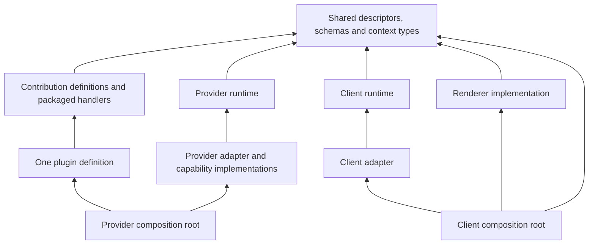

# Architecture, glossary and declaration contract

Working proposal for [Contribution and realm contract](https://github.com/dvcol/devkit-extension/issues/5). The owner requires a clear glossary, dependency/interaction diagrams, type safety and declaration API before runtime implementation. Explicit imported descriptors and separation of definition modules from core runtime are settled requirements. Names, signatures and the lifecycle policies below remain under review.

This packet supersedes the earlier two-step `definePluginEntry`/`definePlugin` authoring sketch. There is one plugin definition. Executable script references remain explicit where a real execution boundary requires separate packaging.

Follow-up: the owner challenged the mixed contribution list, imperative-only service registration and amount of abstraction. The [declaration and upstream-alignment proposal](./005-declaration-alignment.md) recommends dedicated properties, a shared startup/dynamic service definition and installation into existing host contexts. It supersedes those authoring/bootstrap recommendations below; the glossary and execution diagrams remain review context.

## Correct the relationships first

A **capability** is a service contract. A **provider instance** offers an implementation of that contract. A **realm** describes the environment family; it does not execute or implement anything. A provider only advertises capabilities it can actually implement in eligible contexts.

A **contribution** is something a plugin adds, including views, actions, state declarations, transforms and packaged scripts. Its implementation can require zero or more **capabilities**. A view may also reference an action contribution through its public action descriptor. Keep those references distinct from service dependencies.

A **plugin** groups contributions under one identity and installation lifetime. Its package can also export shared capability contracts and optional implementation definitions. Exporting or listing a contract does not supply an implementation. Several plugins can share the same contract without owning one another.

An action describes a use case, such as capture a snapshot. A capability describes a service that can support that use case, such as debugger operations. An action handler may orchestrate several capabilities; a capability may support several actions or transforms.

## Proposed glossary

This is the complete proposed replacement vocabulary for the current discussion. Copy agreed terms into the root glossary after owner review; the earlier glossary is not silently renamed by this packet.

| Term | Definition | Example or boundary |
| --- | --- | --- |
| Capability descriptor | Stable, versioned, typed service contract with runtime operation schemas | Page inspection contract, independent of Chrome or Vite |
| Capability implementation | Executable code satisfying one capability contract in an eligible execution | A browser adapter's page inspection service |
| Capability binding | A consumer's currently resolved implementation, exposing `api` and `context` | Page service from provider A for document generation B |
| Contribution definition | Typed description of one addition to a host | Action, JSON view, transform, state declaration or packaged script |
| Action descriptor | Shared input/output contract and identity for an invocable action | Imported by both UI and the action contribution's handler |
| Plugin definition | Named collection of contributions installed and controlled together | Inspector plugin, useful with or without UI |
| Plugin installation | One provider's running instance of a plugin | Same definition installed independently in two providers |
| Plugin handle | Local control and observation object for one installation | Status, enable, disable, retry setup and dispose |
| Provider | Logical identity offering capabilities and installed plugin behavior | One development server or one extension instance |
| Realm | Extensible environment family of a provider | WebExtension or development server |
| Host | Application composition that chooses runtimes, adapters and installed plugins | Browser extension application or a development tool application |
| Runtime | Process-local engine that manages registrations, execution and lifecycle | Provider runtime or client runtime |
| Provider runtime | Runtime responsible for service implementations, plugin contributions and authoritative operation execution | Runs in extension background or a server process |
| Client runtime | Runtime responsible for discovery, selection, subscriptions, action calls and local presentation | Runs in a popup or panel document |
| Execution agent | Target-scoped code that performs delegated work in another execution for a provider | Isolated content script or page MAIN script |
| Adapter | Integration code that connects the portable runtime to a specific environment | WebExtension provider adapter or Devframe client adapter |
| Transport | Channel carrying validated protocol messages | Extension messaging or a server connection |
| Renderer | Implementation that turns JSON views and bindings into UI | Default renderer or downstream replacement |
| Execution context | Actual worker, process or document where code and native resources live | Background worker, Node process, popup document |
| UI surface | Placement of a rendered interface | Popup, options, side panel, DevTools panel |
| Target | Subject of an operation, including identity and generation | A particular inspected document, independent of selected UI |
| Native context | Raw resources owned by a local execution, accessed through explicit descriptors | Browser events, Devframe/hub/Vite context objects |

A process may contain both client and provider roles when a host deliberately composes them. The default extension popup is a client; that does not erase the browser APIs that its own document legitimately owns.

## Axes that must remain separate

| Axis | Answers | Proposed examples |
| --- | --- | --- |
| Provider identity | Which instance owns this operation/state? | `extension:local`, `server:project-a` |
| Realm | What environment family does that provider belong to? | `webext`, `devserver` |
| Adapter | How is this runtime connected to that environment? | Chromium/Firefox integration, standalone Devframe, Vite DevTools |
| Execution | Where is this particular code running? | Background worker, content script, page document, server process, UI document |
| Surface | Where does its UI appear? | Popup, options, panel, side panel |
| Target | Which inspected subject does this call address? | Tab plus document generation, frame |
| Mode | Which build and reload policy applies? | Development, watched production preview, packaged release |

Recommend one development-server realm for standalone Devframe and Vite DevTools. They use different adapters and can expose different native context descriptors. A Vite DevTools server may expose Devframe, hub and Vite resources together. Those libraries do not create three independent provider identities. Realm IDs remain extensible imported descriptors; the example names are not a closed core union.

An options document can have no selected target. A popup's selected target is not automatically a background service's lifetime. Closing a panel ends that client document's subscriptions and presentation, while independent provider work continues.

## Definition dependencies

Arrows in this diagram mean imports or typed references, not runtime messages.



Definitions do not import either runtime. Shared action/view/capability contracts do not import their executable implementations. A client can import an action descriptor without importing the plugin's provider handlers or native server code. Adapter modules and renderer implementations may depend on native APIs or a UI framework within their own eligible bundles.

A definition may contain a packaged function. That is executable source known at build time, not JSON sent to a browser. The compiler/packager resolves the declared execution assignments and script modules; the wire protocol publishes only validated metadata, state and operation messages.

## Runtime interactions

Arrows in this diagram mean runtime interactions. One client may connect to several providers; selecting and broadcasting across them is owned by [Provider discovery and routing](https://github.com/dvcol/devkit-extension/issues/7).

```mermaid
flowchart LR
  subgraph Presentation["Client execution: popup, options or panel"]
    Renderer["JSON renderer"]
    Client["Client runtime + client adapter"]
    Renderer -->|"action request"| Client
    Client -->|"view, state and availability"| Renderer
  end
  Client <-->|"validated messages"| Transport["Transport"]
  Transport <-->|"calls, results and subscriptions"| Provider["Provider runtime + provider adapter"]
  Provider -->|"invokes packaged handler"| Action["Action contribution"]
  Action -->|"typed capability binding"| Service["Capability implementation"]
  Service -->|"local eligible operation"| Native["Browser or server APIs"]
  Service <-->|"validated target-scoped requests"| Agent["Content or page execution agent"]
  Agent -->|"local operation"| Target["Inspected document"]
  Provider -->|"owns declarations and registrations"| Registry["Views, actions, state and transforms"]
```



The provider runtime remains the authority for its owned operations. A MAIN script does not receive background permissions or become a trusted provider simply because it can send a message. An execution agent reports into a provider under explicit target/session validation. If a future host advertises an agent as an independent provider, it must give it its own identity and authority explicitly.

## Placement by host

| Deployment piece | SDK role | Adapter/implementation responsibility | Lifecycle owner |
| --- | --- | --- | --- |
| Extension background worker/document | Provider runtime | Extension messaging, persistence, eligible browser APIs, delegation to tab executions | Extension provider; survives UI closures, recovers from worker replacement |
| Isolated content script | Execution agent | DOM operations and the extension-side page bridge in that document | Document/frame generation |
| Injected MAIN script | Execution agent | Page-owned APIs through the validated page bridge | Page document generation |
| Extension DevTools page | Client bootstrap and local native integration | DevTools lifecycle, inspected target and panel creation hooks | DevTools document |
| Extension popup/options/side panel/panel | Client runtime plus renderer | Local UI lifecycle, connection to providers, permitted local native hooks | Each UI document |
| Vite DevTools server | Provider runtime | Adapter around Devframe/hub/DevTools and Vite resources | Server provider |
| Standalone Devframe server | Provider runtime | Adapter around the available Devframe and optional hub resources | Server provider |
| Vite DevTools panel | Client runtime plus renderer | DevTools mount/connection integration | Panel mount/document |
| Standalone Devframe panel | Client runtime plus renderer | Devframe mount/connection integration | Panel mount/document |

The server provider can also rely on a browser execution agent for page-side operations. The shared capability contract exposes the operation and its actual availability; it does not require every platform to perform it through the same native API. Detailed injection timing, browser permissions and transport/recovery behavior remain the linked map contracts' work.

An adapter is broader than a transport. It may provide lifecycle hooks, target discovery, capability implementations, entry packaging and local context access. A transport alone does not implement page inspection, debugger operations or rendering.

## One plugin declaration

All names below are proposed exports. The snippets define an authoring contract, not implemented SDK packages.

### Shared contracts

Schema-derived types keep TypeScript inference and wire validation tied to the same declarations. The imported schemas below are portable runtime schemas for the target and result; they are application examples, not magic SDK globals.

```ts
// contracts.ts: safe for provider and client bundles
import { defineAction, defineCapability, defineOperation } from '@portable-sdk/definitions';
import { targetInputSchema, titleOutputSchema } from './schemas.js';

export const pageCapability = defineCapability({
  id: 'example.page',
  version: 1,
  operations: {
    readTitle: defineOperation({
      input: targetInputSchema,
      output: titleOutputSchema,
    }),
  },
});

export const readTitleAction = defineAction({
  id: 'example.inspector.read-title',
  version: 1,
  input: targetInputSchema,
  output: titleOutputSchema,
});
```

Capability operations are reusable services. The action is the plugin's invocable use case. Their schemas happen to match in this small example; a more complex action can combine several operations and return a different result.

### Contribution implementation and plugin definition

```ts
// plugin.ts: packaged for provider execution
import {
  defineActionContribution,
  definePlugin,
  providerExecution,
} from '@portable-sdk/definitions';
import { pageCapability, readTitleAction } from './contracts.js';
import { inspectorView } from './view.js';

const readTitleContribution = defineActionContribution(readTitleAction, {
  execution: providerExecution,
  requires: { page: pageCapability },

  handler({ input, services, signal }) {
    return services.page.api.readTitle(input, { signal });
  },
});

export const inspectorPlugin = definePlugin({
  id: 'example.inspector',
  contributions: [readTitleContribution, inspectorView],
});
```

`defineAction` creates the public contract. `defineActionContribution` attaches a handler, service dependencies and execution assignment to that contract. Both are inert definition helpers. This is an actual action callback, not a new generic feature/handler grouping.

`inspectorView` is a separately defined JSON view contribution that references `readTitleAction` through its public descriptor. Its JSON catalog and component bindings belong to the renderer contract. The client imports public contracts and views, never this provider implementation module.

There is no `definePluginEntry`, no mandatory setup wrapper returning an unchanged array, and no second plugin identity. A contribution kind that owns startup resources supplies a typed activation hook and cleanup scope through that kind's definition contract. It shares the runtime ownership protocol rather than forcing all plugins into an additional feature container.

### Platform implementations and provider composition

The custom page capability has separate implementation modules, for example `page.webext.ts` and `page.devframe.ts`. They both implement the operation schemas above, receive eligible local contexts and obey the same outcome contract. A common contribution uses the descriptor without importing either module.

```ts
// provider.webext.ts: host composition, the runtime dependency starts here
import { createProviderRuntime } from '@portable-sdk/runtime/provider';
import { createWebExtensionProviderAdapter } from '@portable-sdk/adapter-webext/provider';
import { pageCapability } from './contracts.js';
import { inspectorPlugin } from './plugin.js';
import { pageImplementation } from './page.webext.js';

const provider = createProviderRuntime({
  adapter: createWebExtensionProviderAdapter({
    providerId: 'example.extension',
  }),
});

provider.provide(pageCapability, pageImplementation);
const installation = await provider.install(inspectorPlugin);
```

The Devframe composition substitutes its provider adapter and page implementation. The Vite DevTools adapter can build on the Devframe adapter while exposing the additional eligible Vite context. These are factories for adapters around the same provider-runtime contract; they do not redefine plugins.

`provide` validates and registers an implementation definition for later eligible activation. `install` starts that plugin's eligible registrations and returns a handle. The adapter's environment bootstrap owns channel and native listener initialization, including any synchronous registration requirements. The exact start/readiness API and worker recovery sequence must be fixed before implementation, not inferred from this sketch.

A plugin package may export optional native implementations, but host composition selects the eligible ones. Contract-only exports do not make those native implementations appear automatically. The first proof can use explicit composition; automatic implementation selection would need its own reviewed build-time declaration contract.

### Client composition

```ts
// popup.ts: client runtime, no provider handler imports
import { createClientRuntime } from '@portable-sdk/runtime/client';
import { createWebExtensionClientAdapter } from '@portable-sdk/adapter-webext/client';
import { renderer } from './renderer.js';
import { readTitleAction } from './contracts.js';

const client = createClientRuntime({
  adapter: createWebExtensionClientAdapter({ surface: popupSurface }),
  renderer,
});

await client.connect();
const presentation = client.mountView(inspectorViewReference, {
  container,
  provider: selectedProvider,
});

const result = await client.actions.invoke(
  readTitleAction,
  { target: selectedTarget },
  { provider: selectedProvider },
);
```

`popupSurface` is an imported surface descriptor. `inspectorViewReference` is a typed public reference to the published view. `container`, `selectedProvider` and `selectedTarget` come from the client application. The client knows its own local execution and selected remote provider separately. Mount/subscription handles belong to the client document and are disposed with it. Exact view mounting and renderer integration signatures remain part of [Renderer and surface contract](https://github.com/dvcol/devkit-extension/issues/12).

The Devframe/DevTools client compositions substitute their mount/connection adapters. The view and action contract stay the same. A renderer can also handle a local presentation interaction without creating a provider action; the renderer contract must distinguish those local interactions from authoritative backend commands.

### Scripts retain real execution boundaries

Some contributions genuinely need a separate packaged module:

```ts
const pageProbe = defineScriptContribution({
  id: 'example.inspector.page-probe',
  execution: mainWorldExecution,
  module: new URL('./page-probe.ts', import.meta.url),
});
```

This definition identifies a script contribution. It is not another plugin declaration. Its activation target, match rules, permissions, timing and bridge contract must be specified by [Injection and transform contract](https://github.com/dvcol/devkit-extension/issues/11). The script runs in its declared execution. It cannot inherit a provider's raw native context by importing a common type.

## Dependency edges have different meanings

| Edge | Meaning | What it does not imply |
| --- | --- | --- |
| Contribution `requires` capability | Bind the declared service before making the dependent behavior executable | Grant permission, choose arbitrary providers or execute an operation |
| View references action | Bind a UI interaction to the action's public contract and availability | Import its handler or require its service to render the whole view |
| Contribution references shared state | Address a typed state contract with explicit provider/scope ownership | Merge state across providers |
| Plugin contains contributions | Install/control these definitions as one named unit | Make all contributions fail together or expose every capability |
| Capability implementation delegates to agent | Execute an eligible part of the operation in a target context | Transfer all provider authority to page code |
| Host selects adapter | Connect the portable runtime to this environment | Make unsupported platform features available |

Default recommendation: no arbitrary plugin-to-plugin or contribution-to-contribution activation dependencies. Share behavior through capability and action contracts, with explicit references for views/state. If a real ordering dependency remains, name and specify it before adding a general dependency graph API. This revises earlier speculative cycle handling in the first review packet; that older sketch is not an accepted promise of a dependency graph.

An action using several services resolves them under its selected provider by default. Cross-provider orchestration must be explicit and preserve per-provider outcomes. Binding resolution must not silently combine state from one provider with target operations from another.

## Type-safety contract

| Boundary | Required guarantee | Rejection/evidence |
| --- | --- | --- |
| Descriptor identity | Literal identity/version preserved in types; runtime compares declared identity/version across bundles | Duplicate copies of the same compatible contract work without object identity |
| Operation schema | Infer input/output types from runtime schemas | Reject wrong input types statically and malformed messages at runtime |
| Capability implementation | Every declared operation has the correct signature and outcome type | Compile failures for missing operations, wrong results and accidental extra operations |
| `requires` inference | Each declared local key maps to a typed binding for exactly its descriptor | `services.page.api` inferred; undeclared services rejected |
| Action caller | Import the public action descriptor and infer its input/result | Client builds without provider handler or native dependencies |
| Local native context | Descriptor access returns only correctly typed resources owned by this execution | Unsupported context returns absent; a realm label alone cannot grant access |
| Remote context | Serializable provider/execution/target metadata, no native object field | Compile-time narrowing and wire rejection for native handles/functions |
| Target lifecycle | Every target-bearing call validates current identity and generation | A reused tab/frame identity cannot authorize a stale document operation |
| Availability | Typed bindings do not imply permanent permission or connectivity | Runtime rejects races with explicit outcomes |
| Downstream extension | Imported capability, realm and contribution-kind descriptors extend the SDK | Third-party example compiles without global augmentation or core union edits |
| Packaging | Execution declarations become actual eligible bundles | Emitted client graph contains no provider handlers or Node/backend-only dependencies |

Proposed operation outcome shape:

```ts
export type OperationResult<Output> =
  | { status: 'success'; value: Output }
  | { status: 'unavailable'; reason: UnavailableReason }
  | { status: 'cancelled' }
  | { status: 'failed'; error: OperationError };
```

`UnavailableReason` retains distinct unsupported implementation, wrong execution, missing permission, restricted target, disconnected provider, conflicting owner, stale target and incompatible contract reasons. `OperationError` is serializable and contains no native exception object. Capability bindings and action calls use the same envelope; the declared output schema validates the successful `value`. The concrete reason/error fields and authorization policy still need review.

An implementation is typed against the descriptor's inferred operations rather than a separately hand-maintained API interface. Optionality is explicit in schema and contract declarations. Avoid `any`, assertions that pretend a browser Port is a Devframe transport, and `skipLibCheck` as evidence of compatibility.

Recommend exact declared contract-version matching for the first proof. Semver-range negotiation and schema compatibility inference can be added only with an explicit policy. Exporting a changed schema under the same version is a contract violation; version equality alone is not proof that the author preserved the schema. Runtime schema validation remains mandatory.

## Context and ownership contract

Every bound API exposes `api` and `context`. Its context describes the service owner. The action callback separately receives its own execution identity and cancellation scope.

```ts
export type BindingContext<LocalNativeContext> =
  | {
      access: 'local';
      provider: ProviderDescriptor;
      execution: ExecutionDescriptor;
      target?: TargetReference;
      native: LocalNativeContext;
    }
  | {
      access: 'remote';
      provider: ProviderDescriptor;
      execution: ExecutionDescriptor;
      target?: TargetReference;
    };
```

`ProviderDescriptor` carries provider identity and the serializable realm descriptor. `LocalNativeContext` is a descriptor-indexed accessor restricted to the owning execution, not a union of every host namespace. A local Vite server can expose several native descriptors; a remote popup sees only their declared metadata. Permission and trust remain runtime checks even after TypeScript narrows a local context.

A plugin installation owns provider contributions and their activation generations. A client owns its renderer mounts and subscriptions. An agent owns document-scoped resources. A capability implementation owns its native service resources within its eligible execution. The runtime records those owners and unwinds resources on failure, replacement, disable and disposal. Abrupt worker termination requires durable recovery rather than assuming cleanup callbacks ran.

Missing required services keep contribution metadata observable while executable behavior is unavailable. Losing a binding cancels dependent work and active registrations. Compatible restoration recreates registrations and never replays a user action. Permission/target failure on one operation does not automatically dispose a provider-wide plugin.

## Public inventory and decision boundaries

| Area | Proposed exports/hooks | Owner of unresolved details |
| --- | --- | --- |
| Definitions | `defineCapability`, `defineOperation`, `defineAction`, `defineActionContribution`, `definePlugin`; execution/realm/native-context/contribution-kind descriptors | This contract |
| Provider runtime | `createProviderRuntime`, `provide`, contribution-kind registration, `install`, runtime disposal | This contract; adapter lifecycle in server/state contracts |
| Installation handle | Snapshot, subscribe, enable/disable, explicit failed-activation retry, dispose | This contract; exact retry target revised after removing entry wrappers |
| Capability binding | Typed API/context, resolution and observable availability | This contract; routing/trust behavior in their dedicated contracts |
| Client runtime | Connect/disconnect, provider discovery/selection, action invocation, state subscriptions | Routing/state contracts |
| Presentation | View references, mount/unmount, renderer adapter, local UI actions | Renderer/surface contract |
| Native implementations | Eligible local contexts and capability implementations | Server/debugger/injection contracts |
| Script definitions | Packaged execution reference and lifecycle hooks | Injection/transform contract |
| Build integration | Discover declarations, produce per-execution bundles and preserve ownership through reload | Toolchain/reload contracts |

This packet supplies the architecture and proposed declaration API. It does not claim every domain signature is finished. Before implementation admission, each public method and hook must have an exact type, execution owner, failure behavior and example/test obligation. The map must make remaining decisions explicit rather than leaving them to an implementer.

## Required contract evidence before implementation is considered complete

- Compile positive and negative authoring fixtures for inferred schemas, dependency bindings, implementation conformance, local/remote narrowing and downstream descriptors.
- Prove a contract-only client import cannot pull in a provider handler, native adapter or UI framework unintentionally.
- Execute the same inspector definitions through all supported host/client examples, with real success, unsupported, failure and lifecycle assertions.
- Exercise multiple providers and simultaneous client documents, including panel closure, document replacement and background recovery.
- Verify that capability restoration cannot replay a user action and that unavailable behavior does not remove unrelated views.
- Enumerate every public export, hook and behavior-changing option in the API/example/test/host matrix.

These are future implementation obligations. This planning change adds no SDK runtime. Documentation syntax checks are not evidence of any of these guarantees.

## Owner review frontier

1. Accept the corrected naming and relationships: provider implements capabilities; plugin contains contributions; contributions consume capabilities and may reference action/view/state contracts.
2. Accept one `definePlugin({ contributions })`, separate shared action contracts from handlers, and keep native script modules as explicit contribution packaging references.
3. Choose realm classification. Recommend `webext` and `devserver`, with standalone Devframe versus Vite DevTools represented by adapters and native-context descriptors.
4. Decide whether explicit host composition of capability implementations is sufficient for the first contract. Recommend yes; plugins can export optional implementations without introducing automatic realm-based implementation discovery yet.

After this review, record agreed vocabulary and settle the remaining exact core descriptor, contribution-kind installer, availability, retry/disposal and context signatures. The ticket remains open until the user-reviewed definition of done is satisfied.
