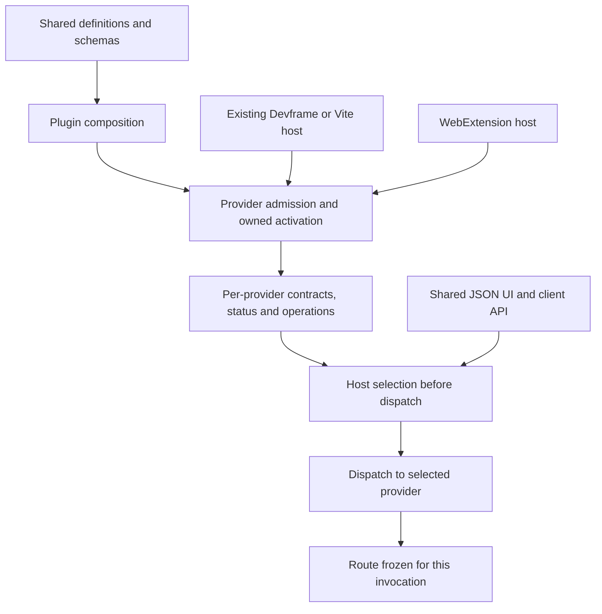
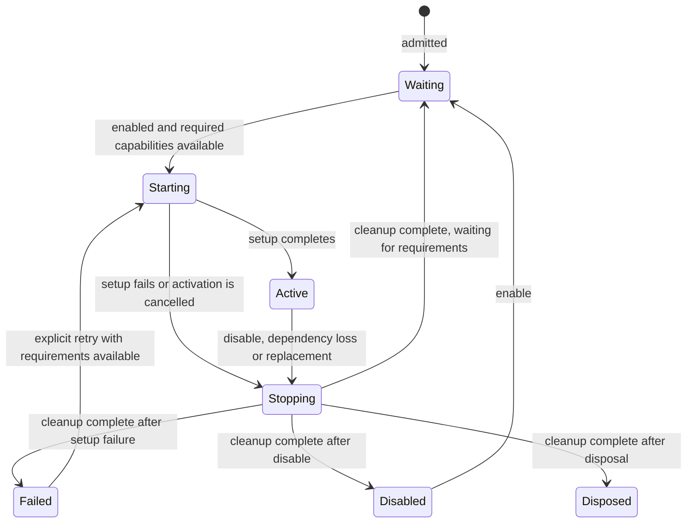

# Consolidated core API review

Review packet for [Contribution and realm contract](https://github.com/dvcol/devkit-extension/issues/5), following interview rounds 1 through 4. The [decision ledger](./005-decisions.md) records accepted choices. This packet consolidates their consequences and labels the remaining choices; it is not an implemented SDK or the final architecture document.

Earlier packets contain superseded alternatives, including mixed built-in contribution arrays, generic plugin-entry wrappers, portable raw-object `provide`, pointer-identity exceptions and shared installation leases. Those are absent from this proposal.

## Agreed structure

| Element | Contract and ownership |
| --- | --- |
| Capability descriptor | Imported stable ID, numeric contract version and Standard Schema operation definitions. It contains no running service or native context. |
| Service definition | An inert construction recipe for one capability in an eligible execution. Startup and runtime installation consume the same definition. |
| Plugin definition | Named composition with dedicated `services`, `actions`, `views`, `transforms`, `scripts` properties and descriptor-tagged `extensions` for new kinds. Omitted kinds contribute nothing. |
| Service registration | One provider's owned implementation. Duplicate handling never shares ownership or returns the existing service's owning handle. |
| Contribution activation | One live generation of a declaration's executable registrations. Required capability loss ends it; restoration can create another generation. Setup failure requires explicit retry. |
| Capability binding | Typed API plus context for the selected provider. Availability is observable but is not a guarantee that the next operation succeeds. |
| Host | Composes client/provider roles, adapters and policies across multiple providers and realms. Native host bootstrapping remains available. |
| Client | Selects providers, observes state/availability and invokes shared operation contracts. Its own native execution remains separate from a remote service's execution. |

Definitions stay separate from core runtime, native implementation bundles and renderer implementations. Server adapters use Devframe/Vite's existing host. Browser adapters supply extension mechanisms for the same contracts. Realm families begin with `webext` and `devserver`; imported descriptors allow additional families without editing a closed union.



## Schema-derived method types

Standard Schema checks original values. Its successful parsed output does not replace a handler argument or result. Consumer implementations may normalize explicitly, provided their returned wire values satisfy the declared return schema.

The following candidate illustrates type derivation for ordinary value-returning calls, pending Q22. These are proposed types, not published exports. `target` placement remains Q23; it is intentionally absent from this minimal derivation.

```ts
import type { StandardSchemaV1 } from '@standard-schema/spec';

export interface OperationDefinition {
  readonly input: StandardSchemaV1;
  readonly output: StandardSchemaV1;
}

export interface CallOptions {
  readonly signal?: AbortSignal;
}

export type OperationInput<Definition extends OperationDefinition> =
  StandardSchemaV1.InferInput<Definition['input']>;

export type OperationValue<Definition extends OperationDefinition> =
  StandardSchemaV1.InferInput<Definition['output']>;

export type CapabilityApi<
  Operations extends Readonly<Record<string, OperationDefinition>>,
> = {
  readonly [OperationName in keyof Operations]: (
    input: OperationInput<Operations[OperationName]>,
    options?: CallOptions,
  ) => Promise<OperationValue<Operations[OperationName]>>;
};
```

Definition helpers must preserve each supplied schema's precise type instead of widening it to the base `OperationDefinition`. Input and output names refer to operation direction; `InferInput` on the return schema describes the original return value that this contract validates. Advertising `InferOutput` would promise transformations the runtime does not apply.

JSON Schema export is required by integrations that need schema inspection, rather than every public definition. An integration must report missing or unsupported conversion. Exported metadata never replaces the validator or permission checks.

## Registration, activation and ownership

Registration identity is distinct from capability contract identity. The precise service conflict key is Q21. Distinct provider registries remain independent regardless of that choice.

| Step | Guaranteed behavior | Remaining detail |
| --- | --- | --- |
| Inspect definition | Check declaration shape, version, execution eligibility and registration conflicts before setup creates resources | Strict failure boundary for an entire startup/plugin batch is Q20 |
| Duplicate admission | Strict mode fails the incoming registration; relaxed mode warns and skips it. Preserve the existing owner | Return discriminants belong in the final signature review; a skipped result carries no owning service handle |
| Resolve requirements | Bind exact contract versions in the contribution's selected provider by default. Missing requirements leave metadata/status observable | Detailed provider selection remains in the routing ticket |
| Activate | Construct service APIs or register the contribution kind's behavior in an owned scope | The kind-specific factory/setup hook must preserve dependency inference |
| Setup failure | Clean up that contribution, mark dependents unavailable, retain independent contributions, log and expose diagnostics | A readiness report must describe partial activation without reporting whole-plugin health |
| Dependency restoration | Start a new activation after the old activation ends. Never replay an operation | Failed setup requires explicit retry instead of an automatic loop |
| Dispose/replace | End owned registrations before allowing an overlapping generation | Cleanup failure or non-completion policy is Q24 |

Proposed registration ordering: inspect a complete startup batch before launching asynchronous setup, reserve admitted identities deterministically, and order activation by declared dependencies. A faster setup must not win a duplicate slot. A dependency cycle must report the involved declarations instead of hanging readiness. These mechanisms support the accepted duplicate rule; the final admission unit depends on Q20.

A host-installed service belongs to the host. A plugin-installed service belongs to that plugin installation. Consumers acquire bindings without acquiring installation ownership. Dropping a later duplicate must not transfer ownership, merge setup options or make a disposable alias for the earlier registration.

## Observable lifecycle and diagnostics

The candidate installation handle supports reading current status, subscribing to changes, enabling/disabling declarations, explicitly retrying failed setup and asynchronous disposal. A plugin handle observes its child declarations; a partial failure remains distinguishable from full readiness. Exact aggregate result and retry-selector signatures will follow Q20/Q24.



This diagram deliberately shows successful cleanup paths. Failed or non-completing cleanup is the separate Q24 case. Explicitly disabled declarations stay inactive even when capabilities return. Disposal is terminal for that handle; a new installation requires a new handle. These are proposed lifecycle details for the final API review.

Failure status carries a serializable diagnostic with provider, plugin, contribution, phase and code. Native exceptions stay local. The host logs failures and exposes current diagnostic status so a current or later UI mount can display it. A generic host failure view must not require the failed service. Reuse existing status/transport integration rather than creating another diagnostics backend.

## Local and remote native context

Use an explicit access discriminant, alongside provider/realm/execution metadata:

| Context | Native access | Typing consequence |
| --- | --- | --- |
| Locally owned service binding | Descriptor-indexed access to the actual native objects owned by this execution | Import a native descriptor and narrow presence before using its typed value |
| Remote service binding | Serializable provider, realm, execution and target metadata only | No `native` field after narrowing to remote access |
| Client's own execution | Its own local native access where available | A popup's browser APIs do not become the remote background worker's APIs |

The proposed accessor is `context.native.get(importedDescriptor)`, returning its native type or `undefined`. A realm label alone must not imply privileged background APIs or a running Vite server. A local Vite adapter may expose Devframe, hub and kit contexts together. The contract must not turn those layered contexts into mutually exclusive realms.

The complete signatures must prove literal descriptor inference, custom realm/native descriptors, remote exclusion and absence handling. Native resources and executable setup functions never travel in a serialized descriptor.

## Remaining owner decisions

### Q20: Strict errors during batch admission

Q15 fixed isolation after setup begins; it did not settle invalid startup declarations discovered before setup. Consider two service definitions claiming the same slot in one startup batch with strict mode enabled.

- A: Reject that admission batch before running any of its setup callbacks. A startup batch fails to start; a later plugin batch fails to install. Previously running installations remain intact.
- B: Reject only the conflicting declaration, activate independent declarations and return a partial admission report.

Recommend A. It separates invalid composition from runtime setup failure and gives strict mode a predictable admission boundary. Relaxed duplicates still warn/skip. This does not change Q15's isolation for setup failures in an admitted batch.

### Q21: Service versions in one provider

Should one provider be able to offer both version 1 and version 2 of the same capability ID at the same time?

- A: Yes. Conflicts use provider plus capability ID plus exact numeric version; each version has its own registration and owner.
- B: No. One service slot per capability ID in a provider; changing its version requires explicit replacement.

Recommend A. It supports explicit compatibility implementations while preserving exact matching and no negotiation. Registering the same ID/version twice still conflicts, including repeated object references. Different provider instances remain independent under either option.

### Q22: Individual call results

- A: Ordinary calls return `Promise<Value>` and reject on failure. Publish stable error codes and a runtime narrowing helper. Availability and lifecycle remain observable separately.
- B: Every call returns a tagged result such as success, unavailable, cancelled or failed. Callers must unwrap the successful value.

Recommend A to preserve upstream call/return-schema semantics. TypeScript does not encode a rejection type in `Promise<Value>`, so this is a runtime-classified error contract, not statically typed exceptions. The already-required broadcast routing API still needs separate per-provider outcomes; that does not require wrapping every service method.

The earlier architecture packet proposed B. This revision makes the compatibility tradeoff explicit instead of adopting that wrapper by default.

### Q23: Target placement

- A: Put the inspected target in common invocation options/context; operation input contains business data. Routing and authorization consume that same target.
- B: Put the target in each operation's input schema; routing needs a declared way to extract it.

Recommend A. A target-bearing call must not carry two independently editable target identities in routing options and business input. The operation descriptor must specify whether a target is required or absent; the exact typing follows this choice. Browser target data remains a validated transport value, and targetless calls such as provider configuration remain possible. A business operation can still reference other subjects in its payload; those do not silently change its execution target.

### Q24: Cleanup failure before replacement

If cleanup rejects or never completes during reactivation or HMR replacement:

- A: Keep the new activation blocked. Report the failure; recovery requires successful cleanup or an explicit adapter reset/reload that proves the old execution is gone.
- B: After a configurable limit, warn and allow the new activation even though old registrations may remain.

Recommend A. This preserves the accepted requirement to end the previous activation before starting another. Async teardown should be awaited and repeated disposal should refer to the same teardown attempt. An abort signal requests cooperative cancellation; it cannot prove that old native work stopped or undo external effects.

The concrete reset/reload choice, timeout and recovery from browser worker termination belong to the reload and state tickets. The core contract must state what qualifies as the old activation ending.

## Released API evidence

A read-only follow-up checked SHA-512-verified `devframe@1.0.0` and `@vitejs/devtools-kit@0.7.5` artifacts. No new runtime experiment or latest-release claim is made here.

- Ordinary RPC calls return values through promises and reject on failure. Scoped calls and local invocation preserve the awaited return type. A universal result envelope would change this shape. [Client RPC](https://github.com/devframes/devframe/blob/18fa60effeb928eb445add2a536cd44906a59981/packages/devframe/src/client/rpc.ts#L124), [scoped calls](https://github.com/devframes/devframe/blob/18fa60effeb928eb445add2a536cd44906a59981/packages/devframe/src/client/scope.ts#L44).
- Connection errors expose runtime `kind` values for connection, authentication and timeout. Status/events and named RPC diagnostics are separate observability mechanisms. Preservation of native exception prototypes/codes through every future adapter is not established. [Connection errors](https://github.com/devframes/devframe/blob/18fa60effeb928eb445add2a536cd44906a59981/packages/devframe/src/client/connection.ts#L227), [RPC diagnostics](https://github.com/devframes/devframe/blob/18fa60effeb928eb445add2a536cd44906a59981/packages/devframe/src/rpc/diagnostics.ts).
- Definition wrappers accept an existing typed context, and kit contexts extend hub contexts. The released Devframe bridge installs into the existing host. [Context wrapper](https://github.com/devframes/devframe/blob/18fa60effeb928eb445add2a536cd44906a59981/packages/devframe/src/rpc/define.ts), [kit context](https://github.com/vitejs/devtools/blob/ad2d6df720a513670f93ac09318ae6dc8b4a0623/packages/kit/src/node/context.ts#L17), [bridge](https://github.com/vitejs/devtools/blob/ad2d6df720a513670f93ac09318ae6dc8b4a0623/packages/kit/src/node/create-plugin-from-devframe.ts).

## Canonical-document and implementation gates

The method-type snippet passed an isolated TypeScript 7.0.2 check using `@standard-schema/spec@1.1.0` and Zod 4.6.5 fixtures, with strict mode, unchecked-index checks, exact optional properties and library checking enabled. Positive fixtures preserve original string input/return types even when the validator declares a string-to-number transform. Four negative fixtures reject transformed input types, transformed result types, undeclared operations and missing required input. The same fixture passed Oxlint correctness, suspicious and pedantic categories with warnings denied.

This checks the proposed method-type derivation, including Q17's accepted guard-only semantics. It does not prove definition-helper inference, a running adapter, serialization, renderer behavior or the candidate call-error policy in Q22. No SDK implementation was added and no full-repository validation was run.

Once this review settles the remaining core choices, consolidate accepted definitions in `GLOSSARY.md` and the full core contract in `ARCHITECTURE.md`. Link historical proposals instead of leaving conflicting instructions as parallel authorities. The final review must include exact signatures, lifecycle states, ownership tables and representative shared/native examples.

| Remaining domain contract | Required integration with the core |
| --- | --- |
| [Server adapter contract](https://github.com/dvcol/devkit-extension/issues/6) | Actual Devframe/Vite host composition, service lifecycle gaps and supported native contexts |
| [Provider discovery and routing](https://github.com/dvcol/devkit-extension/issues/7) | Candidate resolution, call target, overrides, frozen dispatch, cancellation and per-provider outcomes |
| [State scope and recovery](https://github.com/dvcol/devkit-extension/issues/8) | Provider separation, persisted state and abrupt execution loss |
| [Permissions and trust](https://github.com/dvcol/devkit-extension/issues/9) | Runtime validation, target authorization and safe context/error transport |
| [Debugger and CDB contract](https://github.com/dvcol/devkit-extension/issues/10) | Exact operations, session ownership, native support and unsupported outcomes |
| [Injection and transform contract](https://github.com/dvcol/devkit-extension/issues/11) | Packaged scripts, execution/target scopes, interception operations and cleanup |
| [Renderer and surface contract](https://github.com/dvcol/devkit-extension/issues/12) | JSON definitions, actions, diagnostic presentation, state validation and UI mount ownership |
| [Live preview and reload contract](https://github.com/dvcol/devkit-extension/issues/13) | Explicit replacement, async cleanup and reset/reload recovery across build modes |
| [Examples and API coverage contract](https://github.com/dvcol/devkit-extension/issues/14) | Every core/domain export and hook mapped to runnable examples and assertions across supported hosts |
| [Portable contribution proof](https://github.com/dvcol/devkit-extension/issues/15) | Real cross-host execution of the settled contracts |
| [Release and conformance contract](https://github.com/dvcol/devkit-extension/issues/16) | Published package boundaries, compatibility claims and required release evidence |

These are existing map dependencies, not permission to leave public APIs undocumented during implementation. The monorepo must eventually launch contribution, renderer, standalone Devframe, Vite DevTools, Chromium and Firefox examples, with every supported API/hook covered for success, failure, unsupported outcomes and relevant lifecycle transitions. Type checks and mocks supplement real-host assertions; they do not replace them.
