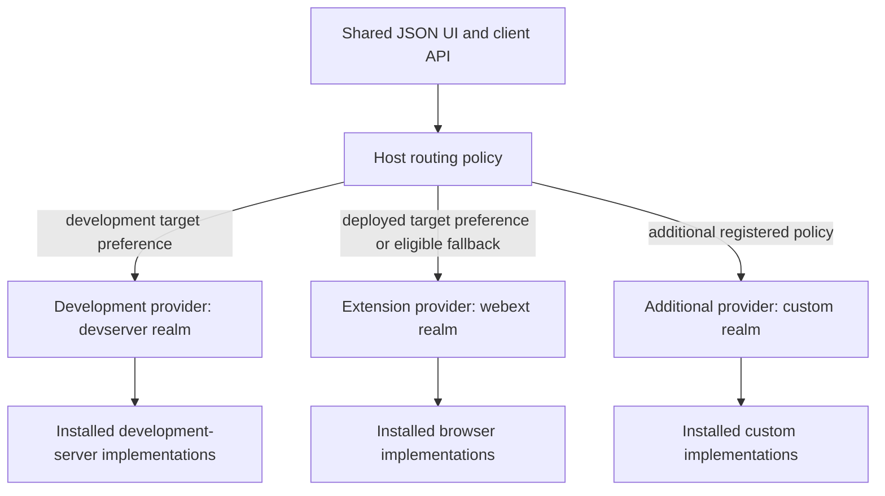

# Contribution contract decision ledger

Accepted decisions from the live review of [Contribution and realm contract](https://github.com/dvcol/devkit-extension/issues/5). This ledger distinguishes owner decisions from earlier proposal packets. It does not close the contract or claim an implemented SDK.

## Previously settled requirements

- Explicit imported capability and realm descriptors provide downstream extension without global declaration merging or a closed central realm switch.
- Contribution/capability definitions stay separate from core runtime and eligible native implementation modules.
- Authoring and public contracts are framework-neutral. JSON rendering is replaceable.
- The host can use multiple providers, routing defaults and per-operation overrides. Broadcast, callbacks, provider/realm preferences and UI-driven selection are already in the map's agreed scope.
- Provider state remains distinct. Native resources stay local to their owning execution.

## Interview round 1: owner decisions

| Question | Owner answer | Accepted consequence |
| --- | --- | --- |
| Plugin declaration shape | `1A` | Use dedicated typed properties such as `services`, `actions`, `views`, `transforms` and `scripts`. Contribution is shared terminology/typing; a mixed built-in collection is not the canonical declaration shape. |
| Portable service registration inputs | `2A` | Use service implementation definitions for both startup lists and runtime installation. A separate portable operation accepting arbitrary already-created service objects is not required; eligible native contexts retain their native APIs. |
| Implementation selection and routing | Corrected the question | A host must support multiple realms/providers and dynamic backend selection, including target-origin/URL policies and default fallback. Installing service implementations must not fix the host to one backend. |
| Wire type authority | Agreed | Runtime schemas are the source of public wire input/output types. The schema format/library and descriptor generics remain to be selected. |
| Realm classification | Agreed, with easy extensibility required | Begin with `webext` and `devserver` environment families. Devframe/Vite integration differences belong in adapters/native contexts. Adding or changing realm families must remain straightforward through descriptors and adapters. |

The owner explicitly requires the agreed architecture to be recorded in `GLOSSARY.md` and `ARCHITECTURE.md`, with detailed definitions, tables, schemas and diagrams, after the architecture/declaration interview settles it. The current root glossary records agreed vocabulary in the meantime; the canonical documents must not present remaining proposals as accepted.

## Correction to the earlier implementation-selection question

The previous question conflated two decisions:

1. **Installation** determines which implementations a particular provider can offer in its eligible executions.
2. **Routing** selects which available provider or providers execute a requested operation.

Both are required. A host may have a WebExtension provider and one or more development-server providers available simultaneously. A shared UI can route a development target to its development server and a deployed staging/production target to the extension provider. The same host may also apply capability-specific preferences, caller overrides, callbacks and broadcast.

The earlier recommendation for explicit host installation did not and must not narrow the original runtime routing scope. Provider installation declaration details remain subject to the packaging/lifecycle contract; dynamic provider routing is an accepted requirement, not a new optional feature.

## Proposed identity and routing relationship

The following diagram makes the accepted multi-realm host requirement concrete. The model uses separately identifiable providers with their own realm metadata; exact connection and dispatch rules remain under review.

URL-sensitive policy refers to the inspected target, not the popup's own extension URL. The generic SDK must not contain company domains, hard-coded staging/production classifications or assumptions that every development origin is localhost. The host supplies target policies and provider metadata.

Adding a realm requires an exported descriptor and an adapter/integration that advertises eligible implementations. It must not require modifying an exhaustive core realm union or teaching the JSON renderer a new backend. A new realm can initially support only some capabilities, with explicit unsupported outcomes for the remainder.

## Still open at the core/routing boundary

[Provider discovery and routing](https://github.com/dvcol/devkit-extension/issues/7) already owns detailed selection, ambiguity, cancellation, broadcast and reconnect behavior. The current contribution contract must expose compatible definition/context integration points rather than settle that ticket implicitly.

The next interview must clarify:

- How host URL policies combine with plugin/contribution defaults and explicit invocation overrides.
- Whether an action's required services remain on one provider by default, and how intentional cross-provider orchestration is declared.
- Whether fallback is only pre-dispatch, and how uncertain execution after disconnect is represented without repeating a mutation.
- How custom contribution kinds extend dedicated properties without weakening type checking.
- How multiple declarations of the same service interact with ownership and disposal.

Later declaration questions include schema representation, descriptor/version compatibility, local/remote context narrowing, activation failure and async teardown. Accepted answers must be consolidated into the canonical architecture documents once the core review is complete.

## Status

The contract remains open. No SDK runtime, canonical architecture declaration or routing implementation is delivered by this decision ledger. This commit records the owner's accepted choices and corrects the previous installation/routing conflation.
