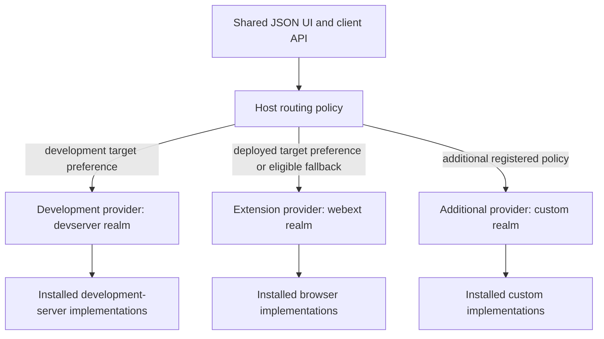

# Contribution contract decision ledger

Accepted decisions from the live review of [Contribution and realm contract](https://github.com/dvcol/devkit-extension/issues/5). This ledger distinguishes owner decisions from earlier proposal packets. It does not close the contract or claim an implemented SDK.

## Previously settled requirements

- Explicit imported capability and realm descriptors provide downstream extension without global declaration merging or a closed central realm switch.
- Contribution/capability definitions stay separate from core runtime and eligible native implementation modules.
- Authoring and public contracts are framework-neutral. JSON rendering is replaceable.
- The host can use multiple providers, routing defaults and per-operation overrides. Broadcast, callbacks, provider/realm preferences and UI-driven selection are already in the map's agreed scope.
- Provider state remains distinct. Native resources stay local to their owning execution.

## Interview round 1: owner decisions

| Question | Owner answer | Accepted consequence |
| --- | --- | --- |
| Plugin declaration shape | `1A` | Use dedicated typed properties such as `services`, `actions`, `views`, `transforms` and `scripts`. Contribution is shared terminology/typing; a mixed built-in collection is not the canonical declaration shape. |
| Portable service registration inputs | `2A` | Use service implementation definitions for both startup lists and runtime installation. A separate portable operation accepting arbitrary already-created service objects is not required; eligible native contexts retain their native APIs. |
| Implementation selection and routing | Corrected the question | A host must support multiple realms/providers and dynamic backend selection, including target-origin/URL policies and default fallback. Installing service implementations must not fix the host to one backend. |
| Wire type authority | Agreed | Runtime schemas are the source of public wire input/output types. The schema format/library and descriptor generics remain to be selected. |
| Realm classification | Agreed, with easy extensibility required | Begin with `webext` and `devserver` environment families. Devframe/Vite integration differences belong in adapters/native contexts. Adding or changing realm families must remain straightforward through descriptors and adapters. |

The owner explicitly requires the agreed architecture to be recorded in `GLOSSARY.md` and `ARCHITECTURE.md`, with detailed definitions, tables, schemas and diagrams, after the architecture/declaration interview settles it. The current root glossary records agreed vocabulary in the meantime; the canonical documents must not present remaining proposals as accepted.

## Interview round 2: owner decisions

| Question | Owner answer | Accepted consequence |
| --- | --- | --- |
| Q6: Invocation overrides | Agreed | An explicit invocation policy replaces lower-priority defaults. An exact provider pin has no inherited fallback; the invocation must explicitly permit any fallback. |
| Q7: Action provider affinity | Agreed | An action uses its selected provider's required capabilities by default. Cross-provider orchestration must be explicit. |
| Q8: Fallback boundary | A, with the clarification "once dispatched nor more routing" | Routing freezes at dispatch. Fallback can select an eligible alternative before dispatch only. No response, timeout, disconnect or report that execution never began allows that dispatched invocation to move to another provider. |
| Q9: Custom contribution kinds | Agreed | Genuinely new kinds use a typed, descriptor-tagged `extensions` collection. Built-ins retain dedicated properties; arbitrary top-level plugin keys remain invalid. |
| Q10: Duplicate services | Initially reject every duplicate; then allow exact instance identity | Reject conflicting duplicate service registrations within the owning provider's registry. Permit an exception for the exact same object by reference. Equal IDs, versions, schemas or object contents do not establish this exception. The compared object and ownership after repeated registration still need clarification. |

The Q8 clarification is stricter than the offered recommendation, which also allowed fallback after confirmation that execution never started. The accepted rule removes that exception. A separately requested invocation starts a new routing decision; the SDK must not silently create one to replay the dispatched call. The detailed definition of dispatch, connection races and outcomes remains in [Provider discovery and routing](https://github.com/dvcol/devkit-extension/issues/7), subject to this boundary.

The Q10 clarification supersedes unconditional rejection, but does not yet select reference counting, shared disposal handles or ownership transfer.

### Two different identity rules

| Identity | Comparison | Purpose |
| --- | --- | --- |
| Capability contract | Declared stable identity/version, with compatibility policy still open | Match consumers and providers across separately bundled modules and remote connections |
| Duplicate service exception | Exact local object reference | Recognize the same installation object without treating separately constructed definitions as equivalent |

Different providers can implement the same capability. The duplicate check is local to the provider's owning registry, not a global prohibition across the host. A serialized remote description cannot prove local pointer equality.

Portable installation already accepts service definitions. The next decision is whether the duplicate exception compares that definition object before setup, or the running API object produced by setup. Comparing the definition is recommended because a registry can reject a different recipe before it creates resources. This recommendation is not yet accepted.

Allowing two owners to install the same definition also requires explicit disposal semantics. A recommended proposal is one constructed service with a separate ownership lease per installation; disposing one lease leaves the other installation active. A stricter alternative permits repeated references only within one owner. Neither policy follows automatically from reference equality. HMR creates a new object and therefore needs an explicit replacement lifecycle; structural equality must not bypass duplicate checks.

## Correction to the earlier implementation-selection question

The previous question conflated two decisions:

1. **Installation** determines which implementations a particular provider can offer in its eligible executions.
2. **Routing** selects which available provider or providers execute a requested operation.

Both are required. A host may have a WebExtension provider and one or more development-server providers available simultaneously. A shared UI can route a development target to its development server and a deployed staging/production target to the extension provider. The same host may also apply capability-specific preferences, caller overrides, callbacks and broadcast.

The earlier recommendation for explicit host installation did not and must not narrow the original runtime routing scope. Provider installation declaration details remain subject to the packaging/lifecycle contract; dynamic provider routing is an accepted requirement, not a new optional feature.

## Proposed identity and routing relationship

The following diagram makes the accepted multi-realm host requirement concrete. The model uses separately identifiable providers with their own realm metadata; exact connection and dispatch rules remain under review.

URL-sensitive policy refers to the inspected target, not the popup's own extension URL. The generic SDK must not contain company domains, hard-coded staging/production classifications or assumptions that every development origin is localhost. The host supplies target policies and provider metadata.

Adding a realm requires an exported descriptor and an adapter/integration that advertises eligible implementations. It must not require modifying an exhaustive core realm union or teaching the JSON renderer a new backend. A new realm can initially support only some capabilities, with explicit unsupported outcomes for the remainder.

## Still open at the core/routing boundary

[Provider discovery and routing](https://github.com/dvcol/devkit-extension/issues/7) already owns detailed selection, ambiguity, cancellation, broadcast and reconnect behavior. The current contribution contract must expose compatible definition/context integration points rather than settle that ticket implicitly.

The next interview must clarify:

- Whether the duplicate exception compares service-definition references or the API object returned by setup.
- Whether the same reference can be installed by different owners, and who releases the resulting service.
- Which schema interface the declarations accept. [Verified upstream schema behavior](./005-declaration-alignment.md#schema-boundary-evidence) informs that choice.
- How descriptors express supported contract versions without relying on object identity or guessing compatibility.
- Whether a hard activation failure rolls back the whole plugin or only the affected declaration and its dependents.

Later declaration questions include schema normalization and metadata export after selecting a schema interface, local/remote context typing in the complete API sketch, and async teardown/replacement after settling ownership and failure units. The routing ticket retains detailed policy resolution, dispatch races and outcomes. Accepted answers must be consolidated into the canonical architecture documents once the core review is complete.

## Status

The contract remains open. No SDK runtime, canonical architecture declaration or routing implementation is delivered by this decision ledger. The latest decisions fix routing at dispatch and refine duplicate rejection with an exact-reference exception. Remaining ownership and declaration choices still require owner review.
