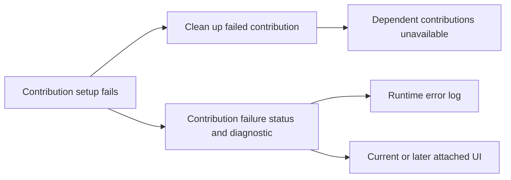
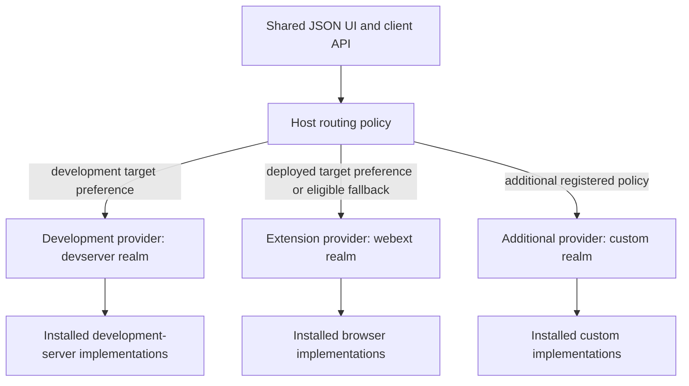

# Contribution contract decision ledger

Accepted decisions from the live review of [Contribution and realm contract](https://github.com/dvcol/devkit-extension/issues/5). This ledger distinguishes owner decisions from earlier proposal packets. It does not close the contract or claim an implemented SDK.

## Previously settled requirements

- Explicit imported capability and realm descriptors provide downstream extension without global declaration merging or a closed central realm switch.
- Contribution/capability definitions stay separate from core runtime and eligible native implementation modules.
- Authoring and public contracts are framework-neutral. JSON rendering is replaceable.
- The host can use multiple providers, routing defaults and per-operation overrides. Broadcast, callbacks, provider/realm preferences and UI-driven selection are already in the map's agreed scope.
- Provider state remains distinct. Native resources stay local to their owning execution.

## Interview round 1: owner decisions

| Question | Owner answer | Accepted consequence |
| --- | --- | --- |
| Plugin declaration shape | `1A` | Use dedicated typed properties such as `services`, `actions`, `views`, `transforms` and `scripts`. Contribution is shared terminology/typing; a mixed built-in collection is not the canonical declaration shape. |
| Portable service registration inputs | `2A` | Use service implementation definitions for both startup lists and runtime installation. A separate portable operation accepting arbitrary already-created service objects is not required; eligible native contexts retain their native APIs. |
| Implementation selection and routing | Corrected the question | A host must support multiple realms/providers and dynamic backend selection, including target-origin/URL policies and default fallback. Installing service implementations must not fix the host to one backend. |
| Wire type authority | Agreed | Runtime schemas are the source of public wire input/output types. The schema format/library and descriptor generics remain to be selected. |
| Realm classification | Agreed, with easy extensibility required | Begin with `webext` and `devserver` environment families. Devframe/Vite integration differences belong in adapters/native contexts. Adding or changing realm families must remain straightforward through descriptors and adapters. |

The owner explicitly requires the agreed architecture to be recorded in `GLOSSARY.md` and `ARCHITECTURE.md`, with detailed definitions, tables, schemas and diagrams, after the architecture/declaration interview settles it. The current root glossary records agreed vocabulary in the meantime; the canonical documents must not present remaining proposals as accepted.

## Interview round 2: owner decisions

| Question | Owner answer | Accepted consequence |
| --- | --- | --- |
| Q6: Invocation overrides | Agreed | An explicit invocation policy replaces lower-priority defaults. An exact provider pin has no inherited fallback; the invocation must explicitly permit any fallback. |
| Q7: Action provider affinity | Agreed | An action uses its selected provider's required capabilities by default. Cross-provider orchestration must be explicit. |
| Q8: Fallback boundary | A, with the clarification "once dispatched nor more routing" | Routing freezes at dispatch. Fallback can select an eligible alternative before dispatch only. No response, timeout, disconnect or report that execution never began allows that dispatched invocation to move to another provider. |
| Q9: Custom contribution kinds | Agreed | Genuinely new kinds use a typed, descriptor-tagged `extensions` collection. Built-ins retain dedicated properties; arbitrary top-level plugin keys remain invalid. |
| Q10: Duplicate services | Initially reject every duplicate; then allow exact instance identity | Reject conflicting duplicate service registrations within the owning provider's registry. Permit an exception for the exact same object by reference. Equal IDs, versions, schemas or object contents do not establish this exception. The compared object and ownership after repeated registration still need clarification. |

The Q8 clarification is stricter than the offered recommendation, which also allowed fallback after confirmation that execution never started. The accepted rule removes that exception. A separately requested invocation starts a new routing decision; the SDK must not silently create one to replay the dispatched call. The detailed definition of dispatch, connection races and outcomes remains in [Provider discovery and routing](https://github.com/dvcol/devkit-extension/issues/7), subject to this boundary.

The Q10 clarification superseded unconditional rejection at this stage of the interview. Round 3 below revisits the exception in favor of simpler duplicate handling. No shared ownership policy was accepted.

### Two different identity rules

| Identity | Comparison | Purpose |
| --- | --- | --- |
| Capability contract | Declared stable identity/version, with compatibility policy still open | Match consumers and providers across separately bundled modules and remote connections |
| Duplicate service exception | Exact local object reference | Recognize the same installation object without treating separately constructed definitions as equivalent |

Different providers can implement the same capability. The duplicate check is local to the provider's owning registry, not a global prohibition across the host. A serialized remote description cannot prove local pointer equality.

Portable installation already accepts service definitions. The round 2 proposal compared that definition object before setup, instead of comparing the running API object produced by setup. It was not accepted and is superseded as the working recommendation by round 3's proposal to remove the exception entirely.

Shared ownership leases were also only a recommendation. Removing the identity exception removes the need for that sharing mechanism. HMR replacement still requires an explicit lifecycle; neither object identity nor structural equality is a replacement policy.

## Interview round 3: owner decisions and revised proposal

| Question | Owner answer | Consequence and status |
| --- | --- | --- |
| Q11: Object identity | Suggested dropping the identity check for simplicity; duplicate definitions should fail at setup, or warn and drop the later registration under a strictness option | Revise the working proposal to reject duplicate definition registrations without comparing definition or running API references. The common strict/warn policy is the next confirmation point. |
| Q12: Shared ownership | See Q11 | Do not add shared installation leases while pursuing the simpler duplicate policy. A skipped registration must not gain ownership of the existing service. |
| Q13: Schema interface | Standard Schema | Accepted. Public wire declarations use Standard Schema. Transformation semantics and serializable schema export remain open. |
| Q14: Contract versions | Numeric contract version, exact match for now; use the same strictness toggle to warn when relaxed | Accepted numeric versions and exact matching. Shared strictness behavior is requested. Whether warning means skipping an incompatible candidate or allowing its use needs explicit clarification. |
| Q15: Setup failure | B, with appropriate errors in logs and, where possible, the UI | Accepted. Clean up the failed contribution and make its dependents unavailable. Keep independent contributions active. Report the failure in logs and expose it for UI presentation where a client is available. |

### Proposed common strictness policy

Use a host option such as `strict: true`, enabled by default, for duplicate registration and contract mismatch diagnostics. This table is a recommendation awaiting owner confirmation, not permission to silently redefine relaxed behavior.

| Condition | Strict mode | Relaxed mode | Registry or execution effect in both modes |
| --- | --- | --- | --- |
| A service slot is already registered in this provider | Fail the incoming registration with a typed error | Warn and return an explicit skipped result | Preserve the existing registration and owner; do not run the incoming setup or return an owning handle for the existing service |
| A candidate capability contract version differs from the requested numeric version | Report the mismatch as an error to the affected resolution attempt | Warn and expose an incompatible/unavailable candidate | Do not bind or invoke the incompatible implementation |

Apply duplicate checks during startup registration as well as runtime installation, before the incoming setup callback creates resources. The proposed rule rejects the same definition object too; it needs no pointer comparison. One provider's duplicate rule does not prevent a different provider from implementing the same capability.

The existing registration wins only within a known registration order. Concurrent startup declarations require deterministic admission rather than choosing whichever asynchronous setup finishes first. The exact startup conflict grouping and failure result belong in the complete registration API review.

Only inspect a version mismatch when resolving or installing the relevant contract; advertising an unrelated version must not fail the entire host. A host may select another compatible provider before dispatch when the existing routing policy permits it. An exact provider pin and the prohibition on routing after dispatch still apply. Relaxed mode changes error handling, not the exact-match rule.

This proposal introduces no implicit service sharing, ownership transfer, replacement or use of an incompatible contract. Actual setup failures retain Q15's failure behavior in either mode. HMR replacement and async cleanup remain explicit lifecycle decisions.

### Failure reporting into logs and UI

The accepted requirement is observable failure without removing independent contributions. The proposed integration records the failed contribution's status and a serializable diagnostic identifying its provider, plugin, contribution and lifecycle phase. Runtime logs report the failure; an attached client can render the same diagnostic. A later UI mount reads current failure status, so an error before panel creation is not lost merely because no UI listener existed.

Keep the original native exception in its owning execution. Pass a serializable diagnostic through the existing status/transport integration, rather than requiring a separate diagnostics backend or a renderer to make setup work. The exact status, error and subscription signatures remain part of the complete API sketch. Lifecycle failure reporting does not itself settle how individual operation calls return or throw errors.

Independent contributions keep running. A status view that itself requires the failed service is a dependent contribution and cannot be used as the only failure display. The host's generic failure presentation must remain independent of that service.

## Correction to the earlier implementation-selection question

The previous question conflated two decisions:

1. **Installation** determines which implementations a particular provider can offer in its eligible executions.
2. **Routing** selects which available provider or providers execute a requested operation.

Both are required. A host may have a WebExtension provider and one or more development-server providers available simultaneously. A shared UI can route a development target to its development server and a deployed staging/production target to the extension provider. The same host may also apply capability-specific preferences, caller overrides, callbacks and broadcast.

The earlier recommendation for explicit host installation did not and must not narrow the original runtime routing scope. Provider installation declaration details remain subject to the packaging/lifecycle contract; dynamic provider routing is an accepted requirement, not a new optional feature.

## Proposed identity and routing relationship

The following diagram makes the accepted multi-realm host requirement concrete. The model uses separately identifiable providers with their own realm metadata; exact connection and dispatch rules remain under review.

URL-sensitive policy refers to the inspected target, not the popup's own extension URL. The generic SDK must not contain company domains, hard-coded staging/production classifications or assumptions that every development origin is localhost. The host supplies target policies and provider metadata.

Adding a realm requires an exported descriptor and an adapter/integration that advertises eligible implementations. It must not require modifying an exhaustive core realm union or teaching the JSON renderer a new backend. A new realm can initially support only some capabilities, with explicit unsupported outcomes for the remainder.

## Still open at the core/routing boundary

[Provider discovery and routing](https://github.com/dvcol/devkit-extension/issues/7) already owns detailed selection, ambiguity, cancellation, broadcast and reconnect behavior. The current contribution contract must expose compatible definition/context integration points rather than settle that ticket implicitly.

The next interview must clarify:

- Confirm the proposed common strictness policy, including removal of the identity exception, default strict mode, skipping duplicates and keeping mismatched contracts unavailable when warnings are enabled.
- Whether Standard Schema checks original values or supplies transformed/defaulted values to handlers and callers. [Verified upstream schema behavior](./005-declaration-alignment.md#schema-boundary-evidence) informs that choice.
- Whether JSON Schema export is mandatory for every public definition or required only by integrations needing schema inspection.
- Whether restoration of a required capability automatically reactivates dependent declarations, while setup failures require explicit retry.

The complete API review must specify registration/skip results, operation errors, schema input/output typing, diagnostics and local/remote context narrowing. Async teardown and replacement follow the final ownership/strictness and reactivation rules. The routing ticket retains detailed policy resolution, dispatch races and outcomes. Accepted answers must be consolidated into the canonical architecture documents once the core review is complete.

## Status

The contract remains open. No SDK runtime, canonical architecture declaration or routing implementation is delivered by this decision ledger. Standard Schema, numeric exact contract versions and isolated setup failures with logs/UI reporting are accepted. The next review confirms simplified duplicates and shared strictness, schema behavior and reactivation.
