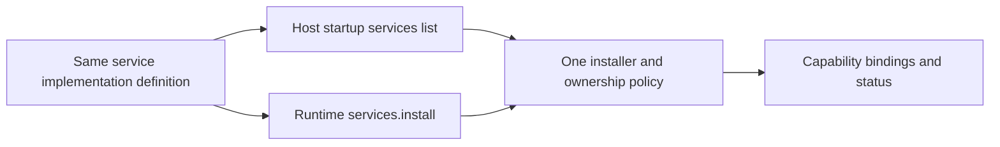
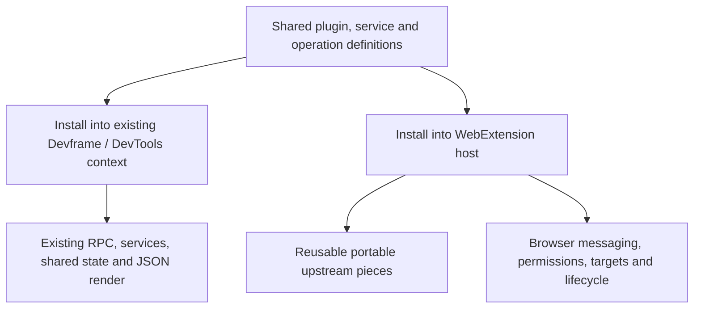

# Dedicated declarations, service installation and upstream alignment

Proposal for [Contribution and realm contract](https://github.com/dvcol/devkit-extension/issues/5), responding to the owner's three challenges about declaration grouping, declarative versus imperative service installation, and the amount of abstraction above existing tooling. This is a revision for review, not a resolved contract or SDK implementation.

This packet supersedes the heterogeneous `contributions` array as the recommended built-in authoring shape. It also supersedes imperative-only capability installation and the assumption that every host must expose a new generic provider runtime constructor. The earlier architecture diagrams remain useful descriptions of ownership and execution roles.

Owner review update: [the decision ledger](./005-decisions.md) records accepted dedicated properties, definition-only portable installation inputs, schema-derived wire types and extensible realm families. The owner clarified that a host must support multiple realms and dynamic backend routing. Explicit implementation installation must not be read as selecting one fixed backend for that host.

## Recommendations

| Question | Recommendation | Reason |
| --- | --- | --- |
| One mixed contribution list or dedicated properties? | Dedicated typed `actions`, `views`, `transforms`, `scripts` and `services` properties | Readers and TypeScript know the expected definition kind from its property |
| Startup declarations or imperative installation? | Both, consuming the same service implementation definition | Static composition is the default; runtime changes use the same lifecycle and validation |
| How much abstraction? | A small portable declaration/context contract, integrated into native host bootstrapping | Reuse Devframe's existing mechanisms instead of introducing parallel RPC, state and rendering engines |

These recommendations preserve the accepted requirements for explicit imported descriptors, separate definition modules, framework-neutral authoring and browser-specific implementations.

## Released API grounding

A bounded follow-up to [Upstream reuse audit](https://github.com/dvcol/devkit-extension/issues/2#issuecomment-5778116319) rechecked the relevant public declarations and selected implementation paths in the SHA-512-verified `devframe@1.0.0`, `@devframes/hub@1.0.0` and `@vitejs/devtools-kit@0.7.5` artifacts. These are verified pinned contracts, not a claim that they are the latest available releases or that every source file matches a release.

- Devframe uses dedicated definition fields and the released DevTools bridge installs a Devframe definition into an existing context. [Definition contract](https://github.com/devframes/devframe/blob/18fa60effeb928eb445add2a536cd44906a59981/packages/devframe/src/types/devframe.ts#L352), [DevTools bridge](https://github.com/vitejs/devtools/blob/ad2d6df720a513670f93ac09318ae6dc8b4a0623/packages/kit/src/node/create-plugin-from-devframe.ts).
- Service declarations, wire-service installation and publication of an existing local object are separate APIs. Package resolution uses Node facilities and therefore needs bundled-factory resolution in a browser adapter. [Service contracts](https://github.com/devframes/devframe/blob/18fa60effeb928eb445add2a536cd44906a59981/packages/devframe/src/types/services.ts#L92), [service host](https://github.com/devframes/devframe/blob/18fa60effeb928eb445add2a536cd44906a59981/packages/devframe/src/node/host-services.ts).
- Released lower-level RPC accepts channel callbacks, while the assembled reference renderer expects the full client context and its high-level transport model. A Port integration must satisfy an actual supported seam rather than cast itself into the larger context. [RPC channel](https://github.com/devframes/devframe/blob/18fa60effeb928eb445add2a536cd44906a59981/packages/devframe/src/rpc/client.ts), [renderer interface](https://github.com/devframes/devframe/blob/18fa60effeb928eb445add2a536cd44906a59981/packages/hub/src/client/renderers.ts#L7).

JSON views, command handles and renderer registrations have removal mechanisms; installed services and the server dock host lack equivalent public uninstall methods. Service revocation alone does not undo wire-service installation. The released hub also starts declared service installations without awaiting each returned promise, then awaits a memoized readiness barrier. After startup that barrier may already be fulfilled, so late setup can race asynchronous service construction. This last point is a source-supported risk, not a reproduced runtime failure. It requires a targeted proof before promising startup/dynamic equivalence. [Hub installation](https://github.com/devframes/devframe/blob/18fa60effeb928eb445add2a536cd44906a59981/packages/hub/src/node/install-devframe.ts#L155), [service host](https://github.com/devframes/devframe/blob/18fa60effeb928eb445add2a536cd44906a59981/packages/devframe/src/node/host-services.ts#L154).

## 1. Contributions describe a relationship, not a mandatory container

A plugin contributes actions, views, transforms and services. The word **contribution** is useful for documentation, ownership, diagnostics and common typing. It does not require all of those declarations to live in the same array or expose identical lifecycle hooks.

```ts
export const inspectorPlugin = definePlugin({
  id: 'example.inspector',
  actions: [captureSnapshotAction],
  views: [inspectorView],
  transforms: [responseTransform],
  scripts: [pageProbe],
});
```

Each item is an imported definition of the appropriate kind. Omitted properties mean no declarations of that kind. A service-only plugin can instead declare `services: [portableService]`, provided the implementation definition is eligible for that plugin's installed execution. A host can supply shared services independently of any plugin.

All kinds can share identity, ownership, dependency diagnostics and disposal conventions where those concepts apply. Their specific contracts remain distinct:

- An action has an invocation handler and invocation lifetime.
- A JSON view has publication state, while its renderer mount has a separate client lifetime.
- A transform owns interception registrations and in-flight request work.
- A packaged script has execution, document generation and injection timing.
- A service definition describes construction of an implementation and its owned resources.

Do not force a view's action reference to behave like a transform's required execution binding. Do not use array position as identity or implicitly derive cross-kind execution order from it.

| Authoring choice | Benefit | Cost |
| --- | --- | --- |
| `contributions: [action, view, transform]` | Uniform iteration and an open list of kinds | More tagging/narrowing; less direct documentation and per-property diagnostics |
| `actions`, `views`, `transforms`, etc. | Discoverable declarations, precise element types, familiar composition | Needs an explicit policy for adding a genuinely new kind |
| Both public shapes for the same built-ins | Two ways to express every plugin | Duplicate docs, precedence and lifecycle rules without additional capability |

Recommend only the dedicated built-in shape. Internal normalization is an implementation choice; it must preserve each kind's schema and semantics. It should not become an extra public execution language.

### Downstream extension without weakening the built-ins

Capability and realm extensibility remain based on imported descriptors. A new service capability normally fits `services` plus existing action/view/transform declarations; it does not require a new contribution kind.

For a genuinely new contribution kind, reserve an explicit descriptor-tagged extension collection rather than accepting arbitrary top-level keys:

```ts
export const diagnosticsPlugin = definePlugin({
  id: 'example.diagnostics',
  actions: [collectDiagnostics],
  extensions: [diagnosticReportDefinition],
});
```

`diagnosticReportDefinition` carries its imported kind descriptor and validated typed payload. Host composition supplies that kind's installer explicitly. This is a proposed extension path, not a requirement to reimplement every built-in through a universal registry. Its exact helper and installer types must be proved with a concrete downstream example before the contract closes. Unknown top-level fields must remain errors so a typo such as `actons` cannot silently become an extension.

### Definition helpers should earn their place

A `define*` helper constructs and types an inert definition. It can infer schema types, preserve literal descriptor identity and validate malformed declarations. It does not register listeners or start a service. Plain objects using `satisfies` remain reasonable where they retain the required types and invariants; do not introduce a factory solely to return the same object under a new name.

The separation between an action's client-safe contract and its executable implementation remains necessary. Dedicated properties do not authorize importing provider handlers into a popup. The helper count should follow actual inference and execution requirements, not the number of glossary nouns.

## 2. One service definition, two installation entry points

The earlier `provide` example belonged to the provider side, not the UI client. It changed a live service registry. That is different from a definition helper constructing a recipe.

Use the following distinction:

| Object or operation | Meaning | Starts work? |
| --- | --- | --- |
| Capability descriptor | Contract the implementation must satisfy | No |
| Service implementation definition | Packaged construction/setup recipe for that contract | No |
| Startup `services` list | Definitions the host must install during startup | Installation begins when the host starts |
| Runtime `services.install(definition)` | Install a definition into an already running host | Yes, through the same installer |
| Registration handle | Observe/release that installation's owned resources | Disposal changes the live registry |

A service implementation definition is the existing capability-implementation concept made explicit as a recipe; it is not another provider identity. Its setup receives the eligible native context and resource scope. The exact helper name below is proposed.

```ts
export const pageService = defineService(pageCapability, {
  execution: extensionBackgroundExecution,

  setup(context) {
    return createPageApi(context);
  },
});
```

`createPageApi` is local implementation code satisfying the operation schemas of `pageCapability`. Resources it creates belong to `context.scope`. The definition helper does not invoke it. The module belongs to the eligible extension provider bundle; a server host supplies a different implementation definition for the same capability.

Startup composition:

```ts
const host = await createWebExtensionHost({
  services: [pageService],
  plugins: [inspectorPlugin],
});
```

Runtime composition, in a separate host where this service is not already installed:

```ts
const host = await createWebExtensionHost({
  plugins: [inspectorPlugin],
});

const registration = await host.services.install(pageService);
await registration.dispose();
```

`createWebExtensionHost` is an illustrative host bootstrap, not a new finalized export. A Devframe host uses its native initialization and adapter's startup service declarations. The guarantee is the shared definition and installation semantics; constructor names need not be identical across hosts.



### Naming and policy

Prefer `services.install(definition)` for constructing a service from its definition. Upstream Devframe uses `provide(id, object)` for a different operation: publishing an already-created in-process object. Do not make these names aliases and silently inherit different transport or ownership semantics.

A raw-object `provide` escape hatch can remain available through an eligible native Devframe context. Add it to the portable API only if a concrete use case establishes how its resources, validation, remote publication and lifetime are owned. The normal authoring interface needs the startup list and runtime installation, not three overlapping methods.

Both installation paths must share:

- Descriptor and runtime schema validation, execution eligibility and authorization.
- Duplicate/conflict behavior and contract-version checking.
- Construction, partial-failure cleanup and cancellation.
- Dependency availability publication and removal.
- Ownership, disposal and replacement rules.

Proposed first-contract defaults: an implementation is installed once in its provider/registration scope; an ambiguous duplicate fails explicitly. Shared host services are installed by host composition and consumed by plugins through requirements. A plugin-declared service belongs to that plugin's installation and is disposed with it. Do not silently merge ownership or configuration when two plugins claim the same implementation slot. If shared installation leases are needed later, specify them explicitly before allowing duplicates.

A failed dynamic installation must leave the previous valid registry state intact and unwind its own partial resources. Required startup failure must report which service prevented readiness; optional unsupported services must report availability without fabricating success. Those policies must be fixed in the exact lifecycle contract, with the same service-level behavior in both paths.

The runtime method supports installation from already-packaged code, including user-enabled integrations and replacement during development. It does not permit fetching arbitrary executable plugin code into a packaged extension.

### Upstream semantics are precedent, not automatically our policy

Devframe's existing service APIs distinguish startup and later option handling. Startup definitions participate in a readiness barrier and option merging; late installation of an existing package can return its existing API and ignore new options. Its wire-service `install` returns an API, while in-process `provide` returns a revoke function. A proposed disposable installation handle is therefore an additional ownership contract, not an existing upstream guarantee.

Our adapter must specify which semantics it preserves and how additional ownership requirements are implemented. Renaming the calls does not establish equivalence.

## 3. Align the implementation with Devframe and the declarations with typed contribution composition

The earlier proposals were accumulating an abstract service registry, action registry, state layer, view layer, transport layer and host factory above a stack that already implements many of those mechanisms. That would create competing representations and more places to enforce the same rules.

Recommend a small portable authoring contract and direct adapters into existing host contexts. The server should continue using Devframe/Vite bootstrapping. The WebExtension host should use its own browser packaging and lifecycle integration. Shared UI and contribution code use the same contracts across them.



This diagram expresses a reuse target, not proof that the whole Devframe Node context runs in a browser. The previous audits still control which released components are actually reusable.

| Concern | Preferred alignment | Additional contract still needed |
| --- | --- | --- |
| Operation contracts and dispatch | Preserve compatible upstream RPC schemas, metadata and registration semantics | Explicit imported descriptors, browser-safe bindings and target/permission outcomes |
| Service definitions | Use the definition/setup plus declarative-list/dynamic-install pattern | Provider/execution identity, exact portable version and ownership policy |
| Shared state | Reuse compatible Devframe shared-state representations and synchronization | Browser persistence, scope, worker recovery and separate-provider ownership |
| JSON rendering | Reuse supported JSON spec, action binding and view/state contracts | Replaceable renderer, extension client connection and UI mount lifecycle |
| Dock/panel integration | Reuse hub docks and DevTools mount hooks where they apply | Map extension popup/options/panels and standalone presentation appropriately |
| Injection/transforms | Reuse compatible server hooks and definitions | Explicit browser mechanisms and differing semantic limits |
| Native access | Expose real local Devframe/hub/Vite or browser contexts through typed descriptors | No fabricated full context or remote native objects |
| Plugin unload/reload | Reuse existing disposable registrations where available | Prove complete cleanup, async ordering and durable recovery; add missing upstream lifecycle hooks if needed |

Do not confuse upstream `ctx.views`, which hosts static assets, with portable JSON view declarations. Mapping must follow actual semantics rather than reusing the word `views` for unrelated operations.

### Avoid a mandatory action around every service method

Capability operations already describe callable behavior. A separate action is useful when it adds an invocable use case, orchestration, command/UI metadata or a distinct input/output contract. It need not be a second wrapper around every RPC function. Reuse the original schemas and metadata rather than hand-maintaining an equivalent descriptor at each layer. Client invocation must still use validated, authorized bindings whether it invokes a service operation or a composed action. Only explicitly published operation contracts are remotely callable; registering an in-process service does not expose its raw methods to clients.

The earlier read-title action demonstrated dependency injection, but it is too small to justify a universal action-over-operation requirement. The complete API must allow a deliberate direct service operation path where no extra action semantics are needed.

### Upstream adoption

Technical alignment can make upstream review easier; maintainer interest is unknown until discussed. A large generic plugin framework is a much larger adoption request than improvements useful to existing Devframe users.

Potential upstream changes should each solve a concrete missing seam, such as a narrower renderer-host interface, portable service resolution, complete disposable registration ownership, or an optional explicit-descriptor API. The combined portable declaration package can remain a companion integration while those pieces are evaluated. Vite-specific integration belongs in the Vite adapter; browser packaging and permissions belong in the WebExtension adapter.

Do not couple the generic SDK to application-specific contribution or renderer types. The reusable lesson from downstream tooling is typed dedicated contribution properties, direct use of compatible upstream types and centralized registration/teardown. The generic package must remain independent of that tooling's business context.

## Exact decision and validation obligations

Before implementation admission, this ticket must settle:

1. Dedicated built-in properties, their exact readonly types and a descriptor-based extension path with no arbitrary top-level keys.
2. Capability descriptor versus service implementation definition, including inferred implementation signatures and eligible execution contexts.
3. One startup/dynamic installer contract, ownership/duplicates, readiness, failure cleanup and disposal outcomes.
4. A public-export mapping showing which types are reused, which are adapted and which are new. A wrapper must name the guarantee it adds.
5. The smallest server adapter that installs these definitions into an existing context, with no duplicate state/RPC authority.
6. The client-safe contract import path, including direct service calls and composed actions without backend imports.

Acceptance evidence must cover positive and negative declaration typing; wrong-kind property entries; misspelled properties; startup/dynamic equivalence; duplicate/conflict behavior; partial installation failure; plugin-owned versus host-owned disposal; actual emitted bundle dependencies; and real host success/unsupported/lifecycle behavior. Preserve the API/example/test/host coverage obligation already recorded by the map.

The owner has not yet accepted these recommendations. The contract remains open. This document is a planning deliverable and contains no runtime implementation.
