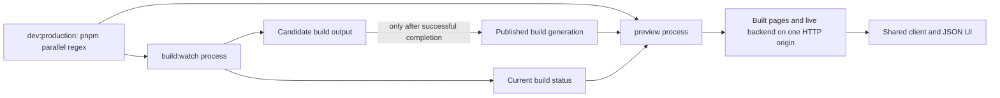

# Server adapter contract

Working deliverable for [Server adapter contract](https://github.com/dvcol/devkit-extension/issues/6), based on the settled [core architecture](../../ARCHITECTURE.md). The process workflow and failed-build policy below are owner decisions. The adapter signatures and remaining reset choice are under review; this document does not claim completed SDK implementations.

## Accepted workflow

The owner requires independently runnable `build:watch` and `preview`, plus `dev:production` starting both in parallel through pnpm's script-name regex. `preview` owns the HTTP server and its live action/state backend. The build watcher is a separate process, so restarting preview need not restart the watcher.

```json
{
  "scripts": {
    "build:watch": "node ./scripts/build-watch.ts",
    "preview": "node ./scripts/preview.ts",
    "dev:production": "pnpm --workspace-concurrency=2 run \"/^(build:watch|preview)$/\""
  }
}
```

These are the intended example entry points, not commands present in the old root application scaffold. A finite timing check on pnpm 12.5.1 found that plain regex selection and `--workspace-concurrency=2` start both scripts concurrently, while adding `--parallel` serialized matched scripts inside this package. Use the verified regex/concurrency form, not that flag. Each script must work alone. The combined command uses an exact anchored selector so it cannot select itself or unrelated scripts. pnpm documents regex script selection and parallel execution; the pinned feasibility environment is pnpm 12.5.1. [pnpm run](https://pnpm.io/cli/run#running-multiple-scripts).

Preview must tolerate starting before the first build completes. Until a successful generation exists, it exposes build status and reports assets unavailable. Once there is a complete build, an in-progress or failed rebuild leaves that generation available and exposes the current build failure. Merely avoiding deletion of `dist` does not prove that partially overwritten files cannot be served.



The last-successful-build rule concerns asset availability. It does not silently preserve arbitrary in-memory backend state or replay interrupted actions. Those are governed by the state and routing contracts.

## Public reuse boundary

The released baseline follows [Upstream reuse audit](https://github.com/dvcol/devkit-extension/issues/2): Devframe/hub/Vite integration 1.0.0 and Vite DevTools/kit 0.7.5. The attachment probe uses Vite 8.3.0 and Node 26.9.0. Future implementation must recheck dependency freshness and peer compatibility rather than treating this evidence pin as a permanent version choice.

| Integration | Public API direction | Ownership |
| --- | --- | --- |
| Existing standalone Devframe/hub | Install portable definitions into its actual Node/hub context | Adapter owns only its registrations; embedding application owns its existing HTTP server and hub |
| Vite Devframe development | Reuse the public Vite hub binding where it satisfies the contract | Vite binding owns attachment, restart and teardown integration |
| Vite DevTools development | Use the public kit context and `createPluginFromDevframe` bridge | Existing DevTools host owns RPC/state and its native context; portable adapter owns its additions |
| Built-output live preview | Public `initHub`, `attach(PreviewServer.httpServer)` and `nodeMiddleware` have direct evidence | Preview entry owns HTTP; attached hub owns its transport; adapter owns contribution resources |
| Full DevTools live preview | Genuine `createKitContext` with an actual preview-specific public `DevframeHost`, then a live hub using that context | Implement correct preview mounts/origin/metadata; do not pass a preview config to the default development host and assume parity |

Sources: [hub public instance contract](https://github.com/devframes/devframe/blob/18fa60effeb928eb445add2a536cd44906a59981/packages/hub/src/node/initiate.ts#L302), [DevTools bridge](https://github.com/vitejs/devtools/blob/ad2d6df720a513670f93ac09318ae6dc8b4a0623/packages/kit/src/node/create-plugin-from-devframe.ts), [kit context](https://github.com/vitejs/devtools/blob/ad2d6df720a513670f93ac09318ae6dc8b4a0623/packages/kit/src/node/context.ts). These source references explain audited APIs; the downloaded released packages are the operational evidence, without a claim of byte-identical source builds.

The released DevTools package publicly exports `createDevToolsContext` and `createDevToolsHub` from its root. The missing piece is their default host binding: preview config has `command: 'serve'` without a `ViteDevServer`, while `createViteDevToolsHost` requires that server to mount client assets, omits frame connection metadata without it and derives origin from development-server settings. Its generic constructor is not a complete preview adapter. Use the existing public `DevframeHost` seam for real preview mounts and native context ownership. The kit context must remain genuine; a hub-shaped substitute does not establish DevTools native feature parity.

This conclusion comes from inspecting the released artifacts, without executing a new DevTools preview. [DevTools 0.7.5 artifact](https://registry.npmjs.org/@vitejs/devtools/-/devtools-0.7.5.tgz) exports the constructors in `dist/index.d.ts` lines 9 and 41–78 and `dist/index.js` lines 1–3. Its `dist/plugins-C4WN3Ft6.js` contains context construction at line 250 and the development server hook at line 550; the published files contain no `configurePreviewServer`. [Kit 0.7.5 artifact](https://registry.npmjs.org/@vitejs/devtools-kit/-/devtools-kit-0.7.5.tgz) exposes `createKitContext` in `dist/node/index.d.ts` lines 45–69; the default host mismatch is in `dist/node/index.js` lines 435–473. [Hub 1.0.0 artifact](https://registry.npmjs.org/@devframes/hub/-/hub-1.0.0.tgz) documents its supplied-context path in `dist/node/initiate.d.mts` lines 145–152.

The supported preview composition to prove is:

```ts
const nativeHost = createPreviewDevframeHost(previewServer);
const context = await createKitContext({
  host: nativeHost,
  cwd: previewServer.config.root,
  mode: 'dev',
  viteConfig: previewServer.config,
});
const hub = initHub({ context, base: '/__tools/' });
const detachUpgrade = hub.attach(previewServer.httpServer);
// The owned preview host supplies each frame's assets and live metadata.
// Install packaged definitions through the actual context and mount hub.nodeMiddleware.
```

`createPreviewDevframeHost` is proposed adapter code implementing the existing public host interface; it is not an upstream export or a new generic host abstraction. This sketch omits embedding configuration and shutdown code, which must be explicit in the runnable implementation. The supplied host must retain middleware ownership and derive origin from the actual listening preview server. A genuine kit context with a hub viewer proves a different scope than the complete DevTools shell and its native plugins; both need separately named assertions.

Do not use private package files, publicly named `internal` escape hatches, or a cast from `PreviewServer` to `ViteDevServer`. An actual kit context can expose its kit descriptor. A hub-only preview cannot advertise kit just because both share some methods.

## Proposed minimal adapter API

Install into an existing native hub or kit context. The initial standalone host is Devframe with its public hub; a lower-level bare Devframe context adapter is not implied by these signatures. Keep host construction, Vite configuration and the DevTools plugin model recognizable. The following names are proposed SDK exports; native names are actual upstream APIs.

```ts
interface ServerComposition {
  readonly providerId: string;
  readonly strict?: boolean;
  readonly services?: readonly ServiceDeclaration[];
  readonly plugins?: readonly PluginDefinition[];
}

interface ServerProviderHandle {
  readonly provider: ProviderDescriptor;
  readonly services: DefinitionInstallationApi<ServiceDeclaration>;
  readonly plugins: DefinitionInstallationApi<PluginDefinition>;
  readonly startup: {
    readonly services: readonly InstallationResult[];
    readonly plugins: readonly InstallationResult[];
  };
  /** Dispose this adapter's owned registrations, not its embedding HTTP server. */
  dispose(): Promise<void>;
}

declare function installDevframeProvider(
  context: DevframeHubContext,
  composition: ServerComposition,
): Promise<ServerProviderHandle>;

declare function installDevToolsProvider(
  context: KitNodeContext,
  composition: ServerComposition,
): Promise<ServerProviderHandle>;
```

The two entry points reflect different real native contexts. Their admission, service/action definitions, installation handles and diagnostics are identical. They do not start a second RPC server, clone state authority or add a second provider identity around the same host. A shared internal installer may implement both. Installed portable service recipes use adapter-owned identities and cleanup rather than pretending upstream package-service cache entries have the SDK's exact-version ownership semantics.

Startup preflights the complete `ServerComposition` before any of its setup. `installDevframeProvider` and `installDevToolsProvider` settle after the initial activation pass. `startup.services` and `startup.plugins` preserve the corresponding composition-list order and admitted/skipped outcomes. Individual setup failures remain observable through admitted child handles as required by the core. Waiting dependencies do not prevent the provider handle from being returned. A strict invalid startup batch rejects the adapter installation before its setup runs.

Standalone composition sketch:

```ts
let provider: ServerProviderHandle | undefined;
const hub = initHub({
  base: '/__tools/',
  async configure(context) {
    provider = await installDevframeProvider(context, composition);
  },
});
await hub.ready;
// The embedding application owns hub attachment and HTTP lifetime.
// Before closing the hub, await provider.dispose() and handle failed cleanup.
```

DevTools composition sketch:

```ts
const integration = createPluginFromDevframe(packagedToolDefinition, {
  async setup(context) {
    provider = await installDevToolsProvider(context, composition);
  },
});
```

`packagedToolDefinition` is a normal native definition containing the tool's packaged client assets. The bridge's kit callback adds the portable provider. It must not install the same portable composition again from that definition's own setup. The Vite integration must retain `provider` and dispose it through an awaited host close/restart path. A callback without such an owner is not a complete integration.

Preview attachment has a concrete tested composition in [the preserved probe](../probes/server-preview/README.md). `configurePreviewServer` mounts the live middleware before static assets and SPA fallback, attaches WebSocket upgrade handling to the actual HTTP server, and awaits hub readiness. Vite documents preview as a distinct hook with a `PreviewServer`. [Vite plugin API](https://vite.dev/guide/api-plugin.html#configurepreviewserver).

## Native context and mode table

| Context/feature | Standalone live Devframe | Vite development | Built-output live preview | Static snapshot |
| --- | --- | --- | --- | --- |
| Actual Devframe/hub context | Available when owned | Available when integrated | Available in the attached live backend | No live provider |
| Actual kit context | Only if genuinely constructed by kit | Available in DevTools host | Conditional on supported kit integration, not assumed | No live provider |
| `ViteDevServer` | Absent | Actual server | Absent | Absent |
| `PreviewServer` | Absent | Absent | Actual server | Absent |
| Live actions and shared state | Yes, subject to capabilities | Yes, subject to capabilities | Verified in standalone hub attachment | No live mutation backend |
| Source module graph and Vite HMR | Absent unless integrated | Actual Vite APIs | Unavailable | Unavailable |
| Build-time HTML transform | Outside standalone server | Vite build pipeline when building | Runs in the separate build process | Already applied when built |
| Request-time HTTP/HTML handling | Only where adapter installs it | Middleware stage supported | Middleware stage supported | Only what the static hosting platform provides |
| Renderer/view updates | Existing live view protocol | Existing live view protocol plus renderer HMR | Live view protocol; rebuilt renderer update governed by reload contract | Snapshot only |

Capability advertisement must reflect implemented operations and eligible executions, not this table alone. A runtime HTTP rewrite is a different operation from `transformIndexHtml` in Vite's source/build pipeline. Injection before script execution cannot be promised by rewriting already-loaded DOM. [Injection and transform contract](https://github.com/dvcol/devkit-extension/issues/11) owns exact stages, schemas, ordering and browser parity.

Backend mode and asset mode are separate. In the real probe the live hub reports `mode: 'dev'` while Vite serves production-built assets. A build flag must not silently choose a static backend when the selected workflow is live preview.

## Lifecycle, routes and update handoffs

| Event | Adapter responsibility | Consumer/follow-on contract |
| --- | --- | --- |
| HTTP start | Initialize the actual native context, preflight portable composition, expose live metadata only for that provider generation | Discovery validates identity and authorized endpoint |
| Connection metadata request | Answer the live route before static `__connection.json` and SPA fallback; preserve mount base and actual transport URL | Client connects to the advertised live backend |
| Build starts | Publish building status; continue serving the last complete generation | Status UI observes current state, including when mounted late |
| Build fails | Retain published generation; publish failure with build identity | Failure display does not depend on the failed tool contribution |
| Build completes | Publish only a complete generation; emit asset-generation change | Reload contract chooses renderer/page reload and cached asset retention |
| Backend code changes | Preflight successor, quiesce calls and dispose owned activation | Automatic whole-backend reset permission is the pending owner decision |
| Connection lost | Mark provider unavailable; reject pending calls with appropriate portable error | Routing never redispatches; state contract decides restoration |
| Adapter disposal | Stop admitting new calls; cancel, await resources, remove owned registrations and attachment; preserve embedding server if not owned | Incomplete cleanup blocks successor |
| Preview process exits | Stop live backend and HTTP, close watcher/status subscriptions; watcher process remains independently usable | Combined command must propagate shutdown to its children |

Mount only under the configured namespace. Authentication/origin checks run before tool endpoints and protected transformations. Do not copy the probe's authentication-disabled loopback configuration into shipping examples as a default. [Permissions and trust](https://github.com/dvcol/devkit-extension/issues/9) owns that policy. Ordinary application requests fall through unchanged unless a declared transform matches them.

Use a stable owned middleware delegate per attachment rather than accumulating a Connect layer on every plugin replacement. Detach upgrade listeners explicitly. Hub close tears down observed transports; it is not a universal contribution disposer. Scoped-state changes, view disposal, service resources and custom native callbacks need their own handles. No deadline proves a running handler has stopped.

Do not treat upstream's memoized service-ready barrier or first-package-wins cache as portable startup/dynamic equivalence. Adapter admission and setup sequencing must honor the core contract. [Released service integration analysis](./005-declaration-alignment.md#2-one-service-definition-two-installation-entry-points).

## Direct evidence and limits

The real production-built browser page invoked an action returning `7`, observed state `0 → 7 → 11`, rejected a deliberate handler error, and rejected an interrupted pending call with a connection error after hub close. Upgrade listeners changed `0 → 1 → 0`. Disabling owned middleware delegation and closing the hub preserved built-page serving; closing `PreviewServer` stopped HTTP. The process exited and the temporary browser tab was closed. [Report](../probes/server-preview/README.md), [results](../probes/server-preview/result.json), [cleanup](../probes/server-preview/cleanup.json).

This proves the public same-server attachment, not Vite DevTools preview, HMR, authentication, arbitrary handler cancellation, renderer mounting or completed-output publication. The deliberately unresolved handler stopped affecting the client, but its resources were not universally disposed by hub close.

Oxlint and the limited probe-source type check pass. Full declaration checking fails in upstream dependencies: six errors reproduce with imports only; four more scoped-state declaration errors appear with registry augmentation. [Validation output](../probes/server-preview/validation.json). These are explicit adoption blockers for a fully strict example. They do not justify a blanket `skipLibCheck` policy or a false passing conformance claim.

The preserved source is the exact executed experiment. Its lint evidence uses the recorded default Oxlint command. An additional broad pedantic audit reports two function-length warnings and one top-level-await preference; it is not represented as passing the eventual monorepo's strict lint policy. The probe's native registry augmentation demonstrates the released upstream API, not a change to the SDK's explicit-descriptor authoring decision.

## Watched-output and launcher proof

A second independent [executed probe](../probes/watched-production/README.md) runs actual Vite 8.3.0 build watching and preview through the selected `dev:production` script. Its [results](../probes/watched-production/result.json) retain response bodies, asset hashes, watcher events, status and shutdown evidence. The [finite launcher controls](../probes/watched-production/launcher-evidence.json) verify concurrent script starts with the exact command above.

Direct serving of Vite's working output kept the old page after a syntax error but returned HTTP 404 after a real late `generateBundle` error. With separate staging and immutable published generations, both failures retained identical previous HTML, JavaScript and CSS. Successful recovery published a new complete generation; URLs belonging to the original generation still served matching hashes.

The prototype snapshots completed output, then publishes the active generation only after the actual `BUNDLE_END` event. This is custom publication behavior built around public Vite hooks, not a built-in Vite transaction. Preview reports failed status through a real JSON endpoint while serving the last generation. Both watcher and preview close handles completed, their child processes exited and the former ports refused connections.

This second probe passes TypeScript 7 strict checking with declaration checks enabled and the recorded default Oxlint command. It establishes local HTTP asset/status behavior and the pnpm launcher. It does not combine the live action/state backend from the first probe, render a failure overlay, prove backend generation compatibility or implement full HMR. Crash consistency, Windows, competing publishers, arbitrary application paths, generation cleanup and continuous concurrent request load remain implementation obligations. A fresh directory is required for reproduction; the bounded controller does not reuse prior generated fixture state.

## Required example and test inventory

Every row applies to both server hosts where the feature is supported. Chromium and Firefox verify explicit unsupported outcomes for server-only APIs exposed through a common contract. Compile-only and mocked tests supplement real hosts.

| Public interface or hook | Runnable example obligation | Required assertions |
| --- | --- | --- |
| `installDevframeProvider` | `examples/devframe-host` | Startup/dynamic recipes, exact versions, waiting/partial status, native descriptors, no renderer dependency |
| `installDevToolsProvider` and bridge setup | `examples/devtools-host` | Same plugin/action/UI; actual layered kit context; no duplicate portable installation; Vite lifecycle ownership |
| `ServerComposition` and startup handles | Both server examples | Strict preflight atomicity, relaxed skip, each child observable, independent setup failure, dependency ordering |
| Provider service/plugin installation APIs | Both server examples | Exact core matrix including dynamic install, retry, disable, replace and failed cleanup |
| `configureServer` integration | Development mode for both host examples | Actual module graph, source HMR, restart, middleware/upgrade listener counts, pending calls |
| `configurePreviewServer` integration | Production-development mode for both host examples | Actual built files, live metadata/actions/state, no fake dev-server context, supported kit differences |
| `build:watch`, `preview`, `dev:production` | Each relevant application package | Scripts work independently and together; parallel first-start race; termination; no accidental self-selection |
| Build status and generation handoff | `examples/watched-preview` | First success, failure retains complete output, late status subscriber, recovery, no partially mixed assets |
| Native context descriptors | `examples/native-context` | Correct actual types; absent dev server in preview; remote exclusion; no native object serialization |
| Action/state/view integration | Shared contribution and renderer examples | Wire validation, real action result/error, subscriptions, view updates, remount and reconnect |
| Request-time transforms/injection | Transform-only/page-only examples | Documented request stage, ordering, cancellation, unsupported stages, target validation |
| Adapter/provider disposal | Both server examples | Unsubscribe, detach, native owned cleanup, repeated dispose, leaked-resource check, unrelated server remains live |
| Full process restart | Development and production-development modes | Permission policy, verified old process exit, interrupted calls not replayed, new provider generation, state restoration only as declared |
| Snapshot output | Static example | Explicit static metadata, no false live actions/capabilities, no assumed preview lifecycle |

## Decision frontier

The owner has settled independent scripts, their combined pnpm command, same-process preview/backend ownership as clarified in the discussion, and last-successful-build retention with failure status. One question is pending: when backend code cannot unload safely, may development tooling automatically restart the complete backend, briefly disconnecting other contributions and clients, or must it await an explicit restart?

The watched-output and launcher findings are incorporated above. Release inspection has identified the supported kit/custom-host seam and the default host’s preview mismatch. Full DevTools shell behavior still needs a separately scoped real-host proof; its absence is explicit, not a question for the owner to answer from memory. The follow-on [Live preview and reload contract](https://github.com/dvcol/devkit-extension/issues/13) owns exact renderer/module/page update strategy and shutdown/reconnect sequencing; this ticket supplies lifecycle events and truthful native host bindings.

The issue remains open until the adapter declaration inventory is complete, the owner decision is incorporated and the Definition of Done is checked against the evidence. Complete production implementation and real-host matrix execution remain later work.
