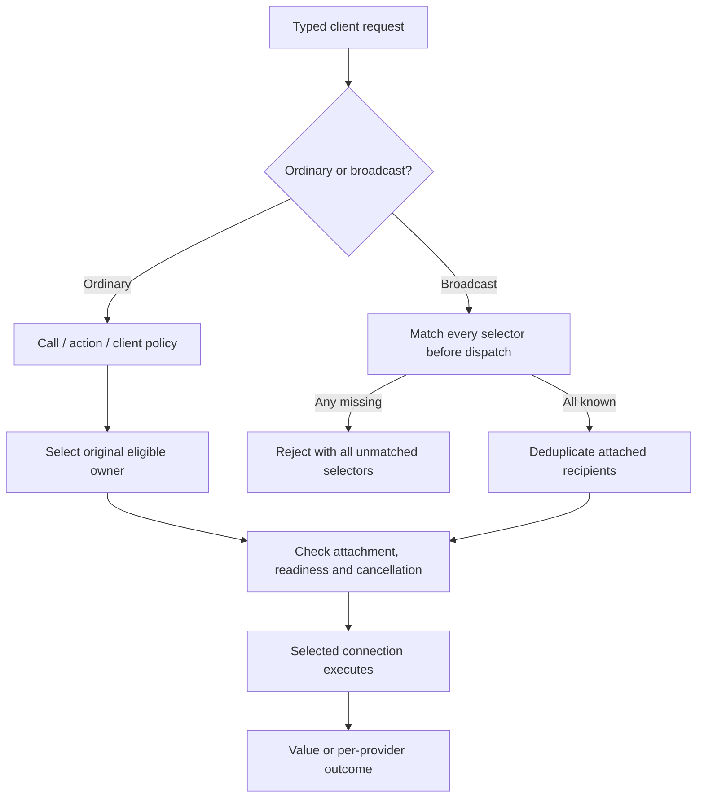

# Provider identity, discovery and routing contract

> Current contract: The 2026-09-27 amendment clarifies two layers: client selectors choose realm/provider recipients; selected implementations decide input applicability. There is no common target reference, generic acceptance hook or new event bus. Ordinary invoke/broadcast semantics remain unchanged. [Architecture](../../ARCHITECTURE.md#recipient-selection-and-request-applicability).

Current direction: [ARCHITECTURE.md](../../ARCHITECTURE.md#upstream-compatibility-and-minimal-adapters) and the [2026-09-27 implementation/map review](../research/upstream-alignment-review.md) govern new adapter work. Dated experiments and superseded proposal sketches below remain historical evidence, not additional APIs to implement.

Working deliverable for [issue 7](https://github.com/dvcol/devkit-extension/issues/7). The owner confirmed identity and discovery ownership on 2026-09-23, then ambiguity, dispatch-time availability, separate broadcast methods and a compact invocation API on 2026-09-24. The owner accepted defaults on the public action declaration. Required realm/optional provider string selectors and single-object declaration helpers are now accepted. The local client behavior is implemented below; authenticated remote discovery and catalog transport remain outstanding. The [research report](../research/provider-routing.md) and its real two-hub evidence establish native integration constraints; they do not implement the complete router.

## Accepted ownership

- The embedding host configures a stable logical provider ID.
- Each backend lifetime has a fresh opaque incarnation. A transport reconnect to the same live backend retains it. UI HMR does not change it unless the backend itself is recreated.
- Existing bindings and dispatched work retain their original provider ownership. Logical ID equality does not let a successor receive old work.
- The client application's composition root owns the discovery registry. It composes supported native connection adapters and supplies provider information to UI and non-UI consumers.
- Shared extension discovery may run in the background runtime, with snapshots carried to popup/panel contexts through native ports. Native context restrictions still apply. No cross-origin singleton or mandatory new daemon is implied.
- Discovery and provider-state synchronization are separate. An endpoint's claimed identity is not authentication.
- Normal development reload follows Vite and native host lifecycle. The registry observes provider availability; it does not supervise host processes or silently replay calls.

The provider descriptor extends the already reviewed core with a mandatory `incarnation: string`. Adapters mint it; declarations do not. A stable provider ID must be configured for the intended logical owner, rather than regenerated on every client connection.

This metadata is implemented in core and the local runtime. Runtime admission rejects non-string, empty and whitespace-only provider IDs and incarnations and freezes an identity snapshot before setup or asynchronous call validation. Focused ownership tests include two live providers sharing a logical ID: an old binding retains its original backend and rejects after disposal instead of switching to its successor. Contribution reactivation retains the incarnation. The complete affected core/runtime suites and packed-consumer gates also pass. This establishes local ownership behavior; remote discovery and selection remain unimplemented.

```ts
// Illustrative metadata; these are not credentials or native transport handles.
const beforeRestart = {
  id: 'example:project-server',
  incarnation: 'backend-lifetime-a',
  realm: { id: 'devserver' },
};
const afterRestart = {
  id: 'example:project-server',
  incarnation: 'backend-lifetime-b',
  realm: { id: 'devserver' },
};
```

| Event | Provider ID | Incarnation | Existing bound API |
| --- | --- | --- | --- |
| Browser renderer HMR | Retained | Retained if backend survives | Keeps the same backend ownership |
| Transport reconnect to live backend | Retained | Retained | Must not acquire another backend while reconnecting |
| Backend disposal and recreation | Retained | Fresh | Remains stale; a new resolution is required |
| Target navigation | Retained if provider survives | Retained if backend survives | Target generation is validated separately |

## Accepted routing behavior

The earlier Q6/Q8 core decisions already established that a per-call policy replaces lower-priority defaults, an exact provider pin inherits no fallback, and a dispatched call never reroutes or automatically replays. The previous version of this note incorrectly listed parts of those decisions as unresolved. The 2026-09-24 review adds:

| Decision | Accepted behavior |
| --- | --- |
| Equal candidates | Return an ambiguity error with enough permitted candidate information to request a discriminant. The UI, agent or caller must explicitly choose before making a new invocation. Do not choose by discovery order or silently skip an ambiguous preferred group. |
| Readiness | Ordinary invocations consider current readiness at dispatch; they do not queue while waiting for a connecting provider. Before dispatch, only the current policy's explicitly permitted alternatives may be considered. |
| Execution failure | A provider dropping during execution is an error. The client may explicitly request a new invocation; the router never replays the failed call. A failed response is not proof that a mutation did not execute. |
| Broadcast | Separate capability/action broadcast methods return per-provider outcomes. Ordinary invocation still returns `Promise<Value>`; an individual broadcast failure retains successful sibling results. |
| Invocation arguments | Prefer a single request object, or at most two or three clear arguments separating business input from common options. Replace the positional contract/operation/input/options chain in the final routed API. The implemented request signatures and their proof are recorded below. |

These decisions are now executed by `@devkit/client` for attached provider connections. Local handles remain pinned to their provider. The chronological research notes below preserve earlier proposals; the implementation record at the end states current behavior.

## Earlier declaration review, superseded by the accepted follow-up

The owner proposed putting `routing` directly on contributions. Its value could select a realm, select a provider, supply an ordered list of alternatives, or run a context-aware selector callback. Separate `realm` and `provider` properties were also suggested. This is a counterproposal to the earlier recommendation for separate client policy declarations, not acceptance of that recommendation.

The next sketch must establish how realm and provider identities are distinguished, how defaults are available to the client before backend selection, and how callback inputs and results preserve target/provider generations. Bare strings cannot be interpreted by guessing which registry namespace currently matches. Current strict service/action/plugin declarations reject an added `routing` property; a settled API requires an explicit declaration and validation change.

Trust filtering, target mapping and state restoration remain owned by their linked issues. Request-object signatures, callback cancellation, registry collisions and broadcast ordering/empty-selection behavior need concrete examples before completing this contract.

## Implementation and verification obligations

| Piece | Required evidence |
| --- | --- |
| Provider incarnation metadata | Strict declaration checks and real local calls preserve a snapshot; same-ID successors cannot reuse old bindings |
| Client-composed registry | Owned adapter attachment/detachment, authoritative versus unknown catalog, explicit provider collisions and stale incarnation updates |
| Selection | Default, exact provider, realm order, callback, ambiguity and explicit pre-dispatch fallback scenarios |
| Broadcast | One settled result per selected incarnation, independent successful siblings, cancellation and empty selection behavior |
| Real hosts | Server and extension together, then actual DevTools server and supported Chromium/Firefox profiles, with separate execution receipts |
| UI reuse | The same selector receives ordinary input from JSON UI and a non-UI consumer |

The bounded released-client experiment found shared endpoint/authentication interference. The separate opt-in upstream patch is still a proposal. SDK integration must resolve that public API/distribution boundary before claiming isolated simultaneous server connections. No mock registry or compile-only adapter counts as the real-host routing proof.

## Initial compact declaration proposal, superseded in part by the clarification below

A single `routing` property can distinguish realm constraints from provider pins without a separate policy factory. Tagged object values avoid interpreting an untagged string through whichever registry happens to contain it. An array represents ordered pre-dispatch fallback, not broadcast:

```ts
routing: { realm: 'devserver' }
routing: { provider: 'project:frontend' }
routing: [{ realm: 'devserver' }, { provider: 'browser:local' }]
routing: (context) => selectRoute(context)
```

These are alternative property values, not implemented exports or an accepted selector type. A namespaced-string alternative would require explicit prefixes such as `realm:devserver` and `provider:project:frontend`. Separate top-level realm/provider fields would need additional rules for their intersection and ordering; one property keeps the fallback sequence in one place. A callback's candidate snapshot, target metadata, cancellation and stale-selection behavior still require review.

The owner accepted the public `defineAction` descriptor as the place for an optional client-visible default, while the action implementation retains its backend handler and execution constraints. A view's action binding or a call can supply a narrower client policy. A callback can run only where its code is installed; it cannot be serialized from a backend-only contribution to a previously unknown client. Remote advertisements can carry validated declarative metadata but not executable JavaScript. Client composition can supply deployment-specific policy without being the only place defaults are declared. Production definitions have not yet gained the accepted default property.

[The request-object type probe](../probes/routing-request-shape/README.md) passes strict TypeScript 7 checking for operation/input/output inference and required-target constraints. It establishes that compact calls are feasible; it does not establish the final routing union or dynamic operation-union inference.

## Connection-isolation follow-up

[Fresh verification](../probes/provider-connection-isolation/proposal/follow-up-20260924/README.md) confirms that the opt-in patch composes with the currently locked declaration repair and passes eight tests, strict TS7 and type-aware Oxlint. Released Devframe 1.0.0 still lacks equivalent public isolation. Kit/hub wrappers can forward the option or accept an owned RPC client. Prebuilt native UI assets contain their own inlined client and are not rewritten by patching the installed Devframe package.

Adopting the exact-version root patch for SDK-owned clients remains an owner decision. It would unblock private workspace transport work; publishing the SDK still needs an upstream release, maintained fork, or explicit consumer patch policy. A fresh browser replay could not start because the in-app browser was unavailable; its runner disposed both hubs and preview. Previous browser passes remain historical evidence, not a new pass.

## Earlier owner clarification after Q6–Q9

The owner accepts public-action routing defaults and proposes a combined selector with required `realm` and optional `provider`. The requested ID types were `string | Symbol`; the exact portable representation remains unresolved. Provider-only selection is a question, not an approved feature. A realm constraint and provider constraint in the same selector must both hold; neither overrides the other.

The current provider descriptor already contains a realm, string ID and incarnation. The generic multi-provider registry is not implemented. Its conflict namespace still needs a decision: provider-only lookup would require registry-wide unique IDs, while a `(realm, provider)` key permits reuse across realms but still requires detecting collisions within a realm. A symbol alone cannot supply cross-runtime identity through JSON or structured-clone transports. Local symbol aliases would need explicit stable-ID mapping; descriptor-backed IDs are the simpler proposal.

The owner also asks why action implementation definitions have a specific helper and two arguments. Dedicated plugin properties do not mandate either factory naming choice. A kind-specific helper supplies the contribution kind; a generic helper would need an explicit kind/descriptor. A fresh single-object declaration probe retains action input/dependency inference and service operation input inference under strict TS7. This removes an inference objection to flattening `contract` or `capability` into the same object as the implementation. Production helpers remain unchanged pending the naming/shape review.

The connection and lifecycle clarifications are explanatory, not patch authorization. Devframe isolation concerns client-side remembered connection/authentication state for multiple backend endpoints. The Vite proposal concerns cleanup of an abandoned replacement after a shutdown hook rejects; it is not a prerequisite for ordinary HMR or build watching. Both proposed runtime patches remain unapplied.

## Earlier follow-up on normalization, naming and client ownership

The owner confirmed required `realm` and optional `provider`. Symbol/number normalization is still under discussion. Normalizing a named symbol by description would work as an input convenience but discard its in-memory uniqueness: two distinct `Symbol('frontend')` values normalize to the same string. Numeric coercion likewise equates `1` and `'1'`. The current recommendation is string identifiers only, caller-owned naming, and SDK validation/conflict detection without another normalization registry.

The owner accepted the single-object, kind-specific authoring direction but flagged the similar `defineAction`/`defineActionContribution` names. A revised naming proposal is `defineActionContract` for the client-safe descriptor and `defineAction` for the handler definition, parallel to `defineCapability`/`defineService`. This proposal renames existing roles; it adds no new runtime concept. No export migration has been implemented or claimed accepted yet.

The provider registry/router is an in-memory client SDK component owned by application composition, not a new dev server or daemon. A web panel may own it locally; extension composition may place connection ownership in its existing background runtime and expose metadata/calls to popup/panels. Discovery adapters can consume an existing external registry or broker without making that process a required SDK component.

Many viewers connecting to one backend and one viewer connecting to many backends are distinct topologies. Native backend trust already belongs to each server/session. The isolated-client proposal addresses shared browser bookkeeping across independent backend connections, not the creation of a new server authentication system. No runtime isolation patch has been approved.

## Accepted follow-up, 2026-09-24

This section supersedes the unresolved naming, identifier and patch-authorization statements above.

- Selectors require `realm: string` and may add `provider: string`. No provider-only selectors, symbol aliases or numeric coercion. Provider IDs are scoped to their realm.
- `defineActionContract` declares a public contract. `defineAction` defines its handler. `defineService`, `defineAction` and `defineExtension` now take one object containing their descriptor and implementation fields. Maintained examples, type fixtures, glossary and architecture use these names. Archived probes preserve their originally executed API.
- Client composition owns the in-memory registry/router. Every backend connection retains its own authentication; no mandatory daemon is introduced.
- The owner authorized a narrow Devframe draft upstream PR for opt-in connection isolation, followed by adoption of the matching exact-version workspace patch. Publication still requires an upstream release or an explicit downstream distribution policy.
- The owner accepts the failed-restart cleanup gap while Vite remains unpatched. A narrow upstream proposal may proceed through source validation and human review; it does not block SDK implementation.

The declaration migration did not implement remote discovery, routing defaults or broadcast. The 2026-09-27 slice below adds validated routing defaults; executing selection remains an issue 7 obligation.

The authorized upstream change is now [Devframe draft PR 401](https://github.com/devframes/devframe/pull/401). The workspace adopts its opt-in behavior through the exact-version Devframe patch, with maintained dependency regression tests. Upstream release adoption and downstream distribution remain separate gates.


The owner's latest isolation shape is `connection.isolated`, carried by the prepared Devframe descriptor. URL discovery uses `connection: { isolated: true }`; reconnecting passes that completed descriptor without another toggle. The draft and exact-version backport both follow this shape. This change does not implement generic discovery or routing.

## Implemented invocation requests, 2026-09-24

The accepted compact invocation direction now has maintained core types and local runtime execution:

```ts
await capabilities.invoke({ capability, operation: 'read', input, target, signal });
await capabilities.resolve({ capability, target });
await actions.invoke({ action, input, target, signal });

// Already bound to one local provider, with no routing override.
await provider.invoke({ action, input, target, signal });
await provider.resolve({ capability });
```

Core exports `CapabilityInvocationRequest`, `ActionInvocationRequest`, `OperationRequest` and `CapabilityResolutionRequest`. A capability request is a discriminated union by operation name, preserving each operation's own input and target requirement. The request's input cannot widen the imported descriptor. Already-bound methods keep the compact `input, options` signature. The adapter's lower-level `invokeLocalOperation` also takes one object containing operation, input, options, context, activationSignal and handler.

The current generic runtime and server handles execute these requests locally. Core's routed client interfaces remain contracts, not a claim of implemented remote selection. New compile-only checks reject 12 invalid request shapes, including uncorrelated operation unions and removed positional calls. Three additional runtime tests cover payload/target separation and cancellation before and during dispatch. Existing lifecycle, real native-host and packaged-consumer checks use the new calls.

The next owner review concerns callback results becoming stale while a provider picker waits, and the distinction between ordinary ordered fallback and explicit broadcast selection. Realm-scoped string IDs, dispatch-time readiness, ambiguity errors, no implicit waiting and no post-dispatch rerouting are already settled and are not reopened by those questions.

## Implemented declarative routing, 2026-09-27

Core now exports the accepted declarative shapes:

```ts
interface RouteSelector {
  readonly realm: string;
  readonly provider?: string;
}
type RoutingDirective = RouteSelector | readonly [RouteSelector, ...RouteSelector[]];

const readTitle = defineActionContract({
  id: 'example.read-title',
  version: 1,
  operation,
  routing: [{ realm: 'devserver', provider: 'frontend' }, { realm: 'webext' }],
});
```

The public action descriptor owns the optional default. Request types accept the same selector/list shape; an explicit request replaces the complete default. Declaration factories validate and freeze their own copy, including when callers provide structural action definitions directly to a plugin. Caller objects remain unfrozen. An empty list, provider-only selector, non-string identifier or unknown selector field fails declaration admission. No identifier normalization is performed.

This slice adds 21 declaration tests and seven negative TypeScript fixtures. It also fixes local provider identity validation: both lifecycle creation and direct local invocation reject malformed provider IDs before handler dispatch, covered by five regression cases. Tests first reproduced the missing check.

The declarations do not execute routing. Local handles remain bound to their provider, and no callback or broadcast behavior is implied by the new types. Registry composition, authenticated remote catalogs, selection/dispatch, cancellation and real multi-host examples remain outstanding.

### Owner decisions accepted on 2026-09-27

1. An asynchronous selection callback observes incarnation A and returns after the same logical provider restarts as B. Reject the stale selection, with a new explicit invocation allowed to select B. Direct declarative selectors still use current availability at dispatch.
2. Broadcast requires its own `selection` list meaning a union of recipients. It inherits no ordinary-invocation defaults. Overlapping selectors identify each provider incarnation only once.

The owner agreed to both recommendations. They are accepted behavior, not a claim that the routing client already executes them.

## Local provider catalogs

The lifecycle now exposes `catalog.snapshot()` and `catalog.subscribe(listener)`, also forwarded by both server installers. Snapshots derive from admitted definitions and their existing activation state. They carry provider identity/lifecycle, exact capability/action IDs and versions, contribution ID, execution, operation names and target requirements. They include registered but inactive contracts with their current status/reason. Unknown remote synchronization is a future connection-adapter state, never inferred from a local empty list.

Catalog entries contain no schemas, handlers, native contexts or diagnostic causes. An active contribution and an open provider are necessary selection conditions, not proof of authorization, target freshness or permission. Subscribers receive an initial snapshot and updates for admission, dependency changes, replacement and disposal. Listener failures use the existing diagnostic sink and do not stop other listeners. Successful disposal releases listeners; blocked cleanup remains visible.

The contribution demo exercises snapshot/subscription against actual lifecycle work. Runtime tests cover versions, immutable snapshots, late admission, rejected duplicates, dependency restoration, replacement and cleanup failure. Native hub/kit tests verify the same catalog on real local server handles. Remote catalog publication and the multi-provider client remain outstanding.

### Accepted missing-recipient decision

Q3 is settled: reject the entire broadcast before dispatch when any selector matches no known provider. The error must identify all unmatched selectors clearly. Known providers that are disconnected or permission-blocked can still produce individual failed outcomes. A's side effect must not occur when B is missing.

## Implemented local routing client

`@devkit/client` implements the core action/capability interfaces over adapter-owned `ProviderConnection`s. Both local server handles satisfy that interface directly. This is an in-process client composition, without a daemon, replacement RPC engine or global state store.

| Contract | Implementation |
| --- | --- |
| Identity and ownership | Registry key is `(realm, provider ID)`; every duplicate throws. Attachment/incarnation fencing prevents stale callbacks and bindings from switching owners. Detach removes subscriptions and cancels client work, leaving backend ownership intact. |
| Catalog readiness | Undefined means unsynchronized. Selection requires an open provider, exact contract version and active contribution. Known unsupported/disabled/unsynchronized providers appear in candidate diagnostics. Target authorization and permissions remain adapter obligations. |
| Precedence | Per-call policy replaces action default, then client default. Malformed explicit routes reject rather than falling back to defaults. |
| Ordinary routing | Ordered groups are checked before dispatch. Zero eligible candidates advances; several reject as ambiguous and require a discriminant. No implicit wait or post-dispatch replay. |
| Callback | Fixed original candidate owners, current readiness for still-attached owners, stale-owner rejection and cancellation of waiting. Input is `unknown` and must be narrowed by the policy. Callback exceptions propagate unchanged. |
| Bound capability | Selected adapter returns its native context and API. The client validates owner identity, captures per-call target metadata and keeps the binding pinned to that attachment. |
| Broadcast | Required non-empty recipient union; no ordinary defaults or `routing` property. Preflight rejects every unmatched selector before any provider call. Overlap deduplicates; known unavailable recipients have rejected outcomes alongside successes. |
| Error reporting | Local `RoutingError` codes include ambiguity, unavailable provider, stale selection, cancellation and unmatched selection. Unmatched errors expose `.selectors` and an actionable message. Callback/adapter errors remain their original values. Wire-safe error disclosure is separate work. |

```ts
const client = createClient({
  connections: [devframeProvider, devtoolsProvider],
  routing: [
    { realm: 'devserver', provider: 'frontend' },
    { realm: 'devserver', provider: 'tools' },
  ],
});
await client.actions.invoke({ action, input });
await client.actions.broadcast({
  action,
  input,
  selection: [{ realm: 'devserver', provider: 'frontend' }, { realm: 'webext' }],
});
```



The package tests use actual local lifecycle providers, including disable/enable, in-flight detach, replacement while a callback waits, mutable target aliases, malformed callback results and mixed broadcast outcomes. New compile fixtures verify callback context and broadcast input/output/target correlation. The isolated packed consumer imports all three portable packages, executes callback/broadcast behavior, checks Bundler and NodeNext declarations and bundles them without host dependencies.

`examples/server-contexts` now provides `demo:routing` and an executable check against simultaneous genuine Devframe hub and DevTools kit contexts. Each owns native shared state. A missing-recipient increment leaves both counters unchanged; overlapping recipient selectors increment each once. This establishes local multi-host routing only. Remote catalog endpoints, authenticated client synchronization, verified discovery and principal/target filtering remain incomplete. Neither the headless demo nor a browser-compatible bundle proves remote or WebExtension behavior.
