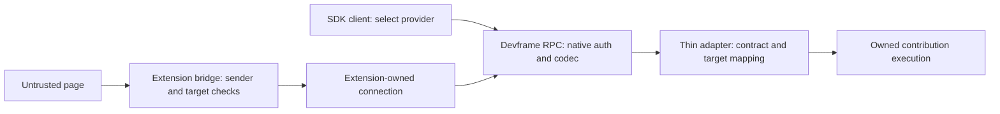

# Remote adapter boundary

Working deliverable for [Permissions and trust](https://github.com/dvcol/devkit-extension/issues/9), updated on 2026-09-27 after the owner's upstream-first review. The earlier Q4/Q5 recommendations are superseded: ordinary native connections inherit native authorization and serialization. A mandatory second SDK policy and a JSON-only business-value format are not prerequisites for implementation.

## Reuse boundary

`@devkit/client` composes `ProviderConnection`s. The maintained two-host example uses local server handles; it does not yet expose contributions remotely. Remote adapters should use existing Devframe RPC and connection APIs, mapping only the portable contribution metadata and ownership they lack.

The native server authenticates the connection. When a trusted extension relays a page request, it must also establish what that page may request; the extension's authenticated session does not establish page authority. These checks belong at the actual bridge boundary, rather than a mandatory generic policy callback on every ordinary native call.

## Authentication and authorization

Devframe already supplies interactive authentication, a native `authorize(methodName, session)` hook and `getCurrentRpcSession()` inside handlers. Preserve that behavior and custom host policies. Credentials and raw sessions remain local. Provider/target identity checks and schema validation complement authorization; they do not replace it.

The operation mapping matters: native authorization sees the RPC method name, not an action ID buried in a generic dispatcher payload. Prefer meaningful native method registrations where supported. If a generic dispatcher proves necessary, document how it preserves the host's intended operation/target restrictions. Do not hide all operations behind one unrestricted method and claim the native gate still distinguishes them. This is an adapter mapping question, not a reason to invent another login or grants framework.

The inspected native implementation chooses `options.authorize ?? authHandler?.authorize`. Supplying an override replaces the handler's gate; it does not automatically compose two policies. Any additional restriction must preserve the native gate deliberately. Ordinary SDK exposure also must not opt into native agent/MCP exposure merely because a method exists.

## Serialization

Use `devframe/utils/structured-clone` when a bridge needs explicit encoding. Native RPC already chooses its wire codec using the method's `jsonSerializable` setting; leave native request IDs, framing and correlation with that implementation. A Chrome Port's JSON envelope does not require JSON-only operation values: the public records serializer produces JSON-safe records that the matching deserializer restores.

The maintained [codec compatibility tests](../../packages/server/tests/serialization.test.ts) exercise these public exports through `JSON.stringify`/`JSON.parse`, covering Date, Map, Set, BigInt, cycles and undefined values, plus unsupported-function rejection. This is an installed-package boundary check, not proof of a running extension or full remote adapter.

One important observed limitation: the installed `structuredCloneStringify` drops an object property containing a function, whereas `structuredCloneSerialize` rejects that input. Do not assume the exported helpers are interchangeable for a strict rejection guarantee. Use the strict public entry point where such validation is needed and test the actual transport path. Do not add a custom graph walker or codec to reproduce that functionality. Class prototypes and arbitrary native handles are not promised portable values.

Standard Schema remains guard-only. JSON-render's serializable UI model and operation payload serialization are separate contracts. The native format is upstream-owned; there is no new SDK rich-value protocol to version.

## Source evidence and remaining gaps

Inspection used the installed patched `devframe@1.0.0` declarations and the source checkout at `a3f967755af99a0a0d8dd82b7b5d4f3dd4aec0bc`. Source findings do not claim complete byte equivalence to that package or an authenticated browser run.

| Finding | Evidence and consequence |
| --- | --- |
| Native auth and actual session access exist | `node/auth/handler.ts`, `recipes/interactive-auth.ts`, `node/rpc-core.ts`, `node/host-functions.ts`. Reuse them; never accept a caller-supplied principal as authority. |
| Native authorization sees method/session; overrides replace the default gate | `node/rpc-core.ts`. Preserve native policy when registering operations or composing restrictions. |
| Native RPC has JSON and structured-clone modes | `rpc/wire-codec.ts` and public `utils/structured-clone.ts`. Reuse public exports; do not copy the internal wire codec. |
| Native low-level RPC accepts channel callbacks | Public `devframe/rpc/client`. Adapt extension Port events/close to that channel before considering any new transport mechanism. |
| Ordinary shared state has client-accessible set/patch endpoints | `node/rpc-shared-state.ts`. A normal writable state key is not authoritative catalog or permission storage. |
| Collector registration has no public unregister method | Public collector API and `rpc/collector.ts`. Direct Map deletion does not emit the collector change event. Investigate supported registration ownership before promising dynamic remote disposal. |
| The public session API has no disconnect signal/subscription | `RpcFunctionsHost` type; native disconnect internals are not a supported extension API. Prove what native close handles, then identify any remaining server cancellation gap. A timeout is not cancellation proof. |
| Local definitions own schema/handler execution | `packages/runtime/src/provider-bindings.ts`. Remote metadata cannot install executable schemas or handlers. |

The [upstream alignment review](../research/upstream-alignment-review.md) maps these limits to the other tickets. Native auth/codec reuse removes the earlier broad choice of competing systems; it does not settle extension actor permissions, state privacy or debugger authority.

## Native socket evidence, September 27

The maintained [remote counter example](../../examples/server-contexts/README.md#authenticated-native-rpc) now proves native allow/deny behavior, actual session trust, invalid-input rejection, provider disposal and stale incarnations over real WebSockets on both native hosts. Host shutdown rejects the pending client call, while an already-started server handler still finishes when released. These are explicit host-owned native definitions, not automatic remote provider publication. Remote catalogs, bridge authority, per-call cancellation and browser execution remain unimplemented.

The [lifecycle investigation](../research/native-rpc-lifecycle.md) also distinguishes standalone disconnect hooks from the installed hub, which does not expose them. Native validation helpers are exported but marked `@internal`; ordinary native declaration schemas remain the supported integration.

## Next implementation slice

1. The fixed-counter native fixture is implemented. Settle reusable remote exposure lifetime, then extend this evidence to SDK catalog synchronization and general contract mapping.
2. Establish registration lifetime and disconnect cleanup through public APIs. If a required operation is absent, record the exact limitation and smallest possible extension; do not reach into private collections or add a replacement RPC host.
3. Map server-owned contract/version/incarnation metadata and target references into that native call. Keep native correlation IDs and native wire encoding. Publish an authoritative, appropriately visible catalog without trusting client-writable state.
4. Adapt a real extension Port to the existing RPC channel and codec. Verify rich values, malformed/unsupported data, disconnection and listener cleanup on Chromium and Firefox. Bridge sender/target checks must precede privileged dispatch.

Existing upstream PRs remain drafts. This review opens no new upstream PR.

## Readiness and completion

- [x] Local routing ownership and broadcast semantics are implemented and tested.
- [x] Native auth/serialization reuse is the implementation direction; Q4/Q5 are no longer pending choices between duplicate systems.
- [x] Public serializer compatibility and unsupported-function rejection have maintained installed-package tests.
- [ ] Public registration/disconnect integration is proven or its exact limitation is resolved.
- [ ] Real authenticated hosts prove synchronization, native allow/deny behavior, spoofed metadata rejection and disposal.
- [ ] Real extension hosts prove wire compatibility, page/extension authority and target freshness.
- [ ] Cancellation, permission revocation and error-detail disclosure meet the complete issue-9 contract.
