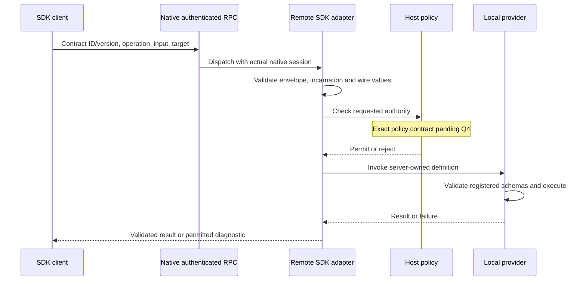

# Remote adapter boundary

Working deliverable for [Permissions and trust](https://github.com/dvcol/devkit-extension/issues/9), following the local client implementation in [issue 7](https://github.com/dvcol/devkit-extension/issues/7). This records source inspection on 2026-09-27 and two pending owner decisions. It does not implement remote endpoints or settle policy by recommendation.

## Current boundary

`@devkit/client` composes existing `ProviderConnection`s. The real two-host example uses local server handles, with no network transport. `@devkit/server` still installs local contributions only. Opting a provider into remote exposure needs a separate, explicit integration.

The session comes from the native transport, never from a principal field supplied by the caller. Credentials and native objects stay local. A remote descriptor cannot supply executable handlers or schemas. Provider identity and target generation are checks alongside authentication; knowing their string values does not grant authority.

## Source evidence

Inspection used the installed `devframe@1.0.0` public declarations and the Devframe checkout at `a3f967755af99a0a0d8dd82b7b5d4f3dd4aec0bc`. These are code facts, not results of a new authenticated browser experiment.

| Finding | Evidence and consequence |
| --- | --- |
| Native RPC handlers can inspect their actual session | `packages/devframe/src/types/rpc.ts`, `RpcFunctionsHost.getCurrentRpcSession`; implemented in `node/host-functions.ts`. The session includes native trust/credential metadata and must not be serialized into a catalog. |
| Native interactive authentication permits nonanonymous methods for a trusted session | `packages/devframe/src/recipes/interactive-auth.ts`, `authorize(methodName, session)`. A generic SDK dispatcher must separately decide whether that session may invoke the SDK operation named inside its request. |
| Ordinary shared state has remote set/patch endpoints | `packages/devframe/src/node/rpc-shared-state.ts`, `devframe:rpc:server-state:set` and `:patch`. A published SDK catalog cannot treat an ordinary client-writable state entry as server authority. |
| Native RPC distinguishes strict JSON and structured-clone codecs | Installed `dist/index-DuEm0sDH.d.mts`, serialization declarations. Omitted/false `jsonSerializable` selects structured clone; true selects strict JSON. This does not establish compatibility with Chrome messaging. |
| The collector exposes register/update/change subscription, with no public unregister method | Installed collector declarations and `packages/devframe/src/rpc/collector.ts`. Its definitions Map is public, but deleting an entry does not emit a change notification. Safe ownership cleanup needs further investigation. |
| The public session API has no disconnect signal/subscription | `RpcFunctionsHost` public type. Native disconnect propagation in `node/rpc-core.ts` reaches `_emitSessionDisconnected` and streaming internals. Consumers must not widen the public API by reaching into those members. |
| Registered schemas already own local action execution | `packages/runtime/src/provider-bindings.ts`. Remote dispatch should reuse that authority after selecting the registered definition, never trust a client-supplied schema. |

The [browser audit](../research/browser-capabilities.md) records Chrome JSON messaging versus Firefox structured clone. Standard Schema validation alone does not choose a common transport value domain.

## Pending owner decisions

### Q4: authorization when enabling remote exposure

Recommendation: require a host-owned policy when exposing a provider remotely. It controls catalog visibility and checks every invocation against the actual session, operation and target. Authentication remains native; this is neither a second login nor a user prompt on every call. A host can explicitly allow a whole trusted scope or expose only selected contracts.

Alternative: native trust alone authorizes every remotely exposed contribution, with an optional narrower policy. This is simpler for a fully trusted development client but intentionally gives the transport trust decision broader authority.

The policy's exact declaration and lifecycle contract follow this choice. Do not silently add an implicit allow-all callback or infer permission from catalog presence. Local in-process calls retain their current behavior.

### Q5: portable remote values

Recommendation: JSON-compatible values, plus explicit absent/void support at operation boundaries. Reject unsupported remote values instead of silently coercing them. Local calls remain unrestricted. Authors can express richer values explicitly, such as a timestamp string accepted by their contract.

Alternative: a common richer codec preserving Date, Map, BigInt and other selected types across all transports. That introduces codec/version compatibility requirements and requires a precise supported-type list before implementation.

Neither choice changes Standard Schema's accepted guard-only semantics. Serialization, schema validation and authorization remain distinct checks. No implementation of either option is approved by this document.

## Work that can proceed without those choices

- Design and validate metadata-only envelopes around server-owned contract IDs, numeric versions, operation names, request IDs, provider incarnations and target references.
- Investigate public native registration cleanup and disconnect ownership. Do not patch private collector arrays or claim that a timeout proves server-side cancellation.
- Plan an authenticated two-server fixture with an explicit narrow allowlist. Its policy can prove integration behavior without defining the default for general consumers.
- Establish catalog authority, initial unknown readiness, immutable snapshot validation and incarnation fencing. Transport publication must preserve these properties and filter metadata according to the eventual host policy.

No new upstream PR is authorized by this investigation. Existing upstream PRs remain drafts.

## Readiness and completion

- [x] Local client ownership, routing, callback and broadcast semantics are implemented and tested.
- [x] Native session/trust, serialization and shared-state boundaries have source evidence.
- [ ] The owner chooses Q4 and Q5.
- [ ] Public native cleanup/disconnect integration is proven or an explicit limitation is agreed.
- [ ] The remote adapter declaration and authorization result types are reviewed against the selected policy.
- [ ] Real authenticated hosts prove initial synchronization, allowed/denied invocation, spoofed input rejection, cancellation, disconnect and disposal.
- [ ] Browser extension integration proves the same wire-value contract and target authority on Chromium and Firefox.

This is a bounded prerequisite record. It does not close the wider actor/operation matrix, permission revocation, state privacy or debugger authority obligations in issue 9.
