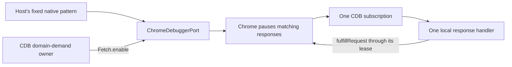
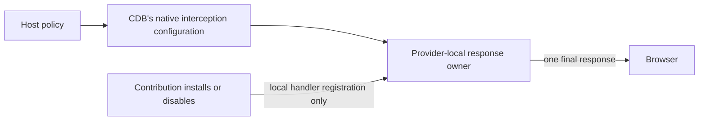
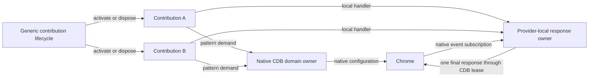

# Optional CDB interception configuration

Status: capability-specific investigation, not a generic SDK blocker. The owner clarified this boundary on 2026-09-29. CDB-backed functionality is an optional capability/service integration built using the framework; CDB itself remains an independent native library. The earlier framing as a required SDK architecture choice is superseded.

The options below concern that integration's Chrome Fetch implementation under [Debugger and CDB contract](https://github.com/dvcol/devkit-extension/issues/10). They do not gate native rendering, action broadcast, provider filtering or other capabilities. The generic [Injection and transform contract](https://github.com/dvcol/devkit-extension/issues/11) remains required, but its shared API must follow cross-backend needs rather than inherit CDB domain-demand or Chrome Fetch configuration.

The maintained SDK packages contain no CDB dependency or CDB-specific routing logic. Native CDB dependencies, ownership and recovery examples live in `examples/debugger`. Existing local CDB patches support that optional integration. They are not framework prerequisites. The illustrative declarations below are integration sketches, not proposed mandatory SDK types. No choice in this document authorizes a new upstream PR.

## Implemented behavior

The maintained [fixed-response example](../../examples/debugger/README.md#fixed-response-interception) configures a native `ChromeDebuggerPort` before creating its host:

```ts
const host = createDebuggerHost(
  'chromium',
  console.error,
  responseDebugger('https://example.test/api/*'),
);
```

CDB owns the debugger attachment, the lease and the first/last demand for Fetch. The port supplies the fixed native pattern when CDB calls `Fetch.enable`. One native subscription reads a matching response and the example fulfills it. This works now and has real-browser evidence. It does not implement multiple transform contributions.



Changing the port's stored parameters alone cannot update active interception. CDB's current public demand method accepts `methodPrefix`, `active` and optional `sessionId`. Another subscriber adds demand but does not cause another configured `Fetch.enable`. Sending an independent raw enable would introduce a competing owner. These facts are documented in the [native response investigation](../research/cdb-response-transform.md#ownership-and-limits).

The integration decision concerns who can change **which traffic Chrome pauses**. Domain and URL matching remain provider/capability concerns. RPC continues to carry validated inputs and results, never executable callbacks.

## A: the host fixes interception coverage

The host configures the intercepted traffic before starting its backend. Contributions filter and transform only responses inside that set. Installing a plugin cannot expand it. Hosts can choose a broad pattern when that is appropriate for their application.

```ts
// Proposed authoring shape only; defineResponseTransform is not implemented.
const hostPolicy = {
  patterns: [{ urlPattern: 'https://example.test/api/*', requestStage: 'Response' }],
};

const plugin = definePlugin({
  id: 'example.feature-overrides',
  transforms: [
    defineResponseTransform({
      id: 'example.flags',
      matches: ({ url }) => new URL(url).pathname === '/api/flags',
      transform: ({ body }) => overrideFlags(body),
    }),
  ],
});
```



This avoids dynamic native pattern reconciliation. A plugin that needs traffic outside the host's coverage cannot work until the host configuration changes. A broad filter pauses unrelated traffic too, so the response owner must still continue responses with no matching handler. Host policy does not eliminate the need for one owner of a paused request or for overlap/failure rules.

The exact unsupported outcome would be explicit where coverage can be established. Arbitrary callback predicates cannot be compared with native URL patterns automatically; we should not add a predicate-analysis utility or imply that configuration proves coverage.

## B: contributions request interception coverage

Each contribution declares native interception patterns alongside its local handler. Installing or disabling a contribution changes active demand. The native CDB integration reconciles pattern demand within its capability implementation. Provider-local code owns the response handlers. CDB does not import SDK contribution types or application transforms; the generic SDK does not send competing enable/disable commands or maintain a second debugger broker.

```ts
// Proposed authoring shape only; names and remaining fields are not settled.
const plugin = definePlugin({
  id: 'example.feature-overrides',
  transforms: [
    defineResponseTransform({
      id: 'example.flags',
      patterns: [
        { urlPattern: 'https://example.test/api/flags*', requestStage: 'Response' },
      ],
      transform: ({ body }) => overrideFlags(body),
    }),
  ],
});

// Existing plugin lifecycle; the proposed native integration follows its lifetime.
const handle = await provider.plugins.install(plugin);
await handle.disable();
```



Within a CDB-backed interception capability, this supports independently installed transforms. The current CDB demand API cannot express the configuration update, so it needs a narrow native design and proof before a local patch. That native work would handle domain configuration only; application transformation logic stays downstream. An upstream draft would still require explicit approval after a concrete diff and tests are prepared.

Native reconciliation must preserve existing handlers and already paused requests while demand changes. A failed update must reject the new registration or report its failure, rather than claim that Chrome uses a configuration it never accepted. Disabling one contribution must preserve another's coverage. Updating configuration cannot replay an action or silently move an already dispatched operation to another provider.

## Comparison and recommendation

| Concern | A: host coverage | B: contribution coverage |
| --- | --- | --- |
| Plugin changes intercepted URLs | Requires host configuration change | Part of native registration lifetime |
| Current native API fit | Fixed-pattern mechanism is proved | Dynamic configuration needs native work |
| Generic SDK responsibility | Existing contribution lifecycle and explicit availability | Same; native CDB still owns interception |
| Broad interception cost | Host may choose a superset | Active contributions can request narrower traffic |
| Overlap and response ownership | Still needs one response owner | Still needs one response owner |
| Runtime configuration failure | Mostly host startup/reconfiguration | Also plugin installation and disable |
| Maintenance cost | Smaller adapter; more host configuration | Additional native contract and compatibility tests |

For a CDB-backed capability that needs independently installed transforms, B offers dynamic coverage; A supplies fixed host coverage with less native integration work. That tradeoff belongs to the capability author. It does not select a framework-wide interception policy. The maintained fixed example supplies evidence for the optional integration, not the final generic transform API.

The current remote demand path is a notification, and the browser reports native setup failures locally. Adding dynamic patterns would therefore also need an explicit decision about native configuration acknowledgement and failure visibility. This is not a parameters-only patch and is not a reason to add a generic SDK recovery or enforcement layer.

Transform ordering, unmatched-response handling and failure policy remain integration work when dynamic CDB transforms are pursued. Preserve ordinary capability boundaries and native ownership. No general callback pipeline, retry controller, dynamic patch or new upstream PR is implemented by this note. Generic framework implementation can proceed independently.
