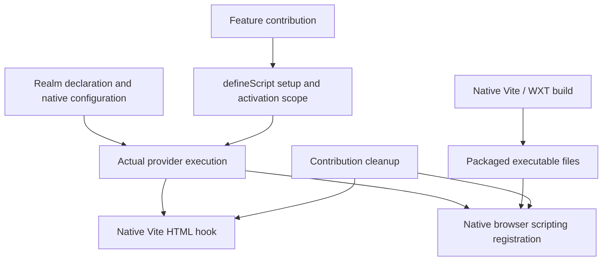

# Portable script registration

Accepted on 2026-10-02 under [Injection and transform contract](https://github.com/dvcol/devkit-extension/issues/11). The owner requires one common contribution API to register a feature on either provider realm, with realm-specific declarations and native implementations. Native configuration plus flexible setup is satisfactory when it meets that requirement.

## Contract

```ts
defineScript({
  id: 'example.bootstrap',
  execution,
  requires: { optionalNamedDependency: capability },
  async setup({ native, services, scope }) {
    // Perform native registration in this realm.
    // Register owned cleanup with scope.onDispose immediately after acquisition.
  },
});
```

The declaration is inert. `requires` is optional and inferred exactly. Setup receives the existing `SetupContext<Requirements>` and returns `Awaitable<void>`. `ScriptDeclaration` is the plugin boundary; `ScriptDefinition<Requirements>` preserves typed setup. `definePlugin({ id, scripts: [...] })` uses the ordinary installation handle with disable, enable, retry, replacement, disposal and observable diagnostics. Failed cleanup retains the existing ownership barrier. Returned resources are not adopted.

Execution assigns the registration owner. It does not imply that page code shares that execution's privileged APIs. Browser `world` and `runAt` remain native options. Functions, browser objects and Vite contexts remain local; ordinary native RPC carries controls and results.



## Maintained implementations

| Host/stage | Native declaration and implementation | Contribution ownership | Limit |
| --- | --- | --- | --- |
| Devframe and DevTools development | Native Vite plugin with `transformIndexHtml` | Setup enables the configured hook; cleanup disables it for future responses | Already-executed documents retain effects |
| Vite build and preview | Native build HTML hook; preview serves compiled HTML | Native build configuration owns emitted code | A live backend cannot disable code already present in built HTML |
| Chromium and Firefox content scripts | Native Vite/WXT entry plus `scripting.registerContentScripts` | Background script recipe owns registration and `unregisterContentScripts` | Future eligible documents only; no rollback of existing document effects |
| Devframe dock client script | Installed native `dock.clientScript.importFrom` configuration | Remains native host configuration | Host-page import after trust/activation is not application document-start injection; no new removal guarantee is claimed |

The [server recipe](../../examples/vite-hosts/src/html-bootstrap.ts) and [extension recipe](../../examples/webext/src/script-contribution.ts) use the same `defineScript` API and logical feature ID. Their native implementation code differs because their native stages differ. The extension's packaged implementation stays in the existing production Vite input and WXT unlisted entry. The server feature uses one local activation flag inside its native hook, without an SDK registry or HTTP transformation engine.

## Evidence and acceptance boundary

Core tests cover inert construction, structural input snapshots, missing setup, unknown source-discovery fields and typed capability requirements. Compiler consumers use the built public package exports. Runtime tests exercise dependency wait/loss/restoration, explicit disable, partial failure, retry, replacement cleanup barriers and ignored structural return values.

The maintained Vite browser suite checks actual first-page-script effects before disable, after disable and after enable on both real development hosts. Independent build/preview checks retain the existing native timing proof without implying dynamic preview removal. The maintained extension browser suites drive native RPC controls on the packaged page and inspect actual browser registrations, first-script effects, MAIN/ISOLATED separation, unmatched pages, disable/enable/dispose and retained old-document effects.

Issue #11 remains open for complete stage coverage, permissions/restart/HMR failure cases, CSP/frames, arbitrary HTTP transforms and their specific ordering/failure guarantees. No automatic SDK source discovery, generated native build configuration, source loader, realm option union, callback wire format or new upstream patch is introduced.
