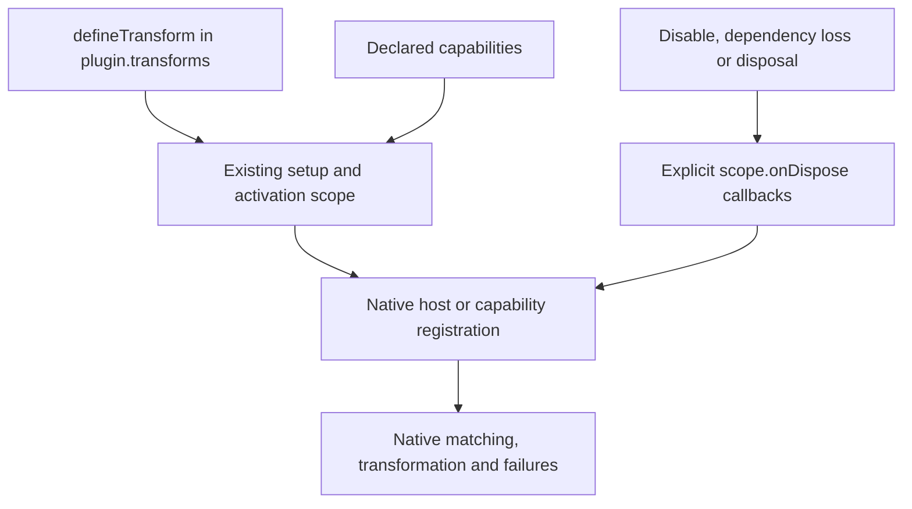

# Native transform contributions

[Injection and transform contract](https://github.com/dvcol/devkit-extension/issues/11) owns this implementation. It follows the owner's common-contribution and native-first direction: one setup API registers the feature in its declared execution, while its native host or capability implements the operation. The accepted view/script setup pattern supplies the existing ownership contract.

## Implemented contract

```ts
defineTransform({
  id: 'example.html-first',
  execution,
  requires: { source: capability },
  async setup({ native, services, scope }) {
    /** Register natively and own each acquired resource immediately with scope.onDispose. */
  },
});
```

`requires` is optional and inferred exactly. `TransformDefinition<Requirements>` preserves the existing typed `SetupContext`; `TransformDeclaration` is the plugin boundary. Setup returns `Awaitable<void>`. `definePlugin({ id, transforms: [...] })` uses ordinary installation, disable, enable, retry, replacement and disposal. The runtime does not adopt returned resources.

The SDK owns declaration validation, capability dependencies and registration lifetime. Its existing cleanup barrier prevents a successor from acquiring resources before the previous generation finishes cleanup. Native APIs own transformation stages, matching, ordering and failures. No common callback pipeline, priority registry, buffering engine, paused-request controller or executable wire format is added.



## Native Vite example

The [maintained implementation](../../examples/vite-hosts/src/html-transforms.ts) creates two independent native HTML hooks and recipes. Configuration deliberately lists the second hook first. Vite's native `transformIndexHtml` `pre`/`post` processing produces the order `first,second`; contribution activation speed does not determine transform order.

Each recipe owns one local activation flag in its configured native hook. Disabling or disposing one stops its future HTML changes while preserving the other. Reenabling uses a fresh activation generation. Existing documents retain effects already applied.

The `/?transform-error` fixture throws from the real second native hook. Vite returns HTTP 500. The next ordinary request succeeds with the same provider and active contribution. A request failure does not masquerade as contribution setup failure, and the SDK installs no error-recovery controller.

Independent builds use the native hooks directly. Both completed effects are present in emitted HTML. Devframe and DevTools preview hosts serve that output without running live HTML transformation. Disposing a live provider cannot edit completed build output.

## Evidence and remaining work

Core tests cover inert setup, structural snapshots, incomplete declarations and rejection of native pipeline fields outside setup. Built-export consumers check capability requirements, inputs, native context and explicit cleanup typing. Runtime tests cover dependency binding, cleanup order, explicit lifecycle, setup failure/retry, returned resources and replacement cleanup barriers.

The [real browser scenarios](../../examples/vite-hosts/tests/browser-transforms.ts) inspect received HTTP bytes and the earliest page script on both actual Devframe and DevTools development hosts. They exercise native order, independent disable/enable, disposal, retained document effects, HTTP failure and recovery. Independent build/preview tests inspect completed bytes and zero preview HTML-hook calls. [Retained automated receipt](../../examples/vite-hosts/evidence/html-timing.json). [In-app live confirmation](../../examples/vite-hosts/evidence/transform-contribution-live.json) separately records independent disable/enable and retained document effects on both hosts, with its native authentication and dock limits.

This establishes the common setup contract and bounded native HTML behavior. Native Chromium/Firefox header recipes now supply bounded production and WXT development evidence described below. Redirect and response-body recipes, Firefox server execution, frames/CSP, streaming/encoding, permission loss, in-flight disposal and overlapping response interception still need their own implementation and evidence. Optional CDB integration remains a capability concern. Native outcomes must be recorded per advertised mechanism; this example does not establish a cross-backend transform order or uniform fallback policy.

## Native WebExtension header example

Two independent background recipes use native `declarativeNetRequest.updateSessionRules`. Each owns an explicit native session rule ID and priority. Native registration succeeds before `scope.onDispose` acquires cleanup ownership. Browser matching and header precedence remain native; no SDK rule registry or callback transform is introduced.

The example grants `declarativeNetRequestWithHostAccess` and uses existing loopback host access. Both matching request and initiator are admitted natively. The compiled rules match only the owned `/transform-headers` XMLHttpRequest fixture. Real server-observed request headers and document-observed response headers establish modification. An unmatched URL retains the original values.

A duplicate rule rejects setup without acquiring the existing owner's cleanup. An invalid native update requesting removal of an existing rule rejects atomically and leaves both rules intact. Disable/enable uses a new activation and native priorities; disposal removes only the owner's rule. Both actual browsers retain the same provider through these operations.

[Maintained assertions](../../examples/webext/tests/header-rules.ts) run in Chromium 153.0.8010.12 and Firefox 157.0, in production and native WXT development. Each of the [four retained receipts](../../examples/webext/evidence/header-rules) contains seven asserted checks, actual request logs, native snapshots and document observations. Chromium captures zero errors from the fixture/extension pages; Firefox's WebDriver Classic limitation remains explicit. Existing CI browser commands execute all four scenarios.

This establishes headers only. Redirect/body rewriting, permission revocation, rule limits, other extensions, worker loss, restart/reload restoration and in-flight cleanup remain separate acceptance. Session rules have their native browser lifecycle; the SDK provides no reinstallation controller or persistent rule ownership.
