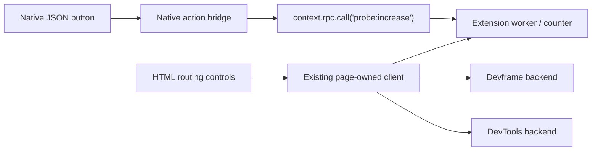
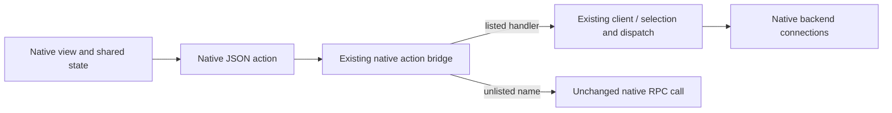
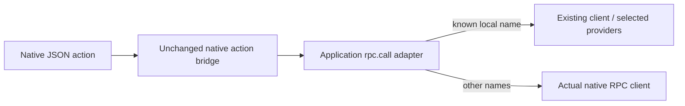

# JSON actions and the client-owned router

Status: owner review required. These are proposals, not implemented APIs. This note concerns [Renderer and surface contract](https://github.com/dvcol/devkit-extension/issues/12). Multi-provider JSON UI is already required; the choice is how to connect the existing renderer to the existing router.

## What works now

The extension example passes 39 real Chromium scenarios and 32 Firefox scenario groups, including actual popup/options, native DevTools panel and browser sidebar lifetimes. Its page-owned router connects to native Devframe, DevTools and extension providers. The JSON-rendered counter button still invokes its own worker. Separate HTML controls exercise selection, fallback and broadcast.



The public reference renderer accepts `entry`, `container` and `context`. A view can be an inline native JSON spec or a native shared-state reference. Non-built-in actions call `context.rpc.call(name, params)`. Native built-ins such as `setState` remain local. The public mount exposes no action-handler callback. Replacing the complete renderer or moving all connections into a new orchestration host would be larger changes.

Published `1.1.0` was checked on 2026-09-29. Its renderer still mounts with only `entry`, `container` and `context`, and its action bridge still calls native RPC. It adds no public local-handler seam and still lacks the `./renderer` and `./view` exports supplied by draft 411. Its exact Devframe/Hub peers also require a coordinated upgrade. The release is still inside the repository's seven-day age threshold; the tested patched `1.0.0` graph remains installed. [UI metadata](https://registry.npmjs.org/@devframes/json-render-ui/1.1.0), [protocol metadata](https://registry.npmjs.org/@devframes/json-render/1.1.0).

Disposing and remounting against another native context already supports changing the selected view provider. It does not by itself make one JSON action broadcast or follow an ordered fallback across providers.

## A: optional native action handlers, recommended

Add one optional, finite handler map to the native JSON renderer mount. The existing action bridge checks that map first and sends unlisted action names through its existing RPC path. Reuse its current loading/error handling and native built-ins.

```ts
// Proposed extension to the native renderer mount, not an SDK factory.
await renderer({
  entry: applicationOwnedView,
  container,
  context: nativeContext,
  handlers: {
    'example:increase-devservers': () => client.actions.broadcast({
      action: increaseCounterAction,
      input: { amount: 1 },
      selection: [{ realm: 'devserver' }],
    }),
  },
});
```



The host grants these handlers to this mount explicitly. The example would attach them only to its packaged application view. This does not grant every remote server-authored view access to the router or extension operations.

Cost: a small native public API addition and an exact-version patch until released. Existing mounts keep their behavior. A rejected handler uses the renderer's existing error path; an unknown name still reaches native RPC. No SDK dispatcher, new RPC protocol or full-context imitation is needed.

## B: adapt the existing RPC call member

Keep upstream unchanged. The application gives the renderer a call adapter that handles specific local UI names and forwards all other calls to the actual native client. Shared state remains the actual native host.

```ts
// Conceptual adapter; the typed implementation is not written yet.
async function rendererCall(name, ...args) {
  if (name === 'example:increase-devservers') {
    return client.actions.broadcast({
      action: increaseCounterAction,
      input: { amount: 1 },
      selection: [{ realm: 'devserver' }],
    });
  }
  return nativeRpc.call(name, ...args);
}

await renderer({
  entry: applicationOwnedView,
  container,
  context: { rpc: { call: rendererCall, sharedState: nativeRpc.sharedState } },
});
```



Cost: no dependency patch, but the supplied `rpc.call` now mixes local UI commands and remote RPC. Local names can shadow real native methods, so the application must reserve a namespace. The adapter must preserve native generic call typing and forward unlisted arguments unchanged. Errors still use the native renderer path. State, connection authentication and backend lifetimes stay native.

## Common requirements

- Same native JSON model and reference renderer; no frontend framework in contribution authoring.
- Invoke, broadcast, fallback and failure use the existing router. No rerouting after dispatch.
- A local handler does not bypass native backend authentication or contribution input validation.
- Native action execution awaits results but does not automatically store them in the JSON view. The example must project command/per-provider outcomes through ordinary native view state, without merging independent provider stores.
- Live tests must trigger rendered JSON buttons against the actual mixed backends, cover partial failure and unmount, and retain the existing native action path.

Recommendation: A makes this composition explicit, fits other native viewers that have local UI commands, and avoids making an RPC method name mean two things. B is a reasonable choice if avoiding another upstream API and patch is the priority. No new upstream PR has been opened for either option.
