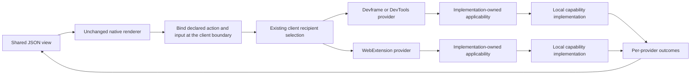

# Native renderer and portable action dispatch

Status: implemented for the maintained native WebExtension renderer in issue #12. `createActionCall` binds imported action declarations to the existing client router. The native renderer remains unchanged. The earlier renderer-handler versus per-button RPC decision is superseded.

## Implemented wiring

The WebExtension page owns native connections to extension, Devframe and DevTools providers and a portable client. Its JSON counter now binds the imported counter action directly; the background-only `probe:increase` handler has been removed. A second JSON control broadcasts a domain-bearing action, with outgoing selection owned by the client and applicability checked inside each provider's action implementation.

```text
JSON control -> native renderer -> declared action binding -> existing router -> selected providers
```

The call-only binding is exported from `@devkit/devframe/client`. Native state, metadata, built-ins and unrelated RPC remain native. One binding maps an imported action ID/version to either ordinary invocation or broadcast; no function is transmitted through JSON. Duplicate IDs and conflicting dispatch policies reject at setup. See the [implemented API](../../packages/devframe/README.md#bind-native-json-actions-to-the-portable-client).

The custom DOM renderer remains an independent replaceability example.

## Required interaction



The client fans a broadcast out to the connected providers admitted by its outgoing selection. Each recipient interprets the schema-defined domain/resource input inside its action or capability implementation. Core, the renderer and transport contain no domain matching logic. If both providers apply, both can act. The existing separate single-recipient invocation API retains its accepted behavior.

The dispatch itself already exists:

```ts
// Existing API. The JSON binding supplies these values from declarations and the view input.
const outcomes = await client.actions.broadcast({
  action: setFlag,
  selection: [{ realm: 'devserver' }, { realm: 'webext' }],
  input: { domain: 'app.example.test', key: 'feature', value: true },
});

// Ordinary capability implementation; not a framework-level filter protocol.
if (!ownedDomains.has(input.domain)) return { status: 'not-applicable' };
return applyFlag(input);
```

`setFlag` and its result schema are illustrative application declarations. A schema-defined `not-applicable` value is an ordinary fulfilled result. The SDK does not add an `accepts` hook, resource selector or special skip message. Existing contracts retain exact numeric versions, authenticated native connections and no rerouting/replay after dispatch.

## Implementation boundary

| Layer | Responsibility |
| --- | --- |
| Native renderer | Render the existing JSON model, execute its built-ins and issue action calls through the supplied context |
| Client integration | Bind known JSON action references to imported portable action declarations and their dispatch policy |
| Existing portable client | Select recipients, dispatch and collect per-provider results/errors |
| Provider action/service | Interpret business input, check applicability and operate on its own resources |
| Native backend | Authentication, RPC, serialization and its state lifecycle |

`createActionCall({ rpc, actions, bindings, signal? })` implements the generic binding. It preserves existing router and provider validation, action identity/version and per-provider outcomes. The application supplies ordinary action declarations and recipient policies, not per-button executable handlers.

The renderer's supplied call boundary can delegate known portable actions to that binding. Unrelated native calls retain their normal target and arguments. Keep the actual native shared-state instance and optional connection metadata; a static backend must retain its native noninteractive behavior. Native view loading and state subscriptions are not broadcast commands. This requires no fabricated full Devframe context, new transport or native renderer patch.

Each backend keeps its native state. The application can project per-provider command results into its JSON view, but broadcast does not merge independent stores or make one backend's counter represent every backend. Preserve both outgoing recipient selection and provider-owned applicability.

## Acceptance

- Trigger portable dispatch from rendered native JSON controls, rather than relying on the separate HTML controls.
- Use the same view/action declarations with actual Devframe, DevTools and WebExtension providers.
- Verify outgoing realm/provider filtering and different provider-local applicability results for the same input.
- Verify multiple matching providers, partial failures and no replay after disconnect or unmount.
- Keep native built-ins, ordinary RPC, metadata and shared state intact.
- Show per-provider outcomes without inventing a second state synchronization layer.
- Keep the custom renderer example optional and independent.

CDB interception configuration is not a prerequisite for this work. The [canonical two-layer routing contract](../../ARCHITECTURE.md#recipient-selection-and-request-applicability) remains authoritative. No native handler API or new upstream PR is required by this direction.

## Executed evidence and remaining scope

`pnpm --filter @devkit/example-webext test:json-actions` exercises the actual packaged Chromium extension, Devframe and DevTools hosts. The [receipt](../../examples/webext/evidence/json-actions.json) records recipient selection, multiple matching providers, provider-owned applicability, partial failures, unmatched selection, unmount and reconnect without replay. The [screenshot](../../examples/webext/evidence/json-actions.png) shows native rendering and the application-owned per-provider output. No native renderer or CDB patch is involved.

The existing Chromium and Firefox suites also passed after the counter button moved onto the binding, including actual popup/options/DevTools/sidebar actions. The new domain applicability matrix is currently Chromium-only. Full renderer catalog coverage, provider view discovery/composition and mixed-backend JSON HMR remain outside this slice. Independent backend stores are not merged. The reference renderer retains its last-error banner after a successful retry; its native `onError`/`onSuccess` callbacks do update the example's own status. That upstream presentation behavior is preserved and documented.
