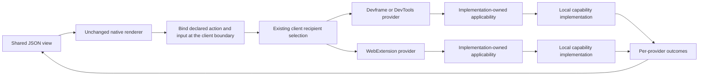

# Native renderer and portable action dispatch

Status: architectural direction clarified by the owner on 2026-09-29. Keep the native renderer unchanged. Connect its JSON actions to declared portable actions through the existing client routing integration. The earlier choice between adding renderer handlers and special per-button RPC branches is superseded. This is implementation work under [Renderer and surface contract](https://github.com/dvcol/devkit-extension/issues/12), not an unresolved renderer API decision.

## Current implementation and missing wiring

The WebExtension page already owns native connections to extension, Devframe and DevTools providers and an instance of the portable client. Its separate HTML controls exercise recipient selection and broadcast. Its JSON counter still calls `probe:increase`, whose example-owned handler invokes only the extension background provider.

```text
Current JSON control -> native renderer -> probe:increase -> background provider
Current HTML controls -> portable client router -> selected connected providers
```

The custom DOM renderer is a separate replaceability example. It does not change the default renderer or supply the missing portable action binding. The native reference renderer already exposes the necessary call boundary through its supplied context.

## Required interaction



The client fans a broadcast out to the connected providers admitted by its outgoing selection. Each recipient interprets the schema-defined domain/resource input inside its action or capability implementation. Core, the renderer and transport contain no domain matching logic. If both providers apply, both can act. The existing separate single-recipient invocation API retains its accepted behavior.

The dispatch itself already exists:

```ts
// Existing API. The JSON binding supplies these values from declarations and the view input.
const outcomes = await client.actions.broadcast({
  action: setFlag,
  selection: [{ realm: 'devserver' }, { realm: 'webext' }],
  input: { domain: 'app.example.test', key: 'feature', value: true },
});

// Ordinary capability implementation; not a framework-level filter protocol.
if (!ownedDomains.has(input.domain)) return { status: 'not-applicable' };
return applyFlag(input);
```

`setFlag` and its result schema are illustrative application declarations. A schema-defined `not-applicable` value is an ordinary fulfilled result. The SDK does not add an `accepts` hook, resource selector or special skip message. Existing contracts retain exact numeric versions, authenticated native connections and no rerouting/replay after dispatch.

## Implementation boundary

| Layer | Responsibility |
| --- | --- |
| Native renderer | Render the existing JSON model, execute its built-ins and issue action calls through the supplied context |
| Client integration | Bind known JSON action references to imported portable action declarations and their dispatch policy |
| Existing portable client | Select recipients, dispatch and collect per-provider results/errors |
| Provider action/service | Interpret business input, check applicability and operate on its own resources |
| Native backend | Authentication, RPC, serialization and its state lifecycle |

Implement a generic binding from the existing declarations, not a hand-written command handler for every button. Its exact helper signature is implementation work, not a new renderer contract. Preserve input validation, action identity/version and per-provider outcomes. Do not send executable handlers through JSON or native RPC.

The renderer's supplied call boundary can delegate known portable actions to that binding. Unrelated native calls retain their normal target and arguments. Keep the actual native shared-state instance and optional connection metadata; a static backend must retain its native noninteractive behavior. Native view loading and state subscriptions are not broadcast commands. This requires no fabricated full Devframe context, new transport or native renderer patch.

Each backend keeps its native state. The application can project per-provider command results into its JSON view, but broadcast does not merge independent stores or make one backend's counter represent every backend. Preserve both outgoing recipient selection and provider-owned applicability.

## Acceptance

- Trigger portable dispatch from rendered native JSON controls, rather than relying on the separate HTML controls.
- Use the same view/action declarations with actual Devframe, DevTools and WebExtension providers.
- Verify outgoing realm/provider filtering and different provider-local applicability results for the same input.
- Verify multiple matching providers, partial failures and no replay after disconnect or unmount.
- Keep native built-ins, ordinary RPC, metadata and shared state intact.
- Show per-provider outcomes without inventing a second state synchronization layer.
- Keep the custom renderer example optional and independent.

CDB interception configuration is not a prerequisite for this work. The [canonical two-layer routing contract](../../ARCHITECTURE.md#recipient-selection-and-request-applicability) remains authoritative. No native handler API or new upstream PR is required by this direction.
