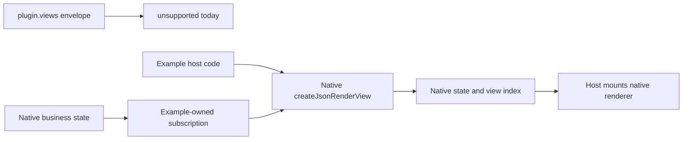
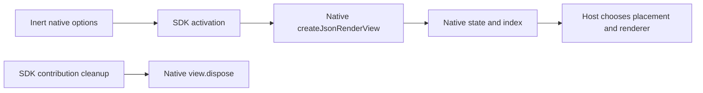
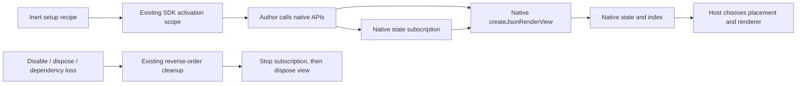

# Portable view declaration: owner review

[Renderer and surface contract](https://github.com/dvcol/devkit-extension/issues/12) owns this decision. Both declarations below are proposals, not implemented exports. Native view publication and rendering already work; this review concerns connecting their lifetime to `plugin.views`.

## Current behavior and missing behavior

`PluginInput.views` currently accepts only `{ kind, id, execution }`. The runtime reports these entries as `unsupported`. Examples instead call native `createJsonRenderView` directly, own its cleanup and discover published views through the native JSON index.

A useful portable view contribution must activate on installation, stop on disable/disposal or dependency loss, and activate afresh on enable. It must also support the existing example's live business-state subscription. Native publication, shared state, validation, rendering and transport already provide their behavior; the SDK needs contribution lifecycle ownership around those calls.



Native options are `{ id, spec, schema?, scope?, title? }`. The context needs `{ rpc: { sharedState } }` and must have stable object identity for native duplicate detection and index ownership. The handle already provides `value`, `update`, `patchState` and idempotent `dispose`. Disposal removes the native publication and its state. Neither option adds a view store, discovery protocol or renderer implementation.

## A. Declare native view options

```ts
// Proposal only.
const counterView = defineView({
  id: 'counter',
  execution,
  scope: 'example',
  title: 'Shared counter',
  spec: counterSpec(0),
});

const plugin = definePlugin({ id: 'example', views: [counterView] });
```



The adapter creates the view and registers its disposal. Authors supply JSON options and do not need to remember cleanup. The factory can reuse `CreateJsonRenderViewOptions` instead of copying vendor fields.

The limitation is live composition. The author receives neither the activation scope nor the created handle. The current server counter reads native business state, subscribes to updates, and calls `view.patchState`. That code would remain outside this declaration, or require an additional hook later. The core's emitted declaration would also need a resolvable native JSON type dependency if it directly exposes that options type. A type-only import does not remove that consumer dependency.

## B. Declare a native setup recipe

```ts
// Existing helper and native type; this descriptor is shared with the host.
const counterViewContext = defineNativeContext<JsonRenderViewContext>({
  id: 'example.counter-view-context',
});

// Proposal only: defineView and its setup support do not exist yet.
const counterView = defineView({
  id: 'counter',
  execution,
  async setup({ native, scope }) {
    const context = native.get(counterViewContext);
    if (context === undefined) throw new Error('Native view context unavailable');

    const state = await context.rpc.sharedState.get<{ value: number }>(counterStateKey);
    const view = createJsonRenderView(context, {
      id: 'counter',
      scope: 'example',
      title: 'Shared counter',
      spec: counterSpec(state.value().value),
    });
    scope.onDispose(view.dispose);
    scope.onDispose(
      state.on('updated', (value) => {
        view.patchState([{ op: 'replace', path: '/value', value: value.value }]);
      }),
    );
  },
});

const plugin = definePlugin({ id: 'example', views: [counterView] });
```



This uses the same `setup`, `native`, `scope` and optional typed `requires` pattern as services. Definitions remain inert; installation runs setup. Core/runtime can retain native-independent types while the author imports the native publisher. The adapter supplies the stable native context through the existing descriptor lookup. No new context container or binding language is needed.

The author must register `view.dispose` immediately after creation, before later code can fail. Otherwise an early throw can leak that native resource. Registered cleanup uses the existing reverse-order disposal, aggregate failure reporting and replacement barriers. This is the same resource-ownership responsibility as other setup recipes, not an automatic resource collector.

## Comparison and recommendation

| Concern                            | A: native options                             | B: native setup recipe                              |
| ---------------------------------- | --------------------------------------------- | --------------------------------------------------- |
| Simple static JSON view            | Short declaration                             | A few setup lines                                   |
| Existing live state subscription   | External owner or another hook needed         | Direct native subscription in the same scope        |
| Native handle ownership            | Adapter owns creation/disposal                | Author immediately registers cleanup                |
| Core native dependency             | Needed if native options appear in core types | No native dependency needed in core/runtime         |
| Missing context / creation failure | Existing activation failure                   | Existing activation failure                         |
| Cleanup failure                    | Existing cleanup barrier                      | Existing cleanup barrier for registered resources   |
| Dependencies                       | Requires lifecycle integration                | Reuses the same optional typed requirements pattern |
| Rendering and transport            | Native                                        | Native                                              |

Recommend **B** for the required live contribution behavior. It follows the existing service declaration pattern, moves current native code into its contribution lifetime, and avoids adding another binding API later. A is attractive when view declarations are intentionally limited to static publication, but that restriction does not cover the demonstrated counter synchronization.

The owner decision is whether `plugin.views` should accept native options only, or a setup recipe that can own live subscriptions. No choice is assumed here.

## Surface placement stays host-owned

Server `DevframeDocksHost.register()` returns an update handle and has no public unregister method. Client-local dock registration does have disposal. Automatically making a server dock follow a removable contribution would need missing native behavior; neither proposal silently deletes vendor maps or adds a local dock protocol.

Both proposals own native publication. Existing native-index consumers can remove their mounts when publication disappears. A server dock registered for host lifetime keeps that native lifetime; portable server-dock removal remains an explicit gap. The current counter example already documents this separation.

## Required proof after the decision

Implement the chosen declaration through public package exports. Run one contribution on an actual server and extension provider; verify initial publication, live updates, disable/removal, reenable with current state, dependency loss and cleanup failure. Keep renderer and browser-host differences explicit. Verify no duplicate mount or stale subscription can act on a replacement. Update glossary/architecture only after the owner settles the declaration.

Evidence inspected in this checkout: `packages/core/src/types.ts`, `packages/runtime/src/provider-activation.ts`, `packages/runtime/src/provider-reconciliation.ts`, `packages/runtime/src/scope.ts`, `examples/json-render/src/index.ts`, and the installed public `@devframes/json-render/view` and native dock declarations. The existing exact-version patches supply the `/view` export; this review does not claim unpatched consumer support.
