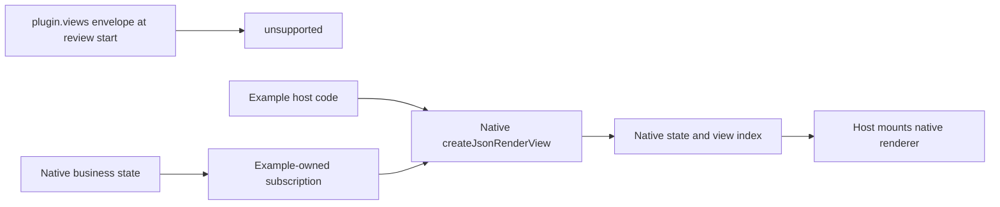
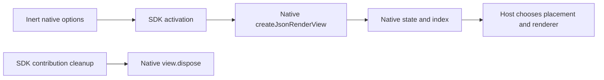
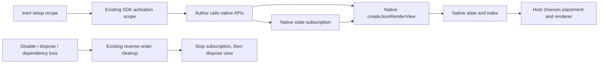

# Portable view declaration: accepted native setup recipe

[Renderer and surface contract](https://github.com/dvcol/devkit-extension/issues/12) owns this decision. The owner accepted **B, the native setup recipe, on 2026-10-02**. A remains an unchosen proposal, retained below with the review baseline and comparison. The accepted declaration is implemented and verified in the native server, Vite and extension examples; the remaining contract gaps are listed below.

The accepted contract is `defineView({ id, execution, requires?, setup })`, with `setup(context: SetupContext<Requirements>): Awaitable<void>` and `ViewDeclaration` entries in `plugin.views`. Core/runtime remain native-independent. The recipe calls native APIs and explicitly registers cleanup with the existing activation scope. Native published views, state, index discovery and renderer behavior retain their native contracts.

## Review baseline and missing behavior

At review start, `PluginInput.views` accepted only `{ kind, id, execution }`, and runtime reported these entries as `unsupported`. Examples instead called native `createJsonRenderView` directly, owned its cleanup and discovered published views through the native JSON index.

The shared example's `publishCounterView({ context, actionName? })`, used by the standalone JSON and Vite hosts, composed the native publisher and counter-state subscription with one disposal handle. This reduced duplication without activating `plugin.views`; the accepted recipe brings that native work into the contribution lifecycle.

A useful portable view contribution must activate on installation, stop on disable/disposal or dependency loss, and activate afresh on enable. It must also support the existing example's live business-state subscription. Native publication, shared state, validation, rendering and transport already provide their behavior; the SDK needs contribution lifecycle ownership around those calls.



Native options are `{ id, spec, schema?, scope?, title? }`. The context needs `{ rpc: { sharedState } }` and must have stable object identity for native duplicate detection and index ownership. The handle already provides `value`, `update`, `patchState` and idempotent `dispose`. Disposal removes the native publication and its state. Neither option adds a view store, discovery protocol or renderer implementation.

## A. Declare native view options, unchosen

```ts
// Unchosen proposal; not the accepted defineView contract.
const counterView = defineView({
  id: 'counter',
  execution,
  scope: 'example',
  title: 'Shared counter',
  spec: counterSpec({ value: 0 }),
});

const plugin = definePlugin({ id: 'example', views: [counterView] });
```



The adapter creates the view and registers its disposal. Authors supply JSON options and do not need to remember cleanup. The factory can reuse `CreateJsonRenderViewOptions` instead of copying vendor fields.

The limitation is live composition. The author receives neither the activation scope nor the created handle. The current server counter reads native business state, subscribes to updates, and calls `view.patchState`. That code would remain outside this declaration, or require an additional hook later. The core's emitted declaration would also need a resolvable native JSON type dependency if it directly exposes that options type. A type-only import does not remove that consumer dependency.

## B. Declare a native setup recipe, accepted 2026-10-02

```ts
// Existing helper and native type; this descriptor is shared with the host.
const counterViewContext = defineNativeContext<JsonRenderViewContext>({
  id: 'example.counter-view-context',
});

// Implemented contract; native publication and cleanup remain explicit.
const counterView = defineView({
  id: 'counter',
  execution,
  async setup({ native, scope }) {
    const context = native.get(counterViewContext);
    if (context === undefined) throw new Error('Native view context unavailable');

    const state = await context.rpc.sharedState.get<{ value: number }>(counterStateKey);
    const view = createJsonRenderView(context, {
      id: 'counter',
      scope: 'example',
      title: 'Shared counter',
      spec: counterSpec({ value: state.value().value }),
    });
    scope.onDispose(view.dispose);
    scope.onDispose(
      state.on('updated', (value) => {
        view.patchState([{ op: 'replace', path: '/value', value: value.value }]);
      }),
    );
  },
});

const plugin = definePlugin({ id: 'example', views: [counterView] });
```



This uses the same `setup`, `native`, `scope` and optional typed `requires` pattern as services. Definitions remain inert; installation runs setup. Core/runtime retain native-independent types while the author imports the native publisher. The host supplies the stable native context through the existing descriptor lookup, using the same context object for all publications on that native shared-state host. No new adapter API, context container, binding language or framework dependency is added.

The author must register `view.dispose` immediately after creation, before later code can fail. Otherwise an early throw can leak that native resource. Registered cleanup runs in reverse order, so the example unsubscribes before disposing its view. Setup failure runs registered cleanup and remains failed until explicit retry. If cleanup throws, every registered cleanup is still attempted, failures are aggregated, and the contribution remains cleanup-blocked. Cleanup that never settles also blocks a successor; enable, retry and replacement cannot bypass that barrier.

Declared capability loss stops the view contribution before its dependency is released. Restoration or reenable activates a fresh recipe after successful cleanup. Referencing an action in the native JSON spec does not make that action an implicit activation requirement. The published view's state belongs to its native handle; separate host-owned business state survives contribution replacement according to its native lifetime.

## Review comparison and accepted decision

| Concern                            | A: native options                             | B: native setup recipe                              |
| ---------------------------------- | --------------------------------------------- | --------------------------------------------------- |
| Simple static JSON view            | Short declaration                             | A few setup lines                                   |
| Existing live state subscription   | External owner or another hook needed         | Direct native subscription in the same scope        |
| Native handle ownership            | Adapter owns creation/disposal                | Author immediately registers cleanup                |
| Core native dependency             | Needed if native options appear in core types | No native dependency needed in core/runtime         |
| Missing context / creation failure | Existing activation failure                   | Existing activation failure                         |
| Cleanup failure                    | Existing cleanup barrier                      | Existing cleanup barrier for registered resources   |
| Dependencies                       | Requires lifecycle integration                | Reuses the same optional typed requirements pattern |
| Rendering and transport            | Native                                        | Native                                              |

The owner accepted **B** for the required live contribution behavior. It follows the existing service declaration pattern, moves current native code into its contribution lifetime, and avoids adding another binding API later. A remains unchosen because options alone do not cover the demonstrated counter synchronization.

The accepted declaration adds contribution ownership around native calls. It adds no JSON schema, metadata catalog, state protocol or renderer implementation.

## Surface placement stays host-owned

Server `DevframeDocksHost.register()` returns an update handle and has no public unregister method. Client-local dock registration does have disposal. Automatically making a server dock follow a removable contribution would need missing native behavior; the accepted recipe does not delete vendor maps or add a local dock protocol.

The recipe owns native publication; the host owns renderer mounting and surface/dock placement. Existing native-index consumers can remove their mounts when publication disappears. A server dock registered for host lifetime keeps that native lifetime; portable server-dock removal remains an explicit gap. The current counter example already documents this separation.

## Implementation and proof

The accepted declaration is implemented in core/runtime and consumed by one browser-safe counter recipe in `examples/json-render/src/view.ts`. Both native server factories, Vite development/preview hosts and the Chromium/Firefox extension providers install that recipe. Host-owned business state survives view disable and dependency loss. Surfaces use the native index to remove mounts and native client caches; republishing reads current data.

Core/runtime checks cover declaration typing, inert setup, dependency teardown, setup failure, explicit cleanup and replacement barriers. Genuine server tests cover native publication/state ownership. The maintained server and extension browser suites verify removal, reenabling and detached action cleanup. Both Vite hosts also pass development, built preview and watched-build checks. In-app checks confirm actions, renderer replacement, remounting and host shutdown.

The shared recipe does not settle all surface placement, script/transform, renderer-module HMR or native-cache edge cases. Exact test and browser receipts belong to the renderer ticket and the executable API inventory; a passing slice is not complete framework conformance.

Evidence inspected in this checkout: `packages/core/src/types.ts`, `packages/runtime/src/provider-activation.ts`, `packages/runtime/src/provider-reconciliation.ts`, `packages/runtime/src/scope.ts`, `examples/json-render/src/index.ts`, and the installed public `@devframes/json-render/view` and native dock declarations. The existing exact-version patches supply the `/view` export; this review does not claim unpatched consumer support.
