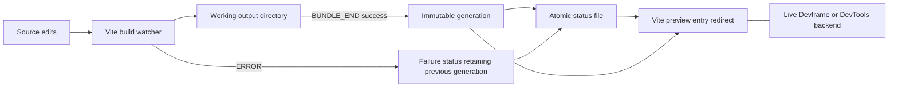

# Live preview and reload implementation

Working deliverable for [Live preview and reload contract](https://github.com/dvcol/devkit-extension/issues/13). Normal compilation, watching and host restarts remain owned by Vite and the native Devframe/DevTools integrations.

## Implemented watched-production slice

The maintained [Vite-host example](../../examples/vite-hosts/README.md) provides independent `build:watch` and `preview` scripts plus the accepted concurrent pnpm-regex `dev:production` command. Both preview backends keep their live provider on the preview HTTP server.

The publication layer uses native build events; it does not restart the server, patch Vite, monitor backend health or replay calls. It snapshots after Vite reports bundle completion, so a `writeBundle` hook cannot publish a half-finished candidate through this layer. The status file changes only after the generation directory is complete. Relative asset URLs remain scoped to that generation.

Before the first success, entry requests return 503 and status is starting/building/failed as applicable. After a successful generation, failed builds keep serving it. Recovery publishes a fresh generation. Status and native backend routes remain available throughout. The native counter state and provider incarnation remain unchanged by asset rebuilds; this is not state restoration across a backend restart.

## Evidence and remaining gates

Real-host tests perform actual source edits and inject real syntax, `generateBundle` and `writeBundle` failures. They check HTML/JavaScript retention, successful recovery, old asset URLs, independent backend actions, provider identity, watcher restart, duplicate publishers, idempotent close and process-listener cleanup in both native hosts. A separate child-process test verifies exit-time lock release. The example README records the exact combined-command check and limits.

Automatic browser reload, JSON renderer replacement/failure display, portable remote invocation, background/content-script reload, navigation invalidation and declared retained-state recovery remain open. Unsupported or untested host/mode cells must remain explicit. The example does not settle callback selection or broadcast semantics in the separate routing contract.

The upstream cleanup proposal remains [Vite draft 23574](https://github.com/vitejs/vite/pull/23574). No Vite workspace patch is adopted; the owner will take over the draft.
