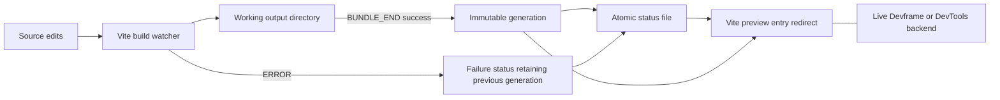

# Live preview and reload implementation

Working deliverable for [Live preview and reload contract](https://github.com/dvcol/devkit-extension/issues/13). Normal compilation, watching and host restarts remain owned by Vite and the native Devframe/DevTools integrations.

## Implemented watched-production slice

The maintained [Vite-host example](../../examples/vite-hosts/README.md) provides independent `build:watch` and `preview` scripts plus the accepted concurrent pnpm-regex `dev:production` command. Both preview backends keep their live provider on the preview HTTP server.

```mermaid
flowchart LR
  Source[Source edits] --> Watch[Vite build watcher]
  Watch --> Staging[Working output directory]
  Staging -->|BUNDLE_END success| Generation[Immutable generation]
  Generation --> Status[Atomic status file]
  Watch -->|ERROR| Failure[Failure status retaining previous generation]
  Failure --> Status
  Status --> Preview[Vite preview entry redirect]
  Generation --> Preview
  Preview --- Backend[Live Devframe or DevTools backend]
```

The publication layer uses native build events; it does not restart the server, patch Vite, monitor backend health or replay calls. It snapshots after Vite reports bundle completion, so a `writeBundle` hook cannot publish a half-finished candidate through this layer. The status file changes only after the generation directory is complete. Relative asset URLs remain scoped to that generation.

Before the first success, entry requests return 503 and status is starting/building/failed as applicable. After a successful generation, failed builds keep serving it. Recovery publishes a fresh generation. Status and native backend routes remain available throughout. The native counter state and provider incarnation remain unchanged by asset rebuilds; this is not state restoration across a backend restart.

## Evidence and remaining gates

Real-host tests perform actual source edits and inject real syntax, `generateBundle` and `writeBundle` failures. They check HTML/JavaScript retention, successful recovery, old asset URLs, independent backend actions, provider identity, watcher restart, duplicate publishers, idempotent close and process-listener cleanup in both native hosts. A separate child-process test verifies exit-time lock release. The example README records the exact combined-command check and limits.

Automatic browser reload, JSON renderer replacement/failure display, portable remote invocation, background/content-script reload, navigation invalidation and declared retained-state recovery remain open. Unsupported or untested host/mode cells must remain explicit. The example does not settle callback selection or broadcast semantics in the separate routing contract.

The upstream cleanup proposal remains [Vite draft 23574](https://github.com/vitejs/vite/pull/23574). No Vite workspace patch is adopted; the owner will take over the draft.

### Restart cleanup refactor, September 27

[Vite draft commit 60b99b3](https://github.com/vitejs/vite/commit/60b99b30b4a3488c2da360ee1b05b2e517e9b848) extracts `closeUnusedReplacementServer()` beside `restartServer()` so its failure path has no nested try/catch. The helper closes the abandoned candidate and retains both errors if cleanup also rejects; the caller rethrows the original restart error after successful cleanup. This corrects a native Vite resource leak and introduces no SDK-specific behavior or API.

All 26 lifecycle-hook tests, affected-package build/type checks, changed-file lint and formatting pass. The PR remains a draft. Vite stays unpatched in this workspace.

## Maintained extension development

The [extension example](../../examples/webext/README.md#native-development-commands) delegates development to WXT and Vite with the existing exact-version compatibility patches. Both maintained browser suites exercise real module HMR, HTML reload, background reload, configuration restart and native shutdown in disposable profiles. Background reload resets the example's ephemeral state; configuration restart replaces the actual browser. Neither path restores state or replays work through an SDK controller.

Actual toolbar popup module replacement and HTML reload are verified in both browsers as well. During module replacement the same native document/provider survives, a new Port caller replaces the old one, current native state is retained and one JSON action produces one update. Chromium additionally verifies retained local form input and that an old pending action completes without overwriting the replacement UI. HTML reload keeps the popup open with a fresh document/caller and the same provider/state, followed by one JSON action effect observed by options. Chromium verifies local form reset. The receipts and native automation boundaries are recorded in the example.

The actual DevTools panel and browser sidebar also pass module HMR and HTML reload in both maintained browsers. Their provider/state remain native; module updates keep the document with a new caller, and HTML reloads create a new document/caller. Each post-update JSON action reaches the options peer once. The Chromium tests additionally cover retained/reset local forms.

This exposed WXT reloading unchanged sibling HTML, which removes Firefox's DevTools tab when the registration page reloads. The [HTML reload correction](../research/wxt-html-reload.md) compares emitted output before/after rebuild and keeps native reload behavior for changed or unreadable output. It introduces no SDK recovery. The retained failure/isolation receipts and real-build transform/missing-output regression define its removal gate.

Popup/DevTools/sidebar background/config transitions, direct DevTools registration changes, content/page updates, rapid edits and watched-production extension behavior remain open. Cross-provider JSON action routing still needs the separate [renderer seam decision](./012-json-routing-seam.md).
