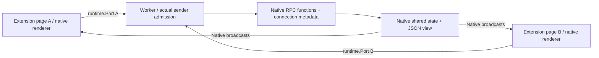
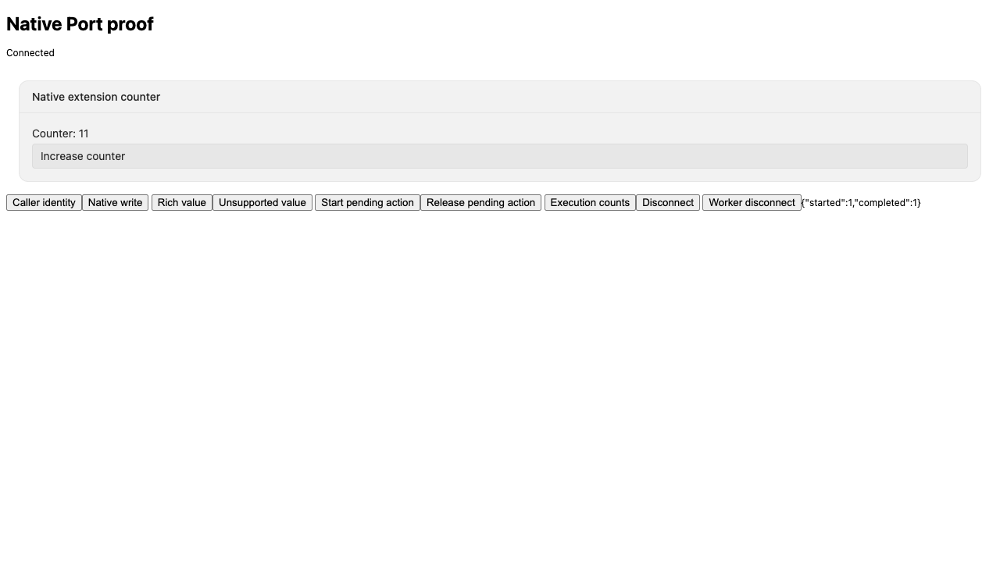

# Native extension Port integration proof

Local proof for [routing #7](https://github.com/dvcol/devkit-extension/issues/7) and [renderer #12](https://github.com/dvcol/devkit-extension/issues/12), following the owner's accepted native integration direction. It uses candidate public Devframe exports, built from the separate upstream prototype based on `9aa752a1` / v1.1.0. The SDK's maintained packages still use v1.0.0 and have no dependency on this unapproved prototype.

The extension contains a module service worker and two instances of one packaged page. Both pages mount the existing JSON renderer. The worker publishes its view through native shared state. Application action handlers, state synchronization, subscription identity and serialization all use Devframe/birpc. `channel.ts` only connects native channel hooks to `runtime.Port`.



## Review commits

- [RPC/state, issue #7](https://github.com/dvcolomban/devframe/commit/fe0fb623da5032b512cedf4956a215cff7a7f594).
- [JSON renderer/view, issue #12](https://github.com/dvcolomban/devframe/commit/5677ecd69e7b1a758233173846aead05b0654023).

The branch is pushed to the existing personal fork. Opening a new upstream draft PR awaits owner approval. Scoped upstream lint, four-package type checks, 43 focused tests and the browser artifact checks pass. The checked-in proof also passes strict SDK Oxlint and TypeScript 7 checks, with `skipLibCheck` disabled.

## Run against the prototype

Build the changed `devframe`, `@devframes/hub`, `@devframes/json-render` and reference renderer outputs in the upstream checkout first. The browser proof imports their package exports without source aliases, private imports or fabricated Node/hub contexts.

```sh
pnpm with current --dir docs/probes/native-port install --ignore-workspace --ignore-scripts
node docs/probes/native-port/prepare.mjs /path/to/built/devframe-prototype
cd docs/probes/native-port
node node_modules/typescript/lib/tsc.js --noEmit
node build.mjs
node check.mjs
```

`prepare.mjs` links already installed upstream tools and built packages into this isolated probe. TypeScript comes from the SDK's TS7 installation. Native declarations currently also reference Node types; these are compile-time dependencies, and the Vite browser build contains no Node runtime. `check.mjs` uses the installed Playwright Chromium with a disposable profile, closes it afterward and removes the profile. The in-app browser cannot load unpacked extensions.

Alternatively, load `dist` unpacked in Chromium and open its options page twice. The extension requests no host permissions and admits only the exact packaged `panel.html` URL and its own extension ID. `denied.html` exercises a rejected sender. No content/page bridge is admitted by this fixture.

## Confirmed live behavior

[The recorded run](./receipt.json) used Chromium 153.0.8010.12 and completed with zero page errors:

- A native renderer action updated both pages from 0 to 1.
- Concurrent identity calls retained distinct actual Port session IDs across an asynchronous handler.
- A native state write from a page updated both views to 10.
- A `Map` containing `BigInt` survived Chrome's JSON transport using native structured-clone records. A function-bearing payload rejected.
- Closing a page connection rejected its pending call and unmounted its renderer. The worker completed the entered action once after the other page released it.
- Reopening the page observed the worker's retained value. Its action was not replayed, and both pages could advance to 11.
- Denied sender admission rejected mounting and removed the renderer's partial DOM. A worker-initiated disconnect closed only its own peer.

The service worker registers listeners synchronously. Its native initial states are supplied as existing `SharedState` instances, so startup needs no top-level await.



## Scope and outstanding work

This is a native integration proof, not a published WebExtension provider. It does not claim the portable provider catalog/router integration, browser toolbar popup lifecycle, DevTools/side-panel surfaces, content/page bridge, debugger, worker suspension recovery, Firefox conformance or extension HMR. The prototype deliberately keeps native state ownership and write semantics. Worker termination can reset in-memory state; persistence remains contribution/host-owned.

The native diff exposes the shared-state factories, browser renderer and view publication dependencies. It also fixes initial snapshot rejection propagation and partial renderer cleanup when mounting fails. Existing renderer declarations retain the full hub context by default; only the reference renderer opts into the smaller RPC context. No new upstream PR or downstream dependency patch is authorized by this evidence alone.

References: [Chrome Port messaging and serialization](https://developer.chrome.com/docs/extensions/develop/concepts/messaging), [Playwright extension testing](https://playwright.dev/docs/chrome-extensions).
