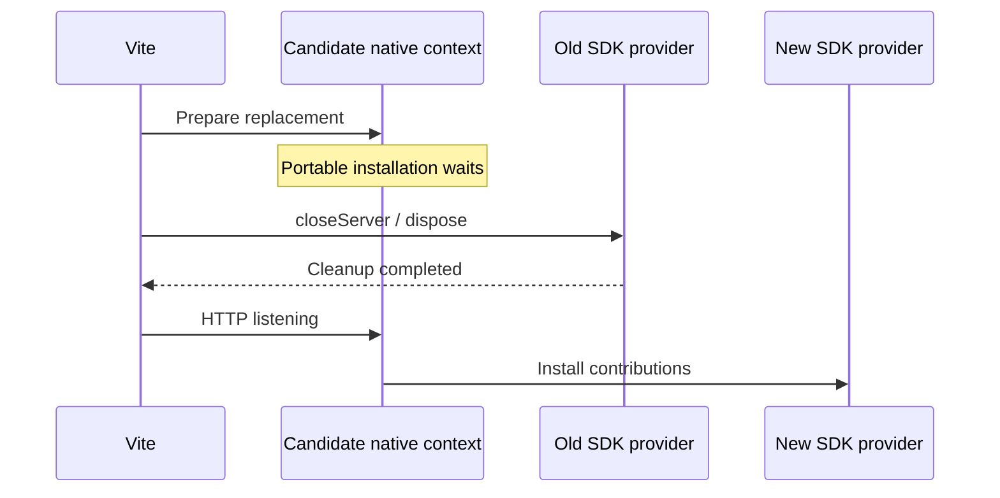
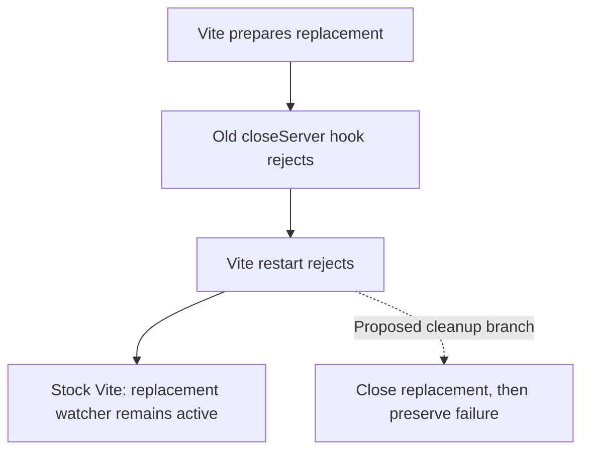

# Vite failed-restart candidate ownership

Executed 2026-09-24 against Vite 8.3.0, Node 26.9.0 and the actual Devframe/DevTools integrations in `examples/vite-hosts`, at repository commit `82a126535105ee96f289aee1db07746b9fcd1ee3`. This is issue 13 evidence, not an adopted dependency patch.

| Probe | Devframe and DevTools result |
| --- | --- |
| Released Vite, old contribution cleanup throws | Restart rejects; old server no longer listens; prepared candidate never listens but retains a live file watcher and pending provider readiness |
| Actual file write after that rejection | Candidate watcher observes the change, establishing a retained active resource rather than an unreachable object alone |
| Narrow candidate-cleanup patch | Candidate is closed before restart rejects; watched directories become zero and readiness rejects; old error remains the rejection |
| Candidate cleanup also throws | Both errors are retained in an AggregateError; candidate watcher still closes |

`failed-restart.mjs`, `patched-restart.mjs` and `double-failure-restart.mjs` are the exact executed programs; adjacent result files contain their outputs. Every run completed with exit 0. `source-hashes.json` records original/patched Vite Node chunk hashes; `SHA256SUMS.json` covers the retained evidence files. All scripts pass `node --check`.

The package source prepares `newServer`, awaits `server._closeServer('restart')`, and then replaces the public server object. It has no candidate-cleanup branch when the old shutdown rejects. The proposed patch catches that rejection, awaits `newServer.close()` and preserves the error. It aggregates both failures if candidate close also rejects. No process supervisor or replay is introduced.

An isolated SDK plugin hook cannot perform equivalent cleanup: the candidate receives no restart-failure notification, and the old plugin receives no candidate reference. Coordinating plugin generations or wrapping Vite restart would introduce additional lifecycle ownership instead of fixing the owner of the abandoned candidate.

The patch was applied only to a disposable copy at `/private/tmp/devkit-host-constraints-20260924/patched/node_modules/vite`. The workspace dependency and pnpm patch configuration remain unchanged. The owner must choose whether to carry this exact-version runtime patch while seeking upstream adoption or retain the documented unsupported failure path until upstream fixes it. No upstream PR has been opened.

These scripts preserve absolute checkout/import paths and the original disposable-package path as execution evidence. To repeat in another checkout, adapt those paths, create a separate copy of the locked Vite package with its dependencies available, apply the retained patch to that copy, and run the three programs with permission for temporary loopback listeners. Do not patch the shared pnpm store. Probe-only global references capture candidate servers for observation and final cleanup; they are not proposed SDK architecture.

Scope: a successfully prepared replacement followed by old-provider cleanup rejection. Candidate construction failure, replacement listen failure, hanging cleanup, preview and browser HMR require separate evidence. Closing the candidate does not recover or restart the old failed provider.

## Relationship to ordinary Vite development

The patch is not required for ordinary HMR or build watching. The maintained example delegates file watching, module transforms, HMR and config restarts to Vite. Its private `ProviderLifetime` captures the native context, waits for HTTP listening to activate portable contributions, and returns an awaited provider-disposal promise from `closeServer`. It creates no watcher, HMR graph or restart loop.

That activation boundary enforces the accepted cleanup-before-replacement contract. A contribution may own native command registrations, subscriptions and external resources that Vite cannot dispose by itself. Vite prepares a replacement context before closing the previous server; installing contributions eagerly would overlap those owners. Frontend-only invalidation preserves the existing provider and its state.

The portable runtime propagates a disposer exception because cleanup failure blocks replacement. This behavior is independent of the strict/warn admission option. A rejected Vite `closeServer` hook then exposes the candidate leak; any plugin rejecting the same hook can expose it. The probe intentionally injected failure and does not claim ordinary HMR fails.

Stock Vite can remain in use while ordinary development and preview implementation continue. The unsupported exceptional path must remain visible: a failed restart can retain candidate resources until process exit. The proposed fix changes candidate cleanup only; it neither recovers the old provider nor retries the restart. It is a failure-conformance decision, not a blocker for the whole roadmap. No owner patch-adoption decision has been made.

The maintained Vite example currently has no production `build:watch`, `preview` or `dev:production` scripts. Its build produces the example library. The separate preview feasibility probe does not establish watched production output, last-complete-build serving or browser refresh; those remain distinct implementation work.
