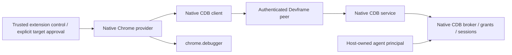

# Native CDB over an existing Devframe peer

The released CDB 0.3.0 APIs already supply an extension-to-server composition. A new SDK debugger transport or authentication layer is unnecessary. This investigation advances [Debugger and CDB contract](https://github.com/dvcol/devkit-extension/issues/10); it does not establish authenticated browser execution yet.

## Public composition

| Public entry                     | Existing responsibility                                                                                                                                                 |
| -------------------------------- | ----------------------------------------------------------------------------------------------------------------------------------------------------------------------- |
| `@dvcol/cdb-devframe`            | `createCdbService` installs the native service; `getCdbService` retrieves it from the host context                                                                      |
| `@dvcol/cdb-devframe/client`     | `createCdbClient` uses an existing native peer; `connectProvider` establishes native provider pairing and its channel                                                   |
| `@dvcol/cdb-extension/chrome`    | `createChromeProvider` owns browser target publication, approval and recovery; `getChromeProviderIdentity` supplies installation identity                               |
| `@dvcol/cdb-extension`           | `createIndexedDbPairingStore` retains native provider pairing                                                                                                           |
| `@dvcol/cdb-devframe/connection` | `createCdbConnection` manages an agent principal's readiness, watches and cancellation across supplied peers; same-peer reattachment currently fails as described below |



The service obtains the actual current Devframe RPC session. It requires native trust and matches the connected peer's RPC identity. Optional `authorizePeer` adds host policy after that check. Provider pairing and challenge verification are native CDB behavior, separate from Devframe transport trust. Native CDB also owns operation IDs, cancellation and peer-disconnect cleanup. None requires another mandatory SDK authorization callback or protocol.

Use the browser client entry in the extension worker. The root CDB Devframe entry includes the Node service and panel, so it is not the worker import. The host forwards the existing native peer connect/disconnect callbacks and owns transport shutdown.

## Exact released baseline

`@dvcol/cdb-devframe@0.3.0` declares **ordinary dependencies**, not peers, on exact `devframe`, `@devframes/hub`, `@devframes/json-render` and `@devframes/json-render-ui` versions `1.0.0`. Its CDB dependencies use `^0.3.0`. The maintained workspace already uses the corresponding 1.0 graph with its documented patches. Matching versions alone is not a typecheck, bundle or authentication proof. [Official release record](https://registry.npmjs.org/@dvcol%2fcdb-devframe/0.3.0).

The release archive's verified integrity is `sha512-yUbqt4fUcIisomKjxktJLnvSIi8DHwThl+uJrg7WFzX4H24EMBu8M7JC34WlhjXvJm6wbM8lKWVcoAihRVdW4g==`. Released service, client, connection and wire source-map entries match the inspected readable local CDB files byte for byte. [Manifest, metadata and source hashes](../probes/cdb-devframe-reconnect/README.md). This establishes those source files' equivalence, not a whole-checkout release identity. No new dependency was installed in this repository for the investigation.

## Reproduced same-peer registration failure

The retained probe imports the real public `RpcFunctionsCollectorBase` and `createScopedClientContext` from the installed patched Devframe 1.0.0. Its peer fixture rejects every transport call. It imports the released CDB 0.3.0 client and connection, then measures this sequence:

```ts
const connection = createCdbConnection();
connection.attach(peer); // Native client event registrations succeed.
connection.disconnected();
connection.attach(peer); // DF0021: cdb:broker:state-changed is already registered.
```

| Control                                                      | Result                                                                                |
| ------------------------------------------------------------ | ------------------------------------------------------------------------------------- |
| First attachment                                             | Connected; three CDB handlers and ordinary fixture echo registered                    |
| Disconnect and attach the same peer                          | Native duplicate-registration error; handle remains disconnected                      |
| Disconnect and attach a distinct peer                        | Connected; existing registrations preserved                                           |
| Retain `createCdbClient(peer)` and call its `disconnected()` | Repeated factory call returns the same memoized client without duplicate registration |
| Transport calls or closure                                   | None; all would fail the fixture                                                      |

The connection handle disposes its previous CDB client on disconnect. That removes the client from its WeakMap, but the three event handlers remain in Devframe's collector. Recreating the client then attempts duplicate registrations. The corresponding upstream same-peer unit test registers through `Map.set`, which masks native duplicate rejection. The parent independently replayed the public-import probe on Node 26.9.0. [Exact receipt and source](../probes/cdb-devframe-reconnect/README.md).

This is a registration-boundary proof, not socket reconnection, browser or authentication evidence. It does not justify forced registration or a new SDK cache. No reconnect patch or new upstream PR was created. The fresh-peer and direct-client controls have different lifetimes; they do not establish the higher-level handle's same-peer guarantee.

## Next acceptance proof

Start one native Devframe host with `createCdbService()` and default authentication enabled. Admit only the owned extension origin, forward native peer callbacks, and expose one ordinary echo method. Connect the extension through existing isolated native connection setup and complete native trust.

Compose `createCdbClient(peer)` with `createChromeProvider`, native installation identity and pairing storage. An extension-owned control page explicitly approves only the owned fixture target. Drive a public broker operation as an explicit host-owned agent principal. Check a real browser result, revocation/cancellation and ordinary RPC before and after CDB teardown. No renderer or MCP host is needed to establish this path.

The existing CDB browser test disables native authentication, so it cannot supply this missing evidence. The first provider proof follows CDB's existing direct-client example and does not need the defective connection handle. Same-peer recovery, persistent credential policy, remote agent clients, MV3 restart and renderer integration retain separate acceptance obligations.
