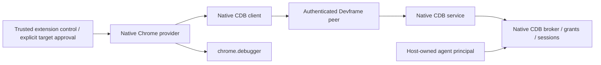

# Native CDB over an existing Devframe peer

The released CDB 0.3.0 APIs already supply an extension-to-server composition. A new SDK debugger transport or authentication layer is unnecessary. This investigation advances [Debugger and CDB contract](https://github.com/dvcol/devkit-extension/issues/10). The follow-on [maintained native browser check](../../examples/debugger/README.md#authenticated-native-devframe-composition) now proves this direct composition with authentication enabled.

## Public composition

| Public entry                     | Existing responsibility                                                                                                                                                 |
| -------------------------------- | ----------------------------------------------------------------------------------------------------------------------------------------------------------------------- |
| `@dvcol/cdb-devframe`            | `createCdbService` installs the native service; `getCdbService` retrieves it from the host context                                                                      |
| `@dvcol/cdb-devframe/client`     | `createCdbClient` uses an existing native peer; `connectProvider` establishes native provider pairing and its channel                                                   |
| `@dvcol/cdb-extension/chrome`    | `createChromeProvider` owns browser target publication, approval and recovery; `getChromeProviderIdentity` supplies installation identity                               |
| `@dvcol/cdb-extension`           | `createIndexedDbPairingStore` retains native provider pairing                                                                                                           |
| `@dvcol/cdb-devframe/connection` | `createCdbConnection` manages an agent principal's readiness, watches and cancellation across supplied peers; same-peer reattachment currently fails as described below |



The service obtains the actual current Devframe RPC session. It requires native trust and matches the connected peer's RPC identity. Optional `authorizePeer` adds host policy after that check. Provider pairing and challenge verification are native CDB behavior, separate from Devframe transport trust. Native CDB also owns operation IDs, cancellation and peer-disconnect cleanup. None requires another mandatory SDK authorization callback or protocol.

Use the browser client entry in the extension worker. The root CDB Devframe entry includes the Node service and panel, so it is not the worker import. The host forwards the existing native peer connect/disconnect callbacks and owns transport shutdown.

## Exact released baseline

`@dvcol/cdb-devframe@0.3.0` declares **ordinary dependencies**, not peers, on exact `devframe`, `@devframes/hub`, `@devframes/json-render` and `@devframes/json-render-ui` versions `1.0.0`. Its CDB dependencies use `^0.3.0`. The maintained workspace already uses the corresponding 1.0 graph with its documented patches. Matching versions alone is not a typecheck, bundle or authentication proof. [Official release record](https://registry.npmjs.org/@dvcol%2fcdb-devframe/0.3.0).

The release archive's verified integrity is `sha512-yUbqt4fUcIisomKjxktJLnvSIi8DHwThl+uJrg7WFzX4H24EMBu8M7JC34WlhjXvJm6wbM8lKWVcoAihRVdW4g==`. Released service, client, connection and wire source-map entries match the inspected readable local CDB files byte for byte. [Manifest, metadata and source hashes](../probes/cdb-devframe-reconnect/README.md). This establishes those source files' equivalence, not a whole-checkout release identity. No new dependency was installed in this repository for the investigation.

## Reproduced same-peer registration failure

The retained probe imports the real public `RpcFunctionsCollectorBase` and `createScopedClientContext` from the installed patched Devframe 1.0.0. Its peer fixture rejects every transport call. It imports the released CDB 0.3.0 client and connection, then measures this sequence:

```ts
const connection = createCdbConnection();
connection.attach(peer); // Native client event registrations succeed.
connection.disconnected();
connection.attach(peer); // DF0021: cdb:broker:state-changed is already registered.
```

| Control                                                      | Result                                                                                |
| ------------------------------------------------------------ | ------------------------------------------------------------------------------------- |
| First attachment                                             | Connected; three CDB handlers and ordinary fixture echo registered                    |
| Disconnect and attach the same peer                          | Native duplicate-registration error; handle remains disconnected                      |
| Disconnect and attach a distinct peer                        | Connected; existing registrations preserved                                           |
| Retain `createCdbClient(peer)` and call its `disconnected()` | Repeated factory call returns the same memoized client without duplicate registration |
| Transport calls or closure                                   | None; all would fail the fixture                                                      |

The connection handle disposes its previous CDB client on disconnect. That removes the client from its WeakMap, but the three event handlers remain in Devframe's collector. Recreating the client then attempts duplicate registrations. The corresponding upstream same-peer unit test registers through `Map.set`, which masks native duplicate rejection. The parent independently replayed the public-import probe on Node 26.9.0. [Exact receipt and source](../probes/cdb-devframe-reconnect/README.md).

This is a registration-boundary proof, not socket reconnection, browser or authentication evidence. It does not justify forced registration or a new SDK cache. No reconnect patch or new upstream PR was created. The fresh-peer and direct-client controls have different lifetimes; they do not establish the higher-level handle's same-peer guarantee.

## Maintained authenticated acceptance

The maintained `pnpm --filter @devkit/example-debugger test:devframe` command starts one native host with `createCdbService()` and default authentication enabled. It admits the owned extension origin, forwards native peer callbacks, and exposes an ordinary echo method. The actual Chromium extension uses isolated native connection setup. Missing credentials and an invalid code fail; the actual temporary native code establishes trust, confirmed from the server RPC session.

`createCdbClient(peer)` composes directly with `createChromeProvider`, native installation identity and pairing storage. Pairing alone creates no target grant. An extension-owned control page explicitly approves the fixture tab, and the host-owned agent's native `browser.evaluate` changes its actual DOM. The shared portable title action also runs through the native broker with its original ID/generation contract. A separate authenticated extension page calls the exposed action using its own actual native session. It cannot borrow the host agent's grant; its own approval enables the call and creates a distinct principal-bound grant for the same target. Its lease is released, mismatched generations reject and contribution disposal retains native ownership. Provider disposal relinquishes this extension's debugger attachment. Ordinary authenticated RPC survives CDB client disposal, and actual peer disconnect leaves no scopes or leases. The nine-step receipt reports zero observed browser errors. [Typed source, command and receipt](../../examples/debugger/README.md#authenticated-native-devframe-composition).

This follows CDB's existing direct-client example and does not need the defective connection handle. No new dependency patch is needed. The example adds exact `@dvcol/cdb-devframe@0.3.0` to its manifest and passes strict TypeScript with `skipLibCheck: false`; browser-only imports are checked during the Vite build. The caller-aware title implementation uses public `browser.acquire`, `browser.raw_cdp` and `browser.release`, with CDB's public Standard Schema validators. It does not map pinned identity to the semantic tool's latest target reference. Same-peer recovery, persistent credential policy, broader worker restart behavior and renderer integration retain separate acceptance obligations. Automatic confirmation of the single fixture broker is not a product credential policy.

## Caller-aware portable contribution

The maintained example uses the public generic `createRpcProvider` for its bare `DevframeNodeContext`; it does not fabricate a hub or widen the server adapter. The service reads the current RPC session once per invocation. `getCdbService(context).invoke(session, { operationId, name, arguments })` checks the trusted, currently registered peer and resolves that peer's existing CDB logical session and grants. The portable runtime preserves the native async call context. No SDK principal mapping, cache, authorization hook or new patch is required.

The live test has two native peers, a background browser provider and an extension-page caller. An authenticated caller without its own grant receives native `CAPABILITY_DENIED` even when the host agent has approved the target. A separate approval yields two native principals and grants for one unchanged native target. The actual title action then succeeds, releases its lease and rejects stale generation through native `TARGET_GENERATION_STALE`. Missing current session also rejects instead of falling back to the host principal. Host diagnostics check the native causes; the test does not depend on exporting native error prototypes across RPC.

Settled service disable/enable and provider disposal retain native grants, target ownership and ordinary RPC. The maintained live test also holds the actual title evaluation on an owned HTTP response, disables its contribution and verifies that disable waits, native Chrome finishes, the late result is cancelled and the lease is released. It adds no mocked command or production testing hook. Core cancellation is cooperative and waits for owned work; the native service method has no external signal parameter. Actual peer disconnect invokes native CDB cancellation and lease teardown. A saved session cannot authorize a later release after disconnect, and the recipe does not borrow another principal to force it. This follows the settled lifecycle contract rather than introducing stronger cancellation or another wire method.

The maintained [pending authority checks](../../examples/debugger/README.md#caller-authority-changes-during-native-execution) also cover actual caller disconnect and grant revocation while Chrome is pending. CDB removes the caller lease before Chrome finishes; the recipe's final release then reports native `ACCESS_DENIED` for a disconnected session or `CAPABILITY_DENIED` for a revoked grant. Disconnect retains the logical-session grant for native resume, while explicit grant revocation removes it. Other principals keep the same target and successful action access. The test explicitly revokes each scenario's scope to restore baseline grants/scopes, releases the held response and observes actual Chrome completion. This proves native authority cleanup, not interruption of an already-dispatched browser evaluation or same-peer reconnect support.

The subsequent [real worker-restoration regression](./cdb-worker-recovery.md) force-stops the browser provider, explicitly authenticates its replacement and restores the same native scope and target at the next generation. It uses a narrow exact-version Chrome provider patch for a surviving attachment. This does not establish automatic credential/bootstrap policy or same-peer reconnection.
