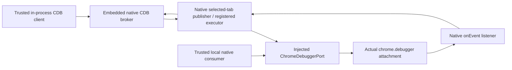
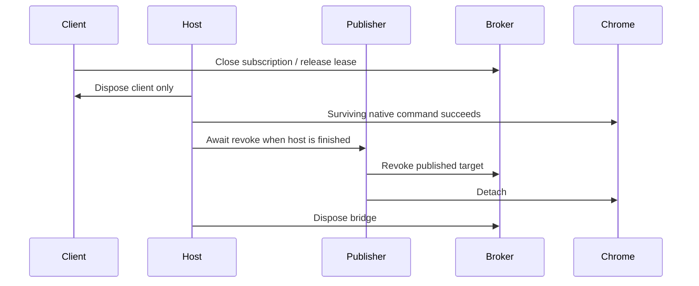

# Embedded debugger composition in Manifest V3

The first real extension proof for [Debugger and CDB contract](https://github.com/dvcol/devkit-extension/issues/10) runs the released CDB client, broker and selected-tab publisher entirely inside an MV3 background worker. It executes an actual browser command and observes an actual protocol event. The only HTTP server serves a disposable target document; there is no debugger daemon or network broker.

This section records the original research run. It does not establish a reference UI or complete debugger adapter.

The follow-on [maintained debugger example](../../examples/debugger/README.md) promotes this composition into strict TypeScript with a portable page-title service/action and native Chromium/Firefox checks. The frozen probe below remains evidence for its original run. Neither example completes the broader debugger contract.

The maintained example now applies the [CDB subscription activation patch](./cdb-subscription-activation.md). The historical proof below used unpatched releases.

## Exact native boundary

The public registry versions remain `@dvcol/cdb@0.3.0`, `@dvcol/cdb-extension@0.3.0` and `@dvcol/cdb-broker@0.3.0`, published September 17 and outside the workspace's seven-day release-age gate. The probe consumed those released tarballs, not a working checkout. [Artifact integrities](../probes/cdb-embedded-extension/versions.json) match the original audit. Primary records: [core](https://registry.npmjs.org/@dvcol%2fcdb/0.3.0), [extension](https://registry.npmjs.org/@dvcol%2fcdb-extension/0.3.0), [broker](https://registry.npmjs.org/@dvcol%2fcdb-broker/0.3.0).

The browser was the installed Chromium 153.0.8010.12 through Playwright 1.63.0. This identifies the tested executable, not a claim about today's latest stable browser. Rolldown produced a browser bundle with no external imports and rejected Node builtins. Source declarations were inspected in the released artifacts.



The public composition needs no new SDK facade:

```ts
// Executed native API shape; the frozen probe contains the full setup and cleanup.
const bridge = createEmbeddedChromeDebuggerBridge();
const publisher = createSelectedTabPublisher({
  scopeId,
  capabilities,
  chromeDebugger: nativePort,
  publishTarget: bridge.broker.publishTarget,
  updateTarget: bridge.broker.updateTarget,
  revokeTarget: (target, reason) =>
    bridge.broker.revokeTarget(target.id, target.generation, reason),
  publishEvent: bridge.broker.publishEvent,
  registerTargetExecutor: bridge.registerTargetExecutor,
});
```

The port calls Chrome's real `attach`, `detach` and `sendCommand`. Instrumentation records calls and delegates to Chrome; no browser replies are mocked. The host forwards `chrome.debugger.onEvent` to `publisher.debuggerEvent` and removes that listener at teardown.

## Verified behavior

| Operation                                              | Observed result                                                                  |
| ------------------------------------------------------ | -------------------------------------------------------------------------------- |
| Publish one selected fixture tab                       | One native attachment; CDB establishes its own flat-session handling             |
| Acquire lease for `Runtime.evaluate`                   | Requires explicit `exclusive-control`; default shared-read was rejected          |
| Execute through CDB                                    | `6 * 7` returns 42                                                               |
| Subscribe through CDB                                  | Receives the real `Runtime.consoleAPICalled` marker from that evaluation         |
| Trusted native command while subscribed                | Same extension attachment returns 54                                             |
| Close subscription, release lease, dispose only client | Further client calls reject; trusted native command still returns 63             |
| Revoke publisher, then dispose bridge                  | One detach; subsequent native command reports that the extension is not attached |
| Repeated revoke/dispose                                | No extra detach; disposed broker rejects use                                     |
| Runtime domain                                         | Exactly one enable and one fulfilled disable                                     |
| Final teardown                                         | Event listener removed, browser/server closed, temporary profile removed         |

[Final browser receipt](../probes/cdb-embedded-extension/receipt.json), [run output](../probes/cdb-embedded-extension/run.log), [exact executed source](../probes/cdb-embedded-extension/background.mjs), and [reproduction notes](../probes/cdb-embedded-extension/README.md) are retained. Earlier failed receipts distinguish a missing lease mode, invalid teardown order and an invalid test assertion.

`chrome.debugger.getTargets().attached` describes any debugger, including Playwright's observer. It remains true after this extension detaches, so it cannot establish extension ownership. The extension's own subsequent `sendCommand` rejection supplies the relevant check.

## Ownership and teardown

This fits the existing host/client distinction. The host owns the publisher, broker and browser attachment. Disposing one CDB client does not dispose those independent host resources. A surviving trusted native consumer can therefore keep using the attachment. There is no need to add another ownership manager to the SDK for this proved composition.



Disposing the whole broker before `publisher.revoke()` is invalid: revoke still needs its broker callback. The native publisher attempts detach in `finally` and catches native detach errors internally. A fulfilled revoke promise alone is therefore insufficient to assert physical cleanup. The retained probe verifies the extension-specific post-detach failure.

The raw native calls intentionally bypass CDB leases. They do not attach another session or mutate managed domain demand. This is trusted-local composition, not enforcement over arbitrary raw Chrome calls. The native `debug` grant level is broad; its `allow` list adds methods rather than restricting the level to only those names. The test's grant is not a proposed remote/page authorization policy.

## Remaining implementation gates

- The maintained example now covers the portable contribution lifecycle, native context access and explicit Firefox unavailability under strict TypeScript and Oxlint. The original scratch scripts remain frozen research; their earlier type-aware lint limitation is recorded in [validation](../probes/cdb-embedded-extension/validation.json).
- Exercise navigation, target closure, child sessions, worker termination, permissions, cancellation, conflicting native lifecycle calls and both native DevTools attachment orders through the final composition.
- Repeat through an authenticated Devframe peer. The embedded client is trusted in-process; this result does not establish remote grants.
- The follow-on [configured response experiment](./cdb-response-transform.md) proves a fixed host policy through the public `ChromeDebuggerPort`, preserving CDB ownership without a patch. Dynamic contribution configuration, paused-request failure handling and complete Fetch lifecycle remain open.
- Prove asynchronous cleanup where needed. Subscription close and embedded disposal are synchronous; observing this Runtime disable does not establish a universal drain guarantee.

No repository dependency, public SDK contract, upstream patch or PR is added by this proof. Issue 10 remains open. Existing host ownership supports the next local contribution example; any broader policy choice must be based on the unproved cases above.
