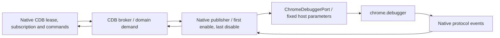

# Configured response interception through CDB

A fixed host-owned response filter works through the released CDB 0.3.0 public APIs without an upstream patch. The real Chromium experiment for [Debugger and CDB contract](https://github.com/dvcol/devkit-extension/issues/10) reads and replaces one response body while CDB remains the attachment and domain owner. Dynamic transform contributions remain part of [Injection and transform contract](https://github.com/dvcol/devkit-extension/issues/11).

The original proof below waits for subscription setup before making requests. A follow-on [activation investigation](./cdb-subscription-activation.md) reproduced event loss during setup and led to an exact-version CDB patch. That lifecycle correction is separate from configuring a fixed response filter, which still uses the existing native port API.

## Maintained example

The fixed policy is now implemented in [the debugger example](../../examples/debugger/README.md#fixed-response-interception) and runs through its existing Chromium command in CI. Its typed recipe uses the public native port, client, lease and subscription types. The retained [maintained receipt](../../examples/debugger/evidence/chromium-response.json) proves matching-body replacement, unaffected concurrent traffic, no interception after native disable, zero remaining leases and final detach. The original archive below remains unchanged.

The maintained runner observes actual completion of both Fetch and Runtime disable before detaching. An initial run detached while `Runtime.disable` was pending and observed its native rejection. Waiting for the native completions corrects the fixture sequencing without changing CDB or claiming that public lease release acknowledges cleanup. No new package patch, protocol or portable transform declaration is introduced.

## Native composition

`createSelectedTabPublisher` accepts a `ChromeDebuggerPort`. The host supplies native parameters when CDB calls `Fetch.enable`; every other command passes through. The client still uses CDB's lease, subscription and command APIs. It never sends a competing raw `Fetch.enable` or `Fetch.disable`.

```ts
// Executed composition, abbreviated. Native replies still need their usual JSON validation.
const chromeDebugger = {
  attach: (target, version) => chrome.debugger.attach(target, version),
  detach: (target) => chrome.debugger.detach(target),
  sendCommand(target, method, parameters) {
    const options = method === 'Fetch.enable' ? fetchConfiguration : parameters;
    return chrome.debugger.sendCommand(target, method, options);
  },
};

const fetchConfiguration = {
  patterns: [{ urlPattern: 'https://example.test/api/*', requestStage: 'Response' }],
};
// Pass this port into the native selected-tab publisher.
```



The browser-side filter pauses only matching responses. A CDB event predicate alone cannot achieve that: filtering an already paused request out of the event stream would leave it waiting for a command.

## Executed evidence

The experiment used installed `@dvcol/cdb@0.3.0` and `@dvcol/cdb-extension@0.3.0`, Chromium 153.0.8010.12 and the maintained example's Playwright installation. It changed no dependency, CDB source or package patch. The bundle rejects Node builtins and external imports. [Exact source and reproduction](../probes/cdb-response-transform/README.md), [full receipt](../probes/cdb-response-transform/receipt.json), [public core release](https://registry.npmjs.org/@dvcol%2fcdb/0.3.0), [public extension release](https://registry.npmjs.org/@dvcol%2fcdb-extension/0.3.0).

| Check                        | Observed result                                                                                                                             |
| ---------------------------- | ------------------------------------------------------------------------------------------------------------------------------------------- |
| Attach and subscribe         | One attachment and one CDB-owned `Fetch.enable` with a response-stage URL pattern                                                           |
| Matching response            | One `Fetch.requestPaused` event at status 200; CDB reads the original body and fulfills `server:selected:transformed`                       |
| Concurrent unmatched request | Original `server:unmatched` body, no Fetch event                                                                                            |
| Native body encoding         | `base64Encoded: true` decoded before transformation                                                                                         |
| Close subscription only      | No `Fetch.disable`; commands retain lease-owned domain demand                                                                               |
| Release lease                | Exactly one successful `Fetch.disable`, observed at the native port                                                                         |
| Later matching request       | Original body, no transformation or additional pause event                                                                                  |
| Teardown                     | Zero dropped events, one detach, extension-specific post-detach command rejection, removed event listener and closed browser/server/profile |

The first real run exposed an incorrect harness assertion about base64 encoding. Correcting the assertion yielded the passing receipt without changing extension behavior. The archived directory retains both attempts and the earlier sandbox bind failure.

## Ownership and limits

Close the subscription and release its lease. CDB commands establish domain demand for the lease's lifetime, so closing an event subscription alone is insufficient. The native broker schedules domain disable asynchronously and swallows its rejection. This experiment explicitly observed the fulfilled native call; `releaseLease()` is not an acknowledged native cleanup barrier.

The released declarations expose `ChromeDebuggerPort`, `SelectedTabPublisherOptions.chromeDebugger` and `setSubscriptionDemand(methodPrefix, active, sessionId?)`. They have no domain-enable configuration argument. In the installed extension source, both initial activation and child-domain replay call the supplied port without parameters. Supplying fixed parameters there preserves the native owner and also reaches the child replay call site. Child-session behavior itself was not tested here.

Further acceptance work is required before offering a general response-transform feature:

- Multiple contributions changing or combining patterns, and competing handlers for one paused request.
- Cancellation and target changes while a response is paused or its body is being read. The follow-on activation investigation proves that closing the subscription and releasing its lease resumes the original root-session response after a completed body read; in-flight reads and other demand remain unproved.
- Queue overload. Native Fetch subscriptions cap their buffers at 16; losing a pause event can lose the request identifier needed to resume it.
- Subscription startup. The original fixture waits for setup before creating requests. The follow-on investigation reproduces this race and verifies the local patch against the actual installed 0.3.0 package.
- Child sessions, redirects, authentication challenges, non-ASCII or binary bodies, compression, streaming, worker termination and permission changes.
- An explicit policy for failed asynchronous native disable if a consumer requires confirmed cleanup.

These are bounded native lifecycle concerns, not reasons to add an SDK broker or second domain owner. A fixed host policy needs no new upstream option. A shared, dynamic configuration API requires separate design and evidence. This proof removes the earlier blanket claim that configured response-stage interception necessarily requires a CDB patch.
