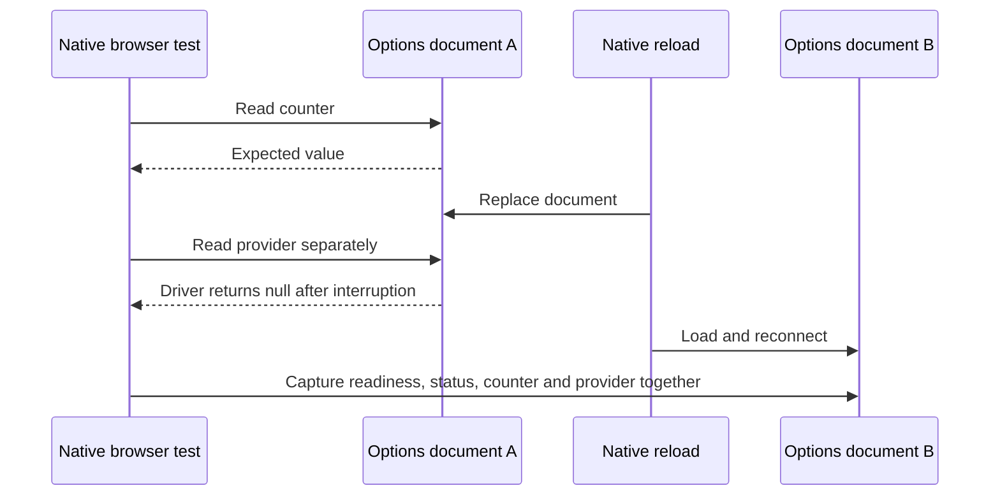

# Firefox peer observation across native reload

The DevTools registration-module test in [4681c9c](https://github.com/dvcol/devkit-extension/commit/4681c9c2ef2dc5a0487185b76c7bb67ef06a1b8c) passed locally but failed in [CI](https://github.com/dvcol/devkit-extension/actions/runs/36865145494). After a rendered action, the test waited for the options peer's counter, then read its provider identity in a separate WebDriver command. That second command returned `null` instead of the expected provider JSON.

The preceding commit passed CI. The new test exposed a race in its own observation sequence; the failing run was not classified as a pre-existing failure or retried without diagnosis.

## Captured reproduction

The maintained Firefox development scenario reproduced the same assertion locally on Firefox 157.0. Temporary instrumentation captured the counter-matching document, the separate provider result, and the next document snapshot. The [retained trace](./firefox-reload-observation-evidence.json) includes the preceding successful observations as controls.

| Observation               | Document timestamp           | Readiness   | Connection | Counter      | Provider               |
| ------------------------- | ---------------------------- | ----------- | ---------- | ------------ | ---------------------- |
| Counter condition matched | `1790859911772`              | Complete    | Connected  | 9            | Expected provider      |
| Separate provider command | Not captured by that command | —           | —          | —            | Driver returned `null` |
| Next atomic snapshot      | `1790859912678`              | Interactive | Connecting | Not rendered | Empty                  |

The options document navigated between the two reads. The `null` was not evidence that an HTML element's `textContent` had become null. The installed Firefox 157 Marionette source also explains that result: `MarionetteCommandsParent.sys.mjs` classifies `executeScript` as a method it must not replay, and returns null after an `AbortError` or `InactiveActor` interruption. Native Vite full reloads can replace other client documents while the test is working with the DevTools host.

## Correction and verification

The peer assertion must wait for a single native snapshot containing the connected status, expected counter and expected provider. A missing snapshot or a connecting document is not ready. The test must not combine a counter from one document with a provider read from another. Its existing timeout stays unchanged, and it does not retry the action, restore state or introduce a reload controller.

The development suites retain peer observations alongside their native receipts. CI uploads development JSON and screenshots even when a later assertion fails. These artifacts describe the observed native behavior; they do not imply a new application recovery guarantee. The final concurrent native run passed 15 Chromium scenario groups and 11 Firefox groups, including the original registration-module case and direct registration-HTML edits. Strict lint, affected-workspace TypeScript and formatting passed. CI must validate the pushed correction separately; the earlier failing run remains part of the diagnosis.
