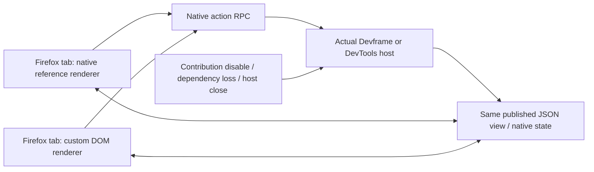

# Firefox native renderer lifecycle

The maintained JSON-render example now runs its reference and custom DOM renderers in Firefox against both actual Devframe and DevTools backends. The source JSON view, action contract, native state, backend factory and public renderer registration stay unchanged. This is test coverage for [Renderer and surface contract #12](https://github.com/dvcol/devkit-extension/issues/12), rather than another rendering or dispatch layer.

The example's existing Vite fixture supplies the native renderer assets and WebSocket proxy to both browser drivers. Firefox uses the repository's pinned Selenium and geckodriver tooling. The Chromium fixture extraction moves that existing server setup without changing its configuration.



## Executed cases

| Case, repeated for each backend       | Direct observation                                                                                                                                                                                             |
| ------------------------------------- | -------------------------------------------------------------------------------------------------------------------------------------------------------------------------------------------------------------- |
| Reference and custom mount            | Both render the unchanged counter view at 0.                                                                                                                                                                   |
| Native action and shared state        | A custom-renderer action updates both pages to 1 and 2.                                                                                                                                                        |
| Invalid input                         | An error is displayed, backend state stays at 1, and the next valid action clears the custom error.                                                                                                            |
| Unmount                               | DOM is removed; a retained detached view stays at 2 after the reference advances to 3, and its button cannot advance the backend.                                                                              |
| Remount and replacement               | Remount reads 3; selecting the reference renderer removes the custom mount; a valid action reaches 4; selecting custom restores it.                                                                            |
| Unsupported custom component          | Native state publication causes an explicit update failure; mounting the unsupported view fails visibly; valid publication and remount recover.                                                                |
| Contribution and dependency lifecycle | Disable removes both mounts, an action advances business state while absent, and reenable republishes 6. Dependency loss removes both mounts; native mutation while absent is retained at 7 after restoration. |
| Host shutdown                         | Both mounts disappear, controls disable, and the actual provider catalog is disposed.                                                                                                                          |

The standalone test writes a receipt only after these assertions complete for both hosts. It records 16 distinct names, Firefox `157.0`, geckodriver `0.37.1`, final values of 7 and disposed providers. Independent review checked those fields and inspected both saved browser screenshots. All eight affected unit/build tests pass. The existing Chromium browser test also passes against the shared fixture, including its separate delayed-state-response replacement test and zero captured page errors.

## Reproduction and retention

Build the example's dependency graph before the browser command:

```sh
pnpm exec turbo run build --filter=@devkit/example-json-render...
pnpm --filter @devkit/example-json-render test
pnpm --filter @devkit/example-json-render lint
pnpm --filter @devkit/example-json-render typecheck
FIREFOX_BINARY=/path/to/firefox pnpm --filter @devkit/example-json-render test:firefox
pnpm --filter @devkit/example-json-render test:browser
```

Use an installed Firefox binary and geckodriver `0.37.1`; CI's existing Firefox setup supplies both. `SE_DRIVER_VERSION=0.37.1` and `SE_SKIP_DRIVER_IN_PATH=true` select the recorded driver when Selenium manages it. Each host owns and closes its native backend and Vite server; the test closes its additional tabs and browser session. No fixture adds credentials to persistent storage.

The maintained result is [firefox-renderers.json](../../examples/json-render/evidence/firefox-renderers.json). Executed runs write `artifacts/firefox-renderers.json` and a screenshot per backend. CI runs this command after installing Firefox, retains the native reports and screenshots, and checks all 16 exact names through the API matrix. Full Linux acceptance remains a CI gate for the issue-scoped commit.

## Limits

Firefox WebDriver Classic does not capture all uncaught page errors here. The Chromium delayed native state-response test has no equivalent Firefox network-interception test in this slice. Renderer-module HMR, injected rendering, complete component/built-in coverage, the full DevTools shell, cross-provider view selection and production-server preview remain separate obligations. Passing these cases does not establish complete renderer conformance.
