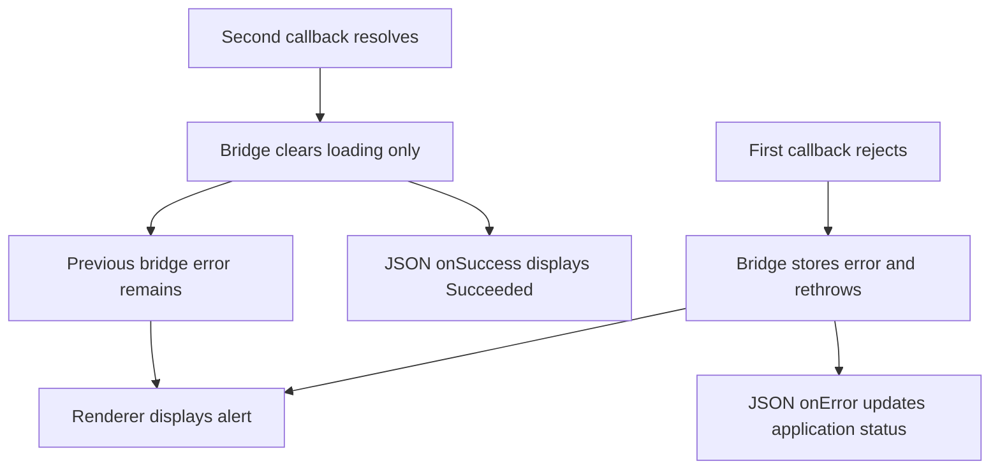

# Native renderer retains an action error after recovery

Investigation for [issue 12](https://github.com/dvcol/devkit-extension/issues/12), 2026-09-30.

Implementation follow-up, 2026-10-01: [upstream PR 416](https://github.com/devframes/devframe/pull/416) contains the native reset and four source regressions. Its two runtime lines are now included in the repository's [versioned renderer patch](../../patches/README.md#native-renderer-action-retry). Maintained Chromium and Firefox tests assert native alert recovery. The experiments below describe the earlier unpatched behavior; the installed-package probe should now pass without `--candidate`.

The stale banner originates in `@devframes/json-render-ui`'s `createActionBridge`. The bridge records failures but never clears its error reference. `JsonRenderView` renders that reference as an alert independently of the JSON specification's state and action callbacks. Calling this a native quirk understated a reproducible error-lifecycle defect.

## Reproduction and isolation

The real extension reproduction selected the devserver realm with no server connected. That first rejection was correct. Selecting the extension and retrying the same JSON action then returned a fulfilled result and advanced the counter to 1. The JSON `onSuccess` callback cleared the application's status, but the original renderer alert remained. Two runs reproduced this exact assertion failure.

The [minimal browser reproduction](../probes/json-render-stale-error/reproduce.mjs) mounts the native renderer with an [inline JSON specification](../probes/json-render-stale-error/index.html) and one plain callback. The first call throws; the second returns `ok`. There is no extension, contribution SDK, router, provider, network RPC, authentication or shared-state backend. A throwing `sharedState` getter verifies that the inline view never accesses one. Native `onError` and `onSuccess` callbacks update the displayed status to `Handled failure` and then `Succeeded`.

Run from the repository root after installing workspace dependencies and Playwright's Chromium:

```sh
node docs/probes/json-render-stale-error/reproduce.mjs
```

Expected with the installed 1.0.0 renderer: exit 1, specifically because the alert count is 1 after the successful second call. A different failure is not evidence of this bug. This intentionally failing probe is archived research, outside the maintained test suites.

| Experiment                                                    | Observed result                                                         |
| ------------------------------------------------------------- | ----------------------------------------------------------------------- |
| Real Chromium extension, failure then successful retry, twice | Counter 1 and fulfilled result; old banner still visible                |
| Installed renderer, inline view, direct callback              | Two calls; status `Succeeded`; old banner still visible; no page errors |
| Unmodified npm 1.0.0 renderer, same minimal probe             | Same stale banner, excluding the repository's existing dependency patch |
| Installed renderer, temporary reset before retry              | Same successful callback and state update; no banner; no page errors    |
| Unmodified npm renderer, same temporary reset                 | Same passing result                                                     |

All browser runs used Chromium 153.0.8010.12 through Playwright. Firefox was not exercised for this diagnosis.

The unmodified package came from the [published 1.0.0 tarball](https://registry.npmjs.org/@devframes/json-render-ui/-/json-render-ui-1.0.0.tgz). Its SHA-1 matched the registry's `dist.shasum`: `9a80eb61c159f105d64fa5afb5439e133d47d879`. The probe's `--bundle /absolute/path/to/package/dist/renderer/json-render.mjs` option accepts that extracted artifact directly.

## Source and causal chain

The same implementation is present in upstream main at [`cac6900ca1fc9e223c728b17e868e9f544bd66c2`](https://github.com/devframes/devframe/commit/cac6900ca1fc9e223c728b17e868e9f544bd66c2), checked on 2026-09-30. This is source inspection of current main; the browser tests above execute the published 1.0.0 bundle.

1. [`action-bridge.ts`](https://github.com/devframes/devframe/blob/cac6900ca1fc9e223c728b17e868e9f544bd66c2/packages/json-render-ui/src/action-bridge.ts#L43) creates one `shallowRef(null)` for the renderer's last action error.
2. Its catch block assigns `{ action, error }` and rethrows. Neither the next invocation nor successful completion resets the reference; `finally` only clears the loading flag.
3. [`renderer.ts`](https://github.com/devframes/devframe/blob/cac6900ca1fc9e223c728b17e868e9f544bd66c2/packages/json-render-ui/src/renderer.ts#L97) displays the alert whenever that reference is non-null. It supplies no dismiss/reset control.
4. JSON `onError`/`onSuccess` callbacks change specification state inside `JSONUIProvider`. They do not own or clear the enclosing bridge's error reference.



The bridge caches handler functions, not rejected promises: the reproduction verifies the callback runs twice. Our `createActionCall` routing layer and the host's result display are absent from the minimal reproduction. The underlying `@json-render/vue` action callbacks execute correctly; the retained reference belongs to Devframe's reference renderer wrapper.

The [upstream bridge tests](https://github.com/devframes/devframe/blob/cac6900ca1fc9e223c728b17e868e9f544bd66c2/packages/json-render-ui/test/action-bridge.test.ts) cover successful dispatch, loading, rejection and static mode individually, but do not test recovery after failure. Our existing live test asserted successful dispatch and application-status recovery without asserting that this separate native alert disappeared.

## Fix direction and limits

The causal experiment inserts this reset immediately before dispatch in the bridge:

```ts
if (error.value?.action === action) error.value = null;
```

```sh
node docs/probes/json-render-stale-error/reproduce.mjs --candidate
```

This exits 0. The reset applies only when retrying the action named by the retained error, so an unrelated action does not erase it. The probe changes only the module text served to its disposable browser; it does not edit the installed package, an upstream checkout or the repository's dependency patches. Its guarded text replacement is specific to the 1.0.0 diagnostic artifact, not a proposed distribution mechanism.

A production fix belongs in the upstream bridge with regression coverage for retry success, another retry failure and unrelated/concurrent actions. The choice of clearing on retry versus on successful completion controls presentation while the retry is pending; the current investigation establishes the missing reset and does not claim to validate every concurrency case. No SDK routing, transport or shared-state change is needed. No upstream PR or shipped fix was added by this investigation.
