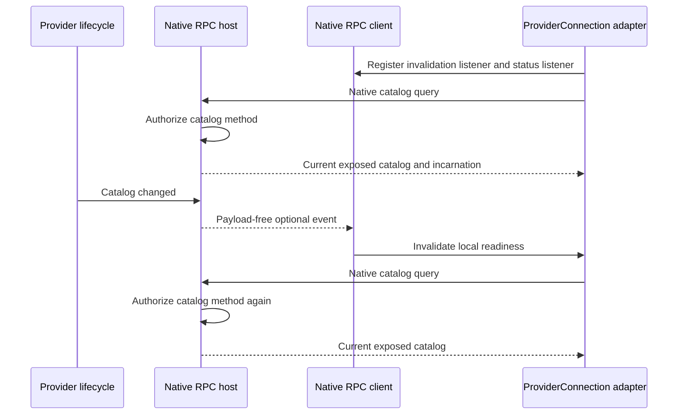

# Native catalog synchronization

Research for [Server adapter contract](https://github.com/dvcol/devkit-extension/issues/6), checked on 2026-09-27. The owner accepted native remote cancellation: stopping client wait does not guarantee that an already-started backend operation stops. This investigation covers the separate prerequisite for a remote `ProviderConnection`: an authoritative catalog and native connection lifecycle.

## Recommendation

Use one ordinary, authorized native catalog query and a payload-free native invalidation event. The server projects its existing provider catalog through the explicit exposure list. On a lifecycle change, `context.rpc.broadcast` tells interested clients to read again. Every read goes through the catalog method's normal Devframe authorization; the event contains no provider metadata, catalog entries, or operation results. This uses existing RPC request/reply and push APIs, without another state authority, codec, authentication layer, stream protocol, or timer-based polling loop. [Native broadcast](https://github.com/devframes/devframe/blob/a3f967755af99a0a0d8dd82b7b5d4f3dd4aec0bc/packages/devframe/src/node/host-functions.ts), [native authorization](https://github.com/devframes/devframe/blob/a3f967755af99a0a0d8dd82b7b5d4f3dd4aec0bc/packages/devframe/src/node/rpc-core.ts), [local catalog contract](../../packages/core/src/catalog.ts).

Compose an existing `DevframeRpcClient`. It already provides `call`, client-side RPC registration, `status`, `connectionError`, and subscribable connection events. The low-level `createRpcClient` returns a Birpc client and leaves connection status and authentication integration to its caller; selecting it would recreate behavior already present in the high-level client. The adapter must not close a native client it does not own. [High-level client](https://github.com/devframes/devframe/blob/a3f967755af99a0a0d8dd82b7b5d4f3dd4aec0bc/packages/devframe/src/client/rpc.ts), [low-level factory](https://github.com/devframes/devframe/blob/a3f967755af99a0a0d8dd82b7b5d4f3dd4aec0bc/packages/devframe/src/rpc/client.ts), [portable connection ownership](../../packages/client/src/types.ts).

No new owner decision is required for this mechanism. The following lifecycle and security details are implementation obligations, not additional configurable frameworks.

## Evidence and pins

- SDK inspection baseline: [`63d35be788b1639a422a15b8e24f79ef24db41a3`](https://github.com/dvcol/devkit-extension/tree/63d35be788b1639a422a15b8e24f79ef24db41a3).
- Installed artifacts inspected directly: `devframe@1.0.0`, `@devframes/hub@1.0.0`, and `@vitejs/devtools-kit@0.7.5`, including the existing [isolated connection patch](../../patches/devframe@1.0.0.patch).
- Readable upstream source reference: [`a3f967755af99a0a0d8dd82b7b5d4f3dd4aec0bc`](https://github.com/devframes/devframe/tree/a3f967755af99a0a0d8dd82b7b5d4f3dd4aec0bc). Relevant installed implementations and declarations were inspected separately; the source checkout is not assumed identical to the published package.
- This note is source research, not a successful end-to-end synchronization test. The checks below remain implementation acceptance criteria.

| Installed artifact                      | SHA-256                                                            |
| --------------------------------------- | ------------------------------------------------------------------ |
| `devframe/dist/client/index.mjs`        | `177879878fed6ae839d09d35a61ba629727d30a0d6139414019fa8ca01744c8e` |
| `devframe/dist/client/index.d.mts`      | `bbbb1fe0895fba0b75cc79c8773ce658aad1d2fd2c5ffb059b8587049af04467` |
| `devframe/dist/context-BqpgC5tq.mjs`    | `51c387b4b4fe5c15a6f0deea3b73f1818d79fa413122f40a06db42f6cd5d1afd` |
| `devframe/dist/context--tVkJw3W.d.mts`  | `e1f6e16861b3e8cd800e131a54cde2daf3f944d81bfe63804dba04893897d9d6` |
| `devframe/dist/rpc/client.mjs`          | `9a6375832ea4fac966fd57ece3e139587985b88e993c3cebd65ae2d2de025028` |
| `@vitejs/devtools-kit/dist/client.js`   | `d5a994c13274721d57b142514a771aedc7de6b8d06fe1700e5ab07d43083c53d` |
| `@vitejs/devtools-kit/dist/client.d.ts` | `b40aa1caa2fe6086fc13673879239bdcc350d123745749724d95248a5cca02d9` |

## Public API mapping

| Requirement                              | Native API and behavior                                                                                 | Adapter responsibility                                                                                                    |
| ---------------------------------------- | ------------------------------------------------------------------------------------------------------- | ------------------------------------------------------------------------------------------------------------------------- |
| Read authoritative metadata              | `context.rpc.register({ name, type: 'query', handler, args, returns })`; `nativeClient.call(name, ...)` | Project only explicitly exposed descriptors from the current provider; return ordinary data, with no new result envelope. |
| Notify catalog changes                   | `context.rpc.broadcast({ method, args: [], optional: true, event: true })`                              | Broadcast an invalidation, then let each consumer re-read through native authorization.                                   |
| Receive notifications                    | `nativeClient.client.register({ name, type: 'event', handler })`                                        | Own one finite client-lifetime registration and a removable set of active listeners.                                      |
| Observe connection loss or trust refusal | `nativeClient.events.on('connection:status', listener)`; `nativeClient.status`, `connectionError`       | Clear the usable catalog immediately when the connection becomes unavailable.                                             |
| Remove local listeners                   | `events.on(...)` returns an unsubscribe function                                                        | Remove listeners and suppress pending read results after disposal; leave native host/client ownership with the caller.    |
| Preserve backend checks                  | Native server `authorize(methodName, session)` runs before the RPC handler                              | A catalog entry is not permission to invoke an operation; the separately named operation still passes its own gate.       |

Sources: [RPC declaration and collector interfaces](https://github.com/devframes/devframe/blob/a3f967755af99a0a0d8dd82b7b5d4f3dd4aec0bc/packages/devframe/src/rpc/types.ts), [server broadcast types](https://github.com/devframes/devframe/blob/a3f967755af99a0a0d8dd82b7b5d4f3dd4aec0bc/packages/devframe/src/types/rpc.ts), [client events and methods](https://github.com/devframes/devframe/blob/a3f967755af99a0a0d8dd82b7b5d4f3dd4aec0bc/packages/devframe/src/client/rpc.ts), [event unsubscription](https://github.com/devframes/devframe/blob/a3f967755af99a0a0d8dd82b7b5d4f3dd4aec0bc/packages/devframe/src/utils/events.ts), [authorization resolver](https://github.com/devframes/devframe/blob/a3f967755af99a0a0d8dd82b7b5d4f3dd4aec0bc/packages/devframe/src/node/rpc-core.ts).

The installed DevTools client delegates to the native `getDevframeRpcClient` with `simpleAuth: false`. Its declarations specialize the three call signatures while retaining the native lifecycle, client collector, streaming, and shared-state interfaces. One adapter implementation can therefore consume both real native client objects; verify structural typing against the installed declarations instead of copying the client type. The exact installed sources are pinned by their hashes above.

## Query and notification lifecycle



This is a proposed composition of the native APIs above. It needs a small local synchronization guard: register the listener before the first query; if invalidation arrives while a query is pending, discard any obsolete result and perform one fresh query. Coalesce multiple invalidations during that read. Disposal and connection loss must fence late responses. These flags coordinate local reads; they are not a remote version, replay log, or independent state protocol. The existing provider catalog is already the authority. [Provider catalog lifecycle](../../packages/runtime/src/provider-catalog.ts), [connection registry identity rule](../../packages/client/src/registry.ts).

Publish provider startup only when its exposed implementation is usable, and emit invalidation when availability changes. Removing the current provider must prevent further dispatch immediately. For a replacement incarnation, do not mutate the identity of an attached `ProviderConnection`: the registry explicitly rejects a changed incarnation. An old connection becomes unavailable and an owner creates/attaches the successor deliberately. Preserve the existing expected-incarnation check in actual operation dispatch. [Host exposure lifetime](../../packages/server/src/exposure.ts), [registry identity check](../../packages/client/src/registry.ts), [accepted architecture](../../ARCHITECTURE.md#host-owned-native-rpc-methods).

`broadcast` returns without work before the RPC group is bound and uses `Promise.allSettled` for connected recipients. Its event is optional, so a native client that does not consume this SDK can ignore it. It does not itself run the server's inbound authorization gate. Therefore broadcast no catalog payload; the subsequent query performs authorization. The occurrence of an invalidation is observable, but it does not disclose provider identifiers or descriptors if the method is fixed and its arguments are empty. [Broadcast implementation](https://github.com/devframes/devframe/blob/a3f967755af99a0a0d8dd82b7b5d4f3dd4aec0bc/packages/devframe/src/node/host-functions.ts).

Per-session descriptor filtering is not automatically supplied by this composition. The catalog method has its own native permission and reveals its configured exposure projection to callers allowed to read it. Every operation has its own native method permission. This satisfies the current distinction between catalog availability and invocation authorization; a future requirement to hide selected descriptors from particular authorized catalog readers would need a separate concrete policy. [Catalog contract](../../packages/core/src/catalog.ts), [native authorization signature](https://github.com/devframes/devframe/blob/a3f967755af99a0a0d8dd82b7b5d4f3dd4aec0bc/packages/devframe/src/node/auth/handler.ts).

## Client registration and cleanup

The client collector has public `definitions`, `register`, `update`, and `onChanged`, but no unregister operation. Do not mutate `definitions` to invent cleanup. Check `nativeClient.client.definitions.has(name)` for a collision, then retain one owned invalidation definition for the native client's lifetime. A `WeakMap` keyed by the actual client collector can hold the definition's listener set. Disposing a provider connection removes its listener; the retained handler must not capture that disposed connection. A later attachment reuses the same owned definition. As on the server, a native registration observer can throw after insertion, so preflight does not imply transactional registration. [Collector public interface](https://github.com/devframes/devframe/blob/a3f967755af99a0a0d8dd82b7b5d4f3dd4aec0bc/packages/devframe/src/rpc/types.ts), [collector mutation order](https://github.com/devframes/devframe/blob/a3f967755af99a0a0d8dd82b7b5d4f3dd4aec0bc/packages/devframe/src/rpc/collector.ts).

`DevframeRpcClient.status` distinguishes `connecting`, `connected`, `unauthorized`, `disconnected`, and `error`. Native guarded calls reject pending work on transport error, disconnect, or trust revocation and reject new calls in unavailable states. An already-started backend unary handler has no corresponding per-call abort signal. The accepted native behavior therefore remains: stop client waiting and clear readiness, without claiming cancellation of backend effects or automatically replaying them. [Connection status contract](https://github.com/devframes/devframe/blob/a3f967755af99a0a0d8dd82b7b5d4f3dd4aec0bc/packages/devframe/src/client/connection.ts), [live client rejection handling](https://github.com/devframes/devframe/blob/a3f967755af99a0a0d8dd82b7b5d4f3dd4aec0bc/packages/devframe/src/client/rpc-live.ts), [unary session interface](https://github.com/devframes/devframe/blob/a3f967755af99a0a0d8dd82b7b5d4f3dd4aec0bc/packages/devframe/src/types/rpc.ts).

Use a live native client. A static backend can report `connected` without a live transport, and cannot satisfy live authoritative catalog synchronization. Also keep catalog and effect methods outside the native client's configured result cache. Caching defaults off, but `cacheOptions.functions` can name arbitrary methods independently of server definition flags. A supplied client's public `cacheManager.validate(method)` detects this incompatible configuration; rejecting it avoids silently changing caller-owned cache policy. [Client transport and caching](https://github.com/devframes/devframe/blob/a3f967755af99a0a0d8dd82b7b5d4f3dd4aec0bc/packages/devframe/src/client/rpc.ts), [cache manager](https://github.com/devframes/devframe/blob/a3f967755af99a0a0d8dd82b7b5d4f3dd4aec0bc/packages/devframe/src/rpc/cache.ts).

## Browser client versus a Node fixture

The installed high-level client is browser-oriented. Supplying a complete isolated connection plus `simpleAuth: false`, `otpParam: false`, and `webmcp: false` avoids shared connection caches, auth broadcasts, prompt/OTP UI, and WebMCP setup. It does **not** make the factory usable in bare Node without browser globals: `createWsRpcClientMode` passes the global `location` to `resolveWsUrl` unconditionally, and the trust handshake reads `location.origin` and `navigator.userAgent`. An absolute WebSocket URL or `wsOptions.url` does not avoid evaluation of `location`. Node's native `WebSocket` alone is therefore insufficient. This is source evidence; no successful bare-Node high-level-client execution is claimed. [WebSocket mode](https://github.com/devframes/devframe/blob/a3f967755af99a0a0d8dd82b7b5d4f3dd4aec0bc/packages/devframe/src/client/rpc-ws.ts), [trust handshake](https://github.com/devframes/devframe/blob/a3f967755af99a0a0d8dd82b7b5d4f3dd4aec0bc/packages/devframe/src/client/rpc-live.ts), [installed isolation patch](../../patches/devframe@1.0.0.patch).

A prepared browser connection needs `connectionMeta` and `metaBaseUrl`; `authToken` and the patched `isolated` property are optional. `ConnectionMeta.backend` is mandatory. For a live WebSocket connection, supply the server's advertised `websocket` field, which supports an absolute URL, a relative path, a port, or a `{ path, host?, port? }` object. Preserve any advertised `jsonSerializableMethods`; do not rebuild the server descriptor from unrelated assumptions. A concrete shape is:

```ts
const nativeClient = await getDevframeRpcClient({
  connection: {
    connectionMeta: advertisedConnectionMeta,
    metaBaseUrl: new URL('__connection.json', serverBaseUrl).href,
    authToken,
    isolated: true,
  },
  simpleAuth: false,
  otpParam: false,
  webmcp: false,
});
```

Sources: [connection shape](https://github.com/devframes/devframe/blob/a3f967755af99a0a0d8dd82b7b5d4f3dd4aec0bc/packages/devframe/src/client/connection.ts), [server metadata](https://github.com/devframes/devframe/blob/a3f967755af99a0a0d8dd82b7b5d4f3dd4aec0bc/packages/devframe/src/types/context.ts), [installed isolation patch](../../patches/devframe@1.0.0.patch).

Exercise this client in a real browser, or give a Node test fixture an explicit, scoped browser-global environment and restore it afterward. Keep that environment in tests/examples; do not add a production adapter shim or patch upstream merely to run a Node fixture. The existing low-level native-client example remains valid for transport evidence, but it does not prove the high-level client's browser lifecycle. [Existing native socket fixture](../../examples/server-contexts/src/remote-client.ts).

## Why not shared state or streaming here

| Native option                                             | What it already supplies                                                               | Missing behavior for this catalog                                                                                                                                                                                                                                                                |
| --------------------------------------------------------- | -------------------------------------------------------------------------------------- | ------------------------------------------------------------------------------------------------------------------------------------------------------------------------------------------------------------------------------------------------------------------------------------------------ |
| `context.rpc.sharedState.get(key, ...)`                   | Snapshot synchronization and updates                                                   | The same host registers client-callable `server-state:set` and `server-state:patch`. Options have no per-key read-only policy. A read-only TypeScript facade does not make the backend authoritative against an authorized writer.                                                               |
| `context.rpc.streaming.create(name, { replayWindow: 1 })` | One-way outbound chunks, latest-value replay, subscribe/cancel, disconnect bookkeeping | Authorization is for generic streaming methods, not an individual channel. Unknown subscriptions log an error and return; the client event call has no acknowledgement. Stream abort, initial subscription loss, and reader cleanup require more lifecycle machinery than an invalidation query. |
| Long-poll native query                                    | Ordinary authorization and return validation                                           | Waiting requests need cancellation/expiry policy because native unary disconnect does not stop backend work. This is unnecessary when native push already fits.                                                                                                                                  |
| Payload-free event plus catalog query                     | Native push, native method authorization, ordinary schema-guarded return               | Only the adapter's finite listener ownership and read synchronization remain.                                                                                                                                                                                                                    |

Sources: [shared-state host options](https://github.com/devframes/devframe/blob/a3f967755af99a0a0d8dd82b7b5d4f3dd4aec0bc/packages/devframe/src/types/rpc.ts), [shared-state writable methods](https://github.com/devframes/devframe/blob/a3f967755af99a0a0d8dd82b7b5d4f3dd4aec0bc/packages/devframe/src/node/rpc-shared-state.ts), [server streaming implementation](https://github.com/devframes/devframe/blob/a3f967755af99a0a0d8dd82b7b5d4f3dd4aec0bc/packages/devframe/src/node/rpc-streaming.ts), [client streaming implementation](https://github.com/devframes/devframe/blob/a3f967755af99a0a0d8dd82b7b5d4f3dd4aec0bc/packages/devframe/src/client/rpc-streaming.ts).

For precision, native stream `sink.abort()` only aborts its signal; it does not close the sink. The producer must react and close/error it. The native streaming client observes trust events for resubscription but does not itself end its readers on every connection-status transition. Those are valid streaming design choices, but they do not give this catalog a simpler owned lifecycle. Do not use `_onSessionDisconnected`, `_push`, `_end`, internal event maps, or collector mutation as an adapter shortcut. [Stream primitive](https://github.com/devframes/devframe/blob/a3f967755af99a0a0d8dd82b7b5d4f3dd4aec0bc/packages/devframe/src/utils/streaming-channel.ts), [streaming client](https://github.com/devframes/devframe/blob/a3f967755af99a0a0d8dd82b7b5d4f3dd4aec0bc/packages/devframe/src/client/rpc-streaming.ts).

Native `returns` validation is guard-only and preserves ordinary values. It does not derive a schema from the TypeScript `ProviderCatalogSnapshot` interface. Any catalog boundary validation must use an explicit schema or a narrow guard; reuse it on the native declaration rather than introducing a new codec. [Native handler validation](https://github.com/devframes/devframe/blob/a3f967755af99a0a0d8dd82b7b5d4f3dd4aec0bc/packages/devframe/src/rpc/handler.ts), [schema declarations](https://github.com/devframes/devframe/blob/a3f967755af99a0a0d8dd82b7b5d4f3dd4aec0bc/packages/devframe/src/rpc/types.ts).

## Implementation acceptance checks

1. With real authenticated Devframe and DevTools hosts, catalog acquisition succeeds only when its native method is authorized. An allowed catalog read does not bypass a denied operation method.
2. Only explicitly exposed action/capability descriptors appear. Disable, enable, late activation, disposal, and replacement invalidate the catalog. No shared-state write can mutate that source of truth.
3. Invalidations during initial/in-flight reads cannot publish an obsolete snapshot. Disposal, trust loss, or disconnect cannot be undone by a late response.
4. A replacement incarnation never changes the identity of an attached connection or reroutes an in-flight operation. The old connection is unavailable until its owner replaces the attachment.
5. Multiple connections consuming one native client reuse the one invalidation definition; disposing one removes only its listeners. A foreign registration collision fails clearly, and no growing history of method names or listeners remains.
6. A native client without the optional notification handler remains unaffected. No catalog payload is broadcast to unauthenticated clients. Uncached live transport is required explicitly.
7. Client cancellation/disconnection settles local callers without a backend cancellation guarantee or automatic effect retry. The native host and caller-owned native client remain open after adapter disposal.
