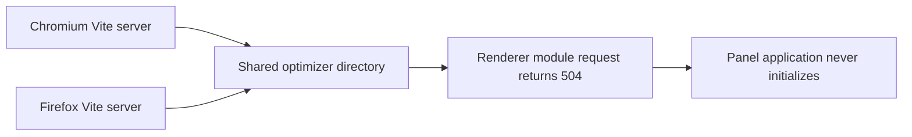

# Concurrent browser development cache

Issue [13](https://github.com/dvcol/devkit-extension/issues/13) recorded a Chromium panel stuck at `Connecting` and a separate Firefox timeout after configuration restart. A focused two-browser probe now reproduces the Chromium symptom with a concrete cause: its optimized renderer module returns HTTP 504 while another native development server shares the dependency cache.

## Executed comparison

The experiment used the maintained application source at `96ace4a`, WXT 0.21.4, Vite 8.3.0, Chromium 153.0.8010.12 and Firefox 156.0.1. It replaced the full UI suite with initial startup and nine configuration restarts. Both Node processes started together, each owning its native WXT server, temporary source copy and browser profile. The copies share installed dependencies through a `node_modules` symlink.

| Cache configuration                                  | Chromium                                                                                  | Firefox                           |
| ---------------------------------------------------- | ----------------------------------------------------------------------------------------- | --------------------------------- |
| Native default, shared physical `node_modules/.vite` | Initial startup passed; first restart failed to load the optimized renderer with HTTP 504 | Startup plus nine restarts passed |
| Native `cacheDir` set under each temporary root      | Startup plus nine restarts passed; no captured page errors or failed requests             | Startup plus nine restarts passed |

The [failed Chromium receipt](../probes/native-cache-isolation/chromium-shared-cache.json) captures `@devframes_json-render-ui_renderer.js` returning 504 and the real panel DOM remaining at `Connecting`, with empty provider/catalog fields. The module failure occurs before application initialization. No RPC request retry or connection recovery can repair that failed module import.

The [Chromium control](../probes/native-cache-isolation/chromium-isolated-cache.json) and [Firefox control](../probes/native-cache-isolation/firefox-isolated-cache.json) record all ten successful starts. [Frozen probe sources and exact scope](../probes/native-cache-isolation/README.md) are retained separately from maintained tests.



The comparison changed only Vite's cache location. Separate roots prevent one optimizer from replacing another server's generated modules. The earlier isolated browser suites passed, while concurrent runs exposed the failure.

## Maintained correction

The example uses WXT's public Vite configuration hook:

```ts
vite: ({ browser }) => ({
  cacheDir: resolve(import.meta.dirname, '.wxt', 'vite', browser),
}),
```

The application root separates disposable fixtures. The browser subdirectory also separates Chromium and Firefox commands in the same checkout. WXT already excludes `.wxt` from watched inputs. Native Vite still owns optimization and cache invalidation; there is no custom cache manager, forced page retry, timeout increase or dependency patch.

The package now supplies `test:dev`, using the same pnpm regex execution pattern as the existing production-preview workflow to run both native suites concurrently. CI installs both browsers before running that command. The full tests still cover popup, DevTools and sidebar module/HTML updates, background replacement, configuration restart, pending work and native shutdown.

## Limits

The focused experiment proves this concurrent cache failure and its native configuration correction. Earlier startup/restart incidents had no network capture, so they cannot conclusively be assigned the same cause. The complete supported-host matrix remains open. The renderer-routing decision and WXT's separate HTML-output patch are unchanged.
