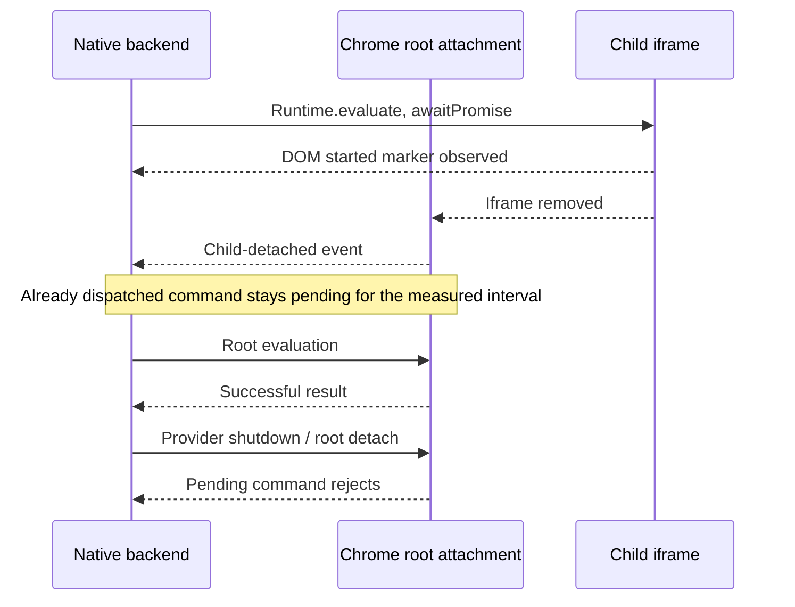

# Native debugger command during child removal

The optional CDB example previously completed a child command, removed its iframe, then sent a new stale command. That did not establish what happens to a command already running when the child disappears. This investigation and the maintained test belong to [Debugger and CDB contract](https://github.com/dvcol/devkit-extension/issues/10).

## Reproduction and source

Chrome `153.0.8010.12`, revision `971a7443b0c9b0a9b2860529b33331b76077ec62`, reproduces the following through raw `chrome.debugger` and through both native CDB backends. The diagnostic reads the revision through a browser-level CDP session; it does not attach another debugger to the inspected target.

1. Attach to an owned top-level tab and enable flattened child auto-attachment. Create an out-of-process cross-origin iframe and observe its actual attached session.
2. Send child `Runtime.evaluate` with `awaitPromise: true`. Its expression sets `document.documentElement.dataset.pendingChildCommand = 'started'`, then returns an unresolved promise.
3. Read that marker directly from the child document. This establishes actual dispatch before removing the iframe.
4. Observe the matching child-detached event and empty child discovery. A newly sent stale child command rejects; a root command still succeeds.
5. Observe the already dispatched command for 1,000 ms while the original lease remains live. It stays pending in the tested browser.
6. Release the lease, then stop the owning provider. The pending CDB call rejects; raw Chrome's promise rejects when its root attachment is detached.



The [tested revision's command dispatch](https://chromium.googlesource.com/chromium/src/+/971a7443b0c9b0a9b2860529b33331b76077ec62/extensions/browser/api/debugger/debugger_api.cc#672) records pending extension requests by request ID and sends the optional child session in the protocol envelope. Its [protocol receiver](https://chromium.googlesource.com/chromium/src/+/971a7443b0c9b0a9b2860529b33331b76077ec62/extensions/browser/api/debugger/debugger_api.cc#740) forwards events without clearing pending requests; an actual response ID clears its corresponding request. The [root-detach cleanup](https://chromium.googlesource.com/chromium/src/+/971a7443b0c9b0a9b2860529b33331b76077ec62/extensions/browser/api/debugger/debugger_api.cc#701) rejects pending requests together. This code and the raw reproduction locate the delayed settlement below CDB and Devframe. They do not establish how every kind of child command or Chrome version behaves.

## Measured outcomes

| Boundary             | After child removal                                               | After lease release                                        | After owning provider/root cleanup                                      |
| -------------------- | ----------------------------------------------------------------- | ---------------------------------------------------------- | ----------------------------------------------------------------------- |
| Raw Chrome debugger  | Still pending after at least 1,000 ms; root evaluation works      | Not a raw Chrome lease operation                           | Rejects with `Detached while handling command.`                         |
| CDB through Devframe | Still pending with its original lease live; root evaluation works | Zero leases, command still pending at the checkpoint       | `REQUEST_CANCELLED`, `The requested target operation is not available.` |
| CDB through DevTools | Same bounded pending observation and preserved root command       | Maintained test releases its lease before provider cleanup | Same native `REQUEST_CANCELLED` rejection                               |

No protocol result or `exceptionDetails` arrived before the measured cleanup in these probes. A bounded pending observation does not mean that a command can never settle. Lease release alone is also distinct from physically detaching the provider's debugger attachment.

The initial attempted assertion expected prompt rejection after child removal. It failed after 10 seconds, when its observation bound coincided with the native lease lifetime. Cleanup then raised `LEASE_REQUIRED`, hiding that first failure inside `SuppressedError`. That unsuccessful test was restored before this shorter investigation; neither the maintained lease nor its timeout was increased.

## Maintained test

The existing child-session fixture now starts the real pending command before removing its iframe. The shared helper verifies the DOM marker, stale-child rejection, empty child discovery, a successful root call and the live lease after the bounded pending interval. Existing lease-release/provider-stop cleanup settles the observed command. The receipt includes that actual rejection, elapsed time, final zero leases, absent attachment and empty captured errors.

```ts
// Sketch of test sequencing, using the existing native capability.
const pending = startNativeChildEvaluation();
await readStartedMarker();
removeOwnedIframe();
await verifyChildRemovedAndStaleCallRejected();
await verifyRootStillUsable();
await observeStillPendingWithinLiveLease(pending);
await releaseNativeLease();
await stopNativeProvider();
await verifyNativeCancellation(pending);
```

The test helper contains the bounded observation. Production code retains native timing, errors and ownership. Existing command and identity-reading functions move unchanged into a small helper to keep the orchestration within strict lint limits.

```sh
pnpm --filter @devkit/example-debugger exec node tests/child-sessions.ts
pnpm --filter @devkit/example-debugger test:devtools
pnpm --filter @devkit/example-debugger test
pnpm --filter @devkit/example-debugger lint
pnpm --filter @devkit/example-debugger typecheck
```

Both maintained browser commands pass on the tested Chrome, with the final Devframe/DevTools pending observations lasting 1,017.6 / 1,012.9 ms and native cleanup rejections recorded at 1,088.0 / 1,081.1 ms from dispatch. All 26 debugger example unit tests, strict Oxlint, TypeScript 7 and formatting pass. Owned browser processes and newly created profiles are gone.

The [Devframe receipt](../../examples/debugger/evidence/child-sessions.json) and [DevTools receipt](../../examples/debugger/evidence/devtools-backend.json) retain the bounded pending state and actual native cleanup error. Independent [raw Chrome and broker diagnostics](../../examples/debugger/evidence/pending-child-command) retain matching child detach events, started markers, live leases and successful root calls. Production and SDK APIs remain unchanged. Full workspace/native acceptance runs in CI after this issue-scoped commit.

## Remaining scope

Prompt rejection solely because a child detaches remains a native Chrome gap. The example adds no SDK timeout, replay, target/session model or callback-rejection shim. Nested frames, workers, same-process contexts, child Fetch interception and broader native permission/recovery cases remain open. No new upstream publication is part of this slice.
