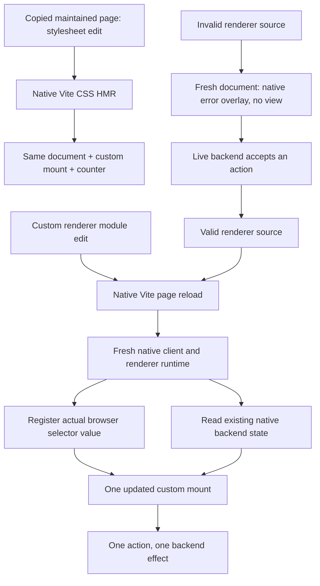

# Native renderer source and style updates

The maintained JSON renderer example delegates updates to Vite. This bounded proof belongs to [Live preview and reload contract](https://github.com/dvcol/devkit-extension/issues/13). It changes no SDK contract, transport, watcher or backend lifecycle.



The fixture copies the real browser sources into an owned temporary directory, adds a native stylesheet, and starts the existing loopback Vite proxy. Actual file writes trigger Vite. There is no injected HMR event or manual navigation after the renderer edit. The genuine Devframe or DevTools backend remains alive while its page reloads.

## Example bug and correction

Firefox restores the renderer selector to custom after the native reload. The example previously registered a custom renderer only in the selector's change listener. Its native runtime therefore mounted reference while the restored control said custom. The pre-fix run observed a fresh document and retained counter at 2, then timed out waiting for the updated custom marker without changing the selection. This is an example startup bug, not a Devframe or Vite bug.

Startup now invokes the same registration function used by the existing change handler. It reads the actual control value and uses native `runtime.context.renderers.register`. Cleanup still owns the returned unregister function. Chromium's native selector reset and Firefox's native restoration remain unchanged.

To reproduce the old failure, remove the initial `registerSelection()` call in `browser/main.ts` and run the Firefox reload command below. The CSS check passes; after renderer reload the restored custom selection has no updated custom mount. Restoring the call makes the same native sequence pass.

## Invalid source and native recovery

The same fixture appends a genuine syntax error to the copied renderer module. Vite reloads the page and its failed Oxc transform produces the native error overlay. The failed document has zero view mounts and disabled renderer controls. Its backend remains live at counter 2; a native backend action advances it to 3 while the frontend cannot initialize.

Writing valid renderer source triggers another native reload. The new document reads counter 3 from the same provider, removes the overlay and mounts the updated custom renderer once. One rendered action reaches 4. The receipt retains the parse-error message and both document changes. Chromium also records the renderer response's HTTP 500 status. Existing page shutdown cleanup owns the old client; no recovery controller, watcher or replay policy is added.

## Maintained confirmation

```sh
pnpm --filter @devkit/example-json-render test:reload:chromium
SE_DRIVER_VERSION=0.37.1 SE_SKIP_DRIVER_IN_PATH=true pnpm --filter @devkit/example-json-render test:reload:firefox
```

Set `FIREFOX_BINARY` when needed. Each command runs both backends and writes its receipt only after all assertions succeed. Each host verifies counter 0 → 1, CSS HMR retaining the exact document/mount at 1, and one action reaching 2. Invalid renderer source creates a failed document while a native backend action reaches 3. The valid edit creates another document, reads that latest state and mounts the updated renderer; one UI action reaches 4. The tests compare provider identity, require one mounted view after recovery, and check the final native view state. All owned browser/server/storage/copy resources close after the run.

The maintained local runs pass on Chromium 153.0.8010.12 and Firefox 157.0 with geckodriver 0.37.1. Chromium captures no uncaught page errors and separately retains the expected native transform error. Firefox WebDriver Classic has no global page-error or HTTP response capture; its receipt retains the actual overlay message. The retained [Chromium receipt](../../examples/json-render/evidence/reload/chromium.json) and [Firefox receipt](../../examples/json-render/evidence/reload/firefox.json) record ten exact checks each, failed and recovered document identities, native selector outcomes and final counter 4 for each backend. CI runs both commands and retains their actual generated JSON.

## Remaining scope

This proves native CSS HMR, renderer-module page reload and invalid-source recovery in development. It does not prove self-accepting renderer replacement, arbitrary rapid edits, injected rendering, backend replacement or watched-production browser refresh. Those remain separate acceptance cells. No common browser form retention or frontend-state restoration policy is inferred.
