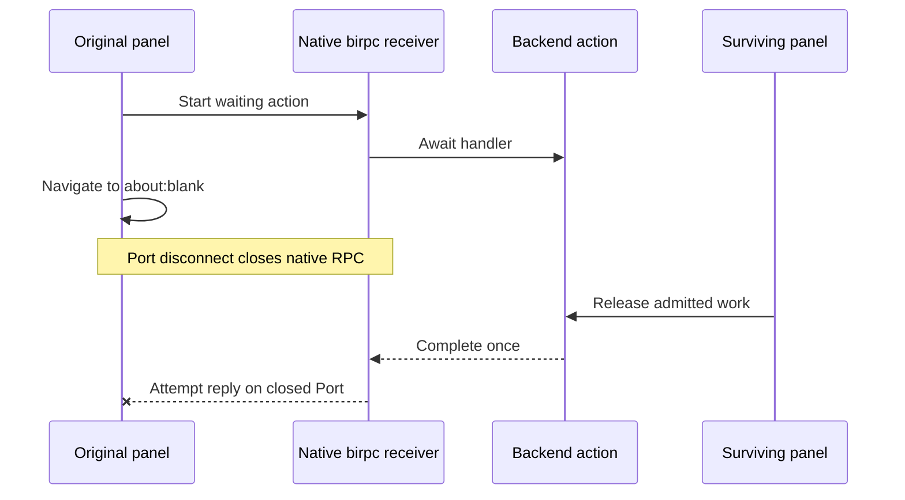

# Native RPC reply after caller navigation

An incoming native RPC handler can finish after its receiver has closed. birpc still tries to serialize and post the reply. Chrome rejects `runtime.Port.postMessage` on the disconnected Port, producing an unhandled background error even though caller cleanup and backend execution completed normally.

Actual Chromium navigation exposed `Attempting to use a disconnected port object` after a panel navigated to `about:blank` while its diagnostic wait was admitted. A surviving peer released that backend handler. The original worker stayed alive and state advanced correctly; the late response was the failure. Firefox permits the same interaction without exposing Chrome's disconnected-Port exception, so its passing navigation test alone did not establish a correction.



## Source and ownership

Pinned [birpc main `e62dda59`](https://github.com/antfu-collective/birpc/blob/e62dda59fd278a3af2f87bd7de77ff6d59419221/src/main.ts#L355-L445) and the inspected npm 4.2.0 release contain this path. `$close()` marks the receiver closed and removes its listener. An already running `onMessage` continues after its awaited resolver or handler and replies without checking that flag. Devframe's public RPC factories delegate to birpc. Devframe 1.0.0 embeds two copies, used by the RPC factory entry points and its high-level client/in-page channel respectively; a standalone birpc override cannot replace them.

The [native source candidate](../probes/native-rpc-late-reply.patch) adds one closed-state guard after existing function-error reporting and before response serialization/posting. This preserves handler completion and diagnostic callbacks. It adds no cancellation, rollback, retry, routing, state engine or public API. The workspace's existing exact-version `devframe@1.0.0` patch applies that guard to both bundled copies and preserves its earlier backports. Published SDK consumers do not automatically receive private workspace patches.

This correction covers closure while an incoming resolver or handler is awaited. It does not claim to fix closure during an asynchronous transport post or every fallback-error response race. Those require their own reproduction. An already admitted handler can still produce backend effects after its caller leaves.

## Reproduction and verification

The maintained [native Port test](../../packages/webext/tests/channel.test.ts) uses only public native RPC factories and the Port binding. It has no SDK provider, router, shared state or renderer. Its existing MessageChannel fixture now reflects Chrome's real error when posting after disconnect and observes completion of the actual incoming native callback at the I/O boundary.

```sh
pnpm --filter @devkit/webext exec vitest run tests/channel.test.ts
```

On the previous installed package, both JSON and structured-clone cases complete their admitted handler and attempt one post after disconnect, failing the zero-post assertion. With the guard, both pass. Two additional cases let a handler fail after closure and verify that `onFunctionError` still receives that error while no reply is attempted. Normal open-connection replies, closed caller rejection, one handler completion and listener cleanup retain their checks.

The separate source candidate adds deferred success/failure cases to birpc's existing `test/close.test.ts`. Applying only its tests to pinned unchanged native source reproduces both late replies; applying the production guard passes the same tests, including zero response serialization. The initial checks used workspace Vitest 5.0.1. On 2026-10-04, a fresh upstream checkout at `e62dda59` installed its unchanged frozen lockfile with pnpm 11.21.0. Upstream Vitest 4.1.10 reproduces both failures with eight existing controls passing, then passes all ten cases with the guard. Native ESLint 10.8.1 on the two changed files, TypeScript 6.0.3 and the single-package tsdown build pass. The lockfile and manifests remain unchanged. [Exact validation receipt](../probes/native-rpc-late-reply-validation.json) and [prepared draft description](../probes/native-rpc-late-reply-draft.md).

```sh
# In the pinned upstream checkout after applying the candidate:
pnpm install --frozen-lockfile
pnpm exec vitest run test/close.test.ts test/error.test.ts test/resolver.test.ts
pnpm exec eslint src/main.ts test/close.test.ts
pnpm run typecheck
pnpm run build
```

Only the three affected test files and two changed lint files were checked locally. Full upstream CI has not been run or claimed.

Rebuilt production extensions pass actual Chromium and Firefox navigation through two independently connected native panels. The returning document receives a fresh caller, current state and one mount per view. The original sibling keeps its caller and provider, completes admitted work once, then closes while the returning panel continues. Chromium captures no page or worker errors. Firefox retains its WebDriver Classic global-error-capture limitation. Both browsers also pass the existing natural-suspension scenario with a waiting RPC after this correction. Storage writes precede these interactions; physical interrupted-write and crash durability remain unproved.

Remove this backport when an unpatched native release passes the maintained late-success, late-failure, open-connection and actual Chromium navigation checks. The generic source fix belongs in birpc, followed by a Devframe adoption/rebuild. No upstream PR has been opened; publication requires owner approval.
