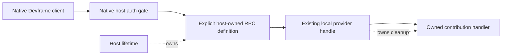

# Native RPC registration and connection lifetime

Research for [Server adapter contract](https://github.com/dvcol/devkit-extension/issues/6), checked on 2026-09-27. This record distinguishes native behavior from the portable lifecycle guarantees already accepted in [ARCHITECTURE.md](../../ARCHITECTURE.md).

## Conclusion

An authenticated example with a fixed set of explicitly named, host-owned RPC definitions can proceed using public Devframe APIs. Its handlers can delegate directly to the existing local provider handle. No generic remote dispatcher, new authentication layer, or RPC engine is required.

That example does **not** settle fully dynamic remote registration. Native RPC declarations lack an unregister operation that also notifies subscribers. Server-side ordinary-call cancellation on client disconnect is another separate gap: standalone Devframe entry points expose disconnect hooks, but the installed hub entry point does not. Neither gap prevents proving native authentication, named operations, value transport, and provider disposal with a bounded host-owned example.

## Versions and evidence

- Installed artifacts: patched `devframe@1.0.0` and `@devframes/hub@1.0.0`, resolved through `packages/server/node_modules`. The Devframe patch is the repository's [connection isolation backport](../../patches/devframe@1.0.0.patch); this investigation does not change it.
- Upstream source checkout: [`a3f967755af99a0a0d8dd82b7b5d4f3dd4aec0bc`](https://github.com/devframes/devframe/tree/a3f967755af99a0a0d8dd82b7b5d4f3dd4aec0bc). Source links below point to that revision. Source and installed declarations/bundles were inspected separately; their complete equivalence is not assumed.
- An executable Node assertion probe against the installed package verified definition replacement, in-flight handler ownership, setup caching, deletion without notification, and low-level client `$close()` rejection. This research probe did not exercise a real browser or socket; the maintained authenticated host fixture owns those integration checks.

## Registration, replacement and caches

The public `ctx.rpc` surface extends `RpcFunctionsCollectorBase`. Its `definitions` property is a mutable `Map`, despite the property reference being readonly. The collector reads the current definition whenever its `functions` proxy is accessed. [Collector implementation](https://github.com/devframes/devframe/blob/a3f967755af99a0a0d8dd82b7b5d4f3dd4aec0bc/packages/devframe/src/rpc/collector.ts#L10), [public RPC host type](https://github.com/devframes/devframe/blob/a3f967755af99a0a0d8dd82b7b5d4f3dd4aec0bc/packages/devframe/src/types/rpc.ts#L32).

| Public operation             | Native behavior                                                             | Lifetime implication                                            |
| ---------------------------- | --------------------------------------------------------------------------- | --------------------------------------------------------------- |
| `register(definition)`       | Rejects an existing name; registers and notifies `onChanged` listeners      | Appropriate for a host's initial explicit exposure              |
| `register(definition, true)` | Overwrites an existing name                                                 | Does not dispose the old handler or its resources               |
| `update(definition)`         | Rejects an unknown name; replaces a known definition and notifies listeners | Subsequent dispatch resolves the new definition                 |
| `update(definition, true)`   | Also creates a missing definition                                           | Upsert, not an ownership/cleanup primitive                      |
| `onChanged(listener)`        | Returns an unsubscribe function                                             | Own and dispose this subscription normally                      |
| `definitions.delete(name)`   | Removes the map entry                                                       | Does not notify `onChanged` listeners or perform cleanup        |
| `unregister`                 | Absent                                                                      | There is no complete native remove-and-notify operation to call |

These statements follow the [register/update/onChanged implementation](https://github.com/devframes/devframe/blob/a3f967755af99a0a0d8dd82b7b5d4f3dd4aec0bc/packages/devframe/src/rpc/collector.ts#L43). Direct map deletion is exposed JavaScript, but it is insufficient to promise coherent dynamic removal to consumers observing the native registry. Mutating the map and fabricating a change event would require access to implementation details.

There are two different caches:

1. **Definition setup cache.** A successful `setup(context)` result is cached on that definition object, keyed by context. Registering/updating a fresh definition object uses a fresh cache. Updating the same definition object does not rerun its successful setup. Rejected setup is evicted for retry. There is no associated setup-result disposer. An already obtained handler keeps its old closure even after replacement. [Handler resolution](https://github.com/devframes/devframe/blob/a3f967755af99a0a0d8dd82b7b5d4f3dd4aec0bc/packages/devframe/src/rpc/handler.ts#L19), [setup-result shape](https://github.com/devframes/devframe/blob/a3f967755af99a0a0d8dd82b7b5d4f3dd4aec0bc/packages/devframe/src/rpc/types.ts#L82).
2. **Optional client result cache.** `getDevframeRpcClient` defaults `cacheOptions` to `false`; its optional cache indexes method and serialized arguments. Server `update()` does not invalidate this client cache automatically. Keep it disabled for operations whose freshness and provider incarnation matter. Reuse explicit native cache controls only where a consumer deliberately wants cached results. [Client cache integration](https://github.com/devframes/devframe/blob/a3f967755af99a0a0d8dd82b7b5d4f3dd4aec0bc/packages/devframe/src/client/rpc.ts#L334), [cache manager](https://github.com/devframes/devframe/blob/a3f967755af99a0a0d8dd82b7b5d4f3dd4aec0bc/packages/devframe/src/rpc/cache.ts#L13).

The installed-package probe started an old handler, updated its definition while it awaited a gate, verified that subsequent dispatch returned the new result, then released the old call and observed its original result. Native replacement does not reroute an already selected handler. It also does not cancel that handler or establish a portable contribution cleanup barrier.

## Smallest usable lifetime

For the immediate example, register the finite RPC definitions once for the native host lifetime and close over the existing provider handle. Contribution disposal remains owned by that provider. After its disposal, the native function may still be registered, but its attempted local invocation rejects through the existing provider lifecycle. The application tears down the host separately.



The names describe the actual exposed operations. They need no `agent` field unless agent exposure is explicitly desired. The example should reuse the existing schemas and native transport, document its host-owned declaration lifetime, and avoid presenting itself as automatic publication of every installed contribution.

If a later host deliberately replaces the provider behind the same finite definitions, an indirection slot is sufficient **only with the already accepted incarnation rules**:

```ts
// Illustrative host composition, not a proposed SDK wrapper or wire contract.
context.rpc.register({
  name: 'example:counter:increment',
  handler: async (request) => {
    const provider = currentProvider;
    assertExpectedProvider(request, provider);
    return provider.invoke({ action: incrementAction, input: request.input });
  },
});
```

The host captures one provider before awaiting, rejects an unavailable or unexpected incarnation, and never reloads the slot during that invocation. It clears availability before beginning old-provider disposal, waits for successful cleanup before exposing a successor, and retains the blocked state if cleanup fails. These are composition obligations derived from the [accepted provider lifecycle](../../ARCHITECTURE.md#identity-admission-and-strictness), not native `update()` behavior. A stable provider fixture does not need this extra slot.

This limited approach avoids unregister **because the declarations belong to the host**. It does not justify retaining an unbounded history of dynamically installed operation names. Full automatic contribution exposure still needs either a supported native removal lifecycle or an explicit bounded host exposure model. Do not introduce an opaque universal dispatcher merely to hide that unresolved distinction.

## Disconnect and cancellation

| Surface                                             | Available behavior                                                                                                                    | What it does not establish                                                    |
| --------------------------------------------------- | ------------------------------------------------------------------------------------------------------------------------------------- | ----------------------------------------------------------------------------- |
| `getDevframeRpcClient` / native high-level client   | `status`, `connectionError`, `events.on('connection:status', ...)`; pending ordinary calls reject on disconnect/error/auth revocation | Server execution cancellation or undo                                         |
| `createRpcClient` with a supplied channel           | Native birpc request correlation; `$close()` rejects its pending calls                                                                | Automatic socket-close wiring, authentication bootstrap, or connection status |
| `createWsRpcChannel`                                | `onDisconnected`, `onError`, and transport `close()`                                                                                  | Calls `$close()` on an independently created low-level client                 |
| `initDevframe` / `createDevServer` options          | Public `onPeerConnect` and `onPeerDisconnect` hooks                                                                                   | A late subscription API on an existing `ctx.rpc`                              |
| `initHub` options, installed `@devframes/hub@1.0.0` | Native auth and host transport ownership                                                                                              | No exposed or forwarded `onPeerDisconnect` / `onPeerConnect` options          |
| `ctx.rpc.getCurrentRpcSession()`                    | Current session and metadata inside a native remote handler                                                                           | A session abort signal or disconnect subscription                             |
| Native streaming channels                           | Stream cancellation; outbound sink signal aborts when its last subscriber cancels/disconnects                                         | Cancellation for ordinary unary RPC handlers                                  |

Sources: [high-level pending-call guards](https://github.com/devframes/devframe/blob/a3f967755af99a0a0d8dd82b7b5d4f3dd4aec0bc/packages/devframe/src/client/rpc-live.ts#L75), [client events](https://github.com/devframes/devframe/blob/a3f967755af99a0a0d8dd82b7b5d4f3dd4aec0bc/packages/devframe/src/client/rpc.ts#L35), [low-level client](https://github.com/devframes/devframe/blob/a3f967755af99a0a0d8dd82b7b5d4f3dd4aec0bc/packages/devframe/src/rpc/client.ts#L4), [WebSocket channel](https://github.com/devframes/devframe/blob/a3f967755af99a0a0d8dd82b7b5d4f3dd4aec0bc/packages/devframe/src/rpc/transports/ws-client.ts#L34), [standalone lifecycle hooks](https://github.com/devframes/devframe/blob/a3f967755af99a0a0d8dd82b7b5d4f3dd4aec0bc/packages/devframe/src/adapters/dev.ts#L117), [hub options and shell composition](https://github.com/devframes/devframe/blob/a3f967755af99a0a0d8dd82b7b5d4f3dd4aec0bc/packages/hub/src/node/initiate.ts#L407), [session and streaming types](https://github.com/devframes/devframe/blob/a3f967755af99a0a0d8dd82b7b5d4f3dd4aec0bc/packages/devframe/src/types/rpc.ts#L18).

The installed low-level client returned `$close()`, and the probe verified that it rejects a pending request. A custom channel adapter must connect its actual disconnect notification to that native method and remove its transport listeners when disposed; it should not recreate a pending-request map. `createWsRpcChannel` itself only invokes the supplied disconnect callback. The high-level native client already supplies its own connection guards, so do not stack another generic pending-call engine above it.

On the server, the native transport removes the disconnected channel and invokes the disconnect hook. The core forwards that event to streaming cleanup. Neither the ordinary RPC handler signature nor session metadata carries a cancellation signal. [WebSocket disconnect path](https://github.com/devframes/devframe/blob/a3f967755af99a0a0d8dd82b7b5d4f3dd4aec0bc/packages/devframe/src/rpc/transports/ws-server.ts#L359), [core disconnect forwarding](https://github.com/devframes/devframe/blob/a3f967755af99a0a0d8dd82b7b5d4f3dd4aec0bc/packages/devframe/src/node/rpc-core.ts#L147), [session metadata](https://github.com/devframes/devframe/blob/a3f967755af99a0a0d8dd82b7b5d4f3dd4aec0bc/packages/devframe/src/rpc/transports/session.ts#L96).

Consequently, “the client sees a disconnect error” is supported today; “the backend operation received an abort signal when that client disconnected” is not an automatic native guarantee. A full adapter needing the latter must demonstrate a supported host event at construction time and pass its signal into the existing provider call. An existing hub context alone is insufficient. Client cancellation also needs a supported per-operation mechanism if it must reach the backend; do not serialize an `AbortSignal` or claim that rejecting a local promise stops remote effects. Keep the accepted no-replay rule in every case.

## Authentication and operation names

The native host applies `DevframeAuthHandler.authorize(methodName, session)` before invoking the resolved handler. It establishes the current session through native async context. The public server entry points already install this behavior. The default interactive handler allows the anonymous authentication namespace and otherwise requires a trusted session. [Auth contract](https://github.com/devframes/devframe/blob/a3f967755af99a0a0d8dd82b7b5d4f3dd4aec0bc/packages/devframe/src/node/auth/handler.ts#L18), [native resolver gate](https://github.com/devframes/devframe/blob/a3f967755af99a0a0d8dd82b7b5d4f3dd4aec0bc/packages/devframe/src/node/rpc-core.ts#L93), [interactive authorization](https://github.com/devframes/devframe/blob/a3f967755af99a0a0d8dd82b7b5d4f3dd4aec0bc/packages/devframe/src/recipes/interactive-auth.ts#L257).

Meaningful per-operation RPC names preserve that authorization granularity. The auth hook does not receive the business payload; a single `invoke` method with an action name hidden inside its input prevents that hook from distinguishing actions. Target-sensitive checks remain at the actual target boundary, where the target and sender can be inspected. Ordinary native calls need no mandatory second SDK authentication mechanism.

Reusing `createRpcClient` and a channel reuses RPC mechanics, **not** the full native connection/bootstrap policy. Likewise, bare `createRpcServer` is a birpc group constructor: it does not independently install the context's auth gate. For native servers use the existing public host entry point; for a future extension channel use its real platform sender authority, with the trust design scoped to that realm. Do not import `createContextRpcServer` merely because it appears in an exported `devframe/internal` module: upstream marks that surface explicitly unstable. [Bare RPC server](https://github.com/devframes/devframe/blob/a3f967755af99a0a0d8dd82b7b5d4f3dd4aec0bc/packages/devframe/src/rpc/server.ts#L4), [internal-surface boundary](https://github.com/devframes/devframe/blob/a3f967755af99a0a0d8dd82b7b5d4f3dd4aec0bc/packages/devframe/src/node/index.ts#L4).

Native `invokeLocal` intentionally bypasses transport authentication. Calling it in a fixture cannot prove that remote authorization worked; an authenticated socket test must reach the native resolver. [Local invocation](https://github.com/devframes/devframe/blob/a3f967755af99a0a0d8dd82b7b5d4f3dd4aec0bc/packages/devframe/src/node/host-functions.ts#L58).

## Validation export correction

`validateRpcArgs` and `validateRpcReturn` are exported from `devframe/rpc`, but both are explicitly annotated `@internal`. Describe them as **exported but marked internal**, rather than nonexistent/private-path-only exports. Reuse normal native declaration `args`/`returns` when registering native RPC functions; do not depend directly on these helpers to remove a small portable Standard Schema guard. [Exports](https://github.com/devframes/devframe/blob/a3f967755af99a0a0d8dd82b7b5d4f3dd4aec0bc/packages/devframe/src/rpc/index.ts#L7), [internal annotations](https://github.com/devframes/devframe/blob/a3f967755af99a0a0d8dd82b7b5d4f3dd4aec0bc/packages/devframe/src/rpc/validate-io.ts#L32).

## Next implementation boundary

Proceed with an explicit native host example that verifies unauthorized rejection, successful authenticated named calls, supported value round trips, and provider lifecycle rejection through real RPC. Keep result caching off and expose no automatic agent dispatcher. The native host owns the finite declarations; the provider owns its contribution resources.

Leave the full automatic remote adapter open until it has evidence for dynamic declaration removal/advertisement, expected-incarnation dispatch, and backend cancellation through each supported host's actual lifecycle. These are concrete integration gaps, not reasons to introduce a second auth system or transport protocol, and they do not require a new decision before the bounded example can be implemented.
