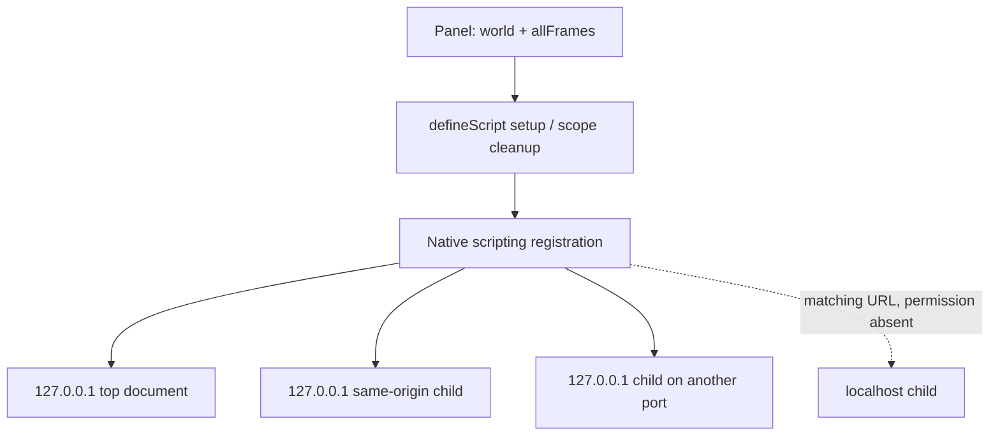

# Native script frames and page CSP

This example extends the existing `defineScript` recipe with native `allFrames`. Registration still uses `scripting.registerContentScripts`; the contribution scope owns `unregisterContentScripts`. Core and the adapters gain no API, frame router or permission policy. The owning ticket is [Injection and transform contract](https://github.com/dvcol/devkit-extension/issues/11).

## Implemented example

The extension panel has an **Include matching child frames** checkbox, initially unchecked. Its existing MAIN and ISOLATED buttons install the same contribution with `{ world, allFrames }`. These are private example controls, not a new SDK declaration API.

```ts
defineScript({
  id: 'example.bootstrap',
  execution: defineExecution({ id: 'example.background' }),
  async setup({ scope }) {
    await chrome.scripting.registerContentScripts([
      {
        id: 'example-script-timing',
        js: ['script-timing.js'],
        matches: matchingFixturePaths,
        runAt: 'document_start',
        world,
        allFrames,
        persistAcrossSessions: false,
      },
    ]);
    scope.onDispose(() =>
      chrome.scripting.unregisterContentScripts({ ids: ['example-script-timing'] }),
    );
  },
});
```

This sketch omits the unchanged example controller and its status display. `matchingFixturePaths` represents the actual four fixed `/index.html` and `/frame.html` patterns on `127.0.0.1` and `localhost`. Both hosts match registration, but only `127.0.0.1` has granted host permission. Registration acceptance alone therefore does not establish permission to inject.



The different port makes the third document cross-origin without changing the granted host. The tests read every document directly through the browser driver. The page has no privileged bridge to the extension.

## Assertions and observations

Each Chromium and Firefox run covers eight active combinations: two worlds, `allFrames` false/true, and ordinary/nonce CSP. Every combination inspects the top document and all three children.

| Native option      | Top document | Same-origin child | Cross-origin child with host permission | Matching localhost child without permission |
| ------------------ | ------------ | ----------------- | --------------------------------------- | ------------------------------------------- |
| `allFrames: false` | Injected     | Absent            | Absent                                  | Absent                                      |
| `allFrames: true`  | Injected     | Injected          | Injected                                | Absent                                      |

The nonce policy is `default-src 'none'; script-src 'nonce-fixture-reader'; frame-src http://127.0.0.1:* http://localhost:*`. A nonce-authorized first page script records injection timing; an ordinary inline control must stay blocked and produce a script-source CSP violation. Without the nonce reader, a blocked observer could falsely suggest that native injection never happened.

The tested packaged `document_start` code executes under this policy in both worlds. In MAIN, its global is visible to the page. In ISOLATED, the global stays private while its DOM marker is visible. Both markers establish execution while `document.readyState` is `loading`, before the first page script. These observations concern native packaged registration, not a page-created `<script>` element or every operation that injected code might subsequently attempt. Chrome's [content-script CSP documentation](https://developer.chrome.com/docs/extensions/develop/concepts/content-scripts#content_security_policy) describes the world's policies; the retained native observations establish this fixture's initial execution.

With child frames enabled, the tests then click the actual disable and enable buttons under CSP. Disable empties native registration and leaves already executed effects intact; fresh documents contain no injected markers. Enable starts generation 2, restores native registration and injects into fresh permitted documents. Dispose empties registration and leaves subsequent documents uninjected. The localhost permission remains absent before and after the scenario.

## Maintained confirmation

```sh
pnpm --filter @devkit/example-webext build
pnpm --filter @devkit/example-webext test:browser
pnpm --filter @devkit/example-webext test:firefox
pnpm --filter @devkit/example-webext test:dev:chromium
pnpm --filter @devkit/example-webext test:dev:firefox
pnpm --filter @devkit/example-webext test
pnpm --filter @devkit/example-webext lint
pnpm --filter @devkit/example-webext typecheck
```

The maintained suites call `chromium-script-contexts.ts` and `firefox-script-contexts.ts` in production and WXT development. Each writes `script-contexts.json` only after all assertions pass. Receipts retain native registrations, permission observations, per-document markers, blocked controls and lifecycle snapshots. CI already retains the four artifact directories and verifies the exact named checks through the API matrix.

All four maintained browser commands pass on Chrome `153.0.8010.12` and Firefox `157.0`, on macOS with Node `24.20.0`. Each receipt has 14 named checks and 72 document observations, including the existing-document, disabled and restored lifecycle reads. Independent receipt verification confirms all 56 exact matrix checks and all 288 document observations. The Chrome production suite also reports no page errors. All 30 extension unit tests, strict type-aware Oxlint, TypeScript 7 and scoped formatting pass; both native production builds pass.

Retained observations are in [Chromium production](../../examples/webext/evidence/script-contexts/chromium-production.json), [Firefox production](../../examples/webext/evidence/script-contexts/firefox-production.json), [Chromium development](../../examples/webext/evidence/script-contexts/chromium-development.json) and [Firefox development](../../examples/webext/evidence/script-contexts/firefox-development.json). The four maintained browser commands complete their owned browser/fixture teardown. Full workspace and Linux native acceptance runs in CI after the issue-scoped commit.

## Remaining scope

This slice does not establish injection into blank/blob/sandboxed frames, origin fallback, frame replacement, later injection stages, permission-revocation rollback, browser restart, dependency loss during registration or native cleanup failure. It does not promise to undo existing page effects. Those obligations remain with the native contribution recipes and their owning tickets, rather than a generic SDK enforcement layer.
