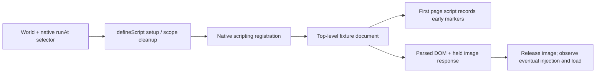

# Native content-script stages

The maintained extension example now passes native `runAt` through the existing `defineScript` recipe. A panel selector chooses `document_start`, `document_end` or `document_idle`; MAIN/ISOLATED and matching-child-frame controls retain their native meaning. Core and adapters gain no public API, timing scheduler or injection policy. This slice belongs to [Injection and transform contract #11](https://github.com/dvcol/devkit-extension/issues/11).

## Implemented example

The private example action accepts `{ world, allFrames?, runAt? }`. Omitting `runAt` keeps the existing `document_start` default. Registration and cleanup continue through native scripting methods:

```ts
defineScript({
  id: 'example.bootstrap',
  execution: defineExecution({ id: 'example.background' }),
  async setup({ scope }) {
    await chrome.scripting.registerContentScripts([
      {
        id: 'example-script-timing',
        js: ['script-timing.js'],
        matches: matchingFixturePaths,
        world,
        allFrames,
        runAt,
        persistAcrossSessions: false,
      },
    ]);
    scope.onDispose(() =>
      chrome.scripting.unregisterContentScripts({ ids: ['example-script-timing'] }),
    );
  },
});
```

This sketch omits the unchanged controller. The native browser chooses when the packaged script executes. The script's existing harmless event listener exposes its captured injection readyState through a DOM marker; MAIN also exposes its global to the page, while ISOLATED keeps that global private.



## Direct native assertions

Each browser/mode run covers three stages in two worlds. The HTTP fixture holds an actual image response so DOM completion can be inspected before the window load event. Drivers inspect the page directly; no privileged page-to-extension bridge is introduced. Firefox navigates by ordinary page location assignment to inspect this interval without changing its native page-load strategy.

| Selected stage   | Assertion                                                                                                                                                                        |
| ---------------- | -------------------------------------------------------------------------------------------------------------------------------------------------------------------------------- |
| `document_start` | First page script observes injection captured at `loading`; only MAIN exposes the injected global.                                                                               |
| `document_end`   | First page script has no injection marker. Injection is observed at `interactive` while the DOM sentinel exists, the image is incomplete and window load has not fired.          |
| `document_idle`  | First page script has no injection marker. Injection eventually occurs with a captured `interactive` or `complete` state; no fixed delay or before/after-load order is required. |

All four maintained receipts captured idle injection at `interactive` in this fixture. A separate disposable Firefox probe had captured `complete`. Neither observation becomes an SDK guarantee or cross-browser normalization rule. The [native Chrome stage contract](https://developer.chrome.com/docs/extensions/reference/api/extensionTypes#type-RunAt) allows browser-chosen idle timing. The tests retain both held-resource and complete-document snapshots rather than requiring one observed ordering.

For end and idle, tests disable the actual contribution, verify an empty native registration set and preserved effects in the old page, then verify a fresh page remains uninjected. Enable restores generation 2 and the selected native stage. Every stage is disposed through the actual UI; registration empties, existing effects remain, and another fresh document has no injected marker.

## Confirmation and evidence

All four maintained commands pass on Chrome `153.0.8010.12` and Firefox `157.0` with geckodriver `0.37.1`: `test:browser`, `test:firefox`, `test:dev:chromium` and `test:dev:firefox` in `@devkit/example-webext`. They use the existing production and WXT development suites. The affected build, strict Oxlint, TypeScript 7, formatting and all 31 unit tests pass; a new real TCP teardown case verifies the added fixture closes its unused peer.

Each receipt contains six world/stage cells, ten exact checks, native lifecycle snapshots and 50 document snapshots. Independent review verifies all 40 named checks and 200 document snapshots across the four receipts, including native selected stages, empty disabled/disposed registrations, preserved old effects and absent fresh-document markers. The retained receipts are [Chromium production](../../examples/webext/evidence/script-stages/chromium-production.json), [Firefox production](../../examples/webext/evidence/script-stages/firefox-production.json), [Chromium development](../../examples/webext/evidence/script-stages/chromium-development.json) and [Firefox development](../../examples/webext/evidence/script-stages/firefox-development.json).

CI already runs all four commands and retains their artifact directories. The API matrix now requires the exact ten checks from each generated `script-stages.json`. Full Linux acceptance runs after the issue-scoped commit. Fixture servers, tabs and disposable browser sessions close after the maintained commands.

## Remaining scope

This held-resource proof covers top-level documents. The separate [frame/CSP proof](./native-script-contexts.md) now covers all three native stages across both worlds, frame-inclusion settings, granted/ungranted children and the tested nonce policy. Its idle timing differs from this fixture and remains native. Blank/blob/sandboxed frames, origin fallback, permission transitions, browser restart, dependency loss during native registration and cleanup failure are separate obligations. Unregistering cannot undo already executed page effects. Firefox WebDriver Classic still lacks global page-error capture here.
