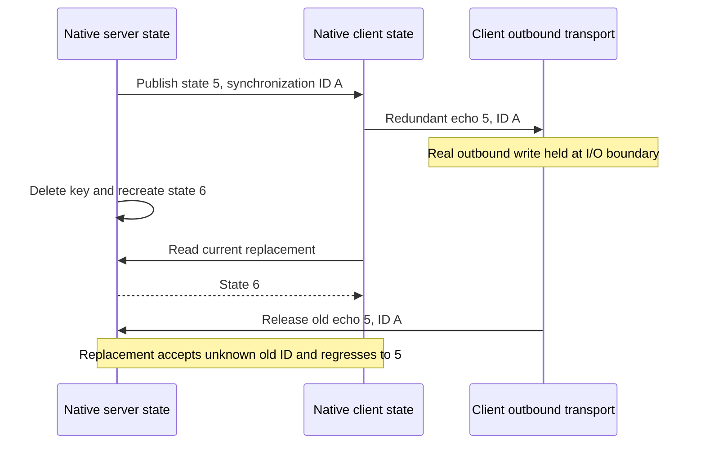

# Native inbound shared-state echo

A native client receiving a server snapshot or patch emitted a redundant write with the same synchronization ID. If that write arrived after the server deleted and recreated its state key, the replacement had no record of the old ID and accepted the stale value. The deterministic regression republishes counter 6, then releases a genuine delayed echo that overwrites it with 5.

This reproduces a reachable cause matching the earlier CI renderer-remount failure. That job did not capture wire ordering, so the diagnosis does not establish its exact packet history. The failure occurred after `viewPlugin.enable()`, before the later service-reenable step. Unchanged local runs and subsequent CI also passed; those passes were not treated as a correction.

## Native correction

The [inspected upstream source](https://github.com/devframes/devframe/blob/72d917d5a57837b748bc9c950a0216049d13363e/packages/devframe/src/client/rpc-shared-state.ts) at main `72d917d5` still contains the echo. The [reviewable source candidate](../probes/native-state-echo.patch) adds 20 production lines and removes 3, plus three focused native regression cases. One private helper tracks the exact state object and received synchronization ID during an inbound update and restores the previous context in `finally`. The outbound listener suppresses only that received update.

A user-authored write with a new ID still propagates, including a synchronous write from an update listener. Writing another key with the received ID also propagates. A blanket receive guard or a host-wide ID set would reject those valid cases. No public API, declaration, server-state mechanism, renderer, serializer, wire format or generated state-key identity changes. This does not introduce ordering guarantees for separately delayed server broadcasts or durable writes.

The exact-version `devframe@1.0.0` backport updates its existing `dist/client/index.mjs` and public `dist/rpc/shared-state.mjs` factory copies. `pnpm patch` preserves the previous backports; the lockfile changes only the patch hash and its resolved dependency references. The private workspace patch is not automatically supplied to published consumers.

## Executed proof

The maintained [public-API regression](../../packages/devframe/tests/shared-state-echo.test.ts) connects actual native RPC/shared-state factories over `MessageChannel`. It queues all client outbound messages only during server publication, resumes normal sends before replacement retrieval, then releases the queued frames. A native GET follows on the same ordered port to confirm the server's actual result. It does not inspect birpc envelopes, recreate serialization or add a production testing parameter.

- The identical installed-package test first fails both snapshot and patch cases with expected 6, received 5. The cross-key control passes on that baseline.
- With the native correction installed, all three cases pass, including ordinary local writes, nested user writes and cross-key synchronization-ID reuse.
- The affected adapter, Port and server suites pass with strict lint and TypeScript 7. The real Chromium custom/reference renderer scenario passes on both Devframe and DevTools hosts with no captured page errors. The packed native-consumer check passes public exports, strict Bundler/NodeNext types, actual native hosts and browser RPC.
- Rebuilt production extensions pass both complete native Chromium and Firefox suites, including their existing view republication and response-body checks. Chromium reports no captured page errors; Firefox retains its WebDriver Classic capture limitation. This is confirmation of the installed runtime backport, not a substitute for the new deterministic delayed-I/O regression.
- The proposed upstream source passes four focused native files with eight tests, native ESLint and native package type checking. Those source checks use an existing cached native dependency graph, not a fresh install of the upstream main lockfile.

Browser source-diagnosis probes used Chromium 153.0.8010.12 and Node 26.9.0; installed-package checks used Node 24.20.0, Vitest 5.0.1 and TypeScript 7.0.2. The probes changed the served native function in memory and added no maintained example instrumentation. Their observed server and browser values preserve replacement 6 and propagate ordinary 7, nested 9 and cross-key 10. The maintained browser command subsequently passes against the installed exact-version patch.

Remove this correction from the workspace patch when an unpatched released native package passes the maintained snapshot/patch, nested-write, cross-key and affected real-browser checks. Publishing a new upstream draft requires owner approval; the local backport is already authorized. Full workspace CI remains the completion gate for each pushed integration commit.
