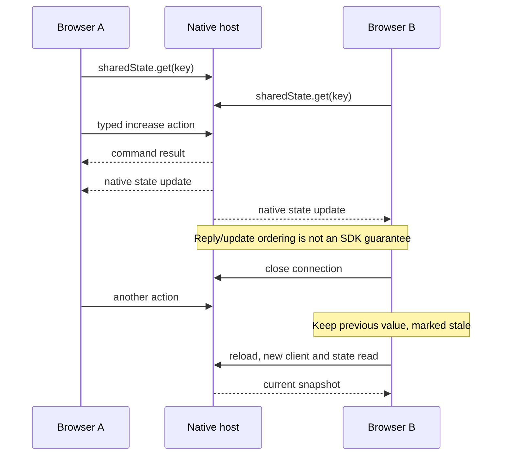

# Native state observation

Evidence for [State scope and recovery #8](https://github.com/dvcol/devkit-extension/issues/8), 2026-09-27. The maintained example uses `devframe@1.0.0` with the existing connection isolation patch, `@devframes/hub@1.0.0` and `@vitejs/devtools-kit@0.7.5`. It adds no SDK state abstraction or upstream patch.

## Implemented path

The service owns a native state key within its host. Each browser document owns an isolated native client, its portable provider attachment and a native state observation. The public action still returns its typed result. The displayed counter comes from state updates so that another client's action is visible without polling.

```ts
// After native authentication and provider attachment have completed:
const state = await nativeClient.sharedState.get<{ value: number }>(counterStateKey);
const unsubscribe = state.on('updated', (value) => render(value.value));
render(state.value().value);

// The initiating UI can separately report command completion.
const result = await client.actions.invoke({ action: increaseCounterAction, input: { amount: 1 } });
```

The browser supplies no `initialValue`, so this path waits for the native initial server read. `state.on` observes later changes; the example explicitly renders the current value after subscribing. This proves the tested snapshot/update flow, not atomic snapshot/stream ordering under every concurrent write.

Disconnect removes observation and adapter listeners, closes the owned native client, disables actions and marks the retained value stale. Reload creates a fresh connection, authenticates, attaches the provider and reads a fresh native snapshot. There is no automatic retry, replay, connection supervisor or missed-event history. Page/HMR disposal uses the same owned cleanup; late startup resources are disposed if their document lifetime already ended.



## Automated and live proof

`examples/server-contexts/tests/state.test.ts` runs against both genuine native hosts and consumes their built package export. Six tests cover:

- Two clients observing the same key, with action completion and peer updates.
- A separate host keeping a separate value under the same key.
- Removing a UI listener while the native handle remains live.
- Closing a client, changing state while it is absent, then opening a new client and reading the latest snapshot under the same backend incarnation.
- Disposing/replacing a portable provider while native state and peer observers survive. Old action bindings reject; a new attachment reads the retained value and can act.
- A separate fresh in-memory host starts from the initial value under the same key.
- Closing one client without preventing another client's operations.
- Native client mutation remaining writable under this example's native authorization policy.

The in-app browser confirmation ran the maintained Vite-served page on both hosts:

| Step                                  | Devframe                                      | DevTools                                       |
| ------------------------------------- | --------------------------------------------- | ---------------------------------------------- |
| Open two tabs                         | Both read `0`, same incarnation               | Both read `0`, same incarnation                |
| Increment in first tab                | Both show `1`; peer sent no command           | Both show `1`; peer sent no command            |
| Disconnect peer, increment first      | First shows `2`; peer stays `1`, marked stale | First shows `2`; peer stays `1`, marked stale  |
| Reload peer                           | Reads `2`, unchanged incarnation              | Reads `2`, unchanged incarnation               |
| Close first tab, increment peer       | Peer reaches `3`                              | Peer reaches `3`                               |
| Separate host during Devframe changes | DevTools stays at `0`                         | Independent state confirmed                    |
| Stop native host                      | Covered by existing server socket tests       | Open page marks `3` stale and disables actions |

These are browser interaction receipts, separate from the automated socket tests. The temporary tabs and demo processes were closed afterward. No Chromium or Firefox extension, persistence, automatic reconnect or complete HMR conformance is claimed.

## Native behavior that still matters

The inspected native client caches state by key, registers update handlers and sends subscribe/read requests when the state is first initialized. Its `get` overload with an `initialValue` returns the local placeholder before the authoritative read completes. An untrusted client can also receive a local handle before trust completes. The example avoids both paths by attaching its authenticated provider first and omitting a client initial value.

A native `SharedState` remains writable. Calling its `mutate` method reaches the server without invoking a portable action; the test observes `42` from the peer and then the normal action returns `43`. UI code choosing to use actions does not establish backend-only write authority. TypeScript generics do not validate state values at runtime. Native state must not be used for authoritative permissions or provider catalogs merely because the connection is authenticated.

The installed client implementation also forwards `updated` notifications through native set/patch methods. A blanket write-method denial needs compatibility evidence with that echo behavior. Do not add a second store or claim an unverified read-only policy. The owner accepted native lifetime and write policy on 2026-09-28. Contributions and hosts own resource scope, validation, persistence, migration and concurrent-edit policy using native facilities. The SDK adds no mandatory incarnation-scoped keys, revision protocol, action-only writes or automatic recovery. This example's state lives in its native host.

## Accepted ownership boundary, 2026-09-28

The portability layer preserves native behavior on both server backends. Provider incarnation fences operation dispatch; it is not a storage namespace or state reset signal. Multiple portable providers in one native host use that host's key space. Contributions choose distinct keys when they need separate records. Separate native hosts retain separate values even when their keys match.

Run either browser demo and type `replace` in its terminal. The launcher disposes only the portable provider and creates its successor in the same native host. The existing page keeps its observed value; its old action binding rejects. Reload the page to attach to the new incarnation and continue from the retained value. Any other terminal input closes the demo. This is an example control using the existing provider lifecycle, not a new SDK recovery API.

The [canonical ownership table](../../ARCHITECTURE.md#native-state-ownership) records the accepted defaults. Extension storage, worker/document lifetime and JSON-rendered state bindings remain integration work. No server test establishes those browser-extension guarantees.

Live in-app confirmation ran on both native hosts on 2026-09-28. Two tabs read `1`; terminal replacement changed the provider incarnation without resetting the value. The old tab's action rejected with `RoutingError`. Reloading its peer read `1` under the new incarnation; incrementing returned `2`, and the old tab's native observer also displayed `2`. This confirms that invalidating an action attachment does not invalidate a separate native state subscription. Both temporary hosts and all four test tabs were closed afterward.
