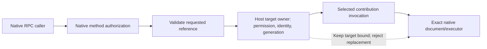

# Native target authority

Research for [Server adapter contract #6](https://github.com/dvcol/devkit-extension/issues/6), [Permissions and trust #9](https://github.com/dvcol/devkit-extension/issues/9), and the target-dependent debugger/injection contracts, checked on 2026-09-27. This report investigates whether existing Devframe or DevTools primitives can authorize and resolve the SDK's `TargetReference` without a new target subsystem.

## Finding

The inspected native APIs do not provide a generic authoritative mapping from `{ kind, id, generation }` to an inspected browser document or executor. They provide useful pieces: an authenticated RPC session, local host services, an in-page channel, and a DevTools extension that discovers a backend from its inspected page. None alone establishes which document a privileged operation may affect or whether that exact document still exists. Keep required-target remote exposure rejected until an actual target-owning integration supplies that guarantee. This does not block the target-free native client. [Session contract](https://github.com/devframes/devframe/blob/a3f967755af99a0a0d8dd82b7b5d4f3dd4aec0bc/packages/devframe/src/rpc/transports/session.ts), [native node context](https://github.com/devframes/devframe/blob/a3f967755af99a0a0d8dd82b7b5d4f3dd4aec0bc/packages/devframe/src/types/context.ts), [current exposure guard](../../packages/server/src/exposure-methods.ts).

The smallest missing seam is a **host-owned target check and resolution at dispatch**, using the actual native session, the selected operation, and the requested target. A generic SDK target registry, separate daemon, alternate authentication system, or new browser transport is not justified by these findings. The host may already obtain its target owner through native `context.services`; reuse that implementation rather than duplicating its registry. [Native service contract](https://github.com/devframes/devframe/blob/a3f967755af99a0a0d8dd82b7b5d4f3dd4aec0bc/packages/devframe/src/types/services.ts), [upstream alignment boundaries](./upstream-alignment-review.md).

This recommendation identifies responsibility, not an approved callback signature. A one-time boolean check is insufficient for the complete stale-target guarantee: the eventual operation must remain bound to the same native document/executor. Resolve that with a concrete target implementation before adding a general callback or lifecycle wrapper.

## Evidence baseline

- Portable contracts: [TargetReference](../../packages/core/src/types.ts), [local invocation](../../packages/runtime/src/invocation.ts), [availability reasons](../../packages/core/src/runtime-types.ts), and the [browser capability research](./browser-capabilities.md).
- Native artifacts inspected directly: `devframe@1.0.0`, `@devframes/hub@1.0.0`, and `@vitejs/devtools-kit@0.7.5` from the workspace installation. Existing connection isolation is unrelated to target identity.
- Readable Devframe source reference: [`a3f967755af99a0a0d8dd82b7b5d4f3dd4aec0bc`](https://github.com/devframes/devframe/tree/a3f967755af99a0a0d8dd82b7b5d4f3dd4aec0bc). Installed declarations and relevant in-page implementation were checked separately; full source/release identity is not assumed.
- DevTools extension source was inspected in the supplied local checkout. Its files are pinned below by exact content hashes. The [earlier source audit](./upstream-reuse.md#main-and-release-parity-limits) records checkout and main revisions; this report does not claim that every local file is identical to either published artifact or current upstream main.
- Browser API references below were read from official Chrome documentation. They illustrate a concrete browser-owned authority boundary; no browser execution, permission grant, navigation race, or Firefox equivalence was tested in this investigation.

| Inspected artifact or source path                        | SHA-256                                                            |
| -------------------------------------------------------- | ------------------------------------------------------------------ |
| `devframe/dist/in-page-channel/index.mjs`                | `246d9f0fdda82e4975806c5bb4a19e78e4378cf797815fc1d8c9090615c3c98c` |
| `devframe/dist/in-page-channel/index.d.mts`              | `fd64685ed98fb7a02d0d8c8537aadf92ee9f4f028b572249f92003de1afcc5b2` |
| `devframe/dist/session-r6PDixP6.d.mts`                   | `54f13afedcd695ece6982f51283f55302cce3b8c1bf501f55a423cd194c7179b` |
| `devframe/dist/context--tVkJw3W.d.mts`                   | `e1f6e16861b3e8cd800e131a54cde2daf3f944d81bfe63804dba04893897d9d6` |
| DevTools `packages/webext/app/panel/inspected-window.ts` | `886f1abc3321381ecbd9de8477114e52d17442537bb13fcee14d3c90d17f5640` |
| DevTools `packages/webext/app/scripts/devtools-bg.ts`    | `ce579e720dc11674440c4e3e868fc522db3aa1c6c50025a27de746ea5a528ff4` |

## What each existing identity means

| Existing identity/API                                                 | What it establishes                                                  | What it does not establish                                                                     |
| --------------------------------------------------------------------- | -------------------------------------------------------------------- | ---------------------------------------------------------------------------------------------- |
| `DevframeNodeRpcSessionMeta.id`                                       | One native RPC connection; created from the server's session counter | A browser tab, inspected page, document generation, or permission for arbitrary target IDs     |
| `session.meta.isTrusted`, token, native `authorize(method, session)`  | Native caller authentication and method permission                   | Ownership of a target named inside the operation arguments                                     |
| `DevframeConnection.connectionMeta` and `metaBaseUrl`                 | Backend transport metadata and endpoint resolution                   | Provider target identity or target freshness                                                   |
| `PageScriptChannel.instanceId` / `PanelChannel.pageScript.instanceId` | In-page pairing identity, persisted per tab in `sessionStorage`      | A new document generation on reload; a browser-issued identity trusted by an extension backend |
| `PanelPeer.id`                                                        | One panel endpoint lifetime                                          | The document that a server operation should affect                                             |
| Hub dock `frameId` / `NavTarget`                                      | Viewer iframe sharing and soft navigation                            | A browser execution target or privileged target grant                                          |
| Chrome `devtools.inspectedWindow.tabId`                               | The tab attached to that DevTools instance                           | The current document generation, or a target binding automatically installed in Devframe RPC   |

Sources: [session metadata](https://github.com/devframes/devframe/blob/a3f967755af99a0a0d8dd82b7b5d4f3dd4aec0bc/packages/devframe/src/rpc/transports/session.ts), [native authorization](https://github.com/devframes/devframe/blob/a3f967755af99a0a0d8dd82b7b5d4f3dd4aec0bc/packages/devframe/src/node/rpc-core.ts), [connection metadata](https://github.com/devframes/devframe/blob/a3f967755af99a0a0d8dd82b7b5d4f3dd4aec0bc/packages/devframe/src/client/connection.ts), [in-page public types](https://github.com/devframes/devframe/blob/a3f967755af99a0a0d8dd82b7b5d4f3dd4aec0bc/packages/devframe/src/in-page-channel/types.ts), [instance persistence](https://github.com/devframes/devframe/blob/a3f967755af99a0a0d8dd82b7b5d4f3dd4aec0bc/packages/devframe/src/in-page-channel/protocol.ts), [dock identities](https://github.com/devframes/devframe/blob/a3f967755af99a0a0d8dd82b7b5d4f3dd4aec0bc/packages/hub/src/types/docks.ts), [Chrome inspectedWindow](https://developer.chrome.com/docs/extensions/reference/api/devtools/inspectedWindow#property-tabId).

The inspected DevTools `getInspectedWindowConnection()` evaluates the page's `window[DEVFRAME_CONNECTION_KEY]`, checks for `connectionMeta` and `metaBaseUrl`, and returns that connection. Its background DevTools script uses `inspectedWindow.tabId` to update the action icon and observes navigation to repeat connection detection. It does not publish a `{ kind, id, generation }` authority into the server context. Those observations are limited to the two content-hashed local files above.

## In-page transport is useful but not a generation authority

`createPageScriptChannel` and `connectPanelChannel` already implement MessagePort RPC, same-origin/default configured-origin handshakes, panel lifecycle, and a bring-your-own-port option. They can carry a concrete page capability without a new transport. Their default instance ID intentionally survives reloads. A panel accepts a replacement port, and while connecting its calls wait for a connection. Consequently, simply copying `instanceId` into `TargetReference.generation` would allow a document replacement to retain the supposed generation. Likewise, passing an old logical reference into a reconnecting channel is not proof that it will execute in the old document. [Channel protocol](https://github.com/devframes/devframe/blob/a3f967755af99a0a0d8dd82b7b5d4f3dd4aec0bc/packages/devframe/src/in-page-channel/protocol.ts), [panel connection and queuing](https://github.com/devframes/devframe/blob/a3f967755af99a0a0d8dd82b7b5d4f3dd4aec0bc/packages/devframe/src/in-page-channel/panel.ts), [page endpoint](https://github.com/devframes/devframe/blob/a3f967755af99a0a0d8dd82b7b5d4f3dd4aec0bc/packages/devframe/src/in-page-channel/page-script.ts).

Use this transport only with a target owner that can issue/check the intended execution generation. Same-origin pairing is not an authentication bridge from untrusted page code into a privileged extension or server operation. The accepted architecture already requires checks at that authority transition. [Architecture trust boundary](../../ARCHITECTURE.md#upstream-compatibility-and-minimal-adapters).

## Where native browser authority can fit

For Chromium extension actors, runtime `MessageSender` includes browser-supplied tab/frame metadata and, where available, `documentId`. Its lifecycle field describes the state when the port opened and may become outdated. These fields come from the receiver's native sender context, so the extension should derive identity there rather than trust copies in a page message. They still require the extension's permission and routing policy. [Chrome MessageSender](https://developer.chrome.com/docs/extensions/reference/api/runtime#type-MessageSender).

Chrome explicitly distinguishes frame identity from document identity: navigation can preserve a frame ID while replacing the document ID. `webNavigation.getFrame({ documentId, tabId, frameId })` can validate a document against its tab/frame, and `scripting.InjectionTarget.documentIds` can address specific documents at execution. These APIs are a concrete candidate for preventing a stale operation from falling through to the tab's new document. A prior read followed by execution using only `tabId` is weaker because the document can change between those steps. This is an integration inference, not a completed adapter guarantee. [Chrome frame/document lifecycle](https://developer.chrome.com/docs/extensions/reference/api/webNavigation#frame_ids), [getFrame](https://developer.chrome.com/docs/extensions/reference/api/webNavigation#method-getFrame), [document-targeted injection](https://developer.chrome.com/docs/extensions/reference/api/scripting#type-InjectionTarget).

The optional CDB integration remains a different target owner. Earlier research found broker-scoped target generations and executor ownership, but the generic mapping and real target lifecycle remain obligations of [Debugger and CDB contract #10](https://github.com/dvcol/devkit-extension/issues/10). Do not create a competing SDK debugger target registry or assume a CDB generation is automatically the browser document generation. Reuse the owner's actual semantics when that integration is selected. [Existing routing research](./provider-routing.md), [CDB reuse boundary](./upstream-reuse-resolution.md).

## The current core check is intentionally incomplete

`TargetReference` is documented as an adapter-issued identity. `invokeLocalOperation` freezes a copy and checks only whether an operation requiring a target received one, or a targetless operation incorrectly received one. It does not authenticate the caller, validate those three fields at a wire boundary, check that a document exists, or compare generations. Its JSDoc requires the owning adapter to authorize and resolve first. Input and output schema validation can await asynchronously, so there can also be time between adapter entry and the handler's eventual effect. [Portable identity](../../packages/core/src/types.ts), [actual invocation implementation](../../packages/runtime/src/invocation.ts).

The final edge is essential. A callback returning `true` cannot by itself prevent a handler from awaiting and then looking up the newest document for the same tab. The target-owning operation must use the resolved native identity or perform its final generation check at execution. Native handles remain local; the portable target reference remains the caller's unchanged selection. No callback should silently normalize a stale generation to the current generation. These are consequences of the accepted stale-target and no-rerouting rules, not a new cancellation guarantee. [Browser acceptance boundary](./browser-capabilities.md#required-coverage-mapping), [invocation flow](../../packages/runtime/src/invocation.ts), [routing ownership](../../ARCHITECTURE.md).

## Decisions needed before required-target exposure

The next owner question is cross-provider target mapping. The current router passes one reference unchanged to the selected provider. Proposed behavior A lets the host map the UI's selected document to that provider's native reference before dispatch, rejecting missing/stale mappings. Alternative B requires the caller to obtain a new provider-specific reference when switching providers. A matches the shared-UI routing goal; neither a mapping API nor an implementation is accepted yet. Both preserve adapter authorization, exact-document execution and no remapping after dispatch.

| Concrete decision             | Smallest justified direction                                                                                                                                       | Why it needs to be settled                                                                                                                                                              |
| ----------------------------- | ------------------------------------------------------------------------------------------------------------------------------------------------------------------ | --------------------------------------------------------------------------------------------------------------------------------------------------------------------------------------- |
| First real target owner       | Choose one implemented document/agent or debugger integration and prove its lifecycle.                                                                             | The ordinary Devframe server has no inspected document registry to resolve from. A fake string registry would prove only its own implementation.                                        |
| Adapter boundary              | Prefer an optional host-supplied resolver/check for target-required exposure, or an already-provided native target service. Keep native session and handles local. | The current factory has no target authority. Putting checks only in individual contribution handlers would change the documented adapter responsibility and must be an explicit choice. |
| Execution binding             | Let the selected target owner keep the operation on the exact document/executor and reject stale references.                                                       | Entry validation alone does not close a navigation race. The concrete implementation determines whether a check is sufficient or scoped execution is necessary.                         |
| Cross-provider target mapping | Keep target IDs/generations owned by the provider that issued them until an explicit mapping exists.                                                               | The same tab represented by a development server and an extension is not automatically the same opaque reference. This matters when routing falls back between realms.                  |

The callback spelling is not a blocker by itself. If a host callback is selected, use one scoped input containing the requested `target`, actual native `session`, and selected native `method`/operation identity. Do not add a mandatory second authorization callback to targetless calls, let the client provide a session, or introduce a universal list/register/watch target service before a concrete consumer needs it. If the first integration can use an existing native service directly, that may remove the need for any new public callback.

## Acceptance evidence for that next slice

- Two simultaneously open pages cannot consume each other's target references unless the host explicitly authorizes it. Invalid shape, unknown target, denied access, restricted target, and stale generation remain distinguishable outcomes.
- Reload/navigation closes or changes the relevant execution generation. A delayed call using the old reference does not run on the replacement, including a race after input validation has begun.
- DevTools panel reconnection and UI HMR do not silently rewrite target identity. Provider incarnation and target generation remain separate.
- Missing authority still rejects required-target exposure clearly. Targetless operations retain their current behavior and native method authorization.
- When a native document/executor API already provides the required identity/lifetime, tests prove the mapping using that API rather than duplicating its registry or testing a fake target owner.

These are future integration checks. This investigation made no implementation change and establishes no new browser support claim.
