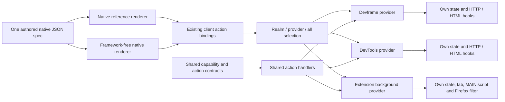

# Portable inspector acceptance

This records the bounded experiment in [Portable contribution proof](https://github.com/dvcol/devkit-extension/issues/15). It complements the [composition, commands and raw observations](./response-inspector.md). The complete SDK release matrix remains open.

## Implemented ownership

The client selects recipients. Each capability selects its own resources. Native connections authenticate independently, and native state stays with its host. The SDK adds no domain classifier, target protocol, codec, renderer authoring language or CDB orchestration. CDB is a separate optional capability example.

## API and hook evidence

These rows cover this prototype's uses of the named APIs. They do not complete every API family or every host/mode combination in the parent tickets. Run commands from the workspace root after building the affected dependency graph. Browser-specific commands and prerequisites are listed in the composition document.

| API or hook                                                                                           | Executed example/test                                                                                | Boundary                                                                                                                                                                                                                    |
| ----------------------------------------------------------------------------------------------------- | ---------------------------------------------------------------------------------------------------- | --------------------------------------------------------------------------------------------------------------------------------------------------------------------------------------------------------------------------- |
| Inspector state schema, capability, four action descriptors and `createInspectorActions`              | `node scripts/check-example-package.ts`; contribution package tests                                  | Packed strict Bundler/NodeNext consumers and actual action execution                                                                                                                                                        |
| `inspectorSpec`, `createInspectorView`, native publication and projection subscriptions               | `node scripts/check-native-packages.ts`; `scripts/fixtures/inspector-native-consumer.ts`             | Both native contexts; separate action-only/view-only/service installation and disposal; business state survives view disposal                                                                                               |
| Native reference renderer and packaged `domRenderer`                                                  | Vite inspector browser runners and extension `custom-inspector.ts` / `custom-inspector-firefox.ts`   | Same authored spec, five buttons, local outcomes, retained backend state and detached-control isolation                                                                                                                     |
| `createInspectorFeature`, `inspectorComposition`, `native.get`, `requires`, service and scope cleanup | Vite `tests/inspector.test.ts` and `tests/inspector-preview.test.ts`                                 | Real native contexts; independently controlled script, transform and service; dependency restoration retains state                                                                                                          |
| Native development/preview middleware registration                                                    | The same Vite suites and production browser runners                                                  | Real original/modified/reset bytes from the owned endpoint; arbitrary HTTP output is outside this fixture                                                                                                                   |
| Native `transformIndexHtml` and packaged marker registration                                          | Vite inspector and extension inspector browser runners                                               | Marker runs before the first parser script in future documents; preview rejects before changing state or built HTML                                                                                                         |
| Extension tabs, fixed MAIN-world fetch and optional Firefox response filter                           | `chromium-inspector.ts`, `firefox-inspector.ts`, extension `tests/inspector.test.ts`                 | Chrome reads but explicitly lacks response filtering; Firefox modifies only the selected top-level owned document                                                                                                           |
| Client action binding, realm/provider selection and broadcast                                         | Extension `mixed-inspector.ts` / `mixed-inspector-firefox.ts`                                        | Three providers, independent state, selected destinations and isolated disconnected-provider failure                                                                                                                        |
| Errors, authored callbacks and recovery                                                               | Vite and extension inspector error runners                                                           | Both renderers and browsers; routed rejection invokes `onError`, while broadcast rejection remains a returned outcome; recovery retains the mount/provider                                                                  |
| Malformed state, native permission failure and teardown                                               | Vite/extension `tests/inspector.test.ts` and packed view disposal                                    | Rejects before effects; permission failure is tested at the native scripting boundary, not a new live permission-prompt proof                                                                                               |
| Native development source reload                                                                      | `inspector-development-chromium.ts` / `inspector-development-firefox.ts`                             | Valid edit, actual syntax error and repair on both native hosts; same provider/state, one request per explicit click and native reauthentication prompts                                                                    |
| Independent build watcher and preview plus combined command                                           | `inspector:build:watch`, `inspector:preview`, `inspector:dev:production`; production browser runners | Both hosts/browsers; last complete assets survive failed compilation; new production generation requires explicit navigation                                                                                                |
| Pending-call disconnection                                                                            | `inspector-races.ts` / `inspector-races-firefox.ts`                                                  | Actual sender sockets close; backend work completes and observer state updates; no cancellation, rollback or replay guarantee                                                                                               |
| Optional CDB capability                                                                               | Debugger embedded, native Devframe/DevTools, Firefox and `chromium-disabled.ts` runners              | Enabled title contract works; disabled profile lacks debugger authority/service and reports unavailable capability; no inspector CDB implementation                                                                         |
| Packed native browser composition                                                                     | `node scripts/check-native-packages.ts --browser`                                                    | Actual HTTP/WebSockets and both packed renderers on both native hosts in Chromium                                                                                                                                           |
| Packed extension application                                                                          | `node scripts/check-native-packages.ts --extension-browser`                                          | Six Chromium and seven Firefox checks pass with unchanged application runners; SDK/shared contracts/renderers resolve installed tarballs. The reference renderer is exercised; custom/mixed-provider proof remains separate |

## Native behavior retained

A broadcast waits for the selected recipients and returns each outcome. A recipient rejection does not reject the whole broadcast, so the authored native success callback reports dispatch completion. The host shows fulfilled and rejected provider outcomes separately. Routed invocation failures use the authored error callback. Remote native operation errors keep their generic message; exact causes remain local.

Closing a caller stops its connection, but native unary backend work already dispatched can still complete. Reload requires the host's native authentication behavior. State is not merged across providers. Preview serves built HTML and rejects runtime marker installation. Chromium reports response-filtering unavailability. Firefox Classic cannot claim global browser-console or page-error capture.

## Closeout

The bounded technical experiment has passed its local native and packed-consumer checks. Final full CI evidence still needs independent verification. The owner must then review the actual experiment before the prototype is resolved. This review is a requirement of the prototype ticket, not an additional SDK permission gate. Broader persistence, authority, injection, renderer, reload and release acceptance stays in the parent contracts. The pending manual Chrome permission interaction and two unpublished peer-lifecycle drafts remain separate owner inputs.
