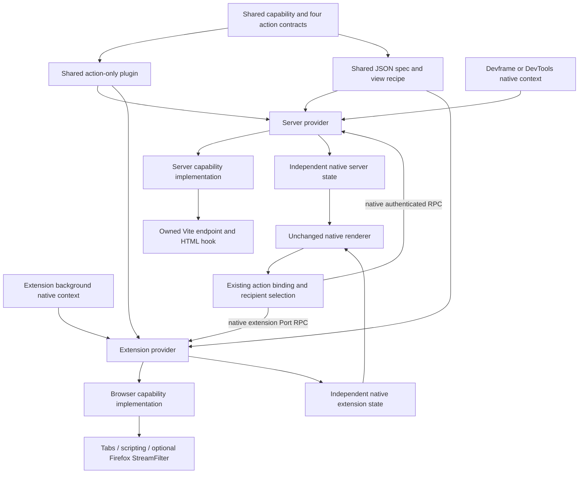

# Shared response inspector

This is the first executable slice of [Portable contribution proof](https://github.com/dvcol/devkit-extension/issues/15). One imported capability, four action contracts and one authored native JSON view run through real Devframe, DevTools, Chromium and Firefox hosts. The implementations and bootstrap remain host-owned. No SDK API, response pipeline, resource router, authentication mechanism or renderer was added.

## Implemented composition

| Part                                            | Maintained implementation                                             | Ownership                                                                |
| ----------------------------------------------- | --------------------------------------------------------------------- | ------------------------------------------------------------------------ |
| Capability, state schema and action descriptors | [Contribution export](../../examples/contribution/src/inspector.ts)   | Shared, framework-neutral contract                                       |
| Action-only plugin                              | `createInspectorActions({ execution })` in that export                | Shared handlers delegate to the required capability                      |
| JSON spec and view recipe                       | [Renderer export](../../examples/json-render/src/inspector.ts)        | Shared native publication and subscribed projection                      |
| Server implementation                           | [Vite fixture feature](../../examples/vite-hosts/src/inspector.ts)    | Provider-owned state, one native middleware endpoint and HTML hook       |
| Server installation                             | [Native configuration](../../examples/vite-hosts/inspector.config.ts) | Existing Devframe/DevTools contexts, public provider factories, shutdown |
| Extension implementation                        | [Native browser feature](../../examples/webext/src/inspector.ts)      | Native tabs, scripting, shared state and optional Firefox filtering      |
| Extension installation                          | [Example plugin](../../examples/webext/src/inspector-plugin.ts)       | Existing native Port background and panel integration                    |
| Rendering and action binding                    | Existing reference renderer and `createActionCall`                    | Renderer stays unchanged; client selects recipients                      |



The standalone server page selects its one provider. [The mixed Chromium proof](../../examples/webext/tests/mixed-inspector.ts) connects one packaged extension panel to both native backends through its existing recipient controls. Realm selection changes both servers while leaving the extension unchanged; explicit provider selection resets only Devframe. An all-provider configuration returns the Chromium rejection alongside both server successes. Each provider selects resources inside its own capability. The SDK does not interpret fixture URLs or tab identities. Closing Devframe produces a catalog-unknown rejection while DevTools and the extension still inspect their own responses; no call reroutes to a sibling. [The Firefox counterpart](../../examples/webext/tests/mixed-inspector-firefox.ts) checks the same realm/provider selection and lifecycle boundaries; all three providers support configuration and return modified bytes from their own endpoints.

The implemented declaration calls are:

```typescript
import { createInspectorActions } from '@devkit/example-contribution/inspector';
import { createInspectorView } from '@devkit/example-json-render/inspector';

const actions = createInspectorActions({ execution: serverExecution });
const view = createInspectorView({
  execution: serverExecution,
  nativeContext: devframeHubContext,
});

const provider = await createDevframeProvider({
  context: actualNativeContext,
  providerId: 'example.devframe-inspector',
  services: [nativeFeature.service],
  plugins: [
    actions,
    definePlugin({
      id: 'example.inspector-native',
      views: [view],
      scripts: [nativeFeature.script],
      transforms: [nativeFeature.transform],
    }),
  ],
});
```

The native configuration also exposes the imported capability and actions through the existing provider `expose` property. The extension uses its own execution/native descriptors and service implementation with the same action/view factories. There is no mandatory all-in-one inspector package: the action plugin and view recipe are separate imported declarations.

The mixed fixture composes the existing private example `createRemoteContext` helper with public `initHub` on real Vite servers. Each connection has a temporary native interactive-auth token and explicitly allows the actual extension origin. Hub middleware mounts in Vite's `configureServer` hook. This tests standalone native context composition; the separate server page proofs test the maintained Vite plugin bootstrap. No origin rewrite, copied authentication or transport policy is introduced.

```typescript
// Existing public Devframe API, owned by the embedding fixture.
const hub = initHub({
  context,
  server: viteServer.httpServer,
  allowedOrigins: [extensionOrigin],
  auth: createInteractiveAuth(context, { clientAuthTokens: [temporaryToken] }),
  // Remaining fixture options retain the existing native hub setup.
});
```

## Observable behavior

| Operation                      | Native server                                             | Chromium extension                                      | Firefox extension                                              |
| ------------------------------ | --------------------------------------------------------- | ------------------------------------------------------- | -------------------------------------------------------------- |
| `read({})`                     | Fetch own `/inspector-response`                           | Execute fixed page fetch in the owned tab               | Same fixed page fetch                                          |
| `configure({ enabled: true })` | Prefix owned endpoint with `native:`                      | Reject; visible state reports filtering unavailable     | Prefix only the selected top-level fixture document's response |
| `marker({})`                   | Enable native HTML head-prepend hook for future documents | Register packaged MAIN/document_start script            | Same native registration                                       |
| `reset({})`                    | Clear state and future effects                            | Clear configuration/result and unregister future marker | Same, also stop admitting response modifications               |

The fixture starts with `fixture:original`. A supported modification returns `native:fixture:original`. Native Vite middleware owns exactly this endpoint; it does not wrap arbitrary response methods. The extension requires exactly one accessible `/inspector-fixture` tab on the repository-owned loopback origin. No tab or multiple tabs rejects before executing a response read. Firefox additionally requires the selected tab, top-level frame, exact initiating document URL and exact response URL before opening its native filter. Navigation to another document in the same tab leaves the response untouched.

The first parser script captures `responseInspectorMarker` and `document.readyState`. Live checks observe `loading` when the marker is enabled. Reset affects future documents and requests. An already executed marker remains in the existing document; disabling listener admission does not roll back an already admitted native stream.

Requested configuration and native support are separate state fields. Each provider owns its own configuration, latest result and marker state. The shared JSON projects those fields without merging providers. Its local completion text reports dispatch completion; per-provider fulfilled/rejected results remain in the host's existing result output. Native remote operation failures retain the generic `Operation handler failed` message; exact native causes are available in local logs and focused service tests. No parallel error-disclosure policy was added.

The Vite feature rejects a runtime marker request on preview because Vite serves already-built HTML there. [The preview proof](../../examples/vite-hosts/tests/inspector-preview.test.ts) builds a real HTML document, starts each maintained native preview host, then dynamically installs the shared inspector actions and native feature. Both hosts return original, modified and reset response bytes. The marker request rejects with the native cause before changing state; the served HTML remains byte-for-byte equal to the build output. Separate script, transform and service disposal cases verify response admission, capability availability and action dependency status. This is native HTTP/provider evidence, not a browser renderer or watched-inspector build proof. The standalone inspector configuration still supports development servers only.

## Run and reproduce

Build the affected graph first, then choose either server command:

```sh
pnpm exec turbo run build --filter=@devkit/example-vite-hosts... --filter=@devkit/example-webext... --concurrency=1
pnpm --filter @devkit/example-vite-hosts inspector:devframe
pnpm --filter @devkit/example-vite-hosts inspector:devtools
```

Open the printed loopback URL and grant access through Devframe's native authentication UI. The page mounts the native reference renderer after authentication. Click **Inspect response**, **Enable response modification**, and **Inspect response** again. The body changes from `fixture:original` to `native:fixture:original`. Click **Install page marker**, then navigate to `/inspector-fixture`. Its first-parser observation becomes `loading`. Click **Reset inspector** and reload that fixture page; the marker is absent and the next response is original.

The automated server command uses the native temporary authentication code and checks both simultaneous backends:

```sh
pnpm --filter @devkit/example-vite-hosts test:inspector
pnpm --filter @devkit/example-vite-hosts exec node tests/inspector-errors.ts
FIREFOX_BINARY=/path/to/firefox SE_DRIVER_VERSION=0.37.1 SE_SKIP_DRIVER_IN_PATH=true pnpm --filter @devkit/example-vite-hosts test:inspector:firefox
FIREFOX_BINARY=/path/to/firefox SE_DRIVER_VERSION=0.37.1 SE_SKIP_DRIVER_IN_PATH=true pnpm --filter @devkit/example-vite-hosts exec node tests/inspector-errors-firefox.ts
```

The extension proof starts and closes its owned fixture server and disposable browser profile. It loads the built example extension, opens `panel.html` and clicks the same five authored buttons:

```sh
pnpm --filter @devkit/example-webext exec node tests/chromium-inspector.ts
pnpm --filter @devkit/example-webext exec node tests/mixed-inspector.ts
pnpm --filter @devkit/example-webext exec node tests/custom-inspector.ts
SE_DRIVER_VERSION=0.37.1 SE_SKIP_DRIVER_IN_PATH=true pnpm --filter @devkit/example-webext exec node tests/firefox-inspector.ts
SE_DRIVER_VERSION=0.37.1 SE_SKIP_DRIVER_IN_PATH=true pnpm --filter @devkit/example-webext exec node tests/mixed-inspector-firefox.ts
SE_DRIVER_VERSION=0.37.1 SE_SKIP_DRIVER_IN_PATH=true pnpm --filter @devkit/example-webext exec node tests/custom-inspector-firefox.ts
```

The native preview proof runs through the affected package suite or directly:

```sh
pnpm --filter @devkit/example-vite-hosts exec vitest run tests/inspector-preview.test.ts
```

Set `FIREFOX_BINARY` when Firefox is outside the driver's discovery path. The browser runners require their existing installed browser/driver dependencies. The in-app browser cannot load these native extensions, so their actual browser tests use disposable native browser profiles.

## Executed evidence and limits

| Run                                                                       | Version                            | Retained evidence                                                                                                            |
| ------------------------------------------------------------------------- | ---------------------------------- | ---------------------------------------------------------------------------------------------------------------------------- |
| Devframe and DevTools reference UI, native development                    | Chromium 153.0.8010.12             | [18 checks with both renderers, zero page/console errors](../../examples/vite-hosts/evidence/inspector-chromium.json)        |
| Devframe and DevTools reference/custom UI, native development             | Firefox 157.0 / geckodriver 0.37.1 | [20 checks through both native hosts](../../examples/vite-hosts/evidence/inspector-firefox.json)                             |
| Packaged extension panel with both standalone native server contexts      | Chromium 153.0.8010.12             | [9 checks, separate state and partial failure](../../examples/webext/evidence/inspector/mixed-chromium.json)                 |
| Native routed inspector rejection/recovery, both hosts and both renderers | Chromium 153.0.8010.12             | [4 cells, 3 checks, expected visible errors](../../examples/vite-hosts/evidence/inspector-errors-chromium.json)              |
| Native routed inspector rejection/recovery, both hosts and both renderers | Firefox 157.0 / geckodriver 0.37.1 | [4 cells, 3 checks, visible error/recovery](../../examples/vite-hosts/evidence/inspector-errors-firefox.json)                |
| Packaged extension panel with both standalone native server contexts      | Firefox 157.0                      | [8 checks, separate modified responses and isolated disconnect](../../examples/webext/evidence/inspector/mixed-firefox.json) |
| Native packaged extension                                                 | Chromium 153.0.8010.12             | [6 checks, zero page errors](../../examples/webext/evidence/inspector/chromium.json)                                         |
| Native packaged extension                                                 | Firefox 157.0 / geckodriver 0.37.1 | [7 checks, actual response filtering](../../examples/webext/evidence/inspector/firefox.json)                                 |

Receipts are written only after successful assertions and resource cleanup. The server proof observes distinct provider identities and independent state. Extension failures preserve the prior inspection result, independent counter and provider incarnation. Firefox WebDriver Classic does not capture global page errors, so its receipt makes no zero-error claim.

The page's **Renderer** selector mounts either the unchanged native reference renderer or the existing framework-free DOM renderer through the native renderer contract. Both consume the exact authored inspector spec. Public JSON core helpers execute state-setting callbacks; their presentation outcomes stay local to each mount. Both browser proofs observe peer projection updates retaining those outcomes, all five custom buttons dispatching, fresh mount-local outcome reset and a disposed button producing no provider effect. Existing counter renderer error/recovery and disposal regressions also pass on both browsers. [The Chromium error/recovery proof](../../examples/vite-hosts/tests/inspector-errors.ts) closes only the owned response endpoint at the real HTTP boundary. Both native hosts and both renderers execute the authored `onError` callback, display `Inspection failed` and the native operation error, and retain the prior body/configuration. Reset followed by Inspect restores original bytes and clears the alert on the same provider, document and renderer mount. Each browser retains four observations with exactly one failed backend request per host/renderer cell. Chromium records no unhandled page/console error; Firefox Classic checks the visible error, connection and Vite overlay but cannot claim global error capture. This proves routed `invoke` rejection. Broadcast recipient rejections remain returned outcome values, so they retain native success-callback semantics. [The Firefox counterpart](../../examples/vite-hosts/tests/inspector-errors-firefox.ts) verifies the same state, identity and recovery behavior.

The extension inspector's **Renderer** selector now mounts the same authored view with either the native reference renderer or the packaged framework-free `@devkit/example-json-render/renderer` export. Both choices use the existing action bindings, recipient controls, native state and mount disposal. Chrome and Firefox execute all four actions through the custom mount, preserve realm/provider/all-provider selection, and switch back to the reference renderer without resetting backend state. Detached controls cannot dispatch after replacement or disconnect. The server cards remain native reference renderers, so their independent projection updates provide a second observation of the same dispatch. [Chrome's seven checks](../../examples/webext/evidence/inspector/custom-chromium.json) retain its partial configuration rejection; [Firefox's six checks](../../examples/webext/evidence/inspector/custom-firefox.json) observe three modified responses. These are packaged extension builds using workspace-built example exports; complete tarball/browser consumption remains separate.

The packed-contract check, `node scripts/check-example-package.ts`, installs real tarballs outside the workspace. Strict Bundler and NodeNext consumers preserve boolean configure input/result types and execute all four shared actions through packed runtime. A separate browser contract bundle imports the schema/descriptors and rejects backend, Node or framework leakage. This proves packed contracts and their local runtime composition, not packed renderer/native host composition.

The maintained native artifact gate, `node scripts/check-native-packages.ts`, now also installs the packed shared actions and JSON view together on actual Devframe and DevTools contexts. Strict Bundler and NodeNext consumers check the native publication index, exact action references/inputs, action-driven projection changes, view subscription/publication disposal and retained business state. Its consumer-local service uses native shared state and explicitly performs no HTTP interception or document injection. This proves installed native-context/action/view composition, not browser mounting or the complete inspector host feature. The unchanged JSON example manifest requires the packed server-contexts example as well; all three example tarballs are installed without workspace links or manifest edits. The existing six-SDK browser graph and native RPC checks remain enforced.

The contribution tests use built public exports and real runtime operations. The server tests use actual native contexts, HTTP responses, HTML hooks, independent contribution controls, dependency loss/restoration and malformed-state rejection before effects. The extension service tests replace only native browser I/O and assert selection/permission failures, filtering boundaries and resource disposal. These focused tests complement the live receipts; they do not substitute for unexecuted host cells.

Ready for this slice:

- [x] All composition calls use maintained public exports and native contexts.
- [x] Deterministic owned endpoints, shared contracts and browser prerequisites are available.

Done for this slice:

- [x] One shared authored JSON view and four actions execute on all four selected host implementations.
- [x] Real browser results distinguish supported modification from Chromium unavailability.
- [x] Future marker timing, reset and independent provider state have direct observations.
- [x] Maintained native browser commands and CI steps retain the actual receipts.

The affected Vite example suite now passes 42 tests, including eight real-preview cases across Devframe and DevTools.

The full ticket remains open. Packed complete browser/native host I/O consumption, extension error recovery, development edits, watched inspector production builds and browser preview retention, cancellation/disconnection races and an actual optional CDB profile still need their own evidence. No generic CDB plumbing belongs in this feature. Human review is required before resolving the prototype.
