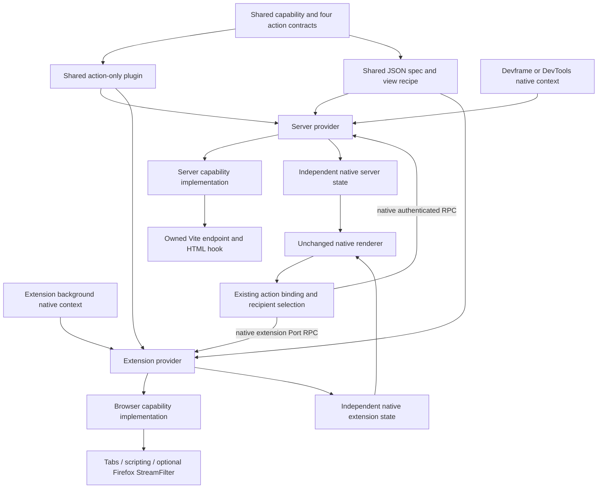

# Shared response inspector

This is the first executable slice of [Portable contribution proof](https://github.com/dvcol/devkit-extension/issues/15). One imported capability, four action contracts and one authored native JSON view run through real Devframe, DevTools, Chromium and Firefox hosts. The implementations and bootstrap remain host-owned. No SDK API, response pipeline, resource router, authentication mechanism or renderer was added.

## Implemented composition

| Part                                            | Maintained implementation                                             | Ownership                                                                |
| ----------------------------------------------- | --------------------------------------------------------------------- | ------------------------------------------------------------------------ |
| Capability, state schema and action descriptors | [Contribution export](../../examples/contribution/src/inspector.ts)   | Shared, framework-neutral contract                                       |
| Action-only plugin                              | `createInspectorActions({ execution })` in that export                | Shared handlers delegate to the required capability                      |
| JSON spec and view recipe                       | [Renderer export](../../examples/json-render/src/inspector.ts)        | Shared native publication and subscribed projection                      |
| Server implementation                           | [Vite fixture feature](../../examples/vite-hosts/src/inspector.ts)    | Provider-owned state, one native middleware endpoint and HTML hook       |
| Server installation                             | [Native configuration](../../examples/vite-hosts/inspector.config.ts) | Existing Devframe/DevTools contexts, public provider factories, shutdown |
| Extension implementation                        | [Native browser feature](../../examples/webext/src/inspector.ts)      | Native tabs, scripting, shared state and optional Firefox filtering      |
| Extension installation                          | [Example plugin](../../examples/webext/src/inspector-plugin.ts)       | Existing native Port background and panel integration                    |
| Rendering and action binding                    | Existing reference renderer and `createActionCall`                    | Renderer stays unchanged; client selects recipients                      |



The diagram shows supported composition, not a passing mixed-host inspector broadcast. The current standalone server page selects its one provider; the extension panel uses its existing recipient controls. A provider selects resources inside its own capability. The SDK does not interpret fixture URLs or tab identities.

The implemented declaration calls are:

```typescript
import { createInspectorActions } from '@devkit/example-contribution/inspector';
import { createInspectorView } from '@devkit/example-json-render/inspector';

const actions = createInspectorActions({ execution: serverExecution });
const view = createInspectorView({
  execution: serverExecution,
  nativeContext: devframeHubContext,
});

const provider = await createDevframeProvider({
  context: actualNativeContext,
  providerId: 'example.devframe-inspector',
  services: [nativeFeature.service],
  plugins: [
    actions,
    definePlugin({
      id: 'example.inspector-native',
      views: [view],
      scripts: [nativeFeature.script],
      transforms: [nativeFeature.transform],
    }),
  ],
});
```

The native configuration also exposes the imported capability and actions through the existing provider `expose` property. The extension uses its own execution/native descriptors and service implementation with the same action/view factories. There is no mandatory all-in-one inspector package: the action plugin and view recipe are separate imported declarations.

## Observable behavior

| Operation                      | Native server                                             | Chromium extension                                      | Firefox extension                                              |
| ------------------------------ | --------------------------------------------------------- | ------------------------------------------------------- | -------------------------------------------------------------- |
| `read({})`                     | Fetch own `/inspector-response`                           | Execute fixed page fetch in the owned tab               | Same fixed page fetch                                          |
| `configure({ enabled: true })` | Prefix owned endpoint with `native:`                      | Reject; visible state reports filtering unavailable     | Prefix only the selected top-level fixture document's response |
| `marker({})`                   | Enable native HTML head-prepend hook for future documents | Register packaged MAIN/document_start script            | Same native registration                                       |
| `reset({})`                    | Clear state and future effects                            | Clear configuration/result and unregister future marker | Same, also stop admitting response modifications               |

The fixture starts with `fixture:original`. A supported modification returns `native:fixture:original`. Native Vite middleware owns exactly this endpoint; it does not wrap arbitrary response methods. The extension requires exactly one accessible `/inspector-fixture` tab on the repository-owned loopback origin. No tab or multiple tabs rejects before executing a response read. Firefox additionally requires the selected tab, top-level frame, exact initiating document URL and exact response URL before opening its native filter. Navigation to another document in the same tab leaves the response untouched.

The first parser script captures `responseInspectorMarker` and `document.readyState`. Live checks observe `loading` when the marker is enabled. Reset affects future documents and requests. An already executed marker remains in the existing document; disabling listener admission does not roll back an already admitted native stream.

Requested configuration and native support are separate state fields. Each provider owns its own configuration, latest result and marker state. The shared JSON projects those fields without merging providers. Its local completion text reports dispatch completion; per-provider fulfilled/rejected results remain in the host's existing result output. Native remote operation failures retain the generic `Operation handler failed` message; exact native causes are available in local logs and focused service tests. No parallel error-disclosure policy was added.

The Vite feature explicitly rejects a runtime marker request on preview because Vite serves already-built HTML there. This guard has not yet been exercised by this inspector proof. The standalone inspector configuration deliberately supports development servers only. Existing production/counter examples remain available, but do not establish the inspector's production behavior.

## Run and reproduce

Build the affected graph first, then choose either server command:

```sh
pnpm exec turbo run build --filter=@devkit/example-vite-hosts... --filter=@devkit/example-webext... --concurrency=1
pnpm --filter @devkit/example-vite-hosts inspector:devframe
pnpm --filter @devkit/example-vite-hosts inspector:devtools
```

Open the printed loopback URL and grant access through Devframe's native authentication UI. The page mounts the native reference renderer after authentication. Click **Inspect response**, **Enable response modification**, and **Inspect response** again. The body changes from `fixture:original` to `native:fixture:original`. Click **Install page marker**, then navigate to `/inspector-fixture`. Its first-parser observation becomes `loading`. Click **Reset inspector** and reload that fixture page; the marker is absent and the next response is original.

The automated server command uses the native temporary authentication code and checks both simultaneous backends:

```sh
pnpm --filter @devkit/example-vite-hosts test:inspector
```

The extension proof starts and closes its owned fixture server and disposable browser profile. It loads the built example extension, opens `panel.html` and clicks the same five authored buttons:

```sh
pnpm --filter @devkit/example-webext exec node tests/chromium-inspector.ts
SE_DRIVER_VERSION=0.37.1 SE_SKIP_DRIVER_IN_PATH=true pnpm --filter @devkit/example-webext exec node tests/firefox-inspector.ts
```

Set `FIREFOX_BINARY` when Firefox is outside the driver's discovery path. The browser runners require their existing installed browser/driver dependencies. The in-app browser cannot load these native extensions, so their actual browser tests use disposable native browser profiles.

## Executed evidence and limits

| Run                                                    | Version                            | Retained evidence                                                                                 |
| ------------------------------------------------------ | ---------------------------------- | ------------------------------------------------------------------------------------------------- |
| Devframe and DevTools reference UI, native development | Chromium 153.0.8010.12             | [10 checks, zero page/console errors](../../examples/vite-hosts/evidence/inspector-chromium.json) |
| Native packaged extension                              | Chromium 153.0.8010.12             | [6 checks, zero page errors](../../examples/webext/evidence/inspector/chromium.json)              |
| Native packaged extension                              | Firefox 157.0 / geckodriver 0.37.1 | [7 checks, actual response filtering](../../examples/webext/evidence/inspector/firefox.json)      |

Receipts are written only after successful assertions and resource cleanup. The server proof observes distinct provider identities and independent state. Extension failures preserve the prior inspection result, independent counter and provider incarnation. Firefox WebDriver Classic does not capture global page errors, so its receipt makes no zero-error claim.

The contribution tests use built public exports and real runtime operations. The server tests use actual native contexts, HTTP responses, HTML hooks, independent contribution controls, dependency loss/restoration and malformed-state rejection before effects. The extension service tests replace only native browser I/O and assert selection/permission failures, filtering boundaries and resource disposal. These focused tests complement the live receipts; they do not substitute for unexecuted host cells.

Ready for this slice:

- [x] All composition calls use maintained public exports and native contexts.
- [x] Deterministic owned endpoints, shared contracts and browser prerequisites are available.

Done for this slice:

- [x] One shared authored JSON view and four actions execute on all four selected host implementations.
- [x] Real browser results distinguish supported modification from Chromium unavailability.
- [x] Future marker timing, reset and independent provider state have direct observations.
- [x] Maintained native browser commands and CI steps retain the actual receipts.

The full ticket remains open. Packed consumption, replacement-renderer compatibility for this exact spec, inspector mixed-provider selection/broadcast and partial failures, standalone Firefox server UI, development edits, watched production/preview retention, cancellation/disconnection races and an actual optional CDB profile still need their own evidence. No generic CDB plumbing belongs in this feature. Human review is required before resolving the prototype.
