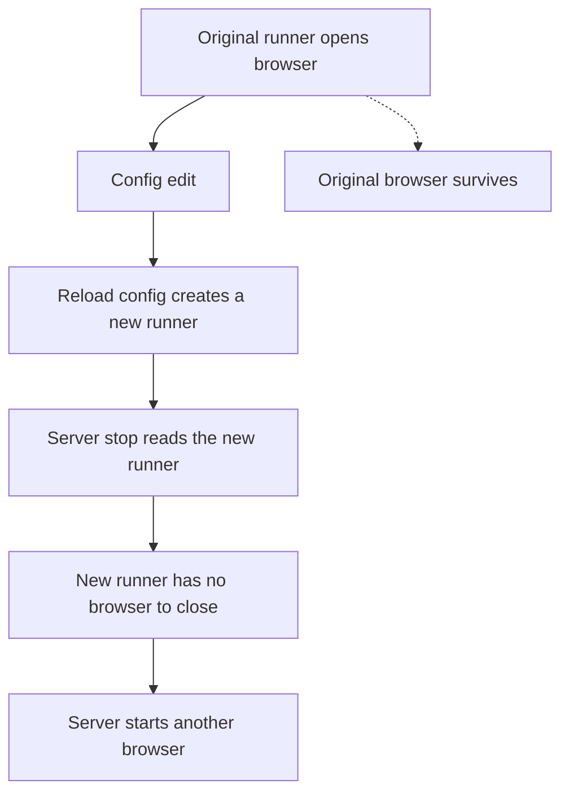

# WXT adoption gates

This follow-up concerns [Live preview and reload contract](https://github.com/dvcol/devkit-extension/issues/13). WXT remains a packaging candidate. The maintained extension still uses Vite directly; this investigation installs no WXT dependency or patch into that workspace.

## Strict declarations

The original [reload audit](./toolchain-reload-resolution.md) found that WXT's generated `skipLibCheck: true` hid declaration errors. An isolated follow-up on 2026-09-29 tested WXT 0.21.4, `@wxt-dev/browser` 0.3.0, TypeScript 7.0.2, Vite 8.3.0 and Chrome ambient types 0.3.0. All consumer checks keep `strict: true`, `skipLibCheck: false`, exact optional properties and checked index access.

The unpatched minimum fails in two ways. With Chrome ambient types, generated global HAR aliases collide with `@types/chrome`. Without Chrome ambient types, two generated browser aliases reference a missing `chrome` name. A declaration-only browser patch imports HAR types into module scope and points those aliases at the exported `Browser` namespace.

The complete WXT-prepared project additionally exposes a stale `I18n.Static` reference in WXT's generated declarations and an absent optional Rollup peer used by the visualizer's declarations. The retained WXT patch imports its public `Browser` type and extends `Omit<typeof Browser.i18n, "getMessage">`. An explicit Rollup 4.63.4 development dependency satisfies the optional peer. A discarded candidate that simply removed inheritance lost native methods on direct `WxtI18n` consumers; the final patch preserves them. Neither patch changes extension runtime behavior.

Eight checks now pass: the minimum and complete generated project, each with and without Chrome ambient types, after separate Chrome and Firefox MV3 preparation. Five negative type assertions preserve generated message-key narrowing, native i18n argument types and HAR member types. A frozen installation also passes. Replaying the retained files from a second fresh temporary directory passed the same eight checks, without the original fixture or workspace dependencies. The [receipt](./wxt-declarations-evidence/RECEIPT.md) contains commands, version pins, intermediate failures, the rejected inheritance candidate and final results. [The verifier](./wxt-declarations-evidence/verify.mjs) checks the effective strict compiler settings before running the cases.

The patches are retained inside that standalone experiment, not in the root workspace's patch policy. The maintained extension still needs its real development and production lifecycle checks before WXT adoption. No upstream PR has been opened for these declaration defects.

## Native lifecycle ownership

The original browser experiment set `webExt.disabled: true` and launched the browser separately. Its manual runner does not own that browser, so those observations alone cannot establish ordinary WXT restart behavior. The follow-up now exercises WXT's managed runner directly.

Both managed attempts confirmed the actual initial manifest `1.0.0` and a UI-triggered background action. Editing `wxt.config.ts` caused a native restart and rebuilt manifest `1.0.1`. With an explicitly reused profile, the new browser failed to load the extension. With default fresh profiles, a second browser opened but the original browser remained connected for the full 30-second observation window. Neither attempt established the post-restart live manifest or action.

The installed WXT 0.21.4 source and [upstream source at a747b9c](https://github.com/wxt-dev/wxt/blob/a747b9c7ecd635c633ade13314552abfdb345bba/packages/wxt/src/core/create-server.ts) contain an ownership defect confirmed by the same failing/passing live test. The file reloader resolves a new configuration before requesting restart. Configuration resolution creates a new runner, while server shutdown reads the runner from the new configuration. That new closure has no reference to the browser opened by the original runner.

This supersedes the initial assumption that using the managed runner alone would resolve the gap. A separate disposable patch retains the runner used to open the current browser. Stop and browser restart close that retained runner; a new open captures the current configured runner. The unchanged live test now passes: the old browser disconnects after the edit, the new browser reports manifest `1.0.1`, and a UI action succeeds with a fresh background generation. Final native shutdown closes the new browser. The patch adds no SDK reload engine, retry loop or state-recovery policy. The maintained extension remains unchanged.

A separate check of public `restartBrowser()` and `stop()` also passes. The [receipt](./wxt-runner-evidence/RECEIPT.md) includes exact versions, runtime observations and cleanup. The [runtime-only patch](./wxt-runner-evidence/runner-only.patch) adds seven lines and removes four in one native file. The [baseline receipt](./wxt-runner-evidence/baseline/RECEIPT.md) retains the failures, and the failing/passing config-change scripts are byte-identical. The standalone fixture contains the actual combined pnpm patch and frozen lockfile. No new upstream PR has been opened.

The same patched native runner now passes a separate Firefox check. WXT owns both browser processes and fresh profiles; geckodriver attaches for observation. A config edit closes the old Firefox, the replacement reports actual manifest `1.0.1`, its UI-triggered background action succeeds with a new generation, and native stop closes it. The test reads Firefox's own extension UUID mapping from the owned profile. An earlier forced-UUID fixture generated an invalid preference and is retained as a setup failure. [Frozen replay and limits](./wxt-firefox-runner-evidence/RECEIPT.md). This checks the patched Firefox path without claiming an unpatched Firefox comparison or renderer HMR.

## Maintained JSON panel module replacement

The maintained extension panel now owns native Vite HMR disposal. A replacement aborts its old DOM listeners, closes the Port and releases the native renderer, router and subscriptions. Disposed controls ignore delayed results. Manual disconnect still reports pending-call errors; remote work is not cancelled or replayed. The background implementation now starts synchronously through an explicit entrypoint, so packaging-time imports do not execute extension code.

A fresh standalone WXT fixture imports those maintained modules and mounts the real reference renderer in Chromium. The observed document retains its time origin, and both panels retain worker state through a panel-module edit. Both old Ports close, two replacement Ports remain, and the routed button retains exactly one DOM listener. Rendered and routed actions each increment once after the edit. An earlier pending action completes without changing the replacement UI. Native stop closes the browser and the test restores the exact source file. [Reproduction, receipt and limits](./wxt-json-hmr-evidence/RECEIPT.md).

The maintained Vite Chromium/Firefox production builds, strict source checks, two bundle tests, 24 Chromium scenarios and 18 Firefox groups also pass. The standalone development fixture uses the previously retained patches; this implementation adds no WXT root dependency, renderer patch or custom reloader.

The same maintained panel now passes Firefox native HMR through WXT's owned browser and native WebDriver attachment. The observed document and provider incarnation stay unchanged, the native connection identity changes, both counters retain state, and routed/rendered clicks each execute once. A pending old action completes without overwriting the replacement UI. Native stop closes Firefox and source restoration is exact. [Frozen Firefox replay and limits](./wxt-firefox-json-hmr-evidence/RECEIPT.md). This verifies effects without claiming exact Firefox listener/Port counts or global browser-error capture.

Native HTML reload also passes in Chromium. Background replacement first failed: the old contexts closed, but opening the extension URL returned `ERR_BLOCKED_BY_CLIENT`. A generic fixture showed that Developer mode was off and the browser disabled the extension on native reload, with unchanged manifest bytes. Enabling normal Developer mode in that disposable profile made native reload pass without another runtime patch. The maintained provider then passed the same transition: a fresh page sees a new provider incarnation, ephemeral state resets, and interrupted actions are not replayed. [Failed and passing comparisons](./wxt-json-hmr-evidence/RECEIPT.md#follow-up-native-html-and-background-reload). web-ext already writes the preference, so unattended fresh-profile startup still needs investigation. No SDK recovery mechanism was added.

## Current live coverage

These cells describe observed candidate behavior. They do not enable development commands in the maintained extension.

| Change                        | Chromium                                                                      | Firefox                                                  | Observed state boundary                                                  |
| ----------------------------- | ----------------------------------------------------------------------------- | -------------------------------------------------------- | ------------------------------------------------------------------------ |
| Panel TypeScript module       | Native Vite HMR passes with the maintained JSON renderer                      | Native Vite HMR passes with the maintained JSON renderer | Same observed document and worker; fresh page-owned connections          |
| Panel HTML                    | Native page reload passes                                                     | Unverified                                               | New document, same background state                                      |
| Background implementation     | Native reload passes with Developer mode enabled; default fresh profile fails | Unverified                                               | New provider incarnation and reset ephemeral state; fresh panel required |
| WXT config / manifest version | Native browser restart passes                                                 | Native browser restart passes                            | Fresh browser/profile and background generation                          |
| Content / page-world code     | Unverified                                                                    | Unverified                                               | No preservation promise                                                  |
| Watched production extension  | Unverified                                                                    | Unverified                                               | Separate from development HMR                                            |

## Remaining adoption evidence

The Chromium and Firefox panel checks establish one native module-replacement path per browser. Repeated rapid updates, content reconnection, Firefox background replacement and unattended Chromium profile setup still require their own checks. A manifest version must be read from the running extension after each causal change; a generated manifest file or stale browser report is insufficient. Chromium and Firefox need separate live receipts. Watched production remains a separate workflow from development HMR.
