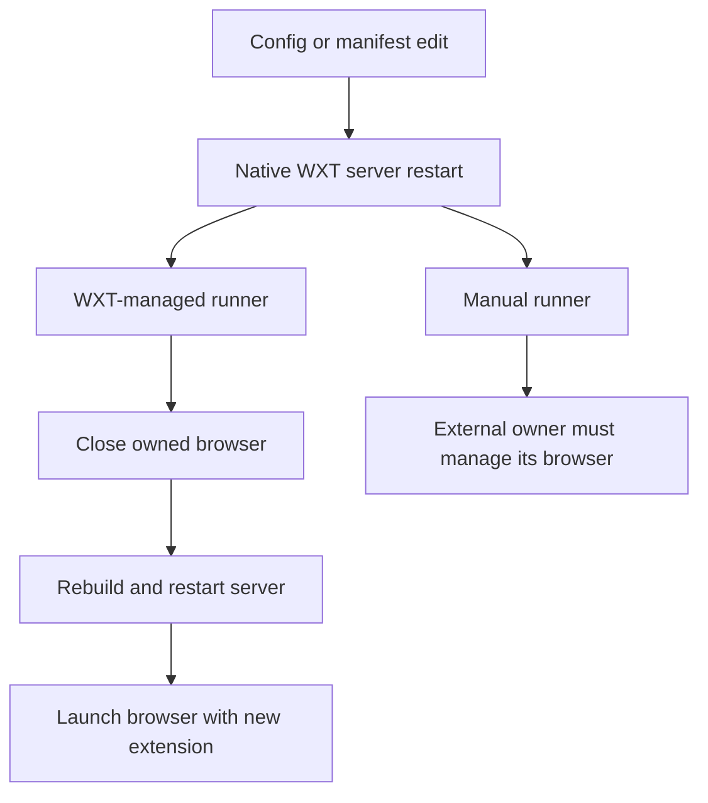

# WXT adoption gates

This follow-up concerns [Live preview and reload contract](https://github.com/dvcol/devkit-extension/issues/13). WXT remains a packaging candidate. The maintained extension still uses Vite directly; this investigation installs no WXT dependency or patch into that workspace.

## Strict declarations

The original [reload audit](./toolchain-reload-resolution.md) found that WXT's generated `skipLibCheck: true` hid declaration errors. An isolated follow-up on 2026-09-29 tested WXT 0.21.4, `@wxt-dev/browser` 0.3.0, TypeScript 7.0.2, Vite 8.3.0 and Chrome ambient types 0.3.0. All consumer checks keep `strict: true`, `skipLibCheck: false`, exact optional properties and checked index access.

The unpatched minimum fails in two ways. With Chrome ambient types, generated global HAR aliases collide with `@types/chrome`. Without Chrome ambient types, two generated browser aliases reference a missing `chrome` name. A declaration-only browser patch imports HAR types into module scope and points those aliases at the exported `Browser` namespace.

The complete WXT-prepared project additionally exposes a stale `I18n.Static` reference in WXT's generated declarations and an absent optional Rollup peer used by the visualizer's declarations. The retained WXT patch imports its public `Browser` type and extends `Omit<typeof Browser.i18n, "getMessage">`. An explicit Rollup 4.63.4 development dependency satisfies the optional peer. A discarded candidate that simply removed inheritance lost native methods on direct `WxtI18n` consumers; the final patch preserves them. Neither patch changes extension runtime behavior.

Eight checks now pass: the minimum and complete generated project, each with and without Chrome ambient types, after separate Chrome and Firefox MV3 preparation. Five negative type assertions preserve generated message-key narrowing, native i18n argument types and HAR member types. A frozen installation also passes. Replaying the retained files from a second fresh temporary directory passed the same eight checks, without the original fixture or workspace dependencies. The [receipt](./wxt-declarations-evidence/RECEIPT.md) contains commands, version pins, intermediate failures, the rejected inheritance candidate and final results. [The verifier](./wxt-declarations-evidence/verify.mjs) checks the effective strict compiler settings before running the cases.

The patches are retained inside that standalone experiment, not in the root workspace's patch policy. The maintained extension still needs its real development and production lifecycle checks before WXT adoption. No upstream PR has been opened for these declaration defects.

## Native lifecycle ownership

The original browser experiment set `webExt.disabled: true` and launched the browser separately. In WXT 0.21.4, a configuration edit restarts the development server. The ordinary runner closes and relaunches its browser during this restart; the manual runner leaves the externally owned browser alone. Its old background development WebSocket does not reconnect after server shutdown. This difference prevents the original external-runner result from proving that normal WXT manifest adoption is broken.

Use WXT's ordinary runner for the next live check. Do not add a second reload engine to compensate for an externally launched browser's lifetime. Extension pages use Vite HMR; content scripts, backgrounds and configuration changes retain WXT's own reload or restart behavior.

## Remaining adoption evidence

The declaration corrections do not prove maintained-renderer HMR, post-update action execution, duplicate-listener cleanup, content reconnection or worker replacement. A manifest version must be read from the running extension after each causal change; a generated manifest file or stale browser report is insufficient. Chromium and Firefox need separate live receipts. Watched production remains a separate workflow from development HMR.
