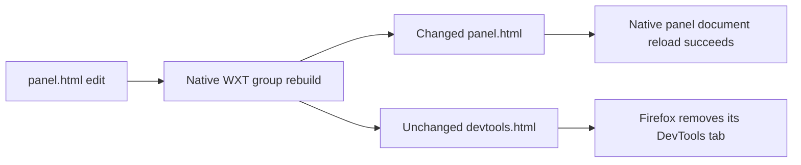

# WXT HTML reload scope

The maintained DevTools development test exposed an unrelated-page reload in WXT 0.21.4. Editing `panel.html` rebuilds a group containing both `panel.html` and `devtools.html`. WXT then tells every HTML page in that group to reload, including the unchanged DevTools registration page. Firefox 156.0.1 removes the Devkit tab and does not restore it while the toolbox stays open.

This is separate from the accepted unpatched Vite failed-restart gap. No Vite change or SDK recovery controller is involved.

## Cause and isolation

The [group-reload receipt](./wxt-html-reload-evidence/group-reload.json) records native panel module HMR first. It retains the document timestamp and provider while changing the caller. A subsequent actual HTML source edit makes the Devkit tab disappear. After 30 seconds, the toolbox still exists but the tab and panel browser are absent. Its `passed` field means the diagnostic experiment completed; `devtoolsTabReturned: false` records the failure.

The [panel-only receipt](./wxt-html-reload-evidence/panel-only-reload.json) uses the native public `server.reloadPage('panel.html')` method in a disposable development fixture. The selected Devkit tab stays present; its panel receives a new document and caller with the same provider/state. The test never reopens the toolbox or recreates the tab.



The installed package and [upstream file reloader](https://github.com/wxt-dev/wxt/blob/main/packages/wxt/src/core/utils/create-file-reloader.ts), inspected September 29, both select every HTML entry in the rebuilt group. The [native HTML reloader](https://github.com/wxt-dev/wxt/blob/main/packages/wxt/src/virtual/reload-html.ts) receives the page-specific message and calls `location.reload()`.

## Narrow native correction

The exact-version WXT patch snapshots the emitted HTML before and after a successful HTML rebuild. It skips a page only when both snapshots exist and their bytes match. All changed outputs retain the existing native `reloadPage` behavior. A failed read conservatively retains that behavior too.

```ts
// Pseudocode for the WXT correction; no application reload API is introduced.
const before = await readEmittedHtml(rebuildGroups);
await rebuild();
const after = await readEmittedHtml(rebuildGroups);
for (const page of htmlPages) {
  if (before.has(page) && after.has(page) && bytesEqual(before.get(page), after.get(page)))
    continue;
  server.reloadPage(page);
}
```

Comparing emitted content also covers transforms and shared inputs that change another page. Filtering only by the edited entrypoint's path would miss those cases. The patch changes no public contract, source watcher, browser launcher, extension reload or state ownership. Failed builds continue through WXT's existing failure path.

The maintained [real-build regression](../../examples/webext/tests/html-reload.test.ts) starts WXT with its browser runner disabled and observes its native `reloadPage` calls. It verifies a panel-only output change, a transform that also changes DevTools HTML, and a missing old output. Actual Chromium/Firefox development suites provide the browser lifecycle gate; the example receipts record their exact supported scope.

Remove this correction when a native release passes the same regression and real-browser tests without it. Editing the DevTools registration page itself can still require native toolbox reopening; this patch prevents an unrelated page edit from triggering that lifecycle. No new upstream PR has been opened.
