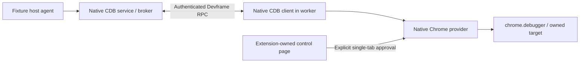
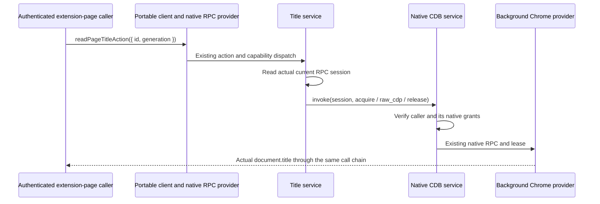

# Debugger contribution example

This private, UI-free example composes `@devkit/core` contribution definitions and the exported `@devkit/runtime` provider lifecycle with `@dvcol/cdb@0.3.0` and `@dvcol/cdb-extension@0.3.0`. The workspace applies an [exact-version CDB subscription patch](../../patches/README.md#cdb-subscription-activation). It runs an embedded bridge inside an extension background context. No daemon, WebSocket broker, renderer, or remote routing layer is required.

`src/contracts.ts` defines a page-title capability and action. Its input is CDB's own `{ id, generation }` target reference, validated against the released UUID/positive-generation shape. The service acquires an `exclusive-control` CDB lease, evaluates the fixed expression `document.title`, validates the result, and releases its lease. It never accepts an arbitrary expression from a contribution caller.

The embedded recipe is a **trusted in-process composition**. The host's `debug` capability level is broader than this action, and the embedded client is trusted. The separate [authenticated native check](#authenticated-native-devframe-composition) below exercises CDB's existing remote provider APIs. Neither establishes a general debugger SDK contract or an untrusted-page authorization boundary.

## Composition and ownership

The recipe uses the actual public native APIs:

| Piece                       | Owner and API                                                                                   |
| --------------------------- | ----------------------------------------------------------------------------------------------- |
| Background provider         | `createProviderLifecycle`, with a fresh incarnation and `webext` / `webext.background` context  |
| Native resource             | `defineNativeContext<EmbeddedChromeDebuggerBridge>`; remains local, outside action input/output |
| Target and attachment       | `createSelectedTabPublisher`; Chrome tab IDs remain inside this host                            |
| Chrome lifecycle forwarding | `createSelectedTabLifecycle.start()` / `.stop()`                                                |
| Commands and events         | CDB client leases, commands and subscriptions; CDB owns domain demand                           |
| Host teardown               | Stop forwarding, await publisher revocation, then dispose the embedded bridge                   |

`src/lifecycle.ts` adapts Chrome's `Tab.id` to CDB's required `tabId` and normalizes optional fields for strict TypeScript. Native debugger event payloads are checked at the JSON boundary; malformed payloads are reported to the host. The upstream lifecycle helper handles navigation updates, tab removal and debugger detachment. CDB's default metadata redaction remains in effect.

An embedding background context can use the source recipe as follows, after it has selected an authorized tab:

```ts
import {
  createDebuggerHost,
  installDebuggerContributions,
  readPageTitleAction,
} from './src/index.js';
import type { SelectedTab } from '@dvcol/cdb-extension';

async function readSelectedTitle(selectedTab: SelectedTab) {
  const host = createDebuggerHost('chromium', console.error);
  if (host.status !== 'available') throw new Error(host.reason);
  try {
    const { provider } = await installDebuggerContributions(host.bridge, console.error);
    try {
      const target = await host.publisher.publish(selectedTab);
      return await provider.invoke({
        action: readPageTitleAction,
        input: { id: target.id, generation: target.generation },
      });
    } finally {
      await provider.dispose();
    }
  } finally {
    await host.dispose();
  }
}
```

The one-shot snippet explicitly owns both lifetimes. A long-lived background host can keep the publisher and bridge alive across multiple contribution installations. Disposing contributions, a lease, a subscription, or the embedded client does not destroy that host. No teardown is tied to an extension document closing. The empty packaged `probe.html` only gives browser automation an extension-owned message sender; it is not an application frontend.

Disabling a service aborts its operation signal and forwards cancellation to `broker.cancelCommand`. The provider still waits for the native command to settle before cleanup completes; cancellation does not prove Chrome has stopped evaluating. There is no replay or automatic reattachment. Release after target revocation can reject through CDB's native authorization checks. Those failures are not suppressed. CDB's publisher catches native detach failures internally, so a resolved host disposal alone is not proof of physical detachment; the browser check also verifies that native commands fail afterward.

## Browser behavior

Chromium uses an MV3 service worker with required `debugger` and `tabs` permissions. Firefox receives a separate MV3 manifest without `debugger`; `createDebuggerHost('firefox', ...)` returns `{ status: 'unavailable', reason: 'unsupported-browser' }` before accessing Chrome debugger APIs. The portable action remains installed, its requirement waits, capability resolution is unavailable, and invocation rejects with the runtime's `unavailable-capability` result.

This package does not claim Firefox CDP parity, native DevTools coexistence, Fetch interception configuration, process recovery, HMR, or integration into a renderer. Those remain separate contract and host work.

## Run and verify

From the repository root, build the affected graph and run the package checks:

```sh
pnpm exec turbo run build --filter=@devkit/example-debugger... --concurrency=1
pnpm --filter @devkit/example-debugger typecheck
pnpm --filter @devkit/example-debugger lint
pnpm --filter @devkit/example-debugger format:check
pnpm --filter @devkit/example-debugger test
pnpm --filter @devkit/example-debugger test:browser
pnpm --filter @devkit/example-debugger test:firefox
pnpm --filter @devkit/example-debugger test:devframe
```

The Chromium command uses the installed Playwright Chromium channel in a temporary profile and serves an owned loopback target. The Firefox command uses Selenium/geckodriver in a temporary native profile; `FIREFOX_BINARY` can select its executable. Install these browser prerequisites through the repository's existing browser setup. Both runners close their owned browsers. Chromium also closes its HTTP server and removes its profile.

Embedded build outputs are `dist/chromium/` and `dist/firefox/`. The former can be loaded unpacked through Chrome's extension developer page; the latter can be loaded temporarily through Firefox's add-on debugging page. There is no action/popup UI. Browser automation opens `probe.html` and starts the checks. Production package imports are bundled, and bundle tests reject Node externals or MCP implementation modules in either browser graph.

Eleven Vitest cases cover ownership, native command failure and later success without replay, stale target references, invalid replies, delayed cancellation, native lifecycle forwarding, events received during domain activation, Firefox absence, and all three bundle targets. The unit tests use the installed CDB broker/publisher/client and mock only native Chrome I/O. The activation regression fails against unpatched 0.3.0 and passes with the workspace patch.

The retained native receipts in `evidence/` record Chromium **153.0.8010.12** and Firefox **156.0.1**. These are exact tested binaries, not a claim about today's stable channel. Chromium observed the title action, a real CDB `Runtime.consoleAPICalled` event and value `42`, raw native value `63` after client disposal, one attachment/detachment, two successful Runtime enable/disable pairs, zero outstanding leases, and the expected post-revocation command failure. The raw command bypasses CDB leases and is deliberately confined to the trusted host test. Firefox observed the actual missing API and unavailable contribution path. Fresh runs write complete receipts to ignored `artifacts/`.

The Chromium command also runs three live lifecycle scenarios, retained in `evidence/chromium-lifecycle.json`. Each creates an owned tab, reads its title, navigates and reads the new title through the same action and native target reference. It then opens a native subscription and exercises explicit publisher revocation, tab closure or navigation to `about:blank`. Each path removes the target and its lease, ends the pending subscription, rejects the stale action without another native evaluation or attachment, and removes all four native lifecycle listeners. The local operation error retains CDB's cause, and the runtime reports the expected failure diagnostic.

Supported HTTP navigation retains CDB's target ID and authority generation in this recipe. That generation does not promise document identity; document-bound contributions must use the native document/session mechanisms appropriate to their resource. Tab closure can be observed through `onRemoved` or `onDetach`; the test accepts their corresponding native revocation reasons without imposing an event order. A detach attempted after the tab has closed can reject, which the native publisher already handles.

Explicit teardown uses `publisher.revoke()`. An initial test called raw `chrome.debugger.detach()` and waited for an `onDetach` notification, but the notification did not arrive. Chrome documents that event for browser-terminated debugging sessions. Raw consumers must respect the publisher's attachment ownership; this example does not add a watcher to repair a bypassed owner. [Chrome debugger events](https://developer.chrome.com/docs/extensions/reference/api/debugger#event-onDetach).

## Authenticated native Devframe composition

`test:devframe` runs the optional external composition against a real Chromium MV3 worker. It uses released `@dvcol/cdb-devframe@0.3.0` with the same patched Devframe 1.0.0 graph as the other examples. The `cac` dependency satisfies Devframe's existing declaration requirement. No additional patch or SDK transport is introduced.



The [host fixture](./tests/remote/host.ts) installs `createCdbService` through `initDevframe`, forwards actual peer callbacks and keeps default native interactive authentication enabled. The native origin registry admits the actual owned extension origin. The [worker](./tests/remote/worker.ts) uses `connectDevframe`, `createCdbClient`, `createChromeProvider`, native installation identity and IndexedDB pairing. It accepts test control messages only from its packaged `control.html` document.

The runner requests trust using the native temporary code, completes CDB pairing and approves exactly its owned target tab. Automatic confirmation of this fixture broker and the broad `debug` grant are test policies, not defaults for a consuming application. Authentication secrets remain in memory or the temporary native stores and are excluded from receipts. All stores and the browser profile are removed afterward. The control schemas are test instrumentation, not another contribution protocol or approval UI.

The [retained receipt](./evidence/devframe.json) records nine checked steps:

1. Missing credentials and an invalid code fail; the real code establishes trust. Ordinary RPC confirms trust from the actual server session.
2. CDB pairing completes with no grant or published scope.
3. The actual extension control approves one explicit fixture tab.
4. A separate authenticated extension-page caller invokes the shared portable title action. It cannot borrow the host agent's grant. Its own approval creates a second principal-bound grant for the same native target, after which title reading succeeds. Missing caller context and mismatched generations reject. Disable/enable and disposal retain native grants, target ownership and ordinary RPC, with no remaining lease.
5. A host-owned agent invokes native `browser.evaluate`, changing the actual target DOM.
6. Ordinary RPC still works on the same peer during browser control.
7. Provider disposal releases this extension's debugger attachment while retaining the peer.
8. Disposing the CDB client preserves ordinary authenticated RPC.
9. Closing the owning peer triggers native disconnect cleanup with no remaining scope or lease.

The attachment check uses a harmless native evaluation before and after disposal. Chrome's global `getTargets().attached` cannot establish extension ownership because Playwright also attaches. The runner closes its server/browser and removes temporary storage before writing a successful receipt. Fresh runs write `artifacts/devframe.json`; CI executes this command after the ordinary Chromium debugger checks.

`dist/devframe/` contains the separate test extension. Its worker bundle uses the public browser client entry and rejects external imports, Node builtins and MCP implementation code. Strict TypeScript checks use `skipLibCheck: false` and Chrome's ambient types.

The [remote title service](./src/remote-service.ts) implements the same imported capability and action contracts as the embedded service. The host supplies its actual `DevframeNodeContext` through a local native descriptor. The service reads `context.rpc.getCurrentRpcSession()` at invocation time and calls `getCdbService(context).invoke(session, ...)`. Devframe authenticates the caller; CDB resolves that caller's principal and checks its grants. No supplied principal ID, fixed demo grant, identity map or second authorization layer is involved.



`browser.list_target_authorities` supplies CDB's ID/generation; `browser.acquire`, `browser.raw_cdp` and `browser.release` preserve that identity. Public native Standard Schema validators check lease and command results. The expression is fixed to `document.title`. The generic `createRpcProvider` exposes only the imported title action on the existing native host. The extension-page caller shares one native peer between its CDB client and portable provider connection; the background browser provider has a separate peer.

The [contribution check](./tests/remote/contribution.ts) confirms that authentication alone does not grant access to a target approved for a different principal. The caller's own explicit approval authorizes the same native target with a separate grant. A missing native caller fails locally, and a different positive generation rejects with the exact native `TARGET_GENERATION_STALE` cause in the owning host's diagnostic. Disabling the service makes its action unavailable; reenabling restores it. Disposing the portable provider preserves the caller's target, grants and ordinary authenticated RPC. The host-local agent remains only in the test's independent raw broker operation and cannot be borrowed by the exposed contribution.

Cancellation follows the existing native contract. `CdbDevframeService.invoke` has no external signal parameter. The recipe checks the contribution signal before acquire and before command dispatch; release runs in `finally`. Disabling during native work therefore waits for native settlement and cleanup before the runtime rejects a late result as cancelled. Native peer disconnect independently aborts CDB operations and releases peer-owned leases. A subsequent release with that disconnected session can reject through native authorization; the recipe never substitutes another principal. The live test now verifies contribution disable during a real pending native command. Its owned page installs a temporary title getter that waits on a synchronous request to the fixture server. Once the server observes that request, the test disables the contribution and confirms both invocation and disable remain pending with the lease still owned. Releasing the HTTP response lets Chrome finish, which a page marker confirms; the late result is rejected with `cancelled`, the lease is released, and reenabling succeeds. The getter is restored during cleanup. No native command or service method is mocked. Native disconnect and revocation during remote execution still need separate live acceptance.

Persistent credential UX, MV3 recovery, revocation during remote execution and JSON UI remain separate work. The native [same-peer reattachment failure](../../docs/research/cdb-devframe-integration.md#reproduced-same-peer-registration-failure) is unchanged; this test does not claim reconnect recovery.
