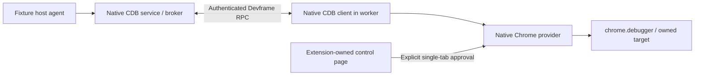
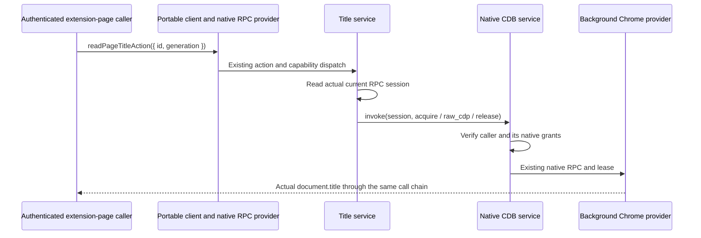

# Debugger contribution example

This private, UI-free example composes `@devkit/core` contribution definitions and the exported `@devkit/runtime` provider lifecycle with `@dvcol/cdb@0.3.0` and `@dvcol/cdb-extension@0.3.0`. The workspace applies an [exact-version CDB subscription patch](../../patches/README.md#cdb-subscription-activation). It runs an embedded bridge inside an extension background context. No daemon, WebSocket broker, renderer, or remote routing layer is required.

`src/contracts.ts` defines a page-title capability and action. Its input is CDB's own `{ id, generation }` target reference, validated against the released UUID/positive-generation shape. The service acquires an `exclusive-control` CDB lease, evaluates the fixed expression `document.title`, validates the result, and releases its lease. It never accepts an arbitrary expression from a contribution caller.

The embedded recipe is a **trusted in-process composition**. The host's `debug` capability level is broader than this action, and the embedded client is trusted. The separate [authenticated native check](#authenticated-native-devframe-composition) below exercises CDB's existing remote provider APIs. Neither establishes a general debugger SDK contract or an untrusted-page authorization boundary.

## Composition and ownership

The recipe uses the actual public native APIs:

| Piece                       | Owner and API                                                                                   |
| --------------------------- | ----------------------------------------------------------------------------------------------- |
| Background provider         | `createProviderLifecycle`, with a fresh incarnation and `webext` / `webext.background` context  |
| Native resource             | `defineNativeContext<EmbeddedChromeDebuggerBridge>`; remains local, outside action input/output |
| Target and attachment       | `createSelectedTabPublisher`; Chrome tab IDs remain inside this host                            |
| Chrome lifecycle forwarding | `createSelectedTabLifecycle.start()` / `.stop()`                                                |
| Commands and events         | CDB client leases, commands and subscriptions; CDB owns domain demand                           |
| Host teardown               | Stop forwarding, await publisher revocation, then dispose the embedded bridge                   |

`src/lifecycle.ts` adapts Chrome's `Tab.id` to CDB's required `tabId` and normalizes optional fields for strict TypeScript. Native debugger event payloads are checked at the JSON boundary; malformed payloads are reported to the host. The upstream lifecycle helper handles navigation updates, tab removal and debugger detachment. CDB's default metadata redaction remains in effect.

An embedding background context can use the source recipe as follows, after it has selected an authorized tab:

```ts
import {
  createDebuggerHost,
  installDebuggerContributions,
  readPageTitleAction,
} from './src/index.js';
import type { SelectedTab } from '@dvcol/cdb-extension';

async function readSelectedTitle(selectedTab: SelectedTab) {
  const host = createDebuggerHost('chromium', console.error);
  if (host.status !== 'available') throw new Error(host.reason);
  try {
    const { provider } = await installDebuggerContributions(host.bridge, console.error);
    try {
      const target = await host.publisher.publish(selectedTab);
      return await provider.invoke({
        action: readPageTitleAction,
        input: { id: target.id, generation: target.generation },
      });
    } finally {
      await provider.dispose();
    }
  } finally {
    await host.dispose();
  }
}
```

The one-shot snippet explicitly owns both lifetimes. A long-lived background host can keep the publisher and bridge alive across multiple contribution installations. Disposing contributions, a lease, a subscription, or the embedded client does not destroy that host. No teardown is tied to an extension document closing. The empty packaged `probe.html` only gives browser automation an extension-owned message sender; it is not an application frontend.

Disabling a service aborts its operation signal and forwards cancellation to `broker.cancelCommand`. The provider still waits for the native command to settle before cleanup completes; cancellation does not prove Chrome has stopped evaluating. There is no replay or automatic reattachment. Release after target revocation can reject through CDB's native authorization checks. Those failures are not suppressed. CDB's publisher catches native detach failures internally, so a resolved host disposal alone is not proof of physical detachment; the browser check also verifies that native commands fail afterward.

## Browser behavior

Chromium uses an MV3 service worker with required `debugger` and `tabs` permissions. Firefox receives a separate MV3 manifest without `debugger`; `createDebuggerHost('firefox', ...)` returns `{ status: 'unavailable', reason: 'unsupported-browser' }` before accessing Chrome debugger APIs. The portable action remains installed, its requirement waits, capability resolution is unavailable, and invocation rejects with the runtime's `unavailable-capability` result.

This package does not claim Firefox CDP parity, dynamic Fetch configuration, general process recovery, HMR, or integration into a renderer. Those remain separate contract and host work. The native DevTools coexistence and explicit worker restoration checks below cover their stated Chromium scenarios.

## Run and verify

From the repository root, build the affected graph and run the package checks:

```sh
pnpm exec turbo run build --filter=@devkit/example-debugger... --concurrency=1
pnpm --filter @devkit/example-debugger typecheck
pnpm --filter @devkit/example-debugger lint
pnpm --filter @devkit/example-debugger format:check
pnpm --filter @devkit/example-debugger test
pnpm --filter @devkit/example-debugger test:browser
pnpm --filter @devkit/example-debugger test:firefox
pnpm --filter @devkit/example-debugger test:devframe
```

The Chromium command uses the installed Playwright Chromium channel in a temporary profile and serves an owned loopback target. The Firefox command uses Selenium/geckodriver in a temporary native profile; `FIREFOX_BINARY` can select its executable. Install these browser prerequisites through the repository's existing browser setup. Both runners close their owned browsers. Chromium also closes its HTTP server and removes its profile.

Embedded build outputs are `dist/chromium/` and `dist/firefox/`. The former can be loaded unpacked through Chrome's extension developer page; the latter can be loaded temporarily through Firefox's add-on debugging page. There is no action/popup UI. Browser automation opens `probe.html` and starts the checks. Production package imports are bundled, and bundle tests reject Node externals or MCP implementation modules in either browser graph.

Twenty-five Vitest cases cover ownership, native command failure and later success without replay, stale target references, invalid replies, delayed cancellation, native lifecycle forwarding, events received during domain activation, detached-child demand cleanup, Firefox absence, and all three bundle targets. The unit tests use the installed CDB broker/publisher/client and mock only native Chrome I/O. The activation and detached-child cleanup regressions fail without their respective workspace patches.

The retained native receipts in `evidence/` record Chromium **153.0.8010.12** and Firefox **156.0.1**. These are exact tested binaries, not a claim about today's stable channel. Chromium observed the title action, a real CDB `Runtime.consoleAPICalled` event and value `42`, raw native value `63` after client disposal, one attachment/detachment, two successful Runtime enable/disable pairs, zero outstanding leases, and the expected post-revocation command failure. The raw command bypasses CDB leases and is deliberately confined to the trusted host test. Firefox observed the actual missing API and unavailable contribution path. Fresh runs write complete receipts to ignored `artifacts/`.

The Chromium command also runs three live lifecycle scenarios, retained in `evidence/chromium-lifecycle.json`. Each creates an owned tab, reads its title, navigates and reads the new title through the same action and native target reference. It then opens a native subscription and exercises explicit publisher revocation, tab closure or navigation to `about:blank`. Each path removes the target and its lease, ends the pending subscription, rejects the stale action without another native evaluation or attachment, and removes all four native lifecycle listeners. The local operation error retains CDB's cause, and the runtime reports the expected failure diagnostic.

Supported HTTP navigation retains CDB's target ID and authority generation in this recipe. That generation does not promise document identity; document-bound contributions must use the native document/session mechanisms appropriate to their resource. Tab closure can be observed through `onRemoved` or `onDetach`; the test accepts their corresponding native revocation reasons without imposing an event order. A detach attempted after the tab has closed can reject, which the native publisher already handles.

Explicit teardown uses `publisher.revoke()`. An initial test called raw `chrome.debugger.detach()` and waited for an `onDetach` notification, but the notification did not arrive. Chrome documents that event for browser-terminated debugging sessions. Raw consumers must respect the publisher's attachment ownership; this example does not add a watcher to repair a bypassed owner. [Chrome debugger events](https://developer.chrome.com/docs/extensions/reference/api/debugger#event-onDetach).

## Fixed response interception

The same `test:browser` command also runs the [response recipe](./src/response.ts) against an owned HTTP fixture and writes `artifacts/chromium-response.json`. CI already runs this command. The [retained receipt](./evidence/chromium-response.json) records the verified Chromium run.

The host passes a native `ChromeDebuggerPort` to `createDebuggerHost`. `responseDebugger(urlPattern)` supplies a fixed response-stage pattern when CDB calls `Fetch.enable`; all other commands pass through the existing port. CDB remains the only attachment and domain owner. A lease and `Fetch.requestPaused` subscription feed one response to `transformNextResponse`, which reads its body and fulfills the bounded text fixture with an appended suffix.

```ts
const host = createDebuggerHost(
  'chromium',
  console.error,
  responseDebugger('https://example.test/api/*'),
);
```

The live check receives `server:selected:transformed` and the fixture response header for the matching request. A concurrent unmatched request keeps `server:unmatched`. Closing the subscription does not disable Fetch because commands retain lease-owned domain demand. Releasing the lease eventually disables Fetch; the test observes actual native completion before verifying that a later matching request receives its original body. Final teardown leaves no lease, detaches once and rejects an extension command after detach. No queued event was dropped in this bounded scenario.

Lease release does not acknowledge native domain-disable completion. The test observes fulfilled Fetch and Runtime disables at the actual port before detach. Its first run exposed an overly early detach racing `Runtime.disable`; the final fixture waits for those observed completions. This observation helper exists only in the tests and does not add an SDK cleanup barrier or recovery mechanism.

This is a fixed host policy and one root-session ASCII text response at status 200. It defines no portable transform contract, dynamic pattern merging, overlapping-handler order or general paused-request failure policy. Binary/compressed/streamed bodies, child sessions, overload and cancellation during a body read remain separate acceptance work. Firefox continues to assert debugger unavailability; no Firefox response-transform parity is implied. The existing subscription activation patch remains installed; no additional patch is needed for this recipe.

## Authenticated native Devframe composition

`test:devframe` runs the optional external composition against a real Chromium MV3 worker. It uses released `@dvcol/cdb-devframe@0.3.0` with the same patched Devframe 1.0.0 graph as the other examples. The `cac` dependency satisfies Devframe's existing declaration requirement. No additional patch or SDK transport is introduced.



The [host fixture](./tests/remote/host.ts) installs `createCdbService` through `initDevframe`, forwards actual peer callbacks and keeps default native interactive authentication enabled. The native origin registry admits the actual owned extension origin. The [worker](./tests/remote/worker.ts) uses `connectDevframe`, `createCdbClient`, `createChromeProvider`, native installation identity and IndexedDB pairing. It accepts test control messages only from its packaged `control.html` document.

The runner requests trust using the native temporary code, completes CDB pairing and approves exactly its owned target tab. Automatic confirmation of this fixture broker and the broad `debug` grant are test policies, not defaults for a consuming application. Authentication secrets remain in memory or the temporary native stores and are excluded from receipts. All stores and the browser profile are removed afterward. The control schemas are test instrumentation, not another contribution protocol or approval UI.

The [retained receipt](./evidence/devframe.json) records ten checked steps:

1. Missing credentials and an invalid code fail; the real code establishes trust. Ordinary RPC confirms trust from the actual server session.
2. CDB pairing completes with no grant or published scope.
3. The actual extension control approves one explicit fixture tab.
4. A separate authenticated extension-page caller invokes the shared portable title action. It cannot borrow the host agent's grant. Its own approval creates a second principal-bound grant for the same native target, after which title reading succeeds. Missing caller context and mismatched generations reject. Disable/enable and disposal retain native grants, target ownership and ordinary RPC, with no remaining lease.
5. A host-owned agent invokes native `browser.evaluate`, changing the actual target DOM.
6. Ordinary RPC still works on the same peer during browser control.
7. Provider disposal releases this extension's debugger attachment while retaining the peer.
8. Disposing the CDB client preserves ordinary authenticated RPC.
9. Closing the owning peer triggers native disconnect cleanup with no remaining scope or lease.
10. Two independent fixtures open the real native DevTools Console before or after the extension's debugger attachment, retain CDB operations and an active event subscription, then verify explicit owner cleanup.

The attachment check uses a harmless native evaluation before and after disposal. Chrome's global `getTargets().attached` cannot establish extension ownership because Playwright also attaches. The runner closes its server/browser and removes temporary storage before writing a successful receipt. Fresh runs write `artifacts/devframe.json`; CI executes this command after the ordinary Chromium debugger checks.

`dist/devframe/` contains the separate test extension. Its worker bundle uses the public browser client entry and rejects external imports, Node builtins and MCP implementation code. Strict TypeScript checks use `skipLibCheck: false` and Chrome's ambient types.

The [remote title service](./src/remote-service.ts) implements the same imported capability and action contracts as the embedded service. The host supplies its actual `DevframeNodeContext` through a local native descriptor. The service reads `context.rpc.getCurrentRpcSession()` at invocation time and calls `getCdbService(context).invoke(session, ...)`. Devframe authenticates the caller; CDB resolves that caller's principal and checks its grants. No supplied principal ID, fixed demo grant, identity map or second authorization layer is involved.



`browser.list_target_authorities` supplies CDB's ID/generation; `browser.acquire`, `browser.raw_cdp` and `browser.release` preserve that identity. Public native Standard Schema validators check lease and command results. The expression is fixed to `document.title`. The generic `createRpcProvider` exposes only the imported title action on the existing native host. The extension-page caller shares one native peer between its CDB client and portable provider connection; the background browser provider has a separate peer.

The [contribution check](./tests/remote/contribution.ts) confirms that authentication alone does not grant access to a target approved for a different principal. The caller's own explicit approval authorizes the same native target with a separate grant. A missing native caller fails locally, and a different positive generation rejects with the exact native `TARGET_GENERATION_STALE` cause in the owning host's diagnostic. Disabling the service makes its action unavailable; reenabling restores it. Disposing the portable provider preserves the caller's target, grants and ordinary authenticated RPC. The host-local agent remains only in the test's independent raw broker operation and cannot be borrowed by the exposed contribution.

Cancellation follows the existing native contract. `CdbDevframeService.invoke` has no external signal parameter. The recipe checks the contribution signal before acquire and before command dispatch; release runs in `finally`. Disabling during native work therefore waits for native settlement and cleanup before the runtime rejects a late result as cancelled. Native peer disconnect independently aborts CDB operations and releases peer-owned leases. A subsequent release with that disconnected session can reject through native authorization; the recipe never substitutes another principal. The live test now verifies contribution disable during a real pending native command. Its owned page installs a temporary title getter that waits on a synchronous request to the fixture server. Once the server observes that request, the test disables the contribution and confirms both invocation and disable remain pending with the lease still owned. Releasing the HTTP response lets Chrome finish, which a page marker confirms; the late result is rejected with `cancelled`, the lease is released, and reenabling succeeds. The getter is restored during cleanup. No native command or service method is mocked.

Automatic startup/credential policy, broader worker recovery and JSON UI remain separate work. The native [same-peer reattachment failure](../../docs/research/cdb-devframe-integration.md#reproduced-same-peer-registration-failure) is unchanged; this test does not claim reconnect recovery.

### Caller authority changes during native execution

The [pending authority checks](./tests/remote/pending-authority.ts) approve a separate caller for each scenario, hold its actual Chrome title evaluation on the same HTTP fixture, and verify the sole pending lease belongs to that caller and exact target. They then call public native APIs while the HTTP response is still held.

| Native event                   | Observed cleanup                                                          | Host diagnostic cause from the recipe's final release                   |
| ------------------------------ | ------------------------------------------------------------------------- | ----------------------------------------------------------------------- |
| Caller `peer.close()`          | Caller lease removed; grant retained for native session resume            | `ACCESS_DENIED`, because the saved RPC session is disconnected          |
| `broker.revokeGrant(grant.id)` | Caller grant and lease removed; authenticated ordinary RPC remains usable | `CAPABILITY_DENIED`, because that caller no longer has target authority |

Both invocation failures and zero leases are observed before the fixture releases the response. Chrome then completes the already-dispatched evaluation and writes a page marker. Cancellation therefore does not promise that Chrome execution has stopped. The unconditional release in `finally` replaces the command error with the native release error; the test checks that cause in host diagnostics, without exporting native error prototypes or borrowing another principal.

Other callers retain their grants, the unchanged native target and successful title access. Each scenario explicitly revokes its own scope afterward and confirms baseline scopes/grants are restored. Disconnect alone does not revoke a resumable grant. These checks add no SDK authorization or recovery policy, dependency patch, or mocked browser command.

### Native worker restoration

The [worker acceptance check](./tests/remote/restart.ts) force-stops the owned MV3 worker after native recovery metadata has been persisted. Native CDB marks the provider and grant as recovering and releases leases. A message wakes the replacement worker, whose connection state is empty. The fixture explicitly authenticates again with a fresh Devframe code; no automatic credential or startup policy is added.

Chrome retains this extension's debugger attachment after termination. Released CDB 0.3.0 tries to attach again and fails. The [narrow native patch](../../docs/research/cdb-worker-recovery.md) resets only a verified same-extension attachment during persisted recovery, after the specific attachment conflict. It keeps native ownership, grant checks and failure propagation.

The real browser test verifies the same provider installation, no repeated pairing confirmation, the same approved scope/principal and target ID, and the next target generation. CDB replaces the grant binding for that generation. The portable title action succeeds against the recovered target and rejects the previous generation. Existing caller disconnect/revocation checks and final attachment, scope and lease cleanup still run. The retained receipt includes this sequence. Natural idle expiry, browser restart and competing managers inside one extension are not covered by this check.

### Native DevTools coexistence

The [coexistence check](./tests/remote/devtools.ts) runs both attachment orders in disposable Chromium profiles. Public browser CDP opens the actual Console frontend and verifies its relationship to the inspected fixture. Standard DOM reads establish that its document and Console have rendered; no private DevTools modules are imported. Screenshots in `artifacts/devtools-*.png` show those frontends, with one [retained screenshot](./evidence/devtools-extension-first.png).

In the tested Chromium **153.0.8010.12**, neither opening nor closing DevTools terminates the extension attachment. Both orders receive a real `Runtime.consoleAPICalled` event through a CDB lease, with exactly one lease during the subscription. In the extension-first order, that subscription is active before DevTools opens. A separately authenticated caller reads the title through the portable action while DevTools is open and again after it closes, with unchanged target identity and no native `onDetach` event. Explicit native provider disposal then releases the physical attachment, leaves zero leases, rejects the stale title call and preserves ordinary authenticated RPC. Host and browser errors are checked after all owned cleanup completes.

This extends the earlier [native browser research](../../docs/research/browser-capabilities.md) to the maintained CDB composition. It proves a rendered frontend and continuing CDB commands/events; it does not exercise debugger commands through the DevTools UI, conflicting breakpoints, child sessions, other Chromium versions or Firefox. Chrome's documented browser-terminated detach path remains distinct from the coexistence observed here. No reattachment or recovery mechanism was added.

### Native child-session routing and cleanup

The same `test:devframe` command runs a separate [child-session check](./tests/remote/child-sessions.ts) through the authenticated native composition. Its owned parent at `127.0.0.1` creates one cross-site iframe at `localhost` on the same loopback server. CDB's existing flat-session auto-attachment discovers it through `Bridge.listChildSessions`; the test does not attach another debugger or manufacture a child-session event. [Chrome's frame/session model](https://developer.chrome.com/docs/extensions/reference/api/debugger#work-with-frames) distinguishes these child targets from same-process frame contexts.

The [retained Chromium receipt](./evidence/child-sessions.json) proves that CDB's public child UUID differs from the actual Chrome session identifier. The leased `browser.raw_cdp` operation evaluates the child origin and changes only its title; root title/origin stay unchanged. A `browser.console` subscription selected by that child UUID receives its real console marker after filtering a root marker. CDB owns domain activation, and the test observes Chrome's child `Runtime.executionContextCreated` event before sending either marker. Its semantic console result omits session metadata, so the check proves selection through the distinct markers rather than assuming a returned session ID.

Removing the iframe while its explicit lease still owns child demands removes that child from native discovery. A stale child command rejects with `CDP_COMMAND_FAILED` and the native message `The requested child session is not available.` Root commands under the same target/generation and lease still succeed. Releasing the lease and disposing the native provider leave zero leases, no physical extension attachment and no worker/host/browser errors. Error arrays are checked after owned cleanup.

This test initially failed: releasing the removed child's console subscription and command demand reported `The requested session is not available.` twice. Native detachment had already cleared the child route and demand set, but `setSubscriptionDemand` resolved the absent child before checking whether demand was already absent. The [exact-version extension patch](../../patches/README.md#cdb-detached-child-demand-cleanup) moves its existing idempotence check before that resolution. No new catch, retry, routing or cleanup owner is introduced. Four public-publisher tests verify both detached-demand forms, live-child disable, invalid-method rejection and propagation of native disable failures; the two detached-demand cases fail before the correction and all four pass afterward. Missing-child activation and the real stale command still reject.

The same fixture now starts an actual child `Runtime.evaluate` with `awaitPromise: true`, observes its started DOM marker, then removes the frame. In the tested Chrome, that command stays pending during a one-second observation with its original lease live, even though child discovery is empty, new stale calls reject and root calls succeed. Existing lease release/provider shutdown then rejects it with native `REQUEST_CANCELLED`. [Raw Chrome reproduction, source attribution and retained observations](../../docs/research/native-pending-child-command.md) locate this delayed settlement below CDB and Devframe. The bounded interval does not establish that it can never settle.

This is one out-of-process iframe over both optional native Devframe and DevTools backends. Each runner supplies its actual native host to the same child-session checks. Prompt child-detach settlement, nested frames, workers, same-process frame contexts and child Fetch interception remain open. The example adds no portable target/session API or general frame policy, and makes no Firefox CDP claim. No upstream PR has been opened for this behavior.

### Actual native DevTools backend

`pnpm --filter @devkit/example-debugger test:devtools` exercises the same optional CDB composition through `@vitejs/devtools@0.7.5`. The [host fixture](./tests/remote/devtools-host.ts) creates the actual `createDevToolsContext`, installs the existing [CDB definition](./tests/remote/definition.ts), then mounts `createDevToolsHub` on its owned HTTP server. The context retains its native kit and hub subsystems. The existing generic `createRpcProvider`, execution identity, title service and caller-grant checks remain unchanged.

The [exact-version native patches](../../patches/README.md#native-hub-peer-lifecycle) forward the service's existing peer callbacks through both hub layers. DevTools retains its native interactive authentication and origin gate; the fixture admits only its own extension origin through DevTools' existing `allowedOrigins` option. CDB retains pairing, target approval, grants, leases and disconnect cleanup. No SDK backend adapter, custom authentication or alternate peer registry is added.

The [backend acceptance check](./tests/devtools.ts) reuses the existing browser checks for denied authentication, explicit approval, the actual portable title action, caller authority changes, pending cancellation, worker restoration, ordinary RPC and final attachment/scope/lease cleanup. A separate fresh native DevTools fixture now runs the same [child-session checks](./tests/remote/child-sessions.ts) as Devframe: cross-origin iframe discovery, child-only console delivery, child evaluation, frame removal, stale-child rejection and preserved root commands. Chromium 153.0.8010.12 passed the nine backend scenario groups and child-session acceptance with zero captured page or native peer-cleanup errors. The original Devframe child-session command also passes. The 26 affected unit tests, strict lint and TypeScript 7 checks pass. CI runs both backend commands.

Fresh runs write `artifacts/devtools-backend.json`; the [retained receipt](./evidence/devtools-backend.json) contains the native backend and child-session observations without authentication credentials. A focused real-WebSocket test additionally verifies native rejection before authentication, the trusted session after native code exchange and the final empty CDB scope/lease sets. Child-session coverage is bounded to the iframe scenario above and does not claim commands through the DevTools UI. The two forwarding patches remain explicit private-workspace installation policy; unpatched releases still drop the callbacks, and publication of the prepared upstream drafts awaits owner approval.
