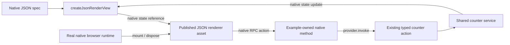

# Native JSON renderer example

The same framework-neutral JSON counter runs against genuine Devframe and DevTools backends. It reuses the existing contribution, native shared state, `createJsonRenderView`, the published `jsonRenderUiRenderer()` asset and `createDevframeClientRuntime`. No SDK view facade or frontend framework dependency is added to the authoring code.

## Run

```sh
pnpm exec turbo run build --filter=@devkit/example-json-render
pnpm --filter @devkit/example-json-render demo devframe
# Or:
pnpm --filter @devkit/example-json-render demo devtools
```

Open the printed loopback URL in two tabs. Choose **Custom DOM** in one tab to replace the reference renderer without changing the contribution or backend. Increment either counter and both views update. **Try invalid input** exercises native RPC validation and the reference renderer's error banner. Unmount one view, increment the other, then mount again to read the current value. Press Enter in the launcher to stop both servers and remove temporary storage.

The launcher supplies a temporary example credential to its loopback-only Vite page and proxies the native endpoint, including the renderer asset. It does not print or persist the token. A real application supplies its own native authentication.

## Native composition



- `src/spec.ts` contains the upstream JSON model and a native RPC type declaration. It imports no framework. The invalid-input button is deliberate test data.
- `src/index.ts` starts the existing native host, registers the upstream renderer and publishes the counter view. It projects the contribution's counter into the view with native `patchState` and removes that projection listener on close.
- The native renderer sends one action params object. One example-owned RPC method uses the existing action's input/result schemas and calls the initial provider's typed action. It retains native authentication and does not silently adopt a replacement provider.
- `browser/main.ts` creates an actual authenticated native client and runtime. It awaits the dock and renderer-manifest snapshots before immediate mounting. Each document owns its mount, runtime, event listeners and socket. Unmounting a view keeps the connection and backend state; closing the document or losing the connection disposes the owned resources.
- The native hub serves the asset returned by `jsonRenderUiRenderer()`. No private browser-factory import, copied renderer or fabricated context is used. Its shadow root contains the upstream styles.

Native dock and RPC registrations live until the example host closes. The installed dock registration API has no unregister handle; this example does not promise hot removal of backend view registrations. The explicit mount disposer handles browser view removal independently.

## Replace the renderer

`browser/renderer.ts` implements the native `JsonRenderDockRenderer` contract. The browser registers it locally through `runtime.context.renderers.register('json-render', domRenderer)`. Switching back unmounts the view and calls the returned unregister function, so the same dock uses its published reference renderer again. Each mount releases its native state listener and DOM listeners on disposal. A preceding renderer's attached shadow root is reused when present.

```text
same contribution -> same native JSON view + state reference
  -> reference renderer, served by the host
  -> custom DOM renderer, registered by this page
both -> unchanged native RPC action -> same backend counter
```

The example renderer uses no frontend framework. `@json-render/core` resolves properties, templates and action parameters; Devframe owns shared state, RPC and backend input validation. The exact core version is the one already used by the native JSON packages. No dependency patch, SDK renderer factory or alternate JSON schema was added.

This is a small example catalog, not a complete replacement for the reference UI. It renders `Card` titles, `Stack` direction/gap, `Text` content and `Button` labels/disabled state with one namespaced RPC press action. Unsupported component types, repeat/visibility/watch, action lists, confirmation/callbacks and unnamespaced local actions reject explicitly. Other catalog styling options are not implemented. Native local built-ins, input bindings and arbitrary catalog conformance remain outside this example. Action failures appear in its alert, and a later action clears that alert. Disposal does not cancel a command already dispatched through native RPC.

## Verification

```sh
pnpm --filter @devkit/example-json-render typecheck
pnpm --filter @devkit/example-json-render lint
pnpm --filter @devkit/example-json-render format:check
pnpm --filter @devkit/example-json-render test
pnpm --filter @devkit/example-json-render test:browser
```

Six automated tests consume built exports and real native sockets. Both hosts prove native dock/manifest publication, byte-for-byte serving of the published renderer asset, action/schema/auth behavior, subscribed view updates and projection cleanup. The browser build test rejects Node shims, backend implementations and Vue/React modules in the surface and custom-renderer bundle. Tests mock only the browser `location` global required by native connection bootstrap.

Earlier live in-app checks on both hosts confirmed initial render, action updates, validation errors, unmounting at `1`, a peer reaching `2`, remounting at `2`, and both views reaching `3`. Closing each host removed the rendered view and disabled mounting. A browser-source edit also triggered Vite's native page reload while retaining backend state. Four temporary test tabs and both launcher processes were closed afterward.

The current reference renderer keeps its last error banner after a later successful action and emits an unhandled-rejection console message for the deliberately rejected action. The rejection is visible and the counter remains usable. This example records those observed upstream behaviors without suppressing the console event or adding an error-policy layer.

The maintained Chromium command now opens reference/custom views against each actual backend. It verifies seven scenario groups per host: unchanged JSON publication, shared actions/state, native input failure, detached-view cleanup, remount and renderer replacement, unsupported component failure/recovery, and host disconnect. The retained [receipt](./evidence/renderers.json) records Chromium 153.0.8010.12, final counter `5` for each backend and zero page errors. CI runs the command after installing Chromium. Servers, browser contexts and temporary native storage are closed after each run. This does not establish Firefox custom-renderer behavior or renderer-module HMR.

## Scope

This is a single-provider native renderer integration with a custom renderer. Cross-provider view selection/broadcast, the full DevTools shell and renderer-module hot replacement remain separate work. Native manifest URLs are relative to the page origin; the example's existing same-origin proxy supplies them. It does not implement cross-origin renderer discovery.

The separate [WebExtension example](../webext/README.md) covers native Port and browser surfaces. This example uses WebSockets and does not itself prove those cells. The pending [JSON routing seam](../../docs/planning/012-json-routing-seam.md) remains a separate owner decision; renderer replacement does not choose a routing handler API.
